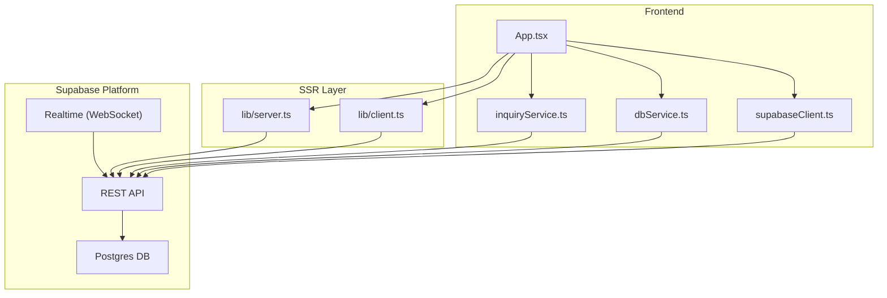
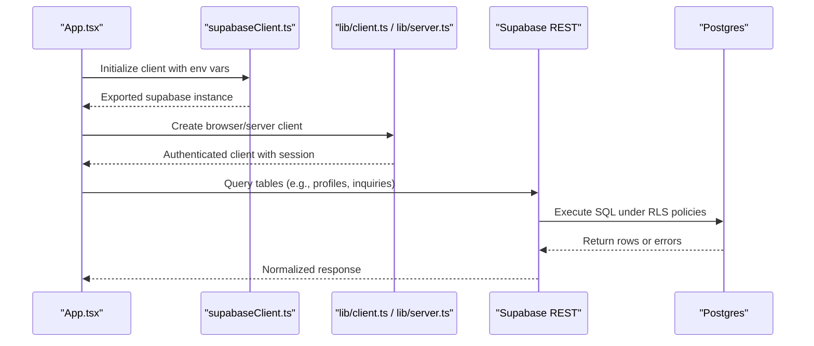
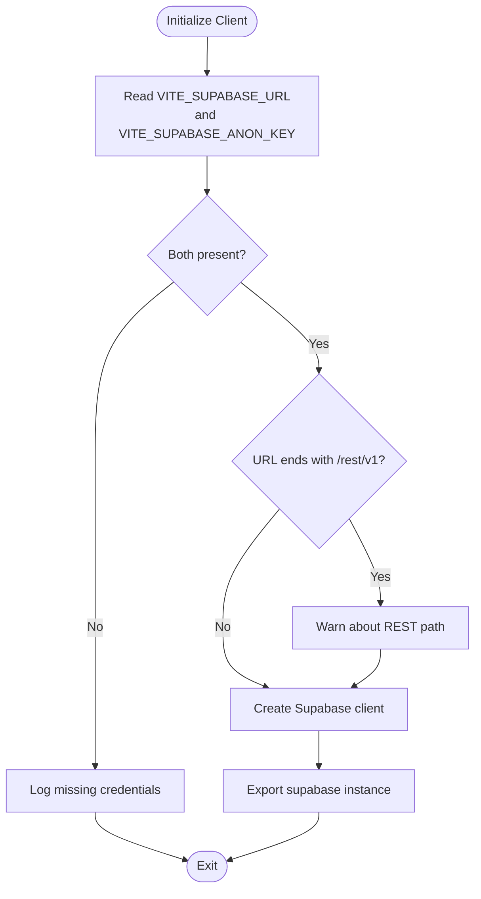
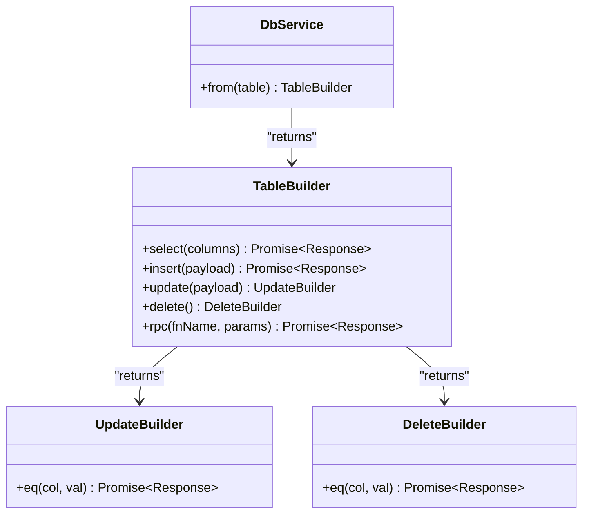
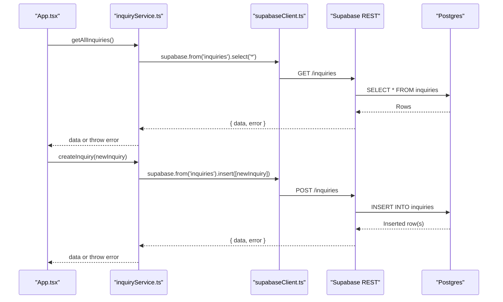
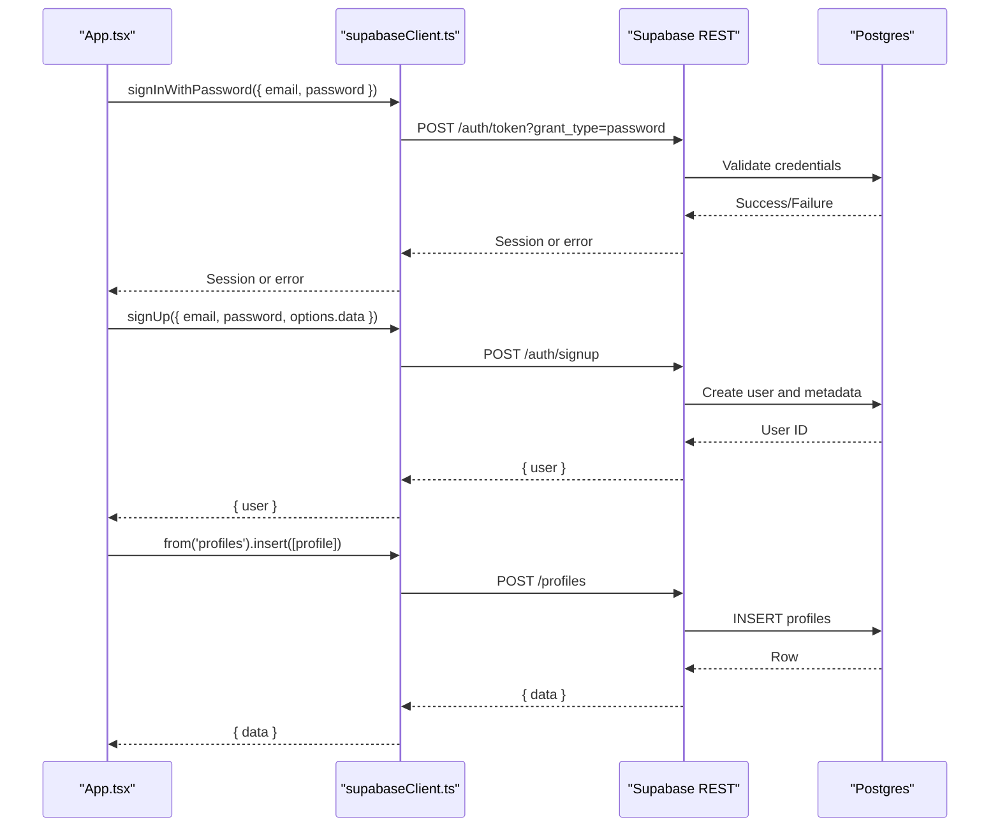
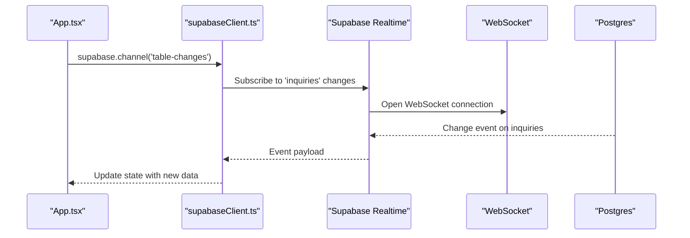
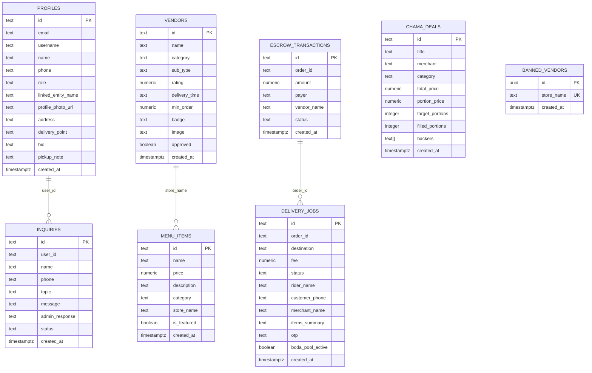
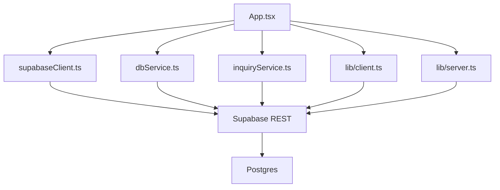

# API Integration

<cite>
**Referenced Files in This Document**
- [supabaseClient.ts](file://src/supabase/supabaseClient.ts)
- [dbService.ts](file://src/supabase/dbService.ts)
- [inquiryService.ts](file://src/supabase/inquiryService.ts)
- [client.ts](file://src/lib/client.ts)
- [server.ts](file://src/lib/server.ts)
- [config.toml](file://supabase/config.toml)
- [supabase_schema.sql](file://supabase_schema.sql)
- [SUPABASE.md](file://SUPABASE.md)
- [App.tsx](file://src/App.tsx)
</cite>

## Table of Contents
1. [Introduction](#introduction)
2. [Project Structure](#project-structure)
3. [Core Components](#core-components)
4. [Architecture Overview](#architecture-overview)
5. [Detailed Component Analysis](#detailed-component-analysis)
6. [Dependency Analysis](#dependency-analysis)
7. [Performance Considerations](#performance-considerations)
8. [Troubleshooting Guide](#troubleshooting-guide)
9. [Conclusion](#conclusion)
10. [Appendices](#appendices)

## Introduction
This document provides comprehensive API integration documentation for Supabase within the project. It covers client configuration, authentication flows, database query patterns via a generic dbService wrapper, and the inquiry service for customer support. It also explains real-time capabilities available through Supabase, rate limiting and caching strategies, and offline synchronization approaches. The goal is to help developers implement robust, secure, and performant integrations with Supabase across browser and server contexts.

## Project Structure
The Supabase integration spans several layers:
- Client initialization and environment validation
- SSR-aware client creation for server-side rendering
- Generic database operations wrapper (dbService)
- Domain-specific service (inquiryService)
- Application-level usage in the main UI component
- Database schema and RLS policies
- Local development configuration



**Diagram sources**
- [App.tsx](file://src/App.tsx)
- [supabaseClient.ts](file://src/supabase/supabaseClient.ts)
- [dbService.ts](file://src/supabase/dbService.ts)
- [inquiryService.ts](file://src/supabase/inquiryService.ts)
- [client.ts](file://src/lib/client.ts)
- [server.ts](file://src/lib/server.ts)

**Section sources**
- [supabaseClient.ts:1-38](file://src/supabase/supabaseClient.ts#L1-L38)
- [client.ts:1-9](file://src/lib/client.ts#L1-L9)
- [server.ts:1-29](file://src/lib/server.ts#L1-L29)
- [config.toml:1-415](file://supabase/config.toml#L1-L415)
- [supabase_schema.sql:1-198](file://supabase_schema.sql#L1-L198)
- [SUPABASE.md:1-38](file://SUPABASE.md#L1-L38)

## Core Components
- Supabase client configuration and environment validation
- SSR-aware client factories for browser and server
- Generic dbService wrapper for CRUD and RPC calls
- Inquiry service for support ticket management
- Application-level auth and data operations

Key responsibilities:
- Centralize credentials and validate environment variables
- Provide typed responses and error normalization
- Expose simple table-centric APIs for common operations
- Implement domain logic for inquiries and notifications
- Integrate authentication flows and profile management

**Section sources**
- [supabaseClient.ts:1-38](file://src/supabase/supabaseClient.ts#L1-L38)
- [dbService.ts:1-24](file://src/supabase/dbService.ts#L1-L24)
- [inquiryService.ts:1-19](file://src/supabase/inquiryService.ts#L1-L19)
- [client.ts:1-9](file://src/lib/client.ts#L1-L9)
- [server.ts:1-29](file://src/lib/server.ts#L1-L29)

## Architecture Overview
The application uses a layered approach:
- Environment-driven client setup with validation
- SSR clients that handle cookies and sessions
- Service layer encapsulating queries and error handling
- UI components orchestrating user interactions and state



**Diagram sources**
- [supabaseClient.ts:1-38](file://src/supabase/supabaseClient.ts#L1-L38)
- [client.ts:1-9](file://src/lib/client.ts#L1-L9)
- [server.ts:1-29](file://src/lib/server.ts#L1-L29)
- [supabase_schema.sql:166-198](file://supabase_schema.sql#L166-L198)

## Detailed Component Analysis

### Supabase Client Configuration
- Reads environment variables for URL and anon key
- Validates presence and warns if REST path is incorrectly appended
- Exports a single shared client instance
- Provides debug helper to log host and key presence



**Diagram sources**
- [supabaseClient.ts:1-38](file://src/supabase/supabaseClient.ts#L1-L38)

**Section sources**
- [supabaseClient.ts:1-38](file://src/supabase/supabaseClient.ts#L1-L38)

### SSR Client Factory (Browser and Server)
- Browser client created using createBrowserClient with env variables
- Server client created using createServerClient with cookie parsing/serialization
- Ensures consistent session handling across environments

```mermaid
classDiagram
class BrowserClient {
+createClient() SupabaseClient
}
class ServerClient {
+createClient(request) { supabase, headers }
-parseCookieHeader()
-serializeCookieHeader()
}
BrowserClient --> SupabaseClient : "uses"
ServerClient --> SupabaseClient : "uses"
```

**Diagram sources**
- [client.ts:1-9](file://src/lib/client.ts#L1-L9)
- [server.ts:1-29](file://src/lib/server.ts#L1-L29)

**Section sources**
- [client.ts:1-9](file://src/lib/client.ts#L1-L9)
- [server.ts:1-29](file://src/lib/server.ts#L1-L29)

### Generic Database Wrapper (dbService)
- Wraps Supabase queries into a unified Response type with data and error
- Provides fluent API: from(table).select(), insert(), update().eq(), delete().eq(), rpc()
- Normalizes errors and ensures consistent return shapes



**Diagram sources**
- [dbService.ts:1-24](file://src/supabase/dbService.ts#L1-L24)

**Section sources**
- [dbService.ts:1-24](file://src/supabase/dbService.ts#L1-L24)

### Inquiry Service Implementation
- Fetches all inquiries from the inquiries table
- Creates new inquiry records
- Throws errors on failures for upstream handling



**Diagram sources**
- [inquiryService.ts:1-19](file://src/supabase/inquiryService.ts#L1-L19)
- [supabaseClient.ts:1-38](file://src/supabase/supabaseClient.ts#L1-L38)

**Section sources**
- [inquiryService.ts:1-19](file://src/supabase/inquiryService.ts#L1-L19)

### Authentication Flows and Profile Management
- Login supports password-based sign-in with fallback to legacy profile lookup
- Signup creates an auth user and inserts a corresponding profile record
- Profile updates use both auth metadata and upsert to the profiles table
- Errors are surfaced via toast notifications and console logs



**Diagram sources**
- [App.tsx:688-956](file://src/App.tsx#L688-L956)
- [supabaseClient.ts:1-38](file://src/supabase/supabaseClient.ts#L1-L38)

**Section sources**
- [App.tsx:688-956](file://src/App.tsx#L688-L956)

### Real-Time Subscriptions and WebSocket Patterns
- Supabase Realtime is enabled in local configuration
- While not implemented in current UI code, subscriptions can be established via the Supabase client to listen for changes on tables
- Typical pattern: subscribe to channel, listen for events, update local state reactively



[No diagram sources needed since this section describes conceptual patterns not tied to specific implementation files]

**Section sources**
- [config.toml:87-102](file://supabase/config.toml#L87-L102)

### Database Schema and RLS Policies
- Comprehensive schema defines core entities: profiles, inquiries, vendors, menu_items, delivery_jobs, escrow_transactions, chama_deals, banned_vendors
- RLS policies enable full access for development; tighten policies before production
- Column names follow snake_case conventions; UI maps to camelCase types



**Diagram sources**
- [supabase_schema.sql:1-198](file://supabase_schema.sql#L1-L198)

**Section sources**
- [supabase_schema.sql:1-198](file://supabase_schema.sql#L1-L198)

## Dependency Analysis
- App.tsx depends on supabaseClient for direct queries and auth
- dbService abstracts common operations and reduces duplication
- inquiryService encapsulates support-related queries
- SSR clients ensure consistent session handling across environments
- config.toml controls local Supabase services including Realtime and API limits



**Diagram sources**
- [App.tsx](file://src/App.tsx)
- [supabaseClient.ts:1-38](file://src/supabase/supabaseClient.ts#L1-L38)
- [dbService.ts:1-24](file://src/supabase/dbService.ts#L1-L24)
- [inquiryService.ts:1-19](file://src/supabase/inquiryService.ts#L1-L19)
- [client.ts:1-9](file://src/lib/client.ts#L1-L9)
- [server.ts:1-29](file://src/lib/server.ts#L1-L29)

**Section sources**
- [config.toml:1-415](file://supabase/config.toml#L1-L415)

## Performance Considerations
- Use specific column selection instead of wildcard selects to reduce payload size
- Leverage indexes defined in schema and consider composite/partial indexes for frequent queries
- Apply pagination for large datasets to avoid memory pressure
- Normalize error handling to prevent unnecessary retries
- Cache frequently accessed data locally where appropriate (e.g., localStorage for small datasets)
- Use Supabase Realtime for live updates instead of polling

[No sources needed since this section provides general guidance]

## Troubleshooting Guide
Common issues and resolutions:
- Missing environment variables: Ensure VITE_SUPABASE_URL and VITE_SUPABASE_ANON_KEY are set at the project root
- Incorrect URL format: Do not append /rest/v1 to the base URL
- Empty results: Confirm rows exist and RLS policies allow access for anon/authenticated roles
- Debugging: Use debugSupabaseInfo to verify effective host and key presence

Recommended steps:
- Verify environment values at runtime
- Inspect Supabase Studio for row existence and policy enforcement
- Temporarily relax RLS during development, then tighten before production

**Section sources**
- [SUPABASE.md:1-38](file://SUPABASE.md#L1-L38)
- [supabaseClient.ts:1-38](file://src/supabase/supabaseClient.ts#L1-L38)

## Conclusion
The Supabase integration in this project follows a clear separation of concerns: environment-driven client setup, SSR-aware client factories, a generic database wrapper for consistent operations, and domain-specific services like inquiry management. With Supabase Realtime enabled, the system is well-positioned to support live updates. Adopting the recommended performance and troubleshooting practices will enhance reliability and scalability.

[No sources needed since this section summarizes without analyzing specific files]

## Appendices

### Rate Limiting and Caching Strategies
- Supabase Auth rate limits are configured in local settings; adjust for production needs
- Implement client-side caching for read-heavy endpoints to reduce network overhead
- Use optimistic updates for better UX, with rollback on failure

[No sources needed since this section provides general guidance]

### Offline Data Synchronization Approaches
- Persist critical data in localStorage or IndexedDB for offline access
- Sync queued mutations when connectivity is restored
- Resolve conflicts using timestamps or last-write-wins strategies

[No sources needed since this section provides general guidance]