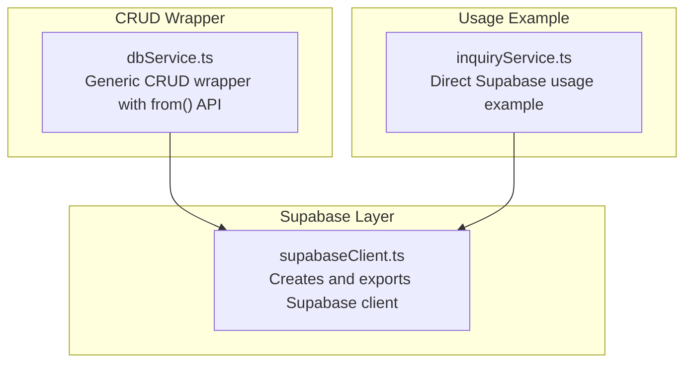
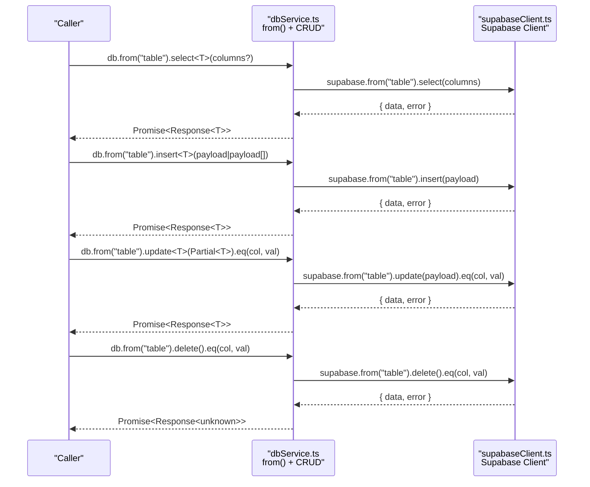
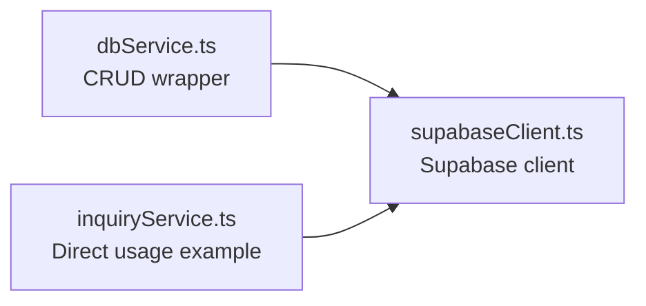

# CRUD Operations

<cite>
**Referenced Files in This Document**
- [dbService.ts](file://src/supabase/dbService.ts)
- [supabaseClient.ts](file://src/supabase/supabaseClient.ts)
- [inquiryService.ts](file://src/supabase/inquiryService.ts)
</cite>

## Table of Contents
1. [Introduction](#introduction)
2. [Project Structure](#project-structure)
3. [Core Components](#core-components)
4. [Architecture Overview](#architecture-overview)
5. [Detailed Component Analysis](#detailed-component-analysis)
6. [Dependency Analysis](#dependency-analysis)
7. [Performance Considerations](#performance-considerations)
8. [Troubleshooting Guide](#troubleshooting-guide)
9. [Conclusion](#conclusion)

## Introduction
This document explains the generic CRUD operations wrapper that provides a type-safe, fluent API for database access using Supabase. It focuses on the from() method pattern and how it enables strongly-typed select(), insert(), update(), and delete() operations with a consistent Response<T> structure. You will learn how to use the fluent chain for complex queries, handle errors consistently, and transform data safely.

## Project Structure
The relevant parts of the codebase are organized into:
- A shared Supabase client configuration
- A generic CRUD wrapper exposing a fluent API
- A service demonstrating direct usage of the underlying client

**Diagram sources**
- [supabaseClient.ts:1-38](file://src/supabase/supabaseClient.ts#L1-L38)
- [dbService.ts:1-24](file://src/supabase/dbService.ts#L1-L24)
- [inquiryService.ts:1-19](file://src/supabase/inquiryService.ts#L1-L19)

**Section sources**
- [supabaseClient.ts:1-38](file://src/supabase/supabaseClient.ts#L1-L38)
- [dbService.ts:1-24](file://src/supabase/dbService.ts#L1-L24)
- [inquiryService.ts:1-19](file://src/supabase/inquiryService.ts#L1-L19)

## Core Components
- Response<T>: A uniform result shape for all operations, containing either data or an error.
- db.from(table): Returns a table-scoped object with fluent methods for select, insert, update, delete, and rpc.
- Fluent methods:
  - select(columns?): returns Response<T>
  - insert(payload | payload[]): returns Response<T>
  - update(payload): returns an object with eq(col, val) returning Response<T>
  - delete(): returns an object with eq(col, val) returning Response<unknown>
  - rpc(fnName, params?): returns Response<T>

Key behaviors:
- Type safety is achieved via generics; you can specify T when calling these methods to get typed results.
- Errors are normalized into Error instances and returned inside Response<T>.
- The wrapper delegates to the underlying Supabase client while standardizing responses.

**Section sources**
- [dbService.ts:3-21](file://src/supabase/dbService.ts#L3-L21)

## Architecture Overview
The wrapper centralizes error handling and typing around Supabase calls. Consumers call db.from(table) and then chain methods to perform CRUD operations. All operations return a Promise<Response<T>> so callers can uniformly handle success and failure.

**Diagram sources**
- [dbService.ts:13-21](file://src/supabase/dbService.ts#L13-L21)
- [supabaseClient.ts:23-26](file://src/supabase/supabaseClient.ts#L23-L26)

## Detailed Component Analysis

### Response<T> Type
- Purpose: Standardize operation outcomes across all CRUD methods.
- Shape:
  - data: T | null
  - error: Error | null
- Behavior:
  - On success, data contains the typed result and error is null.
  - On failure, data is null and error holds an Error instance.
  - Non-Error exceptions are wrapped into Error instances.

Use this type to write uniform error handling logic at call sites.

**Section sources**
- [dbService.ts:3-11](file://src/supabase/dbService.ts#L3-L11)

### from(table) Method Pattern
- Signature: from(table: string) => TableAPI
- TableAPI exposes:
  - select<T>(columns?: string): Promise<Response<T>>
  - insert<T>(payload: T | T[]): Promise<Response<T>>
  - update<T>(payload: Partial<T>): UpdateChain
  - delete(): DeleteChain
  - rpc<T>(fnName: string, params?: object): Promise<Response<T>>
- UpdateChain and DeleteChain expose:
  - eq(col: string, val: unknown): Promise<Response<T>> (or Response<unknown> for delete)

Type-safety:
- Generics allow you to specify the expected row type T for each operation.
- For updates, payload should be Partial<T> to reflect partial row updates.
- For deletes, the response type defaults to unknown because deletion typically does not return rows unless configured otherwise.

Fluent chaining:
- update() and delete() return objects with eq() to constrain the operation by column equality.

**Section sources**
- [dbService.ts:13-21](file://src/supabase/dbService.ts#L13-L21)

### select(columns?)
- Parameters:
  - columns?: string — default "*" if omitted
- Return: Promise<Response<T>>
- Usage:
  - Specify T to get typed rows.
  - Use column selection strings to limit fields.

Example patterns:
- Fetch all rows with full typing: db.from("users").select<User>()
- Fetch specific columns: db.from("users").select<User>("id,name,email")

**Section sources**
- [dbService.ts:15](file://src/supabase/dbService.ts#L15)

### insert(payload | payload[])
- Parameters:
  - payload: T | T[] — single record or array of records
- Return: Promise<Response<T>>
- Notes:
  - When inserting multiple rows, T represents the row type.
  - The wrapper normalizes the response into Response<T>.

Example patterns:
- Insert one: db.from("users").insert<User>({ name: "Alice", email: "alice@example.com" })
- Insert many: db.from("users").insert<User[]>([{ ... }, { ... }])

**Section sources**
- [dbService.ts:16](file://src/supabase/dbService.ts#L16)

### update(payload).eq(col, val)
- Parameters:
  - payload: Partial<T> — fields to update
  - col: string — column name to filter by
  - val: unknown — value to match
- Return: Promise<Response<T>>
- Notes:
  - Requires chaining .eq() to specify which rows to update.
  - Payload should be Partial<T> to avoid requiring all fields.

Example patterns:
- Update one field: db.from("users").update<User>({ email: "new@example.com" }).eq("id", 1)

**Section sources**
- [dbService.ts:17](file://src/supabase/dbService.ts#L17)

### delete().eq(col, val)
- Parameters:
  - col: string — column name to filter by
  - val: unknown — value to match
- Return: Promise<Response<unknown>>
- Notes:
  - Requires chaining .eq() to specify which rows to delete.
  - Default response type is unknown; cast to your model if needed.

Example patterns:
- Delete by id: db.from("users").delete().eq("id", 1)

**Section sources**
- [dbService.ts:18](file://src/supabase/dbService.ts#L18)

### rpc(fnName, params?)
- Parameters:
  - fnName: string — name of the RPC function
  - params?: object — parameters to pass
- Return: Promise<Response<T>>
- Notes:
  - Useful for server-side logic exposed via Supabase functions.

Example patterns:
- Call function: db.from("rpc").rpc("get_user_count")

**Section sources**
- [dbService.ts:19](file://src/supabase/dbService.ts#L19)

### Error Handling Patterns
- Always check error before accessing data:
  - If error is non-null, handle it (log, show user message, retry).
  - Otherwise, use data which is guaranteed to be T | null.
- Normalize behavior:
  - All operations return Response<T>, enabling consistent try/catch-free handling at call sites.

Recommended pattern:
- Await the operation.
- If response.error exists, handle it.
- Else, proceed with response.data.

**Section sources**
- [dbService.ts:3-11](file://src/supabase/dbService.ts#L3-L11)

### Data Transformation
- After retrieving data, transform or map it to your domain models.
- Because Response<T> preserves types, transformations can be fully typed.
- For arrays, map over response.data when non-null.

Example patterns:
- Map rows to DTOs after select.
- Validate or coerce fields post-insert/update.

[No sources needed since this section provides general guidance]

### Fluent API Chain for Complex Queries
- While the current wrapper exposes basic filtering via eq(), you can extend it to support additional filters or joins by building on the same pattern.
- Keep the Response<T> contract consistent for all new methods.

[No sources needed since this section provides general guidance]

## Dependency Analysis
The wrapper depends on the Supabase client and provides a thin abstraction layer.

**Diagram sources**
- [dbService.ts:1-24](file://src/supabase/dbService.ts#L1-L24)
- [supabaseClient.ts:1-38](file://src/supabase/supabaseClient.ts#L1-L38)
- [inquiryService.ts:1-19](file://src/supabase/inquiryService.ts#L1-L19)

**Section sources**
- [dbService.ts:1-24](file://src/supabase/dbService.ts#L1-L24)
- [supabaseClient.ts:1-38](file://src/supabase/supabaseClient.ts#L1-L38)
- [inquiryService.ts:1-19](file://src/supabase/inquiryService.ts#L1-L19)

## Performance Considerations
- Batch inserts: Prefer inserting arrays to reduce round trips.
- Column selection: Limit selected columns to reduce payload size.
- Avoid N+1 queries: Use appropriate joins or batch fetching where possible.
- Reuse client instances: The shared Supabase client avoids redundant initialization.

[No sources needed since this section provides general guidance]

## Troubleshooting Guide
Common issues and resolutions:
- Null data with no error: Indicates zero rows matched; verify query conditions and RLS policies.
- Unexpected errors: Inspect response.error; ensure network and permissions are correct.
- Environment misconfiguration: Ensure VITE_SUPABASE_URL and VITE_SUPABASE_ANON_KEY are set correctly.
- Direct vs wrapper usage: The inquiry service shows direct Supabase usage; prefer the wrapper for consistent error handling and typing.

**Section sources**
- [supabaseClient.ts:6-19](file://src/supabase/supabaseClient.ts#L6-L19)
- [inquiryService.ts:6-17](file://src/supabase/inquiryService.ts#L6-L17)

## Conclusion
The generic CRUD wrapper provides a clean, type-safe interface for database operations through a fluent API. By standardizing responses with Response<T>, it simplifies error handling and enables consistent data transformation. Use from() to scope operations to a table, chain methods for precise control, and always handle errors uniformly. Extend the wrapper as needed while preserving the Response<T> contract for maintainability.