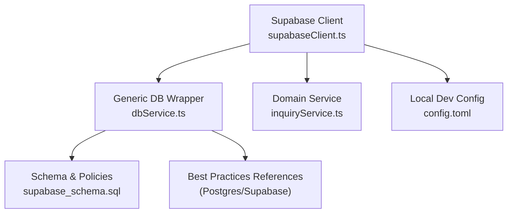
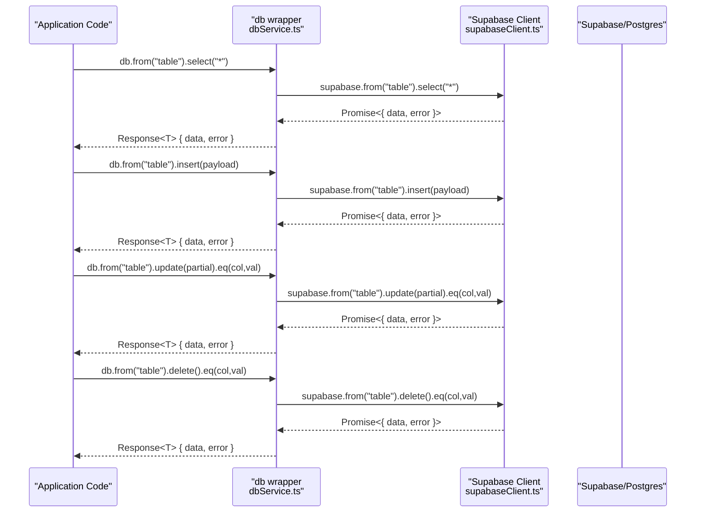
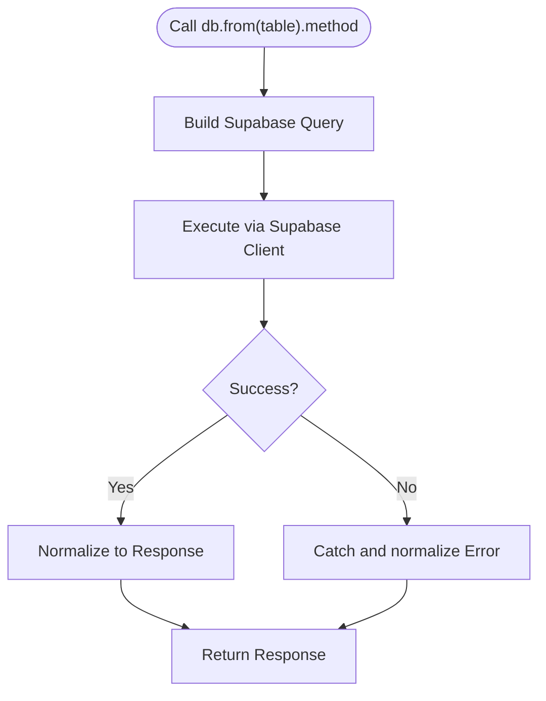
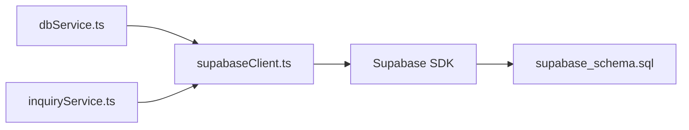

# Database Service Layer

<cite>
**Referenced Files in This Document**
- [dbService.ts](file://src/supabase/dbService.ts)
- [inquiryService.ts](file://src/supabase/inquiryService.ts)
- [supabaseClient.ts](file://src/supabase/supabaseClient.ts)
- [SUPABASE.md](file://SUPABASE.md)
- [supabase_schema.sql](file://supabase_schema.sql)
- [config.toml](file://supabase/config.toml)
- [conn-pooling.md](file://.agents\skills\supabase-postgres-best-practices\references\conn-pooling.md)
- [data-batch-inserts.md](file://.agents\skills\supabase-postgres-best-practices\references\data-batch-inserts.md)
- [data-pagination.md](file://.agents\skills\supabase-postgres-best-practices\references\data-pagination.md)
- [data-upsert.md](file://.agents\skills\supabase-postgres-best-practices\references\data-upsert.md)
- [conn-prepared-statements.md](file://.agents\skills\supabase-postgres-best-practices\references\conn-prepared-statements.md)
- [monitor-explain-analyze.md](file://.agents\skills\supabase-postgres-best-practices\references\monitor-explain-analyze.md)
- [lock-short-transactions.md](file://.agents\skills\supabase-postgres-best-practices\references\lock-short-transactions.md)
- [lock-deadlock-prevention.md](file://.agents\skills\supabase-postgres-best-practices\references\lock-deadlock-prevention.md)
</cite>

## Table of Contents
1. Introduction
2. Project Structure
3. Core Components
4. Architecture Overview
5. Detailed Component Analysis
6. Dependency Analysis
7. Performance Considerations
8. Troubleshooting Guide
9. Conclusion

## Introduction
This document explains the database service layer implementation for the project, focusing on:
- A generic CRUD wrapper around Supabase with TypeScript interfaces
- Query builder patterns and error handling strategies
- Transaction handling guidance, batch operations, and performance optimization techniques
- Examples of complex queries, filtering, sorting, pagination, connection pooling, retry mechanisms, and debugging approaches

The implementation centers on a small, composable db wrapper that standardizes responses and exposes a fluent API for common data operations.

## Project Structure
At a high level, the database layer is composed of:
- A shared Supabase client configured via environment variables
- A generic db wrapper providing table-scoped CRUD methods
- A domain-specific service (e.g., inquiries) demonstrating direct usage patterns
- Schema definitions and RLS policies to secure data access
- Best practices references for Postgres performance and reliability

**Diagram sources**
- [supabaseClient.ts:1-38](file://src/supabase/supabaseClient.ts#L1-L38)
- [dbService.ts:1-24](file://src/supabase/dbService.ts#L1-L24)
- [inquiryService.ts:1-19](file://src/supabase/inquiryService.ts#L1-L19)
- [supabase_schema.sql:1-198](file://supabase_schema.sql#L1-L198)
- [config.toml:1-415](file://supabase/config.toml#L1-L415)

**Section sources**
- [supabaseClient.ts:1-38](file://src/supabase/supabaseClient.ts#L1-L38)
- [dbService.ts:1-24](file://src/supabase/dbService.ts#L1-L24)
- [inquiryService.ts:1-19](file://src/supabase/inquiryService.ts#L1-L19)
- [supabase_schema.sql:1-198](file://supabase_schema.sql#L1-L198)
- [config.toml:1-415](file://supabase/config.toml#L1-L415)

## Core Components
- Generic response type and handler:
  - Response<T> encapsulates { data | null, error | null }
  - handle<T> normalizes success and error outcomes from Supabase calls
- Fluent db wrapper:
  - db.from(table) returns an object with select, insert, update, delete, rpc
  - Methods return Promise<Response<T>> for consistent error propagation
- Domain service example:
  - inquiryService demonstrates direct Supabase usage with explicit error throwing

Key TypeScript interfaces exposed by the wrapper:
- Response<T>: { data: T | null; error: Error | null }
- FromBuilder: { select(columns), insert(payload), update(payload).eq(col,val), delete().eq(col,val), rpc(fnName,params) }

Operational notes:
- All methods wrap Supabase calls through handle<T>, ensuring uniform error handling
- The RPC method enables calling stored procedures or edge functions

**Section sources**
- [dbService.ts:1-24](file://src/supabase/dbService.ts#L1-L24)
- [inquiryService.ts:1-19](file://src/supabase/inquiryService.ts#L1-L19)

## Architecture Overview
The runtime flow starts with the Supabase client initialized from environment variables. The db wrapper provides a consistent interface over Supabase’s query builder, while domain services can use either the wrapper or direct client calls.

**Diagram sources**
- [dbService.ts:1-24](file://src/supabase/dbService.ts#L1-L24)
- [supabaseClient.ts:1-38](file://src/supabase/supabaseClient.ts#L1-L38)

## Detailed Component Analysis

### Generic CRUD Wrapper (dbService.ts)
Responsibilities:
- Normalize all Supabase results into a consistent Response<T>
- Provide a fluent API for table-scoped operations
- Expose RPC invocation for server-side logic

TypeScript interfaces:
- Response<T>: { data: T | null; error: Error | null }
- FromBuilder:
  - select(columns?: string): Promise<Response<T>>
  - insert(payload: T | T[]): Promise<Response<T>>
  - update(payload: Partial<T>): { eq(col: string, val: unknown): Promise<Response<T>> }
  - delete(): { eq(col: string, val: unknown): Promise<Response<unknown>> }
  - rpc<T>(fnName: string, params?: object): Promise<Response<T>>

Error handling strategy:
- Success path returns normalized data and null error
- Failure path returns null data and a standardized Error instance

Performance considerations:
- Batch inserts supported by passing arrays to insert
- Select supports column selection to reduce payload size
- RPC allows moving complex logic to the server

**Diagram sources**
- [dbService.ts:1-24](file://src/supabase/dbService.ts#L1-L24)

**Section sources**
- [dbService.ts:1-24](file://src/supabase/dbService.ts#L1-L24)

### Domain Service Example (inquiryService.ts)
Demonstrates direct Supabase usage:
- getAllInquiries: selects all rows and throws on error
- createInquiry: inserts a new record and throws on error

Use cases:
- When you need explicit control over error semantics outside the wrapper
- For simple operations where the wrapper’s Response pattern is not desired

Note:
- This service throws errors rather than returning them in a Response object, which differs from the wrapper’s approach. Choose one strategy per module for consistency.

**Section sources**
- [inquiryService.ts:1-19](file://src/supabase/inquiryService.ts#L1-L19)

### Supabase Client Configuration (supabaseClient.ts)
Responsibilities:
- Reads VITE_SUPABASE_URL and VITE_SUPABASE_ANON_KEY
- Validates configuration and warns about common mistakes
- Exports a single shared Supabase client instance
- Provides a debug helper to log non-sensitive config details

Best practices:
- Use a single client instance across the app
- Ensure environment variables are set correctly and do not include /rest/v1 suffix

**Section sources**
- [supabaseClient.ts:1-38](file://src/supabase/supabaseClient.ts#L1-L38)
- [SUPABASE.md:1-38](file://SUPABASE.md#L1-L38)

### Schema and Security (supabase_schema.sql)
Highlights:
- Defines core tables used by the application
- Enables Row Level Security (RLS) policies for all listed tables
- Grants permissions to anon, authenticated, and service_role roles

Implications:
- Queries may be filtered or blocked by RLS policies
- Ensure your client uses appropriate credentials and policies allow intended operations

**Section sources**
- [supabase_schema.sql:1-198](file://supabase_schema.sql#L1-L198)

## Dependency Analysis
The database layer has clear dependencies:
- dbService.ts depends on supabaseClient.ts
- inquiryService.ts depends on supabaseClient.ts
- Both rely on Supabase’s query builder and RPC capabilities
- Schema and RLS policies influence query behavior at the database layer

**Diagram sources**
- [dbService.ts:1-24](file://src/supabase/dbService.ts#L1-L24)
- [inquiryService.ts:1-19](file://src/supabase/inquiryService.ts#L1-L19)
- [supabaseClient.ts:1-38](file://src/supabase/supabaseClient.ts#L1-L38)
- [supabase_schema.sql:1-198](file://supabase_schema.sql#L1-L198)

**Section sources**
- [dbService.ts:1-24](file://src/supabase/dbService.ts#L1-L24)
- [inquiryService.ts:1-19](file://src/supabase/inquiryService.ts#L1-L19)
- [supabaseClient.ts:1-38](file://src/supabase/supabaseClient.ts#L1-L38)
- [supabase_schema.sql:1-198](file://supabase_schema.sql#L1-L198)

## Performance Considerations
Recommended techniques aligned with best practices:

- Connection pooling
  - Use a pooler (e.g., PgBouncer) between app and database to scale concurrency efficiently
  - Prefer transaction mode for most apps; session mode when prepared statements or temp tables are required
  - Reference: [conn-pooling.md:1-42](file://.agents\skills\supabase-postgres-best-practices\references\conn-pooling.md#L1-L42)

- Prepared statements with pooling
  - Avoid named prepared statements in transaction-mode pooling due to connection sharing
  - Use unnamed statements or deallocate after use; consider session mode if persistence is needed
  - Reference: [conn-prepared-statements.md:1-47](file://.agents\skills\supabase-postgres-best-practices\references\conn-prepared-statements.md#L1-L47)

- Batch inserts
  - Group multiple rows into a single INSERT to reduce round trips and overhead
  - For large imports, prefer COPY for maximum throughput
  - Reference: [data-batch-inserts.md:1-55](file://.agents\skills\supabase-postgres-best-practices\references\data-batch-inserts.md#L1-L55)

- Pagination
  - Prefer cursor-based (keyset) pagination over OFFSET for stable O(1) performance
  - Include all sort columns in the cursor for multi-column ordering
  - Reference: [data-pagination.md:1-51](file://.agents\skills\supabase-postgres-best-practices\references\data-pagination.md#L1-L51)

- Upserts
  - Use ON CONFLICT to perform atomic insert-or-update operations and avoid race conditions
  - Reference: [data-upsert.md:1-51](file://.agents\skills\supabase-postgres-best-practices\references\data-upsert.md#L1-L51)

- Transactions
  - Keep transactions short to minimize lock contention and deadlocks
  - Set statement timeouts to prevent runaway queries
  - Reference: [lock-short-transactions.md:1-51](file://.agents\skills\supabase-postgres-best-practices\references\lock-short-transactions.md#L1-L51)

- Deadlock prevention
  - Acquire locks in a consistent order or combine updates into a single statement
  - Monitor deadlock metrics and enable relevant logging
  - Reference: [lock-deadlock-prevention.md:1-69](file://.agents\skills\supabase-postgres-best-practices\references\lock-deadlock-prevention.md#L1-L69)

- Diagnostics
  - Use EXPLAIN ANALYZE to identify bottlenecks and validate index usage
  - Reference: [monitor-explain-analyze.md:1-46](file://.agents\skills\supabase-postgres-best-practices\references\monitor-explain-analyze.md#L1-L46)

Implementation tips within the current codebase:
- Use db.from(table).insert(arrayOfRows) for batch inserts
- Select only necessary columns to reduce payload size
- Move complex logic to server-side functions via db.rpc()
- Centralize error handling using Response<T> and decide whether to throw or return errors consistently

[No sources needed since this section provides general guidance]

## Troubleshooting Guide
Common issues and resolutions:

- Missing environment variables
  - Ensure VITE_SUPABASE_URL and VITE_SUPABASE_ANON_KEY are present and correct
  - Do not append /rest/v1 to the URL
  - Use the debug helper to print non-sensitive host info
  - Reference: [supabaseClient.ts:1-38](file://src/supabase/supabaseClient.ts#L1-L38), [SUPABASE.md:1-38](file://SUPABASE.md#L1-L38)

- Empty results with no errors
  - Verify row existence in Supabase Studio
  - Check RLS policies and permissions for anon/authenticated roles
  - Confirm field names and primary keys match inserted payloads
  - Reference: [SUPABASE.md:1-38](file://SUPABASE.md#L1-L38), [supabase_schema.sql:1-198](file://supabase_schema.sql#L1-L198)

- Inconsistent error handling
  - Decide between throwing errors (as in inquiryService) or returning Response<T> (as in dbService)
  - Standardize across modules to simplify consumer code

- Slow queries
  - Use EXPLAIN ANALYZE to diagnose
  - Add indexes on WHERE/JOIN columns
  - Replace OFFSET with keyset pagination
  - Reference: [monitor-explain-analyze.md:1-46](file://.agents\skills\supabase-postgres-best-practices\references\monitor-explain-analyze.md#L1-L46), [data-pagination.md:1-51](file://.agents\skills\supabase-postgres-best-practices\references\data-pagination.md#L1-L51)

- Connection exhaustion under load
  - Enable and configure a connection pooler
  - Tune pool sizes based on CPU cores and workload
  - Reference: [conn-pooling.md:1-42](file://.agents\skills\supabase-postgres-best-practices\references\conn-pooling.md#L1-L42)

- Prepared statement conflicts
  - Avoid named prepared statements in transaction-mode pooling
  - Use unnamed statements or session mode
  - Reference: [conn-prepared-statements.md:1-47](file://.agents\skills\supabase-postgres-best-practices\references\conn-prepared-statements.md#L1-L47)

**Section sources**
- [supabaseClient.ts:1-38](file://src/supabase/supabaseClient.ts#L1-L38)
- [SUPABASE.md:1-38](file://SUPABASE.md#L1-L38)
- [supabase_schema.sql:1-198](file://supabase_schema.sql#L1-L198)

## Conclusion
The database service layer provides a concise, typed, and consistent interface for interacting with Supabase. The generic wrapper standardizes error handling and offers a fluent API for common operations, while domain services can opt for direct client usage when needed. By adopting the recommended best practices—connection pooling, batch operations, keyset pagination, upserts, short transactions, and diagnostics—you can achieve reliable, scalable, and efficient database interactions.

[No sources needed since this section summarizes without analyzing specific files]