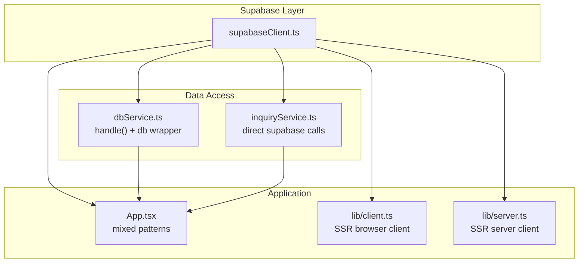
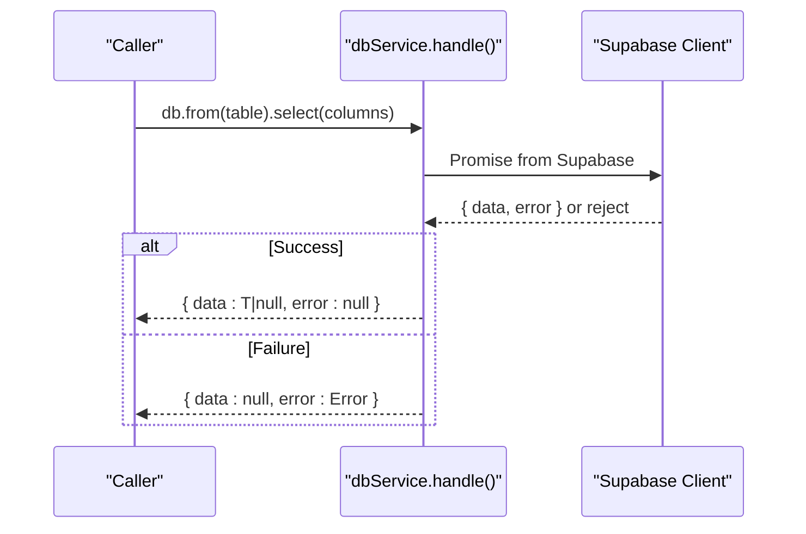
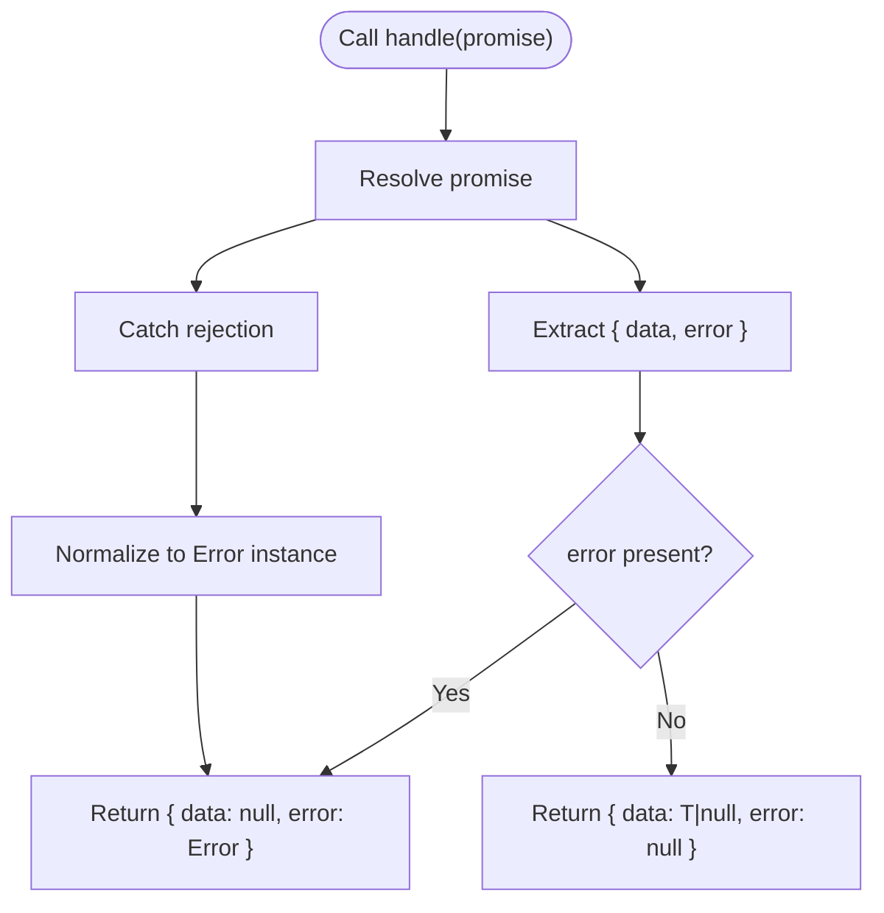
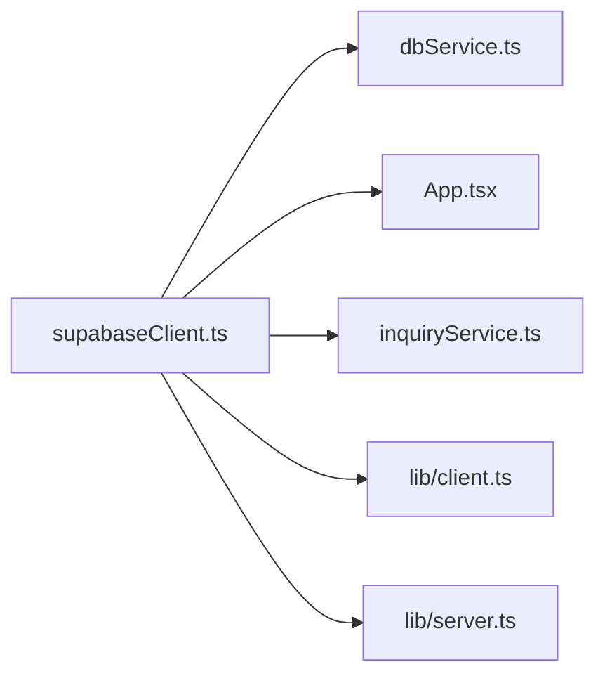

# Error Handling & Response Management

<cite>
**Referenced Files in This Document**
- [dbService.ts](file://src/supabase/dbService.ts)
- [supabaseClient.ts](file://src/supabase/supabaseClient.ts)
- [inquiryService.ts](file://src/supabase/inquiryService.ts)
- [App.tsx](file://src/App.tsx)
- [client.ts](file://src/lib/client.ts)
- [server.ts](file://src/lib/server.ts)
- [SUPABASE.md](file://SUPABASE.md)
</cite>

## Table of Contents
1. Introduction
2. Project Structure
3. Core Components
4. Architecture Overview
5. Detailed Component Analysis
6. Dependency Analysis
7. Performance Considerations
8. Troubleshooting Guide
9. Conclusion

## Introduction
This document explains the centralized error handling strategy and how Supabase responses are normalized into consistent Response<T> objects. It focuses on the handle() function, error types, propagation patterns, debugging techniques, and practical guidance for connection errors, validation failures, and network issues. It also provides examples of error recovery strategies, logging approaches, and testing scenarios.

## Project Structure
The error handling strategy centers around a small wrapper that normalizes Supabase client responses into a uniform shape. The application currently uses two patterns:
- A centralized db service with a handle() helper that returns { data | null; error | null }
- Direct usage of the Supabase client throughout components, which throws or returns error fields depending on the call site

**Diagram sources**
- [supabaseClient.ts:1-38](file://src/supabase/supabaseClient.ts#L1-L38)
- [dbService.ts:1-24](file://src/supabase/dbService.ts#L1-L24)
- [inquiryService.ts:1-19](file://src/supabase/inquiryService.ts#L1-L19)
- [client.ts:1-9](file://src/lib/client.ts#L1-L9)
- [server.ts:1-29](file://src/lib/server.ts#L1-L29)
- [App.tsx:1-800](file://src/App.tsx#L1-L800)

**Section sources**
- [dbService.ts:1-24](file://src/supabase/dbService.ts#L1-L24)
- [supabaseClient.ts:1-38](file://src/supabase/supabaseClient.ts#L1-L38)
- [inquiryService.ts:1-19](file://src/supabase/inquiryService.ts#L1-L19)
- [client.ts:1-9](file://src/lib/client.ts#L1-L9)
- [server.ts:1-29](file://src/lib/server.ts#L1-L29)
- [App.tsx:1-800](file://src/App.tsx#L1-L800)

## Core Components
- Response<T> type: a normalized shape with data (T | null) and error (Error | null).
- handle(): wraps any Supabase promise to return Response<T>, catching both rejected promises and non-Error values.
- db wrapper: exposes table-level methods (select, insert, update, delete, rpc) that all go through handle().
- inquiryService: demonstrates an alternative pattern using direct Supabase calls and throwing on error.
- App component: shows mixed usage—some places use direct Supabase calls with destructured error fields, others could use the db wrapper.

Key responsibilities:
- Centralize normalization of success and failure cases
- Ensure callers always receive a predictable shape
- Provide a single place to add logging, retries, or telemetry

**Section sources**
- [dbService.ts:1-24](file://src/supabase/dbService.ts#L1-L24)
- [inquiryService.ts:1-19](file://src/supabase/inquiryService.ts#L1-L19)
- [App.tsx:349-602](file://src/App.tsx#L349-L602)

## Architecture Overview
The system has two primary flows:
- Centralized flow via dbService.handle(): every database operation is wrapped to produce a consistent Response<T>.
- Direct flow via supabase client: components destructure { data, error } and handle errors inline.

**Diagram sources**
- [dbService.ts:5-11](file://src/supabase/dbService.ts#L5-L11)
- [supabaseClient.ts:23-26](file://src/supabase/supabaseClient.ts#L23-L26)

**Section sources**
- [dbService.ts:1-24](file://src/supabase/dbService.ts#L1-L24)
- [supabaseClient.ts:1-38](file://src/supabase/supabaseClient.ts#L1-L38)

## Detailed Component Analysis

### Centralized handle() and Response<T>
- Normalization: extracts data and error from the Supabase result object; if no error, sets error to null.
- Rejection handling: catches thrown errors and ensures they are wrapped as Error instances.
- Type safety: generic <T> allows typed data while keeping error as Error | null.

**Diagram sources**
- [dbService.ts:5-11](file://src/supabase/dbService.ts#L5-L11)

**Section sources**
- [dbService.ts:1-24](file://src/supabase/dbService.ts#L1-L24)

### db wrapper API surface
- from(table): returns an object with select, insert, update, delete, rpc methods.
- Each method returns a Promise<Response<T>> by passing the underlying Supabase call to handle().
- update and delete expose chaining with eq(...) before returning the handled promise.

Usage implications:
- Callers can consistently check response.error to branch logic without try/catch.
- Data is guaranteed to be T | null when error is null.

**Section sources**
- [dbService.ts:13-21](file://src/supabase/dbService.ts#L13-L21)

### Direct Supabase usage in App.tsx
- Many operations destructure { data, error } directly from Supabase calls.
- Errors are typically logged or shown via toast notifications.
- Some paths throw or rely on catch blocks at higher levels.

Recommendation:
- Migrate these paths to use the db wrapper to unify error handling and reduce duplication.

**Section sources**
- [App.tsx:349-602](file://src/App.tsx#L349-L602)
- [App.tsx:1151-1170](file://src/App.tsx#L1151-L1170)
- [App.tsx:1412-1430](file://src/App.tsx#L1412-L1430)

### inquiryService.ts pattern
- Uses direct Supabase calls and throws on error.
- Suitable for services where exceptions should bubble up to a central error boundary or UI handler.

Comparison:
- inquiryService throws; dbService returns error in a structured Response<T>.
- Choose one pattern per codebase to avoid inconsistency.

**Section sources**
- [inquiryService.ts:1-19](file://src/supabase/inquiryService.ts#L1-L19)

### SSR clients (lib/client.ts and lib/server.ts)
- Create browser and server Supabase clients with environment variables.
- Not directly involved in error handling but provide the underlying client used by dbService and App.

**Section sources**
- [client.ts:1-9](file://src/lib/client.ts#L1-L9)
- [server.ts:1-29](file://src/lib/server.ts#L1-L29)

## Dependency Analysis
- dbService depends on supabaseClient for the Supabase instance.
- App and inquiryService depend on supabaseClient directly.
- SSR clients are separate entry points for different environments.

**Diagram sources**
- [supabaseClient.ts:1-38](file://src/supabase/supabaseClient.ts#L1-L38)
- [dbService.ts:1-24](file://src/supabase/dbService.ts#L1-L24)
- [inquiryService.ts:1-19](file://src/supabase/inquiryService.ts#L1-L19)
- [client.ts:1-9](file://src/lib/client.ts#L1-L9)
- [server.ts:1-29](file://src/lib/server.ts#L1-L29)
- [App.tsx:1-800](file://src/App.tsx#L1-L800)

**Section sources**
- [supabaseClient.ts:1-38](file://src/supabase/supabaseClient.ts#L1-L38)
- [dbService.ts:1-24](file://src/supabase/dbService.ts#L1-L24)
- [inquiryService.ts:1-19](file://src/supabase/inquiryService.ts#L1-L19)
- [client.ts:1-9](file://src/lib/client.ts#L1-L9)
- [server.ts:1-29](file://src/lib/server.ts#L1-L29)
- [App.tsx:1-800](file://src/App.tsx#L1-L800)

## Performance Considerations
- handle() adds minimal overhead: a single then/catch chain per call.
- Avoid unnecessary wrapping; prefer using db wrapper consistently to prevent duplicate error handling logic.
- For high-frequency operations, consider batching or caching results to reduce repeated network calls.

[No sources needed since this section provides general guidance]

## Troubleshooting Guide

### Environment and configuration
- Validate Supabase URL and anon key at startup; warnings are logged if misconfigured.
- Ensure VITE_SUPABASE_URL does not include /rest/v1/ suffix.

**Section sources**
- [supabaseClient.ts:6-19](file://src/supabase/supabaseClient.ts#L6-L19)
- [SUPABASE.md:1-38](file://SUPABASE.md#L1-L38)

### Connection errors
- Network failures will be caught by handle() and returned as error in Response<T>.
- In direct Supabase usage, errors appear as error fields or thrown exceptions depending on the call path.

Recovery strategies:
- Implement retry with exponential backoff for transient network errors.
- Show user-friendly messages and allow retry actions.

**Section sources**
- [dbService.ts:5-11](file://src/supabase/dbService.ts#L5-L11)
- [App.tsx:349-602](file://src/App.tsx#L349-L602)

### Validation failures
- Frontend validation should occur before making requests to reduce error traffic.
- When backend validation fails, Supabase returns an error field; handle it uniformly via Response<T> or inline checks.

Best practices:
- Centralize validation rules near the request boundary.
- Map Supabase error codes to user-facing messages.

**Section sources**
- [App.tsx:688-720](file://src/App.tsx#L688-L720)
- [App.tsx:1151-1170](file://src/App.tsx#L1151-L1170)

### Logging and debugging
- Add structured logging inside handle() to capture operation context (table, method, params).
- Use debugSupabaseInfo() to log host and key presence during development.

Example logging approach:
- Log request signature and timing.
- Log error stack traces only in development.

**Section sources**
- [supabaseClient.ts:30-38](file://src/supabase/supabaseClient.ts#L30-L38)
- [dbService.ts:5-11](file://src/supabase/dbService.ts#L5-L11)

### Testing error scenarios
- Mock Supabase client to return { data: null, error: someError } or reject the promise.
- Assert that handle() returns Response<T> with error set and data null.
- Verify caller branches correctly on error vs data.

Test checklist:
- Successful query returns typed data and null error.
- Network error returns Error instance.
- Non-Error rejection is normalized to Error.
- Retry logic triggers on specific error codes.

[No sources needed since this section provides general guidance]

## Conclusion
The centralized handle() function provides a consistent Response<T> shape for all Supabase operations, simplifying error handling across the app. While the current codebase mixes direct Supabase usage with the db wrapper, adopting the wrapper everywhere will improve consistency, testability, and maintainability. Enhance handle() with logging, retries, and telemetry to build robust error recovery strategies.

[No sources needed since this section summarizes without analyzing specific files]