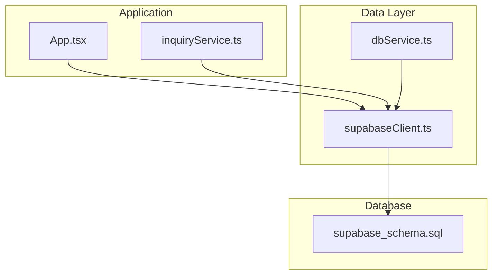
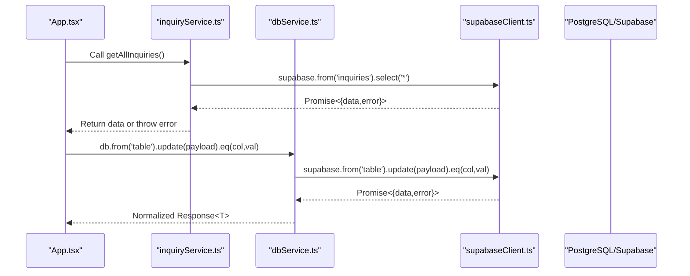
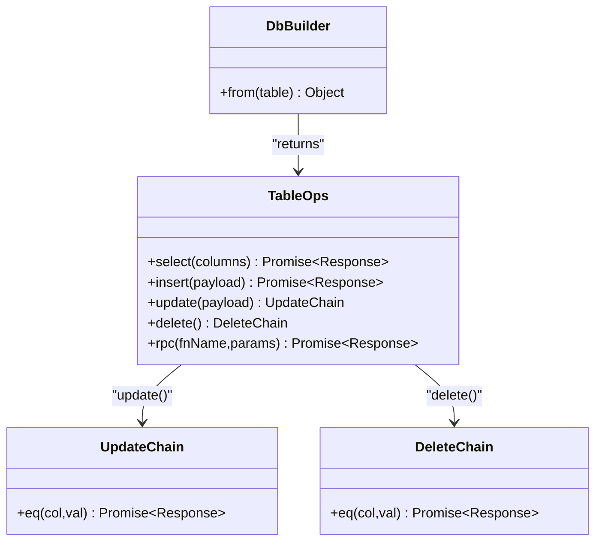
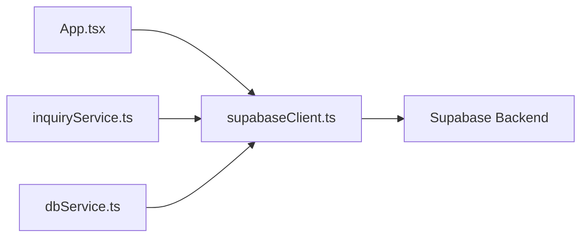

# Query Builder Pattern

<cite>
**Referenced Files in This Document**
- [dbService.ts](file://src/supabase/dbService.ts)
- [supabaseClient.ts](file://src/supabase/supabaseClient.ts)
- [inquiryService.ts](file://src/supabase/inquiryService.ts)
- [App.tsx](file://src/App.tsx)
- [supabase_schema.sql](file://supabase_schema.sql)
</cite>

## Table of Contents
1. [Introduction](#introduction)
2. [Project Structure](#project-structure)
3. [Core Components](#core-components)
4. [Architecture Overview](#architecture-overview)
5. [Detailed Component Analysis](#detailed-component-analysis)
6. [Dependency Analysis](#dependency-analysis)
7. [Performance Considerations](#performance-considerations)
8. [Troubleshooting Guide](#troubleshooting-guide)
9. [Conclusion](#conclusion)

## Introduction
This document explains the query builder pattern implementation used to build readable and maintainable database queries against Supabase. It focuses on the fluent API design with chaining methods such as eq() for filtering, how the builder pattern composes operations, parameter validation, type safety through TypeScript generics, and practical examples of complex filtering, conditional updates, and nested query structures. The goal is to help developers understand both the current implementation and how to extend it safely and effectively.

## Project Structure
The query-related code is primarily located under src/supabase and is consumed by application components and services:
- dbService.ts defines a minimal, fluent query builder over Supabase with select, insert, update, delete, and rpc operations.
- supabaseClient.ts initializes the shared Supabase client and validates environment configuration.
- inquiryService.ts demonstrates direct usage of the Supabase client for simple CRUD operations.
- App.tsx contains extensive usage of Supabase’s fluent API (select, insert, update, delete, order, maybeSingle) across many features.
- supabase_schema.sql defines the database schema and Row Level Security policies that govern data access.

**Diagram sources**
- [App.tsx](file://src/App.tsx)
- [inquiryService.ts](file://src/supabase/inquiryService.ts)
- [dbService.ts](file://src/supabase/dbService.ts)
- [supabaseClient.ts](file://src/supabase/supabaseClient.ts)
- [supabase_schema.sql](file://supabase_schema.sql)

**Section sources**
- [dbService.ts](file://src/supabase/dbService.ts)
- [supabaseClient.ts](file://src/supabase/supabaseClient.ts)
- [inquiryService.ts](file://src/supabase/inquiryService.ts)
- [App.tsx](file://src/App.tsx)
- [supabase_schema.sql](file://supabase_schema.sql)

## Core Components
- Fluent query builder (dbService.ts): Provides a from(table) entry point returning an object with select, insert, update, delete, and rpc methods. Update and delete expose an eq method to chain filters before execution. All operations are wrapped with a handle utility that normalizes responses into { data, error } and ensures consistent error handling.
- Supabase client initialization (supabaseClient.ts): Creates a single shared client instance, validates environment variables, and warns about common misconfigurations.
- Service layer example (inquiryService.ts): Shows straightforward use of supabase.from(...).select(...) and .insert(...) patterns.
- Application usage (App.tsx): Demonstrates real-world queries including select with ordering, insert, update with eq, delete with eq, and chained operations like .select().maybeSingle().

Key responsibilities:
- Type safety via TypeScript generics for typed results.
- Consistent response shape and error normalization.
- Fluent composition of operations for readability.

**Section sources**
- [dbService.ts](file://src/supabase/dbService.ts)
- [supabaseClient.ts](file://src/supabase/supabaseClient.ts)
- [inquiryService.ts](file://src/supabase/inquiryService.ts)
- [App.tsx](file://src/App.tsx)

## Architecture Overview
The architecture follows a layered approach:
- Application layer (App.tsx, inquiryService.ts) constructs queries using either the custom dbService or directly via Supabase client.
- Data layer (dbService.ts) wraps Supabase calls with a uniform response shape and optional fluent chaining.
- Infrastructure (supabaseClient.ts) manages client configuration and environment validation.
- Database (supabase_schema.sql) enforces schema and RLS policies.

**Diagram sources**
- [App.tsx](file://src/App.tsx)
- [inquiryService.ts](file://src/supabase/inquiryService.ts)
- [dbService.ts](file://src/supabase/dbService.ts)
- [supabaseClient.ts](file://src/supabase/supabaseClient.ts)

## Detailed Component Analysis

### Fluent Query Builder (dbService.ts)
The builder exposes a from(table) factory that returns:
- select(columns): Executes a SELECT and returns a normalized response.
- insert(payload): Executes an INSERT and returns a normalized response.
- update(payload): Returns an object with eq(col, val) to apply a filter and execute the update.
- delete(): Returns an object with eq(col, val) to apply a filter and execute the deletion.
- rpc(fnName, params?): Executes a Supabase RPC function.

Type safety:
- Generics allow callers to specify the expected result type T for select, insert, and update.
- Partial<T> is used for update payloads to ensure only specified fields are included.

Error handling:
- A handle utility wraps promises to return { data, error } consistently, converting errors to Error instances when necessary.

**Diagram sources**
- [dbService.ts](file://src/supabase/dbService.ts)

Practical usage patterns:
- Complex filtering: Chain multiple conditions where supported by the underlying Supabase client; currently the builder exposes a single eq() per operation. Extend to support additional filters if needed.
- Conditional updates: Build payload conditionally and call update(payload).eq(filter).
- Nested queries: Use separate queries and compose results in application logic; avoid deep nesting in the builder itself.

**Section sources**
- [dbService.ts](file://src/supabase/dbService.ts)

### Supabase Client Initialization (supabaseClient.ts)
Responsibilities:
- Reads environment variables for URL and anon key.
- Validates presence and warns about incorrect URL formats.
- Exports a single shared Supabase client instance.

Best practices:
- Centralize configuration to prevent duplication.
- Validate early to catch misconfiguration during startup.

**Section sources**
- [supabaseClient.ts](file://src/supabase/supabaseClient.ts)

### Service Layer Example (inquiryService.ts)
Demonstrates:
- Direct use of supabase.from('inquiries').select('*') for reading all inquiries.
- Inserting new records with supabase.from('inquiries').insert([...]).

Notes:
- Throws errors directly rather than returning them, which differs from the normalized Response shape provided by dbService.ts. Choose one strategy consistently across the app.

**Section sources**
- [inquiryService.ts](file://src/supabase/inquiryService.ts)

### Application Usage Patterns (App.tsx)
Common patterns observed:
- Select with ordering: supabase.from('delivery_jobs').select('*').order('created_at', { ascending: false })
- Insert with selection: supabase.from('profiles').insert([payload]).select().maybeSingle()
- Update with filter: supabase.from('inquiries').update({ admin_response, status }).eq('id', inquiryId)
- Delete with filter: supabase.from('gas_predictions').delete().eq('user_id', userId)
- Upsert: supabase.from('profiles').upsert(profileUpdate, { onConflict: 'id' }).select().maybeSingle()

These patterns illustrate how to compose readable queries and handle results within React components.

**Section sources**
- [App.tsx](file://src/App.tsx)

### Database Schema and Policies (supabase_schema.sql)
Key aspects:
- Defines tables for profiles, gas predictions, escrow transactions, delivery jobs, vendors, menu items, inquiries, approvals, chama deals, and banned vendors.
- Enables Row Level Security (RLS) and grants permissions for anon, authenticated, and service_role roles.

Implications:
- Ensure queries align with column names and types defined in the schema.
- RLS policies may affect visibility and mutability; verify policies when encountering unexpected null results.

**Section sources**
- [supabase_schema.sql](file://supabase_schema.sql)

## Dependency Analysis
The following diagram maps dependencies between modules:

Observations:
- App.tsx and inquiryService.ts depend directly on the Supabase client.
- dbService.ts also depends on the Supabase client but adds a thin wrapper for consistent responses and optional fluent chaining.
- No circular dependencies are present among these modules.

**Diagram sources**
- [App.tsx](file://src/App.tsx)
- [inquiryService.ts](file://src/supabase/inquiryService.ts)
- [dbService.ts](file://src/supabase/dbService.ts)
- [supabaseClient.ts](file://src/supabase/supabaseClient.ts)

**Section sources**
- [App.tsx](file://src/App.tsx)
- [inquiryService.ts](file://src/supabase/inquiryService.ts)
- [dbService.ts](file://src/supabase/dbService.ts)
- [supabaseClient.ts](file://src/supabase/supabaseClient.ts)

## Performance Considerations
- Prefer indexed columns in WHERE clauses and JOINs to avoid full table scans.
- Use partial indexes for frequently filtered subsets (e.g., active records).
- Batch operations where possible to reduce round trips.
- Avoid N+1 queries by aggregating IDs and querying once with arrays or JOINs.
- Leverage Supabase’s native optimizations (e.g., maybeSingle for single-row selects).

[No sources needed since this section provides general guidance]

## Troubleshooting Guide
Common issues and resolutions:
- Empty results ({ data: null, error: null }): Verify rows exist in Supabase Studio and confirm RLS policies allow access for the anon/authenticated role.
- Incorrect VITE_SUPABASE_URL: Ensure the URL does not include /rest/v1/.
- Column name mismatches: Align field names with schema definitions (e.g., snake_case vs camelCase mapping in application code).
- Error handling inconsistency: Decide whether to throw errors (as in inquiryService.ts) or return normalized responses (as in dbService.ts), and apply consistently.

Debugging tips:
- Use console logs around queries to inspect payloads and responses.
- Temporarily relax RLS policies during development to isolate permission issues.
- Validate environment variables at startup using the existing validation helper.

**Section sources**
- [supabaseClient.ts](file://src/supabase/supabaseClient.ts)
- [inquiryService.ts](file://src/supabase/inquiryService.ts)
- [supabase_schema.sql](file://supabase_schema.sql)

## Conclusion
The project implements a lightweight query builder that enhances readability and consistency when interacting with Supabase. While the current builder offers basic fluent chaining (notably eq()), the broader application extensively uses Supabase’s native fluent API for advanced compositions. By centralizing client configuration, standardizing response shapes, and adhering to schema-defined types, the codebase achieves maintainability and clarity. Future enhancements could expand the builder’s filtering capabilities while preserving type safety and consistent error handling.