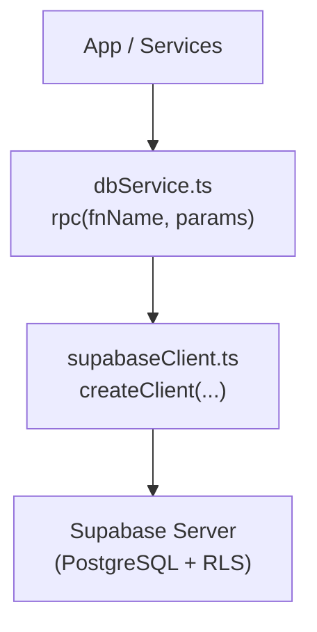
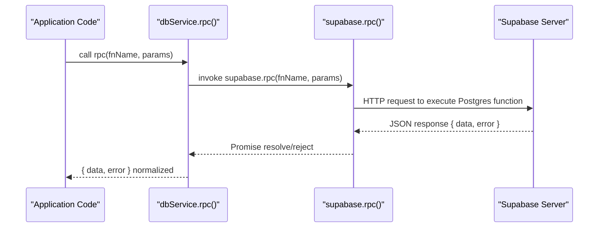
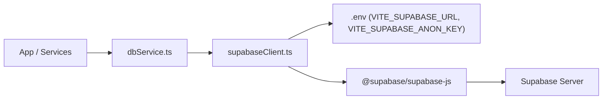

# RPC Functions Integration

<cite>
**Referenced Files in This Document**
- [dbService.ts](file://src/supabase/dbService.ts)
- [supabaseClient.ts](file://src/supabase/supabaseClient.ts)
- [package.json](file://package.json)
- [SUPABASE.md](file://SUPABASE.md)
- [SKILL.md](file://agents/skills/supabase-postgres-best-practices/SKILL.md)
</cite>

## Table of Contents
1. [Introduction](#introduction)
2. [Project Structure](#project-structure)
3. [Core Components](#core-components)
4. [Architecture Overview](#architecture-overview)
5. [Detailed Component Analysis](#detailed-component-analysis)
6. [Dependency Analysis](#dependency-analysis)
7. [Performance Considerations](#performance-considerations)
8. [Troubleshooting Guide](#troubleshooting-guide)
9. [Conclusion](#conclusion)

## Introduction
This document explains how to use Supabase Remote Procedure Calls (RPC) for stored procedures and functions within this project. It covers the rpc() method usage, parameter passing, return type handling, asynchronous operation patterns, best practices for function naming, error handling strategies, and performance considerations. The guidance is grounded in the actual implementation present in the codebase and aligns with Supabase’s client behavior.

## Project Structure
The RPC integration centers around a small, typed wrapper that exposes an rpc() method alongside other database operations. The Supabase client is configured via environment variables and exported as a shared singleton.

**Diagram sources**
- [dbService.ts:13-21](file://src/supabase/dbService.ts#L13-L21)
- [supabaseClient.ts:23-26](file://src/supabase/supabaseClient.ts#L23-L26)

**Section sources**
- [dbService.ts:1-24](file://src/supabase/dbService.ts#L1-L24)
- [supabaseClient.ts:1-38](file://src/supabase/supabaseClient.ts#L1-L38)

## Core Components
- dbService.ts: Provides a unified interface for database operations including select, insert, update, delete, and rpc. The rpc() method wraps supabase.rpc() and normalizes responses into a consistent shape with data and error fields.
- supabaseClient.ts: Creates and exports a single Supabase client instance using environment variables. It validates configuration and warns about common misconfigurations.

Key behaviors:
- All operations return a Promise that resolves to { data, error }.
- Errors are captured and normalized to Error instances.
- The rpc() method accepts a function name and optional parameters object.

**Section sources**
- [dbService.ts:5-21](file://src/supabase/dbService.ts#L5-L21)
- [supabaseClient.ts:6-26](file://src/supabase/supabaseClient.ts#L6-L26)

## Architecture Overview
The RPC flow follows a simple pattern: application code calls db.from(...).rpc(fnName, params), which delegates to supabase.rpc(fnName, params). The result is wrapped by a handler that returns a standardized response object.

**Diagram sources**
- [dbService.ts:19](file://src/supabase/dbService.ts#L19)
- [supabaseClient.ts:23-26](file://src/supabase/supabaseClient.ts#L23-L26)

## Detailed Component Analysis

### RPC Wrapper: dbService.rpc()
- Purpose: Provide a typed, consistent interface for calling Supabase functions.
- Signature: rpc<T = unknown>(fnName: string, params?: object) => Promise<{ data: T | null; error: Error | null }>
- Behavior:
  - Invokes supabase.rpc(fnName, params)
  - Normalizes the result to { data, error }
  - Ensures errors are Error instances
  - Returns a Promise for async handling

Usage pattern:
- Call from components or services: await db.from('...').rpc('function_name', { param1: value1 })
- Type the expected return value using the generic <T> to get compile-time safety.

Best practices:
- Always pass a plain object for params when calling functions that expect arguments.
- Use TypeScript generics to strongly type the returned data.
- Handle both data and error fields consistently across your app.

**Section sources**
- [dbService.ts:5-11](file://src/supabase/dbService.ts#L5-L11)
- [dbService.ts:19](file://src/supabase/dbService.ts#L19)

### Supabase Client Configuration
- Environment variables: VITE_SUPABASE_URL and VITE_SUPABASE_ANON_KEY must be set at the project root .env file.
- Validation: The client checks for missing credentials and warns if the URL incorrectly includes /rest/v1/.
- Export: A single client instance is created and exported for reuse across modules.

Common pitfalls:
- Using the REST endpoint as the base URL will cause connection issues.
- Missing or mismatched credentials lead to silent failures or unauthorized errors.

**Section sources**
- [supabaseClient.ts:3-19](file://src/supabase/supabaseClient.ts#L3-L19)
- [SUPABASE.md:3-24](file://SUPABASE.md#L3-L24)

### Package Dependencies
- @supabase/supabase-js version 2.x provides the createClient API and rpc() method used throughout the codebase.

**Section sources**
- [package.json:16](file://package.json#L16)

## Dependency Analysis
The RPC layer depends on the Supabase client, which in turn depends on environment configuration. There are no circular dependencies; the flow is strictly one-directional from application code down to the Supabase server.

**Diagram sources**
- [dbService.ts:1](file://src/supabase/dbService.ts#L1)
- [supabaseClient.ts:1-26](file://src/supabase/supabaseClient.ts#L1-L26)
- [package.json:16](file://package.json#L16)

**Section sources**
- [dbService.ts:1-24](file://src/supabase/dbService.ts#L1-L24)
- [supabaseClient.ts:1-38](file://src/supabase/supabaseClient.ts#L1-L38)
- [package.json:12-17](file://package.json#L12-L17)

## Performance Considerations
- Batch operations where possible: Prefer single RPC calls that perform multiple steps on the server rather than many small round trips from the client.
- Keep payloads minimal: Pass only necessary parameters to reduce network overhead.
- Avoid heavy transformations on the client: Let Postgres functions handle complex logic and return lean results.
- Connection pooling and timeouts: Managed by Supabase; ensure you’re not creating multiple clients per request.
- Indexing and query plans: Follow Supabase Postgres best practices to optimize function execution time.

[No sources needed since this section provides general guidance]

## Troubleshooting Guide
Common issues and resolutions:
- Empty results: When queries succeed but return null data, verify rows exist and RLS policies allow access.
- Incorrect base URL: Ensure VITE_SUPABASE_URL does not include /rest/v1/.
- Missing credentials: Add VITE_SUPABASE_URL and VITE_SUPABASE_ANON_KEY to the root .env file.
- Error normalization: The wrapper ensures errors are Error instances; inspect error.message for details.

Debugging tips:
- Log effective environment values using the provided debug helper.
- Confirm table permissions and RLS policies in Supabase Studio.
- Validate function signatures and parameter names match between client and server.

**Section sources**
- [SUPABASE.md:14-28](file://SUPABASE.md#L14-L28)
- [supabaseClient.ts:6-19](file://src/supabase/supabaseClient.ts#L6-L19)

## Conclusion
The RPC integration in this project is intentionally lightweight and consistent: a single rpc() method that wraps supabase.rpc(), returning a uniform { data, error } shape. By following the recommended patterns—typed generics, proper parameter objects, centralized client configuration, and robust error handling—you can reliably call Supabase stored procedures and functions while maintaining performance and clarity.