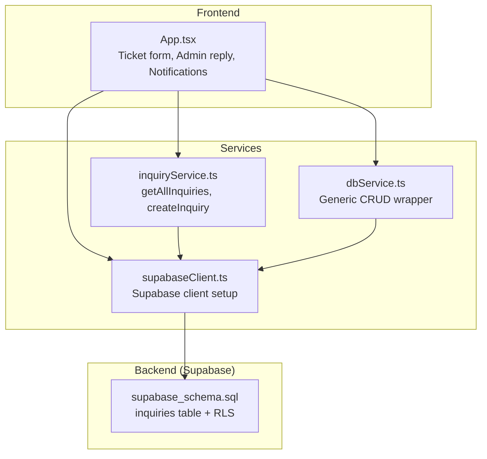
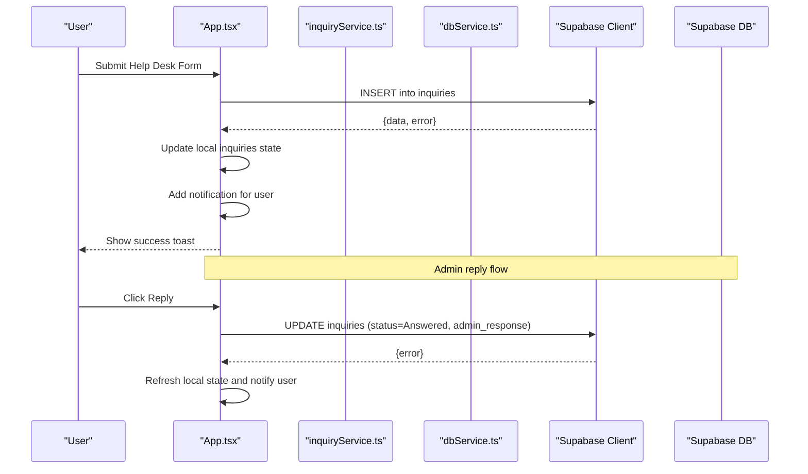
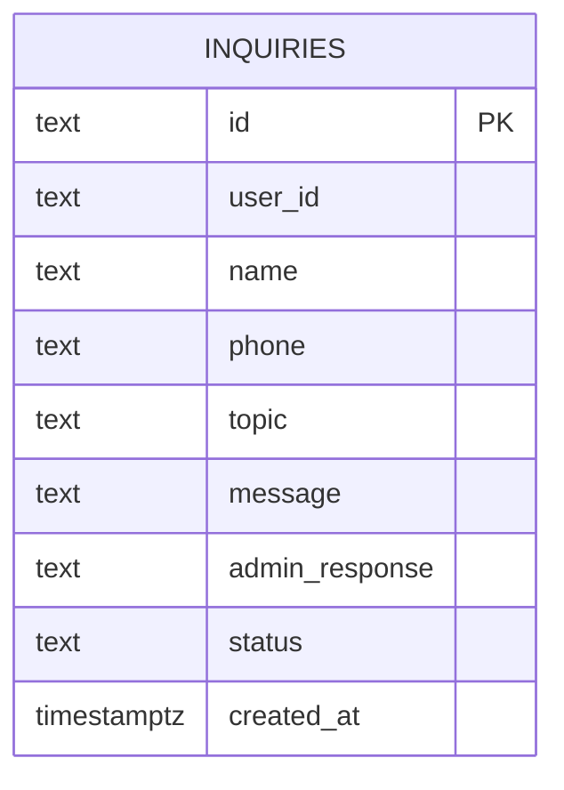
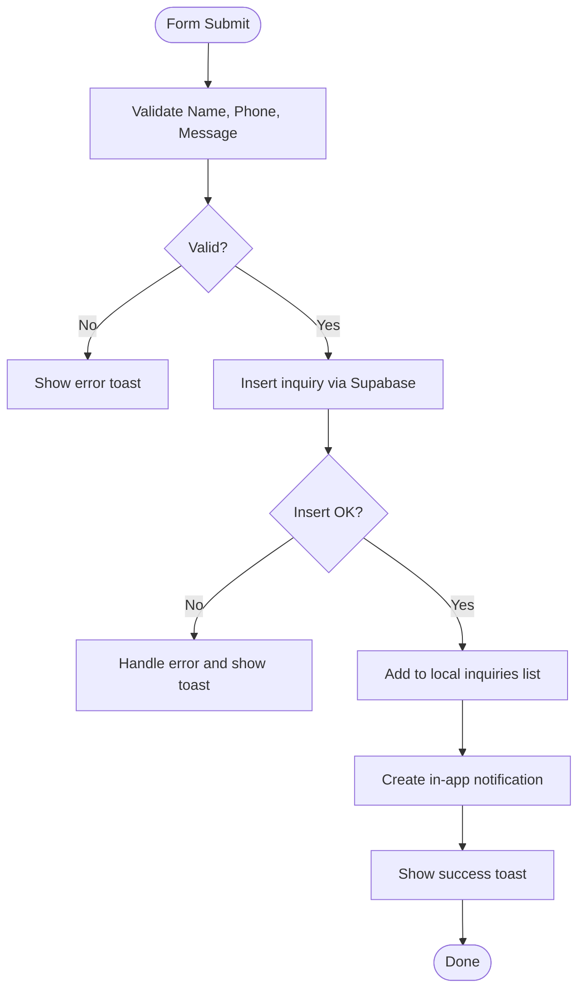
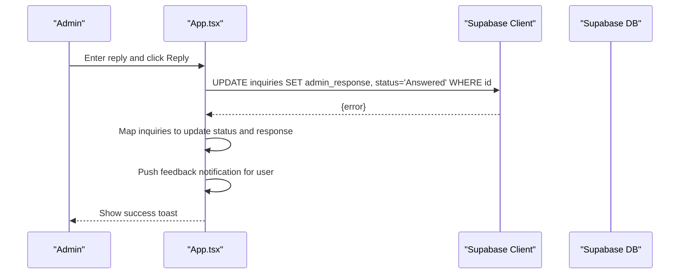
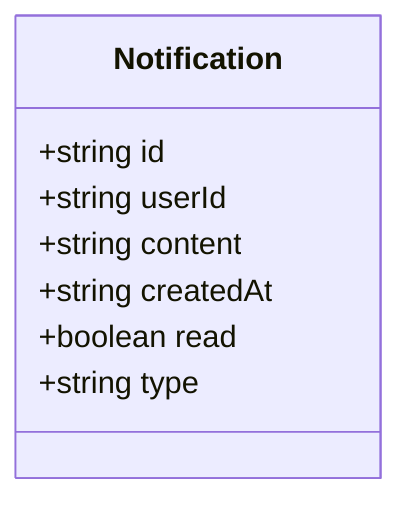
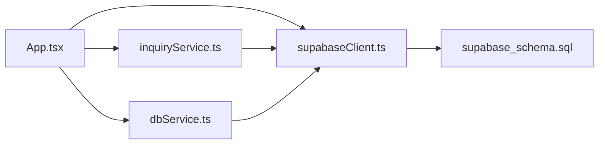

# Inquiry Service

<cite>
**Referenced Files in This Document**
- [inquiryService.ts](file://src/supabase/inquiryService.ts)
- [supabaseClient.ts](file://src/supabase/supabaseClient.ts)
- [dbService.ts](file://src/supabase/dbService.ts)
- [supabase_schema.sql](file://supabase_schema.sql)
- [App.tsx](file://src/App.tsx)
- [SUPABASE.md](file://SUPABASE.md)
</cite>

## Table of Contents
1. [Introduction](#introduction)
2. [Project Structure](#project-structure)
3. [Core Components](#core-components)
4. [Architecture Overview](#architecture-overview)
5. [Detailed Component Analysis](#detailed-component-analysis)
6. [Dependency Analysis](#dependency-analysis)
7. [Performance Considerations](#performance-considerations)
8. [Troubleshooting Guide](#troubleshooting-guide)
9. [Conclusion](#conclusion)
10. [Appendices](#appendices)

## Introduction
This document explains the customer inquiry service implementation for the marketplace application. It covers how support tickets are created, managed, and responded to; how status transitions work; and how notifications are generated for users and administrators. It also documents the data model for inquiries, user interactions, administrative workflows, search and filtering approaches, and integration points with other marketplace features such as order tracking and vendor communication.

## Project Structure
The inquiry feature spans a small set of focused files:
- A dedicated service module that encapsulates Supabase operations for inquiries
- A shared Supabase client configuration
- A generic database wrapper for consistent error handling
- The schema definition for the inquiries table and Row Level Security policies
- The main application component where ticket creation, admin replies, and UI flows are implemented

**Diagram sources**
- [App.tsx](file://src/App.tsx)
- [inquiryService.ts](file://src/supabase/inquiryService.ts)
- [dbService.ts](file://src/supabase/dbService.ts)
- [supabaseClient.ts](file://src/supabase/supabaseClient.ts)
- [supabase_schema.sql](file://supabase_schema.sql)

**Section sources**
- [inquiryService.ts:1-19](file://src/supabase/inquiryService.ts#L1-L19)
- [supabaseClient.ts:1-38](file://src/supabase/supabaseClient.ts#L1-L38)
- [dbService.ts:1-24](file://src/supabase/dbService.ts#L1-L24)
- [supabase_schema.sql:98-113](file://supabase_schema.sql#L98-L113)
- [App.tsx:300-499](file://src/App.tsx#L300-L499)

## Core Components
- Inquiry Service: Provides methods to fetch all inquiries and create new ones using the Supabase client.
- Supabase Client: Centralized configuration and environment validation for connecting to Supabase.
- Database Wrapper: A generic helper that standardizes select/insert/update/delete calls and returns a uniform response shape.
- Schema: Defines the inquiries table structure and enforces open access via Row Level Security policies for development.
- Application UI: Implements the help desk form, ticket submission, admin reply flow, and local notification updates.

Key responsibilities:
- Create support tickets from the Help Desk form
- Load and display existing inquiries
- Update inquiry status and add admin responses
- Emit real-time-like notifications in the UI upon ticket creation and admin replies

**Section sources**
- [inquiryService.ts:4-18](file://src/supabase/inquiryService.ts#L4-L18)
- [supabaseClient.ts:6-26](file://src/supabase/supabaseClient.ts#L6-L26)
- [dbService.ts:13-21](file://src/supabase/dbService.ts#L13-L21)
- [supabase_schema.sql:98-113](file://supabase_schema.sql#L98-L113)
- [App.tsx:1038-1142](file://src/App.tsx#L1038-L1142)

## Architecture Overview
The inquiry service follows a simple client-server pattern:
- The React app collects user input and calls either the inquiry service or direct Supabase queries
- The Supabase client handles authentication and network requests
- The schema defines persistence and security policies
- The app maintains local state for inquiries and notifications, updating them after successful server operations

**Diagram sources**
- [App.tsx:1038-1142](file://src/App.tsx#L1038-L1142)
- [inquiryService.ts:4-18](file://src/supabase/inquiryService.ts#L4-L18)
- [supabaseClient.ts:23-26](file://src/supabase/supabaseClient.ts#L23-L26)

## Detailed Component Analysis

### Data Model: Inquiries
The inquiries table stores support tickets with fields for user identification, contact details, topic, message, admin response, and status. Timestamps are handled by the database default.

**Diagram sources**
- [supabase_schema.sql:98-113](file://supabase_schema.sql#L98-L113)

**Section sources**
- [supabase_schema.sql:98-113](file://supabase_schema.sql#L98-L113)

### Ticket Creation Flow
Users submit a Help Desk form which creates a new inquiry record. The app validates inputs, inserts the record via Supabase, updates local state, and emits a notification.

**Diagram sources**
- [App.tsx:1038-1094](file://src/App.tsx#L1038-L1094)

**Section sources**
- [App.tsx:1038-1094](file://src/App.tsx#L1038-L1094)

### Status Management and Admin Replies
Administrators can reply to an inquiry, setting the status to Answered and storing the response. The app updates both the database and local state, then notifies the user if their ID is present.

**Diagram sources**
- [App.tsx:1096-1142](file://src/App.tsx#L1096-L1142)

**Section sources**
- [App.tsx:1096-1142](file://src/App.tsx#L1096-L1142)

### Notification System
Notifications are maintained in local state and updated when:
- A new support ticket is submitted
- An admin replies to a ticket

These notifications include content, timestamp, read flag, and type. They are displayed in the dashboard and can be marked as read.

**Diagram sources**
- [App.tsx:66-73](file://src/App.tsx#L66-L73)

**Section sources**
- [App.tsx:66-73](file://src/App.tsx#L66-L73)
- [App.tsx:1078-1088](file://src/App.tsx#L1078-L1088)
- [App.tsx:1125-1135](file://src/App.tsx#L1125-L1135)

### Search and Filtering
Current implementation provides basic filtering:
- By user identity (userId or phone) to show only relevant tickets
- By status to distinguish Pending vs Answered

Recommended enhancements:
- Full-text search on topic/message using Supabase’s Postgres full-text search capabilities
- Filter by date range and category/topic
- Pagination for large datasets

[No sources needed since this section proposes enhancements beyond current code]

### Integration with Marketplace Features
- Order Tracking: While not directly linked in the inquiry schema, you can associate inquiries with orders by adding an order_id field and querying delivery_jobs or escrow_transactions for context.
- Vendor Communication: You can extend the inquiry topic to include vendor-specific issues and route accordingly.
- Escrow and Delivery: Use the same Supabase client patterns to correlate support tickets with payment and delivery events.

[No sources needed since this section outlines conceptual integrations]

## Dependency Analysis
The inquiry feature depends on:
- Supabase client for network and auth
- Schema for persistence and security
- Application state for UI rendering and notifications

**Diagram sources**
- [App.tsx](file://src/App.tsx)
- [inquiryService.ts](file://src/supabase/inquiryService.ts)
- [dbService.ts](file://src/supabase/dbService.ts)
- [supabaseClient.ts](file://src/supabase/supabaseClient.ts)
- [supabase_schema.sql](file://supabase_schema.sql)

**Section sources**
- [inquiryService.ts:1-19](file://src/supabase/inquiryService.ts#L1-L19)
- [dbService.ts:1-24](file://src/supabase/dbService.ts#L1-L24)
- [supabaseClient.ts:1-38](file://src/supabase/supabaseClient.ts#L1-L38)
- [supabase_schema.sql:166-198](file://supabase_schema.sql#L166-L198)

## Performance Considerations
- Prefer selecting only needed columns to reduce payload size
- Use order and limit for paginated lists of inquiries
- Index frequently filtered columns (e.g., status, user_id) in Supabase
- Avoid unnecessary re-renders by memoizing derived lists and notifications
- Batch inserts when creating multiple records

[No sources needed since this section provides general guidance]

## Troubleshooting Guide
Common issues and resolutions:
- Empty query results: Ensure the row was inserted and RLS policies allow reads/writes for the anon key
- Incorrect base URL: Do not append /rest/v1 to VITE_SUPABASE_URL
- Environment variables: Confirm VITE_SUPABASE_URL and VITE_SUPABASE_ANON_KEY are set correctly
- Debugging: Use provided debug helpers to log effective host and key presence

**Section sources**
- [SUPABASE.md:14-28](file://SUPABASE.md#L14-L28)
- [supabaseClient.ts:6-19](file://src/supabase/supabaseClient.ts#L6-L19)

## Conclusion
The inquiry service provides a straightforward mechanism for customers to file support tickets and for administrators to respond and manage statuses. The architecture leverages Supabase for persistence and security, while the React app manages UI state and notifications. Future improvements should focus on robust search, filtering, pagination, and tighter integration with orders and vendor communications.

[No sources needed since this section summarizes without analyzing specific files]

## Appendices

### API Reference: Inquiry Service Methods
- getAllInquiries: Fetches all inquiries from the inquiries table
- createInquiry: Inserts a new inquiry record

**Section sources**
- [inquiryService.ts:4-18](file://src/supabase/inquiryService.ts#L4-L18)

### Example Workflows

#### Creating a Support Ticket
- Fill out the Help Desk form with name, phone, topic, and message
- Submit to create a new inquiry
- Receive a success toast and see the ticket appear in your dashboard

**Section sources**
- [App.tsx:1038-1094](file://src/App.tsx#L1038-L1094)

#### Updating Status and Replying
- Open the admin view for inquiries
- Enter a reply and click Reply
- The inquiry status changes to Answered and the response is stored
- The user receives a notification about the reply

**Section sources**
- [App.tsx:1096-1142](file://src/App.tsx#L1096-L1142)