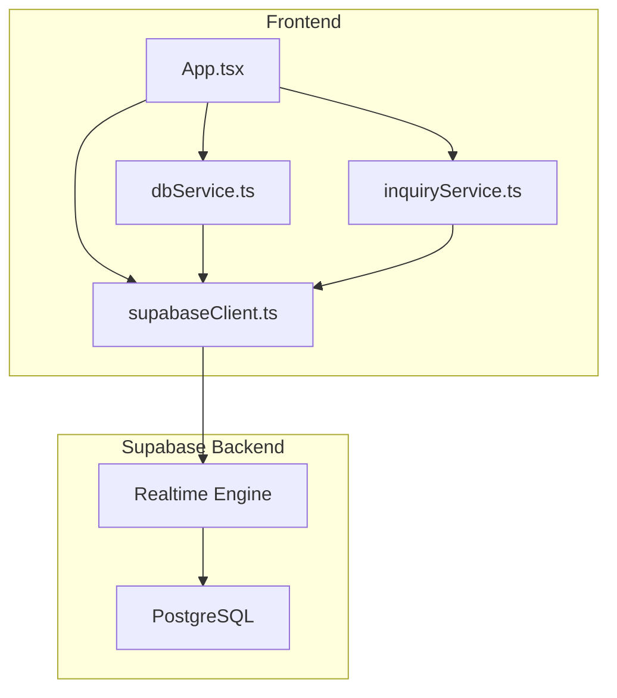
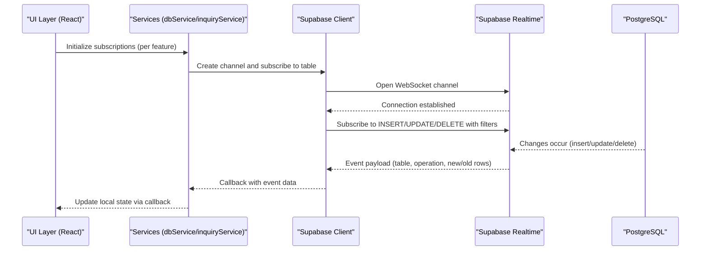
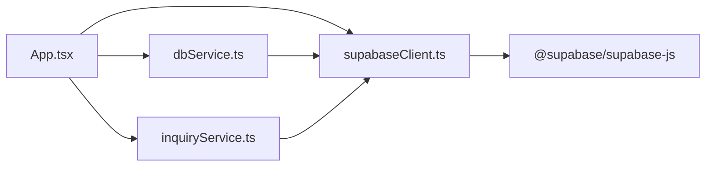

# Real-time Subscriptions

<cite>
**Referenced Files in This Document**
- [supabaseClient.ts](file://src/supabase/supabaseClient.ts)
- [dbService.ts](file://src/supabase/dbService.ts)
- [inquiryService.ts](file://src/supabase/inquiryService.ts)
- [App.tsx](file://src/App.tsx)
- [package.json](file://package.json)
- [supabase_schema.sql](file://supabase_schema.sql)
- [SUPABASE.md](file://SUPABASE.md)
</cite>

## Table of Contents
1. [Introduction](#introduction)
2. [Project Structure](#project-structure)
3. [Core Components](#core-components)
4. [Architecture Overview](#architecture-overview)
5. [Detailed Component Analysis](#detailed-component-analysis)
6. [Dependency Analysis](#dependency-analysis)
7. [Performance Considerations](#performance-considerations)
8. [Troubleshooting Guide](#troubleshooting-guide)
9. [Conclusion](#conclusion)
10. [Appendices](#appendices)

## Introduction
This document explains how to implement real-time subscription patterns using Supabase’s WebSocket capabilities for the Match & Market application. It covers subscribing to database changes, live updates for orders, inventory, and delivery tracking, event handling, error recovery, connection management, filtering events, managing subscription lifecycles, performance considerations, memory management, and debugging techniques. The guidance is tailored to the existing codebase structure and dependencies.

## Project Structure
The project uses a React + TypeScript + Vite setup with Supabase JS client integration. Real-time features will be implemented alongside the existing data layer:
- Client configuration and environment validation are centralized in the Supabase client module.
- A thin database service wrapper normalizes responses and exposes table operations.
- A dedicated inquiry service demonstrates direct Supabase usage patterns.
- The main application component performs initial data loads from multiple tables.
- The schema defines core tables such as delivery_jobs, menu_items, escrow_transactions, inquiries, and others that benefit from real-time updates.

**Diagram sources**
- [App.tsx](file://src/App.tsx)
- [dbService.ts](file://src/supabase/dbService.ts)
- [inquiryService.ts](file://src/supabase/inquiryService.ts)
- [supabaseClient.ts](file://src/supabase/supabaseClient.ts)

**Section sources**
- [supabaseClient.ts](file://src/supabase/supabaseClient.ts)
- [dbService.ts](file://src/supabase/dbService.ts)
- [inquiryService.ts](file://src/supabase/inquiryService.ts)
- [App.tsx](file://src/App.tsx)
- [supabase_schema.sql](file://supabase_schema.sql)

## Core Components
- Supabase client initialization and environment validation ensure correct credentials and URL format.
- Database service provides a consistent response shape and helper methods for CRUD operations.
- Inquiry service shows direct table access patterns used across the app.
- Application component initializes state and loads data from multiple tables on mount.

Key responsibilities:
- Centralized client creation and validation.
- Normalized error/data handling for queries.
- Clear separation between UI state and data persistence.

**Section sources**
- [supabaseClient.ts](file://src/supabase/supabaseClient.ts)
- [dbService.ts](file://src/supabase/dbService.ts)
- [inquiryService.ts](file://src/supabase/inquiryService.ts)
- [App.tsx](file://src/App.tsx)

## Architecture Overview
Real-time subscriptions extend the current request/response flow by adding persistent WebSocket channels per feature area (e.g., delivery jobs, inventory). Channels subscribe to specific tables and filter events by operation type or row conditions. Updates are applied to local state to reflect live changes without polling.

**Diagram sources**
- [supabaseClient.ts](file://src/supabase/supabaseClient.ts)
- [dbService.ts](file://src/supabase/dbService.ts)
- [inquiryService.ts](file://src/supabase/inquiryService.ts)
- [App.tsx](file://src/App.tsx)

## Detailed Component Analysis

### Real-time Subscription Patterns
Implement real-time subscriptions per domain:
- Delivery Jobs: Subscribe to INSERT, UPDATE, DELETE on delivery_jobs; filter by status or order_id.
- Inventory (Menu Items): Subscribe to INSERT, UPDATE on menu_items; filter by category or store_name.
- Orders/Escrow: Subscribe to INSERT, UPDATE on escrow_transactions; filter by order_id.
- Inquiries: Subscribe to INSERT, UPDATE on inquiries; filter by status or user_id.

Event handling:
- Use callbacks to transform payloads into typed state updates.
- Merge new rows, update existing rows by primary key, remove deleted rows.
- Debounce high-frequency updates if necessary to avoid excessive re-renders.

Connection management:
- Create channels once per feature area and reuse them.
- Handle reconnection automatically via Supabase client; add explicit logging for connection states.
- Unsubscribe channels on component unmount to prevent memory leaks.

Filtering events:
- Use column filters to limit events to relevant rows (e.g., eq, neq, in).
- Combine filters with operation types to reduce payload size and processing overhead.

Lifecycle:
- Start subscriptions after initial data load.
- Pause/resume based on visibility or user role.
- Clean up subscriptions when navigating away or signing out.

Error recovery:
- Catch network errors and retry with exponential backoff.
- Log errors and surface non-fatal issues to users.
- Fallback to polling for critical paths if real-time fails persistently.

Performance considerations:
- Limit columns selected in realtime payloads.
- Batch updates where possible.
- Avoid heavy computations inside event handlers.

Memory management:
- Store subscription references and unsubscribe on cleanup.
- Clear timers and intervals used for debouncing or retries.

Debugging:
- Enable verbose logging for channel events and errors.
- Inspect payloads in browser dev tools.
- Validate RLS policies and permissions.

[No sources needed since this section provides conceptual guidance]

### Database Service Wrapper
The database service wraps Supabase calls and returns a normalized response shape. This pattern can be extended to include real-time helpers:
- Add a method to create and manage channels per table.
- Provide a unified callback interface for event handling.
- Integrate error normalization and retry logic.

Current behavior:
- Wraps select, insert, update, delete, rpc calls.
- Returns { data, error } consistently.

Recommendations:
- Extend the service to expose a subscribe method that accepts table name, filters, and event handlers.
- Maintain a registry of active subscriptions to manage lifecycle centrally.

**Section sources**
- [dbService.ts](file://src/supabase/dbService.ts)

### Inquiry Service Example
The inquiry service demonstrates direct Supabase usage for fetching and inserting records. This pattern can be mirrored for real-time subscriptions:
- Replace polling with a channel subscription to inquiries table.
- Apply filters for status or user_id.
- Update local inquiries state upon receiving events.

Current behavior:
- Fetches all inquiries.
- Inserts new inquiries.

Recommendations:
- Add a subscribeInquiries function that creates a channel and handles INSERT/UPDATE events.
- Map incoming events to the Inquiry interface used in the application.

**Section sources**
- [inquiryService.ts](file://src/supabase/inquiryService.ts)

### Application Data Loading
The application component loads initial data from multiple tables on mount. Real-time subscriptions should complement this by keeping state in sync:
- After initial load, start subscriptions for each table.
- Apply deltas to existing arrays rather than replacing entire datasets.
- Ensure idempotency to handle duplicate events gracefully.

Current behavior:
- Loads vendors, menu items, inquiries, approvals, delivery jobs, escrow transactions, chama deals, gas predictions, banned vendors.
- Maps database rows to typed interfaces.

Recommendations:
- Extract subscription logic into custom hooks or services.
- Use memoization to minimize unnecessary re-renders.
- Implement optimistic updates for better UX.

**Section sources**
- [App.tsx](file://src/App.tsx)

### Schema and Tables
The schema defines core tables that benefit from real-time updates:
- delivery_jobs: Track order fulfillment and rider assignments.
- menu_items: Manage product inventory and pricing.
- escrow_transactions: Monitor payment statuses and disputes.
- inquiries: Handle support requests and admin responses.
- vendor_approvals, rider_approvals: Onboarding workflows.
- chama_deals: Group buying coordination.

RLS policies:
- Full access policies are enabled for development; tighten in production.
- Ensure realtime subscriptions respect RLS constraints.

**Section sources**
- [supabase_schema.sql](file://supabase_schema.sql)

## Dependency Analysis
The project depends on Supabase JS client and SSR utilities. Realtime functionality is provided transitively through the Supabase client package.

**Diagram sources**
- [App.tsx](file://src/App.tsx)
- [supabaseClient.ts](file://src/supabase/supabaseClient.ts)
- [dbService.ts](file://src/supabase/dbService.ts)
- [inquiryService.ts](file://src/supabase/inquiryService.ts)
- [package.json](file://package.json)

**Section sources**
- [package.json](file://package.json)

## Performance Considerations
- Prefer targeted subscriptions over broad table-wide listeners.
- Use column selection to minimize payload size.
- Debounce rapid updates to avoid UI thrashing.
- Cache derived data and compute only when necessary.
- Monitor WebSocket connections and reconnect on failures.
- Profile event handlers to identify bottlenecks.

[No sources needed since this section provides general guidance]

## Troubleshooting Guide
Common issues and resolutions:
- Missing credentials: Ensure VITE_SUPABASE_URL and VITE_SUPABASE_ANON_KEY are set correctly.
- Incorrect URL format: Do not append /rest/v1 to the base URL.
- RLS blocking events: Verify policies allow realtime access for anon/authenticated roles.
- Memory leaks: Always unsubscribe channels on component unmount.
- Network errors: Implement retry logic and fallback mechanisms.
- Debugging: Log channel events and errors; inspect payloads in dev tools.

**Section sources**
- [SUPABASE.md](file://SUPABASE.md)
- [supabaseClient.ts](file://src/supabase/supabaseClient.ts)

## Conclusion
Real-time subscriptions enhance user experience by providing instant updates for orders, inventory, and delivery tracking. By leveraging Supabase’s WebSocket capabilities, you can build responsive applications that react to database changes efficiently. Follow best practices for event handling, error recovery, connection management, and performance optimization to deliver a robust real-time experience.

[No sources needed since this section summarizes without analyzing specific files]

## Appendices

### Implementation Checklist
- Set up Supabase client with environment variables.
- Create channels per feature area.
- Subscribe to relevant tables with filters.
- Handle INSERT/UPDATE/DELETE events.
- Update local state immutably.
- Manage subscription lifecycle.
- Implement error handling and retries.
- Debug and monitor connections.

[No sources needed since this section provides general guidance]