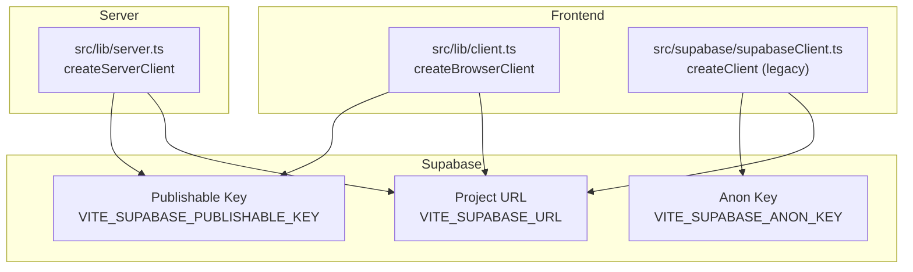
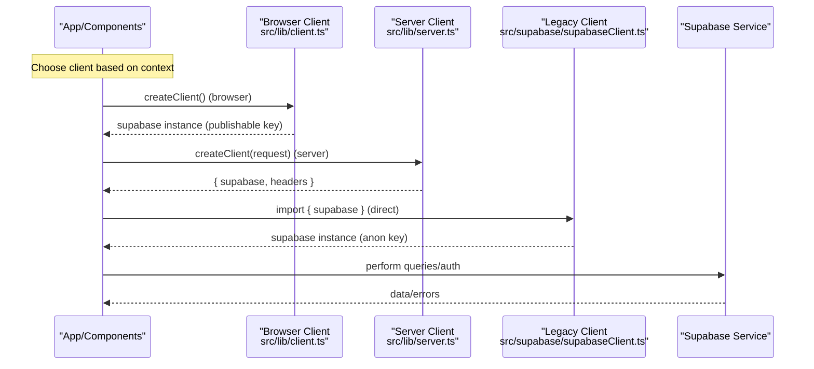
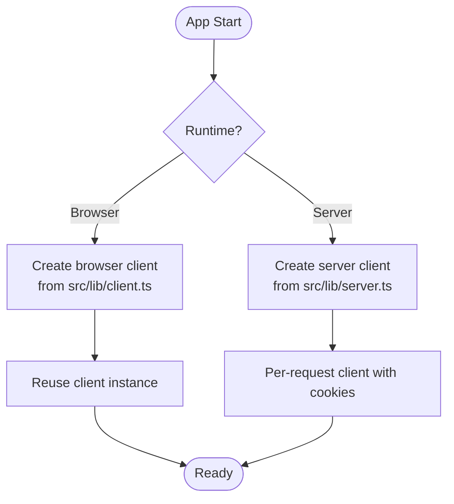
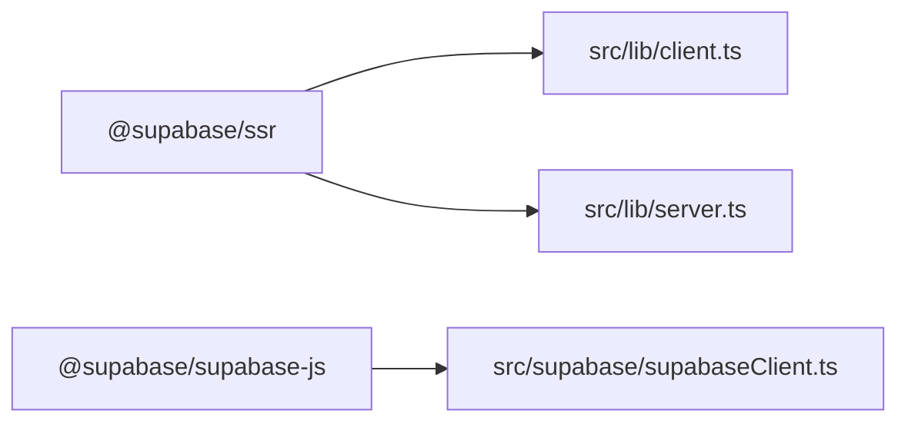

# Supabase Client Configuration

<cite>
**Referenced Files in This Document**
- [src/supabase/supabaseClient.ts](file://src/supabase/supabaseClient.ts)
- [src/lib/client.ts](file://src/lib/client.ts)
- [src/lib/server.ts](file://src/lib/server.ts)
- [SUPABASE.md](file://SUPABASE.md)
- [supabase/config.toml](file://supabase/config.toml)
- [package.json](file://package.json)
</cite>

## Table of Contents
1. Introduction
2. Project Structure
3. Core Components
4. Architecture Overview
5. Detailed Component Analysis
6. Dependency Analysis
7. Performance Considerations
8. Troubleshooting Guide
9. Conclusion

## Introduction
This document explains how the application configures and initializes Supabase clients for both browser and server contexts, how environment variables are managed, and how authentication keys are handled. It also clarifies the difference between anonymous and authenticated clients, outlines security considerations for API keys, and provides best practices for client instantiation across environments (development, staging, production). Finally, it covers client lifecycle management patterns used in this codebase.

## Project Structure
The project uses a dual-client approach:
- A browser client created with createBrowserClient from @supabase/ssr for frontend usage.
- A server client created with createServerClient from @supabase/ssr for server-side rendering or API routes.
- A legacy direct client using @supabase/supabase-js for simple browser access.

**Diagram sources**
- [src/lib/client.ts:1-9](file://src/lib/client.ts#L1-L9)
- [src/lib/server.ts:1-29](file://src/lib/server.ts#L1-L29)
- [src/supabase/supabaseClient.ts:1-38](file://src/supabase/supabaseClient.ts#L1-L38)

**Section sources**
- [src/lib/client.ts:1-9](file://src/lib/client.ts#L1-L9)
- [src/lib/server.ts:1-29](file://src/lib/server.ts#L1-L29)
- [src/supabase/supabaseClient.ts:1-38](file://src/supabase/supabaseClient.ts#L1-L38)
- [package.json:12-17](file://package.json#L12-L17)

## Core Components
- Browser client factory: Creates a browser-specific Supabase client using publishable key and project URL.
- Server client factory: Creates a server-specific Supabase client with cookie handling for sessions.
- Legacy direct client: Uses @supabase/supabase-js directly with anon key and project URL, including environment validation helpers.

Key responsibilities:
- Environment variable resolution per runtime (browser vs Node).
- Centralized client creation to avoid duplication.
- Cookie-based session propagation on the server.
- Validation and debugging utilities for configuration issues.

**Section sources**
- [src/lib/client.ts:1-9](file://src/lib/client.ts#L1-L9)
- [src/lib/server.ts:1-29](file://src/lib/server.ts#L1-L29)
- [src/supabase/supabaseClient.ts:1-38](file://src/supabase/supabaseClient.ts#L1-L38)

## Architecture Overview
The application supports two primary client patterns:
- SSR-aware pattern via @supabase/ssr for consistent auth and cookies across server and browser.
- Direct pattern via @supabase/supabase-js for quick browser-only access.

**Diagram sources**
- [src/lib/client.ts:1-9](file://src/lib/client.ts#L1-L9)
- [src/lib/server.ts:1-29](file://src/lib/server.ts#L1-L29)
- [src/supabase/supabaseClient.ts:1-38](file://src/supabase/supabaseClient.ts#L1-L38)

## Detailed Component Analysis

### Browser Client Factory (@supabase/ssr)
- Purpose: Create a browser-safe Supabase client that integrates with SSR frameworks and manages cookies automatically.
- Inputs: VITE_SUPABASE_URL and VITE_SUPABASE_PUBLISHABLE_KEY.
- Behavior: Returns a configured client instance ready for use in components and services.

Best practices:
- Use this factory wherever possible for consistent behavior across SSR and CSR.
- Ensure environment variables are present at build time.

**Section sources**
- [src/lib/client.ts:1-9](file://src/lib/client.ts#L1-L9)

### Server Client Factory (@supabase/ssr)
- Purpose: Create a server-side Supabase client with explicit cookie handling for request/response cycles.
- Inputs: VITE_SUPABASE_URL and VITE_SUPABASE_PUBLISHABLE_KEY.
- Behavior: Parses incoming cookies and sets outgoing cookies to maintain session state.

Security considerations:
- Only expose necessary endpoints; keep secrets out of client bundles.
- Validate and sanitize headers when integrating with custom middleware.

**Section sources**
- [src/lib/server.ts:1-29](file://src/lib/server.ts#L1-L29)

### Legacy Direct Client (@supabase/supabase-js)
- Purpose: Provide a straightforward Supabase client for browser-only scenarios using anon key.
- Inputs: VITE_SUPABASE_URL and VITE_SUPABASE_ANON_KEY.
- Behavior: Validates environment variables and warns about common misconfigurations (e.g., REST path in URL). Includes a debug helper to log non-sensitive configuration details.

Notes:
- Prefer @supabase/ssr clients for new features to unify auth/session handling.
- Keep anon key usage limited to read-only or public operations where appropriate.

**Section sources**
- [src/supabase/supabaseClient.ts:1-38](file://src/supabase/supabaseClient.ts#L1-L38)

### Environment Variables and Key Handling
- Browser environment:
  - VITE_SUPABASE_URL: Base project URL (do not include /rest/v1).
  - VITE_SUPABASE_PUBLISHABLE_KEY: Used by SSR-aware clients.
  - VITE_SUPABASE_ANON_KEY: Used by legacy direct client.
- Server environment:
  - process.env.VITE_SUPABASE_URL and process.env.VITE_SUPABASE_PUBLISHABLE_KEY.

Recommendations:
- Store credentials in root .env for Vite consumption.
- Avoid duplicating .env files across directories.
- Never commit secrets; use environment injection at deploy time.

**Section sources**
- [SUPABASE.md:1-38](file://SUPABASE.md#L1-L38)
- [src/lib/client.ts:1-9](file://src/lib/client.ts#L1-L9)
- [src/lib/server.ts:1-29](file://src/lib/server.ts#L1-L29)
- [src/supabase/supabaseClient.ts:1-38](file://src/supabase/supabaseClient.ts#L1-L38)

### Anonymous vs Authenticated Clients
- Anonymous client:
  - Uses anon/publishable keys.
  - Suitable for public reads or unauthenticated flows.
  - Subject to Row Level Security policies defined for the anon role.
- Authenticated client:
  - Uses user sessions (cookies) propagated via SSR-aware client.
  - Enables secure writes and access governed by RLS policies for authenticated users.

Implementation notes:
- The SSR-aware server client maintains session cookies to support authenticated requests.
- The legacy client can still call auth methods but lacks built-in cookie propagation in SSR contexts.

**Section sources**
- [src/lib/server.ts:1-29](file://src/lib/server.ts#L1-L29)
- [src/supabase/supabaseClient.ts:1-38](file://src/supabase/supabaseClient.ts#L1-L38)

### Client Lifecycle Management
- Initialization:
  - Browser: Instantiate once via createBrowserClient and reuse across modules.
  - Server: Instantiate per request via createServerClient to propagate cookies correctly.
- Usage:
  - Import the shared client instance in services/components.
  - For SSR, ensure headers are passed through to maintain session continuity.
- Cleanup:
  - No explicit teardown is required; rely on module-level singleton for browser.
  - On server, each request gets its own client instance.

[No sources needed since this diagram shows conceptual workflow, not actual code structure]

## Dependency Analysis
The following dependencies underpin the Supabase integration:
- @supabase/ssr: Provides createBrowserClient and createServerClient for SSR-aware auth and cookie handling.
- @supabase/supabase-js: Provides createClient for direct browser usage.

**Diagram sources**
- [package.json:12-17](file://package.json#L12-L17)
- [src/lib/client.ts:1-9](file://src/lib/client.ts#L1-L9)
- [src/lib/server.ts:1-29](file://src/lib/server.ts#L1-L29)
- [src/supabase/supabaseClient.ts:1-38](file://src/supabase/supabaseClient.ts#L1-L38)

**Section sources**
- [package.json:12-17](file://package.json#L12-L17)

## Performance Considerations
- Singleton pattern in browser: Reuse a single client instance to avoid redundant initialization overhead.
- Per-request server clients: Ensures correct cookie propagation without cross-request leakage.
- Minimize network calls: Batch operations and leverage Supabase’s query optimizations.
- Avoid exposing sensitive keys: Use publishable/anon keys only; never embed service-role keys in client code.

[No sources needed since this section provides general guidance]

## Troubleshooting Guide
Common issues and resolutions:
- Missing environment variables:
  - Ensure VITE_SUPABASE_URL and VITE_SUPABASE_PUBLISHABLE_KEY (or ANON_KEY for legacy) are set in root .env.
- Incorrect base URL:
  - Do not append /rest/v1 to VITE_SUPABASE_URL; use the project base URL only.
- Query returns null data:
  - Verify Row Level Security policies for anon/authenticated roles.
  - Confirm table names and field mappings match database schema.
- Debugging configuration:
  - Use the provided debug helper to log non-sensitive host and key presence.

Operational tips:
- Temporarily relax RLS for development, then tighten before production.
- Validate effective env values at runtime during local development.

**Section sources**
- [SUPABASE.md:1-38](file://SUPABASE.md#L1-L38)
- [src/supabase/supabaseClient.ts:1-38](file://src/supabase/supabaseClient.ts#L1-L38)

## Conclusion
This project adopts a robust Supabase client strategy by combining SSR-aware clients for consistent authentication and cookie handling with a legacy direct client for simplicity. Environment variables are centralized and validated, while security best practices emphasize minimal exposure of keys and reliance on RLS policies. Following the recommended patterns ensures reliable client lifecycle management across development, staging, and production environments.