# Administrative Dashboard

<cite>
**Referenced Files in This Document**
- [App.tsx](file://src/App.tsx)
- [supabaseClient.ts](file://src/supabase/supabaseClient.ts)
- [dbService.ts](file://src/supabase/dbService.ts)
- [inquiryService.ts](file://src/supabase/inquiryService.ts)
- [supabase_schema.sql](file://supabase_schema.sql)
- [package.json](file://package.json)
</cite>

## Table of Contents
1. [Introduction](#introduction)
2. [Project Structure](#project-structure)
3. [Core Components](#core-components)
4. [Architecture Overview](#architecture-overview)
5. [Detailed Component Analysis](#detailed-component-analysis)
6. [Dependency Analysis](#dependency-analysis)
7. [Performance Considerations](#performance-considerations)
8. [Troubleshooting Guide](#troubleshooting-guide)
9. [Conclusion](#conclusion)
10. [Appendices](#appendices)

## Introduction
This document provides comprehensive documentation for the administrative dashboard and platform management features of the Match & Market application. It covers user administration (role management, account suspension via vendor bans), vendor approval workflows, product moderation tools, content management interfaces, analytics and reporting surfaces, admin-specific routes and permission checks, data visualization components, export capabilities, audit logging, and administrative task automation. The implementation is a single-page React application that interacts with Supabase for authentication and data persistence.

## Project Structure
The application is a Vite + React + TypeScript project with Supabase as the backend. The main UI and all business logic are implemented within a single large component file, while Supabase client configuration and lightweight services encapsulate database interactions. The schema defines tables for profiles, vendors, menu items, inquiries, approvals, delivery jobs, escrow transactions, chama deals, gas predictions, and banned vendors.

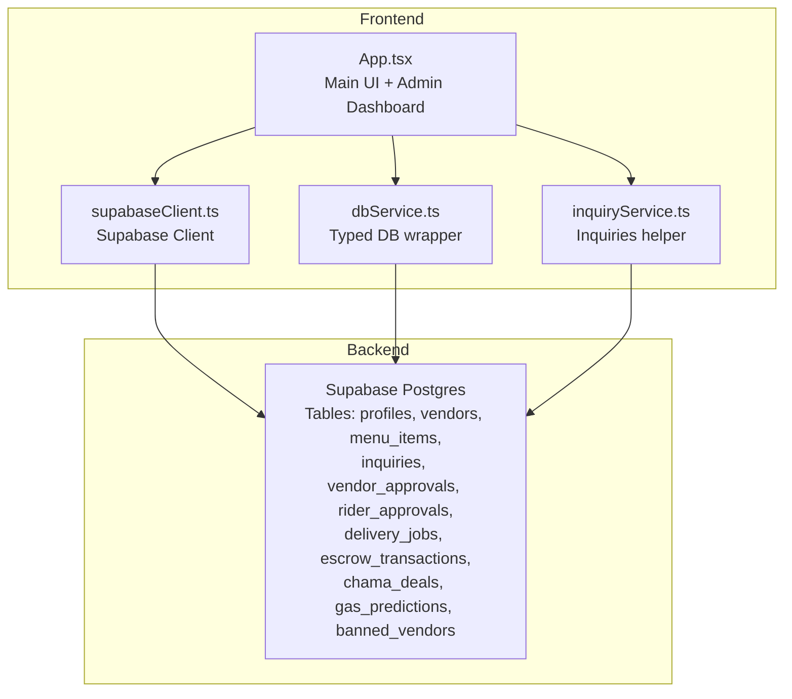

**Diagram sources**
- [App.tsx](file://src/App.tsx)
- [supabaseClient.ts](file://src/supabase/supabaseClient.ts)
- [dbService.ts](file://src/supabase/dbService.ts)
- [inquiryService.ts](file://src/supabase/inquiryService.ts)
- [supabase_schema.sql](file://supabase_schema.sql)

**Section sources**
- [package.json](file://package.json)
- [supabase_schema.sql](file://supabase_schema.sql)

## Core Components
- App.tsx: Central application component containing all UI flows, state management, and admin operations including vendor/rider approvals, escrow release, vendor banning/unbanning, product uploads, support replies, and delivery job management.
- supabaseClient.ts: Environment-driven Supabase client initialization with validation helpers.
- dbService.ts: Typed wrapper around Supabase queries for select/insert/update/delete/rpc.
- inquiryService.ts: Focused service for inquiries CRUD.
- supabase_schema.sql: Database schema and RLS policies enabling full access for development.

Key admin capabilities exposed by the UI:
- Vendor approval workflow: Approve or decline vendor registration requests; approved vendors are inserted into the vendors table.
- Rider approval workflow: Approve rider registrations to unlock delivery dashboards.
- Product moderation: Upload new products to the marketplace catalog; feature/promote items.
- Content management: Manage inquiries and reply as admin; update status to answered.
- Escrow and delivery oversight: Release funds upon delivery confirmation; manage job statuses.
- User administration: Ban/unban vendors to hide their listings from the marketplace.
- Analytics surfaces: Display escrow ledger, delivery fleet status, and inquiry counts.

**Section sources**
- [App.tsx](file://src/App.tsx)
- [supabaseClient.ts](file://src/supabase/supabaseClient.ts)
- [dbService.ts](file://src/supabase/dbService.ts)
- [inquiryService.ts](file://src/supabase/inquiryService.ts)
- [supabase_schema.sql](file://supabase_schema.sql)

## Architecture Overview
The admin dashboard is embedded within the same application shell as customer/vendor/rider views. Access to the admin tab is gated by an in-app password gate and role check. Data is loaded from Supabase on mount and kept in local React state for interactive operations.

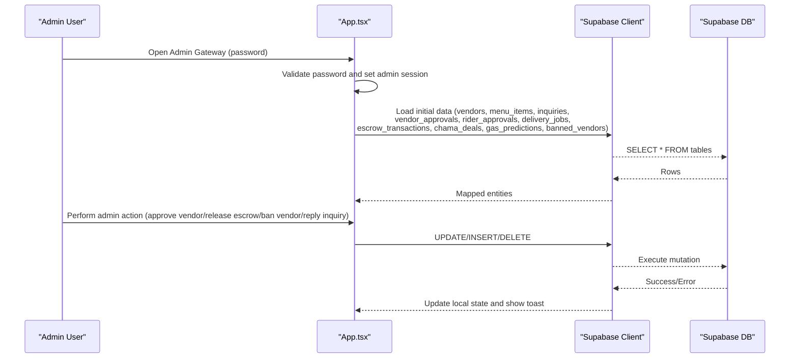

**Diagram sources**
- [App.tsx](file://src/App.tsx)
- [supabaseClient.ts](file://src/supabase/supabaseClient.ts)
- [supabase_schema.sql](file://supabase_schema.sql)

## Detailed Component Analysis

### Admin Authentication and Gate
- Hidden lock icon opens a modal requiring a hardcoded password to unlock admin mode.
- On success, sets an admin session and switches dashboard tab to admin.

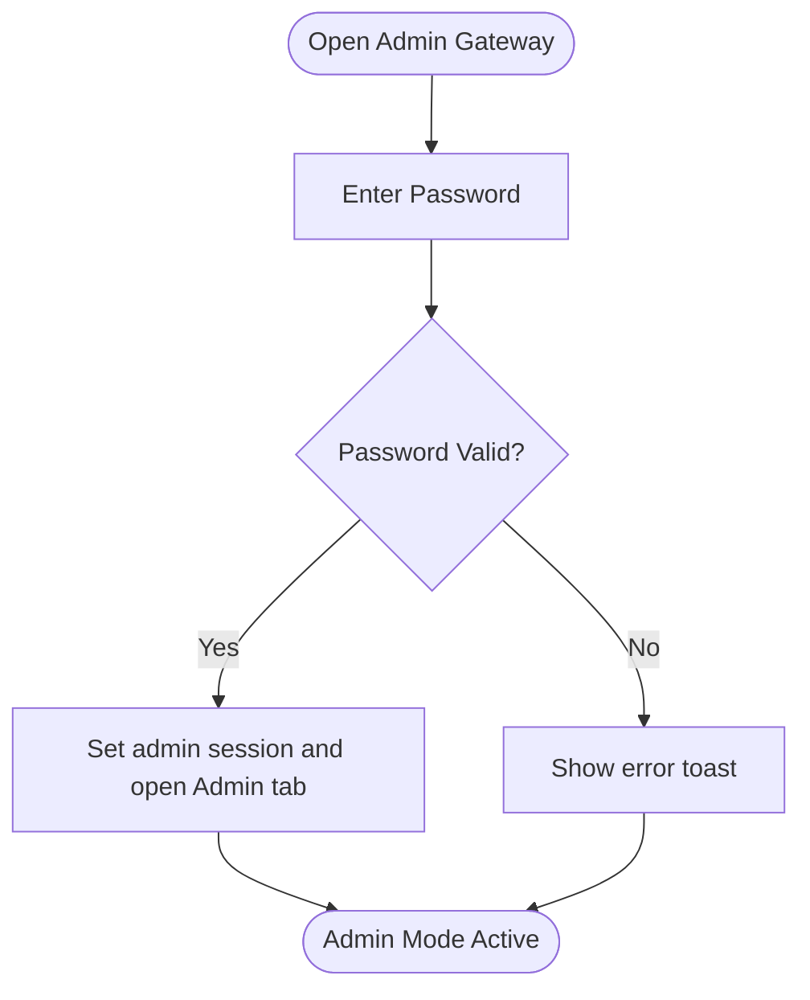

**Diagram sources**
- [App.tsx](file://src/App.tsx)

**Section sources**
- [App.tsx](file://src/App.tsx)

### Vendor Approval Workflow
- Admin view lists pending vendor applications.
- Approving updates the request status and inserts a new vendor record into the vendors table.
- Local state updates reflect immediate UI changes.

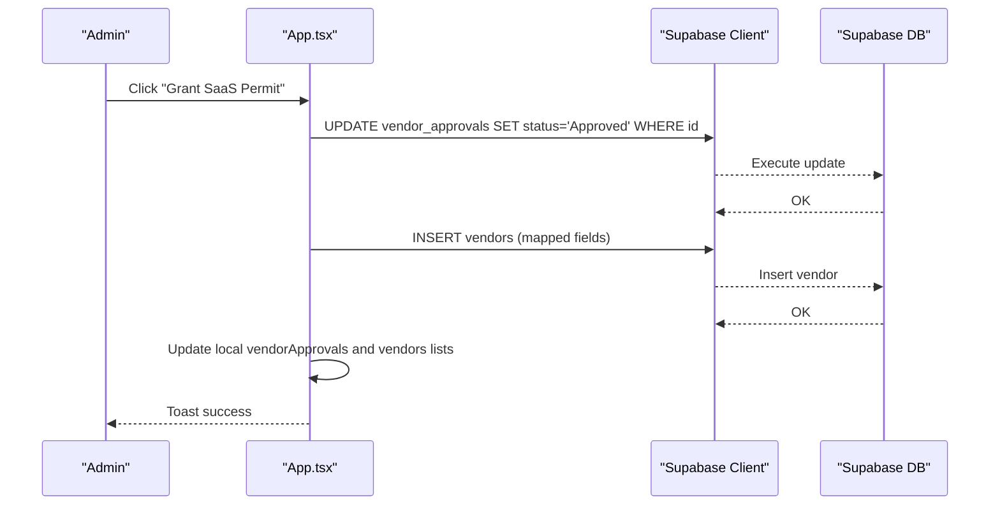

**Diagram sources**
- [App.tsx](file://src/App.tsx)
- [supabase_schema.sql](file://supabase_schema.sql)

**Section sources**
- [App.tsx](file://src/App.tsx)

### Rider Approval Workflow
- Similar to vendor approvals; approves rider registration and updates local state.

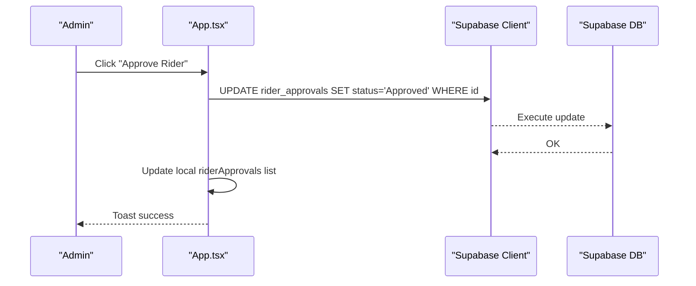

**Diagram sources**
- [App.tsx](file://src/App.tsx)
- [supabase_schema.sql](file://supabase_schema.sql)

**Section sources**
- [App.tsx](file://src/App.tsx)

### Product Moderation and Catalog Management
- Admin can upload new products to the marketplace catalog.
- Products can be promoted to featured status.

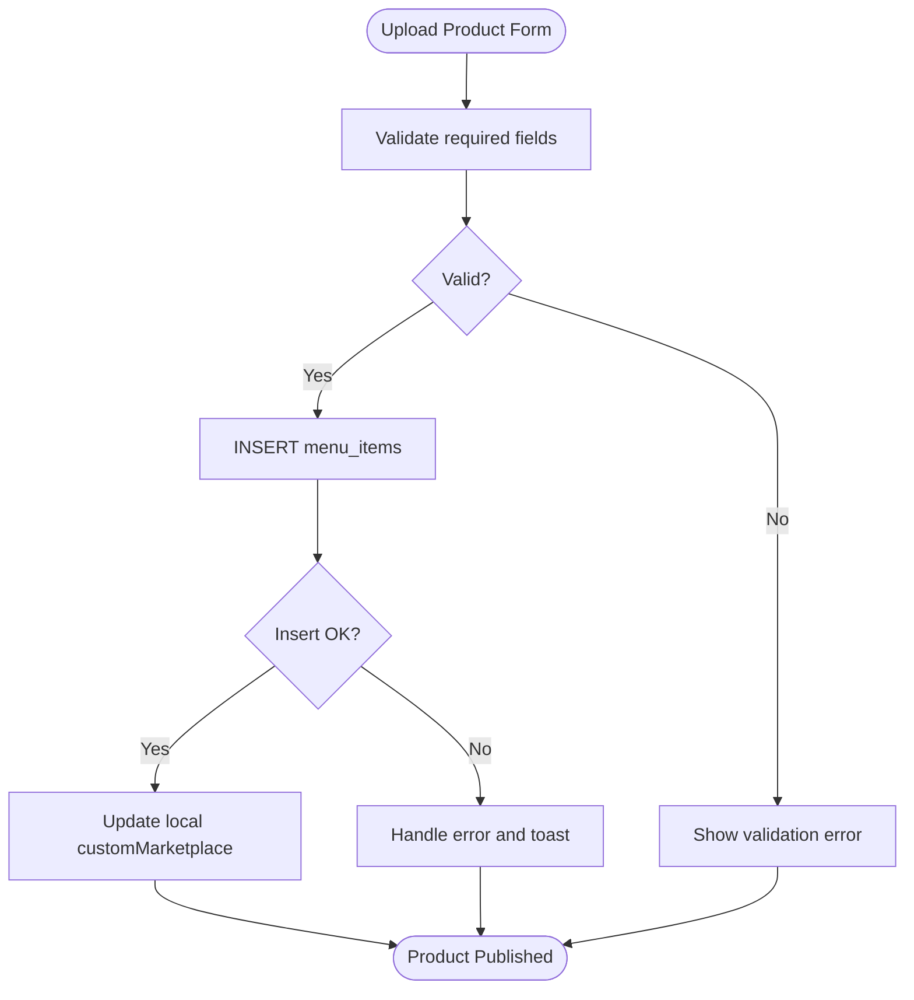

**Diagram sources**
- [App.tsx](file://src/App.tsx)
- [supabase_schema.sql](file://supabase_schema.sql)

**Section sources**
- [App.tsx](file://src/App.tsx)

### Support Inquiries and Admin Replies
- Admin can view inquiries and reply, updating status to answered.

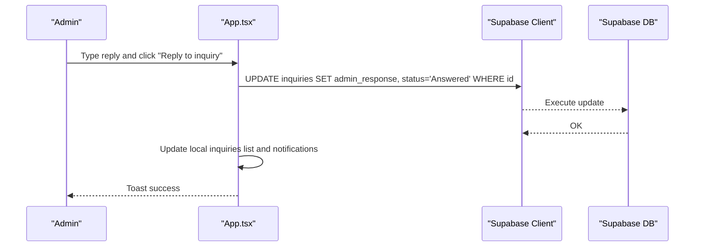

**Diagram sources**
- [App.tsx](file://src/App.tsx)
- [supabase_schema.sql](file://supabase_schema.sql)

**Section sources**
- [App.tsx](file://src/App.tsx)

### Escrow Release and Delivery Job Oversight
- Admin can release escrow funds when orders are delivered.
- Delivery job statuses are updated accordingly.

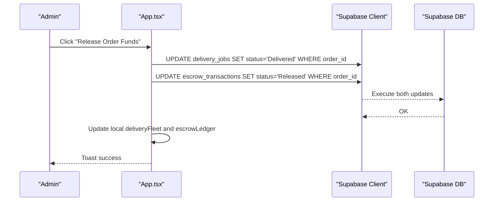

**Diagram sources**
- [App.tsx](file://src/App.tsx)
- [supabase_schema.sql](file://supabase_schema.sql)

**Section sources**
- [App.tsx](file://src/App.tsx)

### Vendor Ban/Unban (Account Suspension)
- Admin can ban/unban vendors to control visibility of their products.

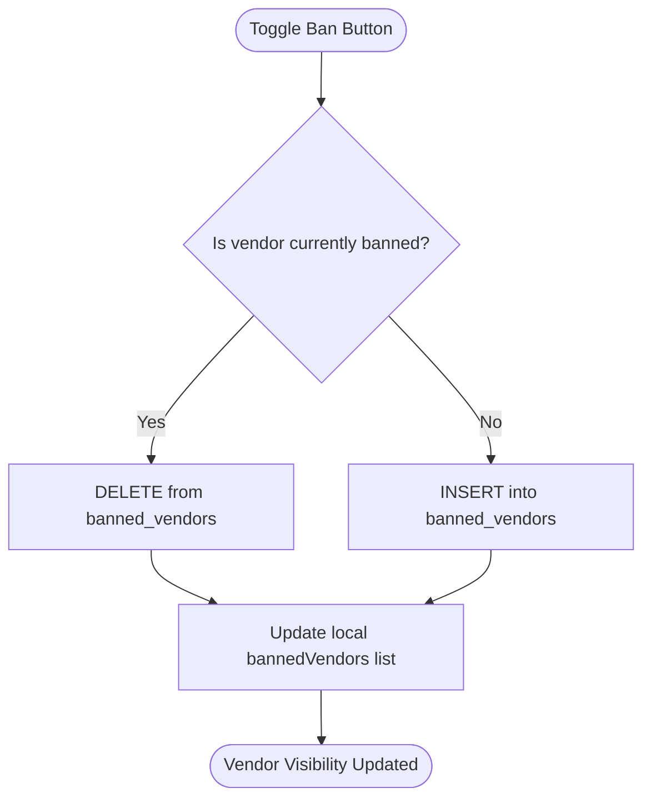

**Diagram sources**
- [App.tsx](file://src/App.tsx)
- [supabase_schema.sql](file://supabase_schema.sql)

**Section sources**
- [App.tsx](file://src/App.tsx)

### Data Models and Schema Alignment
The following diagram maps key entities used by the admin dashboard:

```mermaid
erDiagram
PROFILES {
text id PK
text email
text username
text name
text phone
text role
text linked_entity_name
text profile_photo_url
text address
text delivery_point
text bio
text pickup_note
timestamptz created_at
}
VENDORS {
text id PK
text name
text category
text sub_type
numeric rating
text delivery_time
numeric min_order
text badge
text image
boolean approved
timestamptz created_at
}
MENU_ITEMS {
text id PK
text name
numeric price
text description
text category
text store_name
boolean is_featured
timestamptz created_at
}
INQUIRIES {
text id PK
text user_id
text name
text phone
text topic
text message
text admin_response
text status
timestamptz created_at
}
VENDOR_APPROVALS {
text id PK
text shop_name
text category
text phone
text login_email
text login_password
text status
timestamptz created_at
}
RIDER_APPROVALS {
text id PK
text rider_name
text motorcycle_plate
text phone
text login_email
text login_password
text status
timestamptz created_at
}
DELIVERY_JOBS {
text id PK
text order_id
text destination
numeric fee
text status
text rider_name
text customer_phone
text merchant_name
text items_summary
text otp
boolean boda_pool_active
timestamptz created_at
}
ESCROW_TRANSACTIONS {
text id PK
text order_id
numeric amount
text payer
text vendor_name
text status
timestamptz created_at
}
CHAMA_DEALS {
text id PK
text title
text merchant
text category
numeric total_price
numeric portion_price
integer target_portions
integer filled_portions
text[] backers
timestamptz created_at
}
GAS_PREDICTIONS {
uuid id PK
text user_id
text gas_size
numeric household_size
numeric days_remaining
text last_refill_date
timestamptz created_at
}
BANNED_VENDORS {
uuid id PK
text store_name UK
timestamptz created_at
}
```

**Diagram sources**
- [supabase_schema.sql](file://supabase_schema.sql)

**Section sources**
- [supabase_schema.sql](file://supabase_schema.sql)

### Permission Checks and Admin-Specific Routes
- Admin tab visibility is conditional based on current user role.
- An in-app password gate unlocks admin mode without server-side route protection.
- Role-based gating ensures only admins see the admin tab.

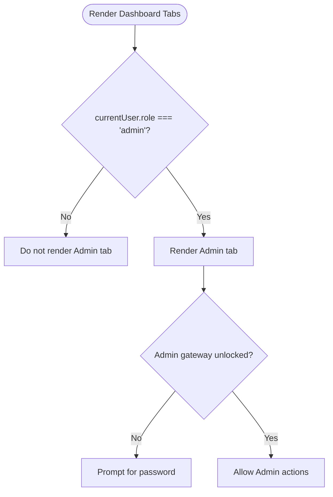

**Diagram sources**
- [App.tsx](file://src/App.tsx)

**Section sources**
- [App.tsx](file://src/App.tsx)

### Export Capabilities
- No explicit export functionality is implemented in the codebase.
- Data can be exported manually via Supabase Studio or direct SQL queries against the defined schema.

[No sources needed since this section provides general guidance]

### Audit Logging
- There is no dedicated audit log table or mechanism.
- Timestamps exist on most tables (created_at), which can serve as basic audit trails.
- For robust auditing, consider adding an audit_log table and triggers.

[No sources needed since this section provides general guidance]

### Administrative Task Automation
- Manual approvals and releases are supported through UI actions.
- Automation could be introduced via Supabase Edge Functions or scheduled tasks to auto-approve based on rules or trigger notifications.

[No sources needed since this section provides general guidance]

## Dependency Analysis
The app depends on Supabase for auth and data operations. The client is configured via environment variables, and typed wrappers simplify queries.

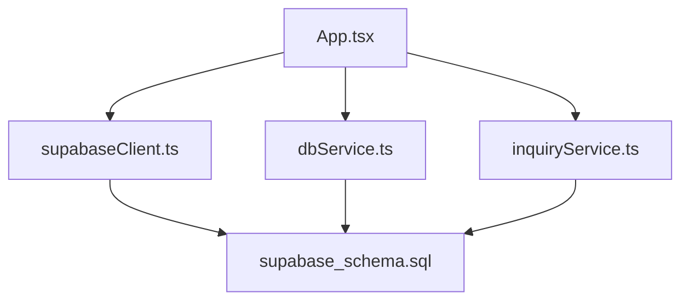

**Diagram sources**
- [App.tsx](file://src/App.tsx)
- [supabaseClient.ts](file://src/supabase/supabaseClient.ts)
- [dbService.ts](file://src/supabase/dbService.ts)
- [inquiryService.ts](file://src/supabase/inquiryService.ts)
- [supabase_schema.sql](file://supabase_schema.sql)

**Section sources**
- [package.json](file://package.json)
- [supabase_schema.sql](file://supabase_schema.sql)

## Performance Considerations
- All data loads occur on mount; consider pagination and selective queries for large datasets.
- Local state mutations provide instant feedback; ensure optimistic updates align with server responses.
- Avoid unnecessary re-renders by memoizing derived lists where appropriate.
- Use Supabase indexes on frequently queried columns (e.g., status, order_id).

[No sources needed since this section provides general guidance]

## Troubleshooting Guide
Common issues and resolutions:
- Supabase credentials missing: Ensure VITE_SUPABASE_URL and VITE_SUPABASE_ANON_KEY are set in .env.
- Incorrect base URL: Do not include /rest/v1 in the URL.
- Query returns null: Verify rows exist and RLS policies allow access.
- Auth fallback behavior: Legacy phone-based login may bypass standard auth; confirm expected flow.

**Section sources**
- [supabaseClient.ts](file://src/supabase/supabaseClient.ts)
- [App.tsx](file://src/App.tsx)

## Conclusion
The administrative dashboard integrates seamlessly within the application’s single-page architecture, providing essential platform management capabilities such as vendor and rider approvals, product moderation, support handling, escrow oversight, and vendor bans. While export and audit logging are not implemented, the existing schema supports basic tracking. Future enhancements should introduce robust auditing, automated approvals, and scalable data retrieval strategies.

[No sources needed since this section summarizes without analyzing specific files]

## Appendices
- Environment setup: Configure Supabase credentials in .env and use the shared client.
- Schema execution: Run the provided schema script to align tables and RLS policies.
- Development scripts: Use Vite for dev/build and ESLint for linting.

**Section sources**
- [package.json](file://package.json)
- [supabase_schema.sql](file://supabase_schema.sql)