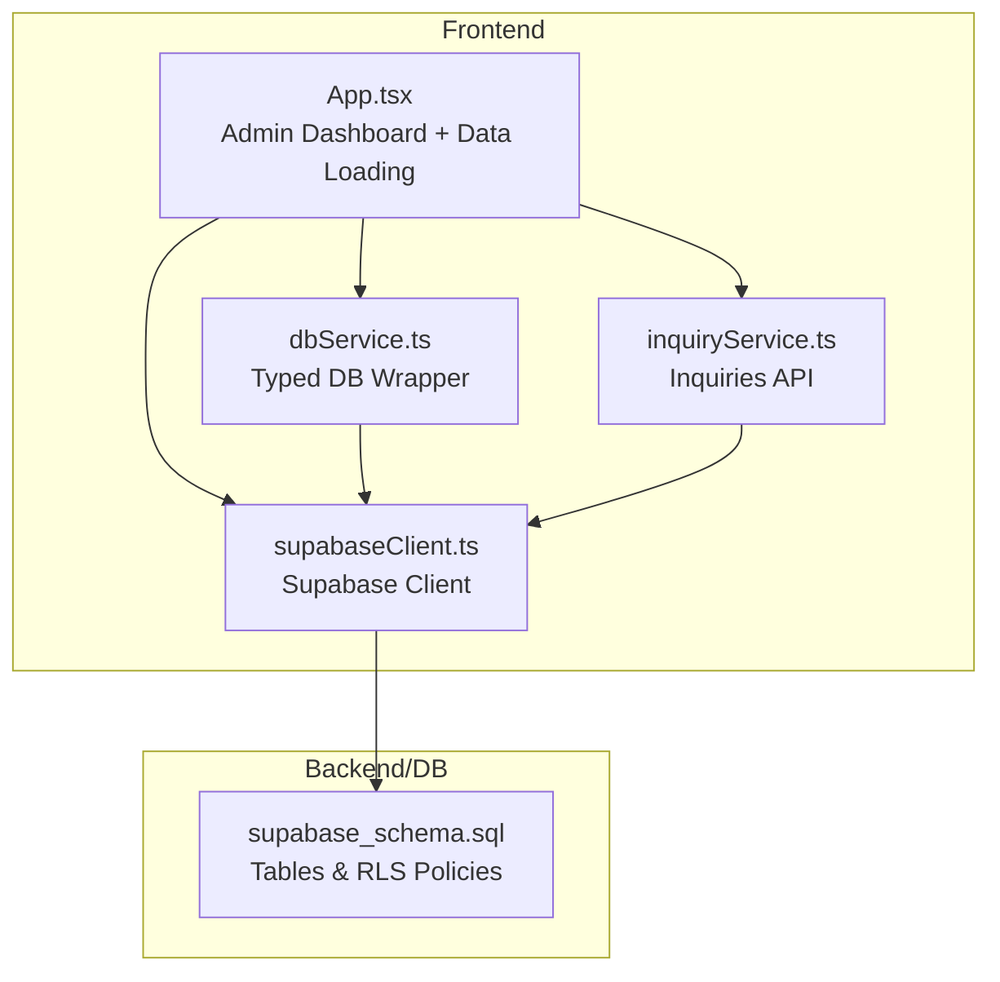
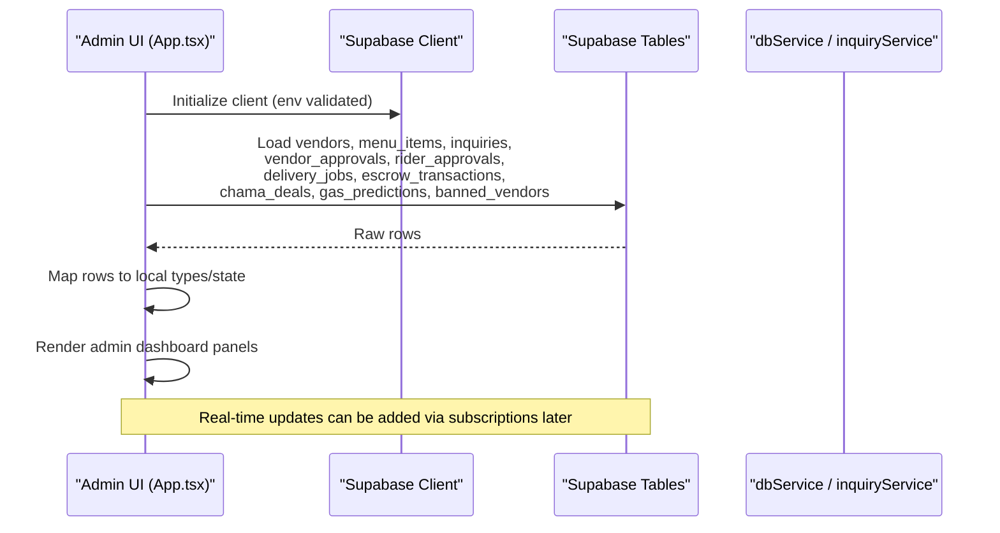
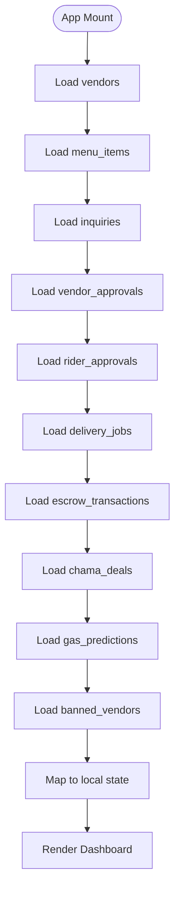
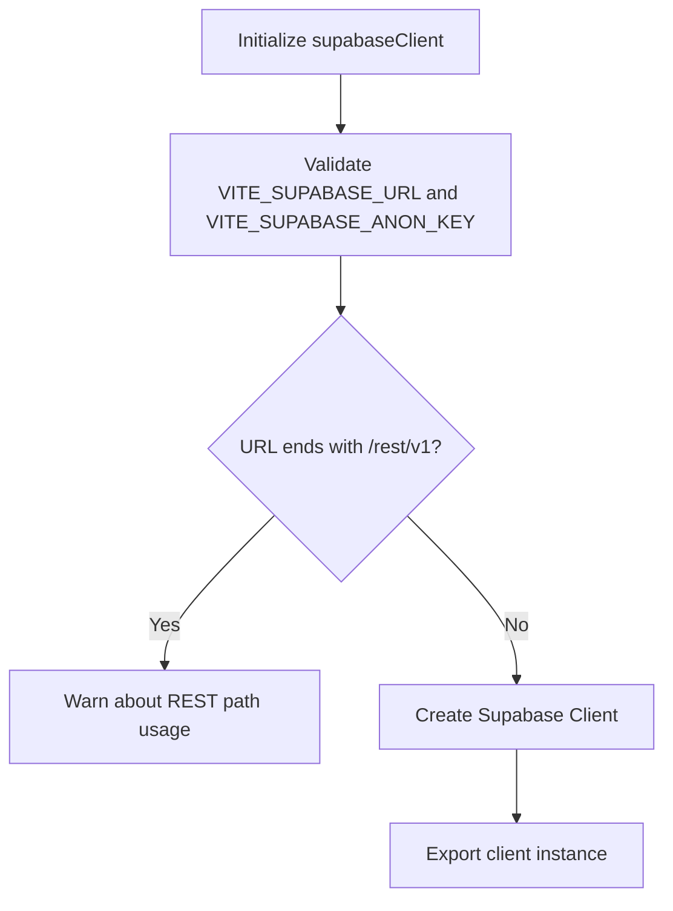
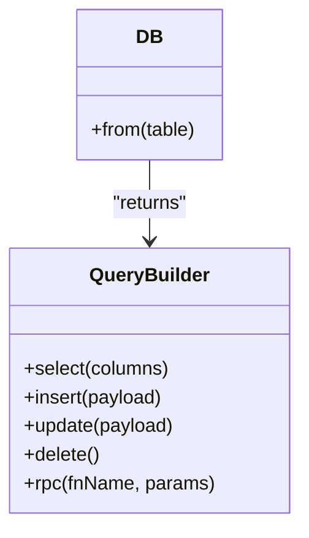
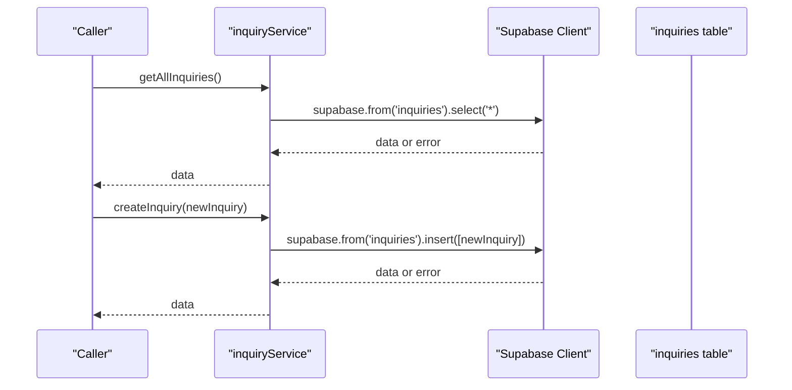
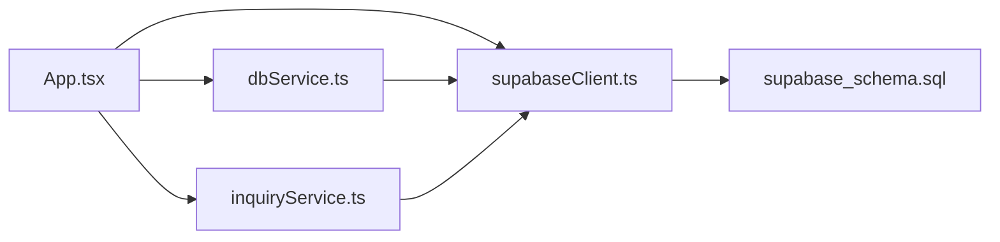

# Analytics & Reporting

<cite>
**Referenced Files in This Document**
- [App.tsx](file://src/App.tsx)
- [supabaseClient.ts](file://src/supabase/supabaseClient.ts)
- [dbService.ts](file://src/supabase/dbService.ts)
- [inquiryService.ts](file://src/supabase/inquiryService.ts)
- [supabase_schema.sql](file://supabase_schema.sql)
- [SUPABASE.md](file://SUPABASE.md)
- [package.json](file://package.json)
</cite>

## Table of Contents
1. [Introduction](#introduction)
2. [Project Structure](#project-structure)
3. [Core Components](#core-components)
4. [Architecture Overview](#architecture-overview)
5. [Detailed Component Analysis](#detailed-component-analysis)
6. [Dependency Analysis](#dependency-analysis)
7. [Performance Considerations](#performance-considerations)
8. [Troubleshooting Guide](#troubleshooting-guide)
9. [Conclusion](#conclusion)
10. [Appendices](#appendices)

## Introduction
This document describes the analytics and reporting capabilities available within the administrative dashboard of the application. It focuses on how sales metrics, revenue tracking, and transaction analysis are collected and presented; how user activity monitoring and platform health dashboards can be implemented; and how to build reports, export data, and visualize key performance indicators (KPIs). It also outlines a path for real-time analytics, trend analysis, custom report builders, KPI definitions, dashboard customization, and automated reporting schedules.

The current codebase provides:
- A unified Supabase client and typed database service layer for querying operational tables.
- An admin dashboard view that surfaces approvals, escrow transactions, delivery jobs, inquiries, and vendor listings.
- Database schema covering core entities such as vendors, menu items, escrow transactions, delivery jobs, inquiries, and more.

These building blocks enable robust analytics and reporting once additional aggregation, visualization, and scheduling layers are added.

## Project Structure
At a high level, analytics and reporting rely on:
- The React application entrypoint and main UI logic (App.tsx), which loads and displays operational data and admin views.
- The Supabase client configuration and environment validation.
- A lightweight database service wrapper for consistent queries.
- A dedicated inquiry service for support-related operations.
- The Supabase SQL schema defining tables used by analytics.

**Diagram sources**
- [App.tsx](file://src/App.tsx)
- [supabaseClient.ts](file://src/supabase/supabaseClient.ts)
- [dbService.ts](file://src/supabase/dbService.ts)
- [inquiryService.ts](file://src/supabase/inquiryService.ts)
- [supabase_schema.sql](file://supabase_schema.sql)

**Section sources**
- [App.tsx](file://src/App.tsx)
- [supabaseClient.ts](file://src/supabase/supabaseClient.ts)
- [dbService.ts](file://src/supabase/dbService.ts)
- [inquiryService.ts](file://src/supabase/inquiryService.ts)
- [supabase_schema.sql](file://supabase_schema.sql)

## Core Components
- Admin Dashboard View: Displays merchant applications, rider licenses, store approvals, escrow release queue, and customer support communications. It is gated by role-based access control.
- Data Loading: On mount, the app loads initial datasets from multiple tables and maps them into local state for rendering.
- Supabase Client: Centralized client with environment validation and debugging helpers.
- Typed DB Service: Provides a consistent interface for select, insert, update, delete, and RPC calls.
- Inquiry Service: Encapsulates fetching and creating inquiries.

Key responsibilities for analytics and reporting:
- Aggregation of sales and revenue metrics from escrow_transactions and delivery_jobs.
- Transaction analysis via status transitions and timestamps.
- User activity monitoring through profiles and inquiries.
- Platform health via counts and statuses across vendors, delivery jobs, and escrow states.

**Section sources**
- [App.tsx](file://src/App.tsx)
- [supabaseClient.ts](file://src/supabase/supabaseClient.ts)
- [dbService.ts](file://src/supabase/dbService.ts)
- [inquiryService.ts](file://src/supabase/inquiryService.ts)

## Architecture Overview
The analytics pipeline begins with data ingestion from Supabase tables, flows through the React app’s state management, and renders dashboard widgets. Future enhancements will introduce aggregation services, visualization components, and scheduled report generation.

**Diagram sources**
- [App.tsx](file://src/App.tsx)
- [supabaseClient.ts](file://src/supabase/supabaseClient.ts)
- [supabase_schema.sql](file://supabase_schema.sql)

## Detailed Component Analysis

### Admin Dashboard Panels
- Merchant Applications: Lists pending vendor requests with approve actions.
- Rider Licenses: Lists pending rider requests with approve actions.
- Platform Store Approval: Shows vendors with ban/lift-ban controls.
- Escrow & Delivery Release Queue: Displays holding escrow transactions with release actions.
- Customer Support Communications: Shows inquiries with admin reply capability.

These panels provide the foundation for KPIs such as:
- Pending approvals count
- Escrow funds awaiting release
- Active delivery jobs by status
- Inquiries volume and response rate

**Section sources**
- [App.tsx](file://src/App.tsx)

### Data Loading and Mapping
On application start, the app performs bulk reads from multiple tables and maps results into strongly-typed local structures. This ensures consistent rendering and enables further computation for analytics.

**Diagram sources**
- [App.tsx](file://src/App.tsx)

**Section sources**
- [App.tsx](file://src/App.tsx)

### Supabase Client and Environment Validation
The client validates environment variables and warns about common misconfigurations. It exposes a debug helper to log host and key presence.

**Diagram sources**
- [supabaseClient.ts](file://src/supabase/supabaseClient.ts)

**Section sources**
- [supabaseClient.ts](file://src/supabase/supabaseClient.ts)
- [SUPABASE.md](file://SUPABASE.md)

### Typed Database Service
Provides a uniform interface for CRUD operations and RPC calls, returning standardized responses with data and error fields.

**Diagram sources**
- [dbService.ts](file://src/supabase/dbService.ts)

**Section sources**
- [dbService.ts](file://src/supabase/dbService.ts)

### Inquiry Service
Encapsulates fetching all inquiries and creating new ones, throwing errors when needed.

**Diagram sources**
- [inquiryService.ts](file://src/supabase/inquiryService.ts)

**Section sources**
- [inquiryService.ts](file://src/supabase/inquiryService.ts)

### Database Schema and RLS Policies
Defines core tables including profiles, gas_predictions, escrow_transactions, delivery_jobs, vendors, menu_items, inquiries, vendor_approvals, rider_approvals, chama_deals, and banned_vendors. RLS policies grant full access for development scenarios.

```mermaid
erDiagram
PROFILES {
text id PK
text email
text username
text name
text phone
text role
text linked_entity_name
text profile_photo_url
text address
text delivery_point
text bio
text pickup_note
timestamptz created_at
}
ESCROW_TRANSACTIONS {
text id PK
text order_id
numeric amount
text payer
text vendor_name
text status
timestamptz created_at
}
DELIVERY_JOBS {
text id PK
text order_id
text destination
numeric fee
text status
text rider_name
text customer_phone
text merchant_name
text items_summary
text otp
boolean boda_pool_active
timestamptz created_at
}
VENDORS {
text id PK
text name
text category
text sub_type
numeric rating
text delivery_time
numeric min_order
text badge
text image
boolean approved
timestamptz created_at
}
MENU_ITEMS {
text id PK
text name
numeric price
text description
text category
text store_name
boolean is_featured
timestamptz created_at
}
INQUIRIES {
text id PK
text user_id
text name
text phone
text topic
text message
text admin_response
text status
timestamptz created_at
}
VENDOR_APPROVALS {
text id PK
text shop_name
text category
text phone
text login_email
text login_password
text status
timestamptz created_at
}
RIDER_APPROVALS {
text id PK
text rider_name
text motorcycle_plate
text phone
text login_email
text login_password
text status
timestamptz created_at
}
CHAMA_DEALS {
text id PK
text title
text merchant
text category
numeric total_price
numeric portion_price
integer target_portions
integer filled_portions
text[] backers
timestamptz created_at
}
BANNED_VENDORS {
uuid id PK
text store_name UK
timestamptz created_at
}
```

**Diagram sources**
- [supabase_schema.sql](file://supabase_schema.sql)

**Section sources**
- [supabase_schema.sql](file://supabase_schema.sql)

## Dependency Analysis
The frontend depends on Supabase for persistence and authentication. The app composes multiple services and uses typed wrappers to ensure consistent query patterns.

**Diagram sources**
- [App.tsx](file://src/App.tsx)
- [supabaseClient.ts](file://src/supabase/supabaseClient.ts)
- [dbService.ts](file://src/supabase/dbService.ts)
- [inquiryService.ts](file://src/supabase/inquiryService.ts)
- [supabase_schema.sql](file://supabase_schema.sql)

**Section sources**
- [package.json](file://package.json)
- [supabaseClient.ts](file://src/supabase/supabaseClient.ts)

## Performance Considerations
- Batch loading: Initial load fetches many tables concurrently; consider pagination and selective columns for large datasets.
- Indexing: Ensure indexes on frequently filtered columns (e.g., status, created_at) to optimize dashboard queries.
- Caching: Cache computed aggregates locally to reduce re-renders and network calls.
- Real-time: Use Supabase subscriptions for live updates instead of polling.
- Error handling: Centralize error handling in dbService to avoid repeated try/catch blocks.

[No sources needed since this section provides general guidance]

## Troubleshooting Guide
Common issues and resolutions:
- Missing credentials: Ensure VITE_SUPABASE_URL and VITE_SUPABASE_ANON_KEY are set in root .env.
- Incorrect URL format: Do not append /rest/v1 to the base URL.
- Empty query results: Verify RLS policies and inserted rows; confirm field names match schema.
- Debugging: Use the provided debug helper to log effective Supabase host and key presence.

**Section sources**
- [SUPABASE.md](file://SUPABASE.md)
- [supabaseClient.ts](file://src/supabase/supabaseClient.ts)

## Conclusion
The application provides a solid foundation for analytics and reporting through its admin dashboard, typed database service, and comprehensive schema. To fully realize advanced analytics features—such as sales metrics collection, revenue tracking, transaction analysis, user activity monitoring, platform health dashboards, visualization components, real-time analytics, trend analysis, custom report builders, KPIs, dashboard customization, and automated reporting schedules—additional layers should be introduced:
- Aggregation services for KPI computation
- Visualization libraries for charts and graphs
- Subscription-based real-time updates
- Scheduled report generation and export utilities

These enhancements will transform the existing operational views into a powerful analytics and reporting system.

[No sources needed since this section summarizes without analyzing specific files]

## Appendices

### Proposed KPIs and Metrics
- Sales Metrics:
  - Total orders, average order value, conversion rate
  - Revenue by category, vendor, and time period
- Revenue Tracking:
  - Escrow totals by status (Holding, Released, Refunded)
  - Net revenue after refunds and fees
- Transaction Analysis:
  - Order lifecycle duration
  - Payment success/failure rates
- User Activity Monitoring:
  - Active users, sign-ups, support inquiries volume
- Platform Health:
  - Pending approvals, active delivery jobs, error rates

[No sources needed since this section provides conceptual content]

### Implementation Roadmap
- Phase 1: Add aggregation endpoints (serverless functions or Supabase RPC) to compute KPIs.
- Phase 2: Integrate visualization components (charts/graphs) in the admin dashboard.
- Phase 3: Implement real-time subscriptions for live updates.
- Phase 4: Build custom report builder with filters and exports (CSV/PDF).
- Phase 5: Schedule automated reports and distribute via email or webhook.

[No sources needed since this section provides conceptual content]