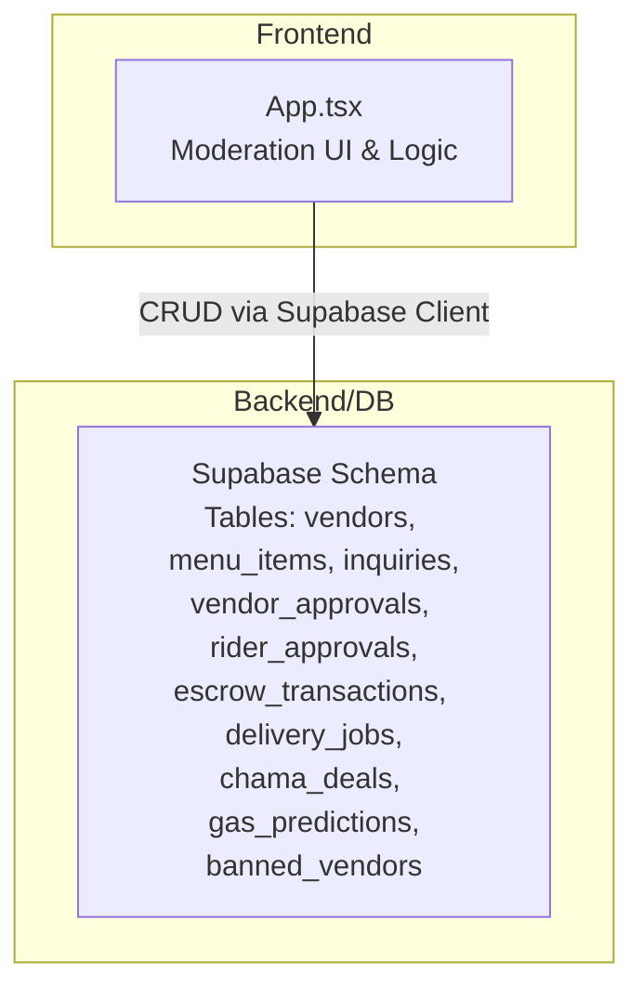
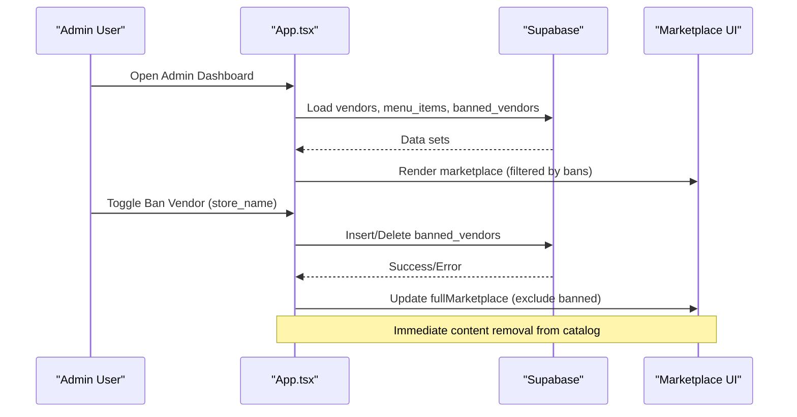
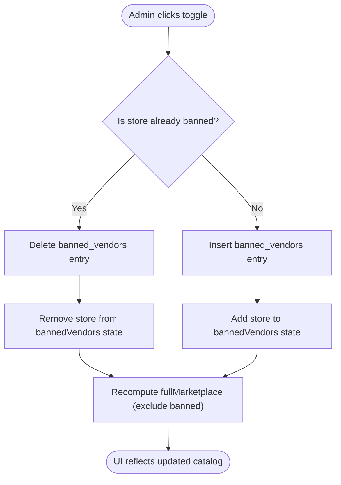
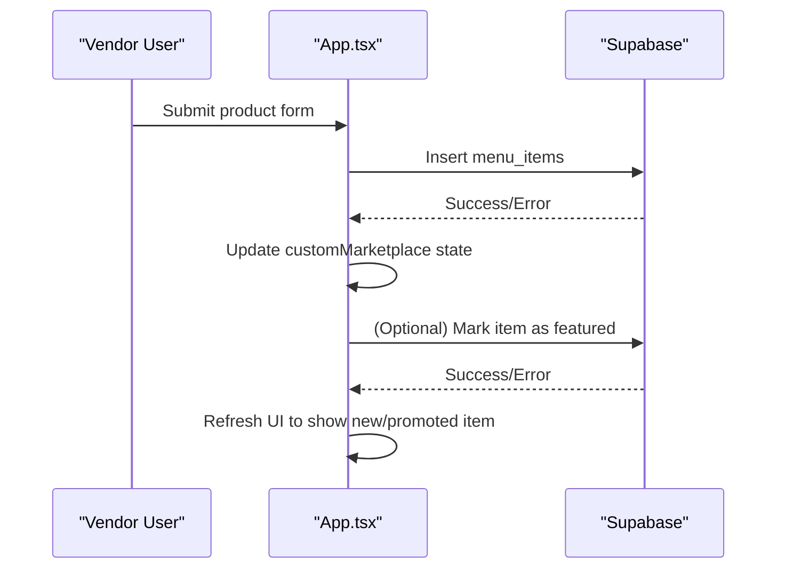
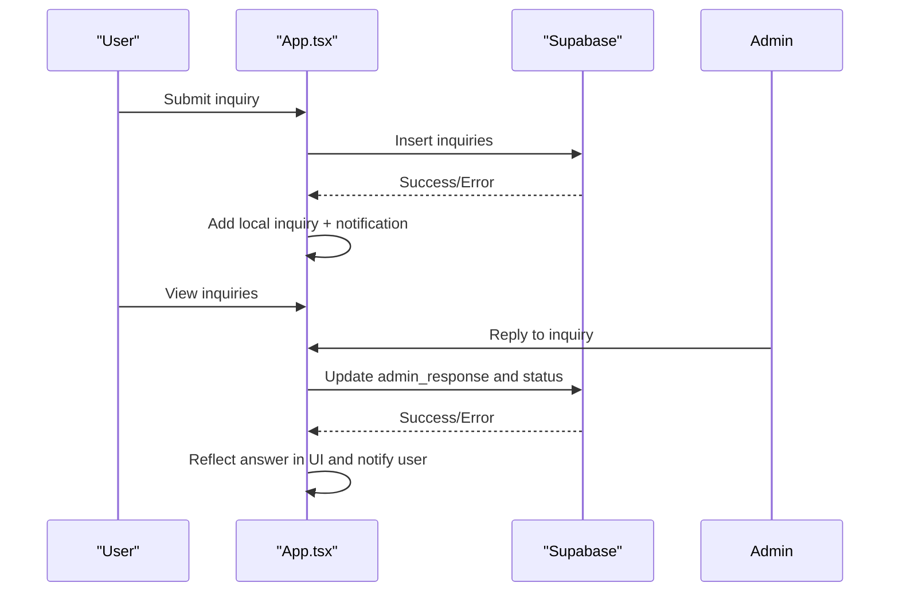
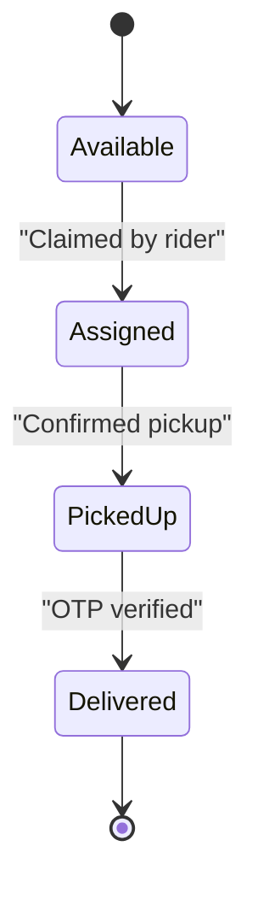
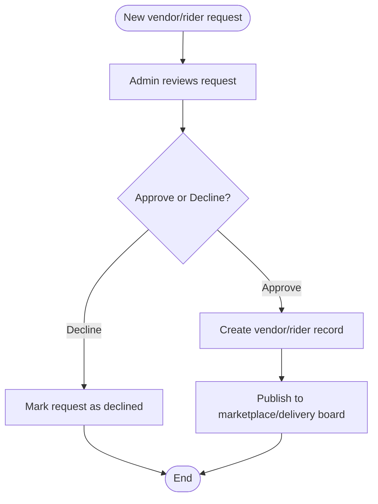
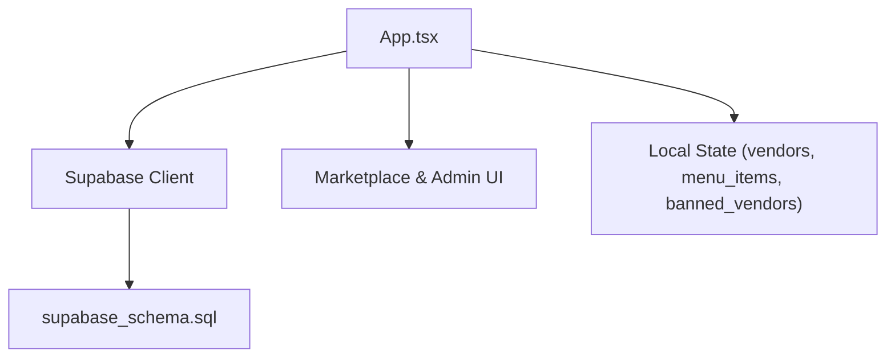

# Content Moderation

<cite>
**Referenced Files in This Document**
- [App.tsx](file://src/App.tsx)
- [supabase_schema.sql](file://supabase_schema.sql)
- [SUPABASE.md](file://SUPABASE.md)
- [package.json](file://package.json)
</cite>

## Table of Contents
1. Introduction
2. Project Structure
3. Core Components
4. Architecture Overview
5. Detailed Component Analysis
6. Dependency Analysis
7. Performance Considerations
8. Troubleshooting Guide
9. Conclusion

## Introduction
This document explains the content moderation and quality control features available in the administrative dashboard of the platform. It focuses on product listing review, image/content validation, spam detection mechanisms, content flagging, automated moderation tools, manual review workflows, banned vendor management, content removal procedures, appeal handling, and content restoration capabilities. The implementation is primarily client-side with Supabase-backed persistence for moderation state and audit trails.

## Project Structure
The moderation features are implemented within the main application component and supported by a database schema that includes tables for vendors, menu items, inquiries, approvals, and a dedicated banned vendors list. The application uses Supabase for data operations and environment configuration.

**Diagram sources**
- [App.tsx](file://src/App.tsx)
- [supabase_schema.sql](file://supabase_schema.sql)

**Section sources**
- [App.tsx](file://src/App.tsx)
- [supabase_schema.sql](file://supabase_schema.sql)
- [SUPABASE.md](file://SUPABASE.md)
- [package.json](file://package.json)

## Core Components
- Vendor and Product Listing Management
  - Vendors and menu items are loaded from Supabase and displayed in the marketplace. Products can be uploaded through the vendor hub form and persisted to the database.
- Banned Vendor Management
  - Administrators can ban or unban stores; banned stores’ products are filtered out from the full marketplace view.
- Support Inquiries and Appeals
  - Users can submit support tickets; admins can reply and update status, forming an appeals workflow.
- Escrow and Delivery Controls
  - Payment holding and delivery job states provide operational controls that indirectly affect content visibility and fulfillment.

Key behaviors:
- Full marketplace filtering excludes items from banned stores.
- Admin actions (ban/unban) persist to the banned_vendors table and immediately affect frontend display.
- Support inquiries are stored and can be answered by admins, enabling appeal handling.

**Section sources**
- [App.tsx](file://src/App.tsx)
- [supabase_schema.sql](file://supabase_schema.sql)

## Architecture Overview
The moderation architecture combines client-side state and server-side persistence:

**Diagram sources**
- [App.tsx](file://src/App.tsx)
- [supabase_schema.sql](file://supabase_schema.sql)

## Detailed Component Analysis

### Banned Vendor Management
- Functionality
  - Administrators can ban or unban a store name. When banned, all items from that store are excluded from the full marketplace view.
- Persistence
  - Banned stores are stored in the banned_vendors table. Unbanning removes the entry.
- UI Actions
  - Each vendor row shows a De-authorize/Lift Ban button based on current ban status.

**Diagram sources**
- [App.tsx](file://src/App.tsx)
- [supabase_schema.sql](file://supabase_schema.sql)

**Section sources**
- [App.tsx](file://src/App.tsx)
- [supabase_schema.sql](file://supabase_schema.sql)

### Product Listing Review and Upload
- Vendor Hub
  - Vendors can upload new products via a form that persists to menu_items.
- Approval Workflow
  - Vendor registration requests go into vendor_approvals; admin approval creates a vendor record and updates marketplace categories.
- Featured Promotions
  - Items can be promoted to featured status, affecting visibility in the sponsor banner area.

**Diagram sources**
- [App.tsx](file://src/App.tsx)
- [supabase_schema.sql](file://supabase_schema.sql)

**Section sources**
- [App.tsx](file://src/App.tsx)
- [supabase_schema.sql](file://supabase_schema.sql)

### Support Inquiries and Appeal Handling
- Submission
  - Users submit inquiries with topic, message, and contact details.
- Admin Reply
  - Admins can respond and mark inquiries as Answered.
- Notifications
  - System generates notifications for users when replies are posted.

**Diagram sources**
- [App.tsx](file://src/App.tsx)
- [supabase_schema.sql](file://supabase_schema.sql)

**Section sources**
- [App.tsx](file://src/App.tsx)
- [supabase_schema.sql](file://supabase_schema.sql)

### Escrow and Delivery Controls (Indirect Moderation)
- Escrow Holding
  - Payments are held until delivery verification; this ensures transaction integrity before releasing funds.
- Delivery Job States
  - Jobs transition through Available, Assigned, Picked Up, Delivered; OTP verification finalizes delivery and releases escrow.

**Diagram sources**
- [App.tsx](file://src/App.tsx)
- [supabase_schema.sql](file://supabase_schema.sql)

**Section sources**
- [App.tsx](file://src/App.tsx)
- [supabase_schema.sql](file://supabase_schema.sql)

### Content Flagging and Removal Procedures
- Current Capabilities
  - Store-level banning effectively removes all associated content from the marketplace.
- Limitations
  - No per-item flagging or takedown mechanism is present in the current codebase.
- Recommended Enhancements
  - Introduce a flags table to track reported items, reasons, and statuses.
  - Implement per-item moderation states (e.g., Pending Review, Approved, Rejected).
  - Provide bulk actions for flagged items and audit logs.

[No sources needed since this section proposes enhancements not present in the current code]

### Automated Moderation Tools and Keyword Blocking
- Current State
  - No automated keyword blocking or image recognition is implemented in the provided files.
- Recommended Implementation
  - Add client-side validators for product titles/descriptions to block prohibited keywords.
  - Integrate external image moderation APIs to detect inappropriate content before publishing.
  - Maintain a configurable blocklist and allow admin overrides with audit trails.

[No sources needed since this section provides general guidance]

### Manual Review Workflows
- Vendor Approvals
  - Admins approve or decline vendor applications; approved vendors are added to the vendors table and become visible in their category.
- Rider Approvals
  - Similar workflow for riders, enabling access to delivery operations upon approval.

**Diagram sources**
- [App.tsx](file://src/App.tsx)
- [supabase_schema.sql](file://supabase_schema.sql)

**Section sources**
- [App.tsx](file://src/App.tsx)
- [supabase_schema.sql](file://supabase_schema.sql)

### Moderation Policies and Enforcement Actions
- Policies
  - Banned stores are excluded from marketplace listings.
  - Only approved vendors appear in their respective categories.
- Enforcement
  - Admin actions directly modify database records and instantly reflect in UI.
- Restoration
  - Unbanning restores visibility; no soft-delete or archive mechanism exists for individual items.

**Section sources**
- [App.tsx](file://src/App.tsx)
- [supabase_schema.sql](file://supabase_schema.sql)

## Dependency Analysis
The moderation features depend on:
- React state and event handlers in App.tsx for UI interactions and logic.
- Supabase client for data operations (select, insert, update, delete).
- Database schema defining tables and RLS policies.

**Diagram sources**
- [App.tsx](file://src/App.tsx)
- [supabase_schema.sql](file://supabase_schema.sql)

**Section sources**
- [App.tsx](file://src/App.tsx)
- [supabase_schema.sql](file://supabase_schema.sql)
- [package.json](file://package.json)

## Performance Considerations
- Filtering Efficiency
  - Marketplace filtering excludes banned stores using in-memory arrays; ensure datasets remain manageable.
- Database Queries
  - Initial load queries fetch multiple tables; consider pagination and selective fields for large catalogs.
- UI Updates
  - Frequent state updates during ban/unban should be batched where possible to avoid excessive re-renders.

[No sources needed since this section provides general guidance]

## Troubleshooting Guide
- Supabase Configuration
  - Ensure environment variables are correctly set and do not include /rest/v1 in the URL.
- Query Returns Null
  - Verify rows exist and RLS policies allow access; check field names and primary keys.
- Common Issues
  - Confirm correct Supabase project URL and anon key usage across operations.
  - Validate table permissions and RLS policies for anon and authenticated roles.

**Section sources**
- [SUPABASE.md](file://SUPABASE.md)

## Conclusion
The platform’s moderation system currently supports store-level banning, vendor and rider approval workflows, and support-based appeal handling. While effective for high-level enforcement, it lacks granular content flagging, automated keyword/image moderation, and per-item takedown capabilities. Extending the system with a flags table, client-side validators, and external image moderation services would significantly enhance content safety and moderation efficiency.