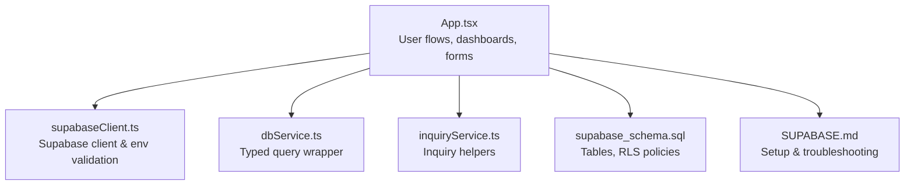
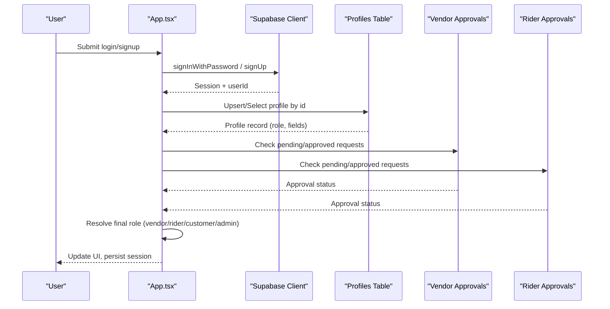
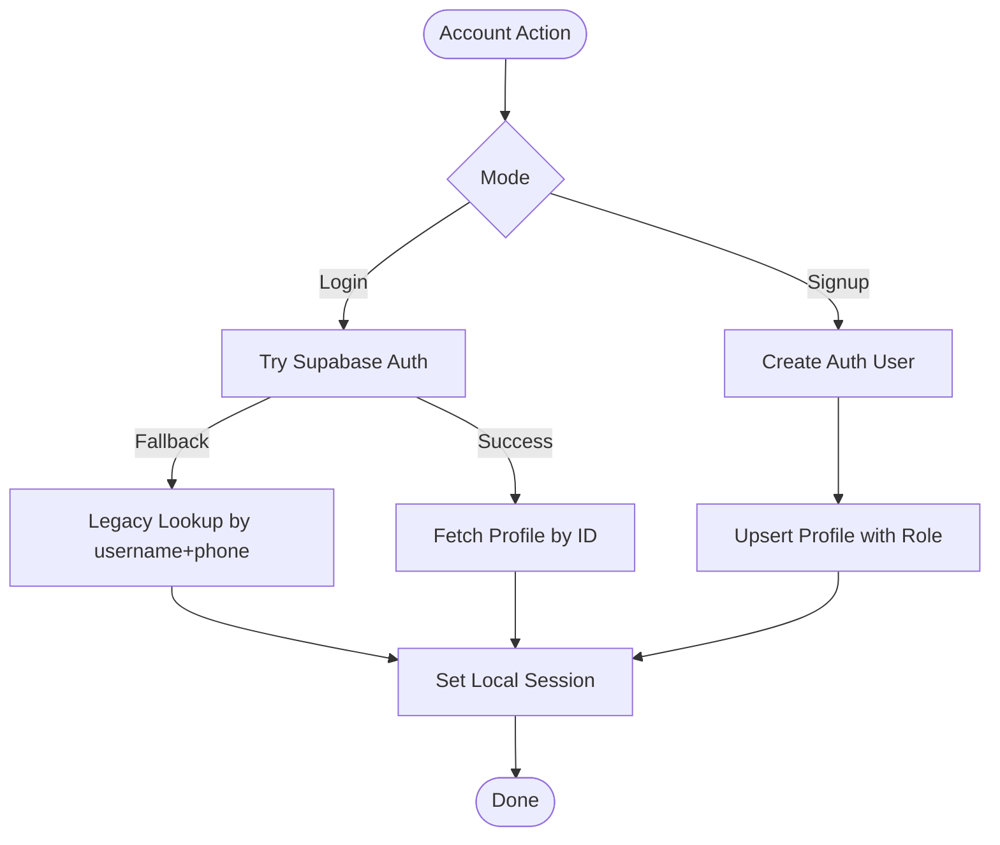
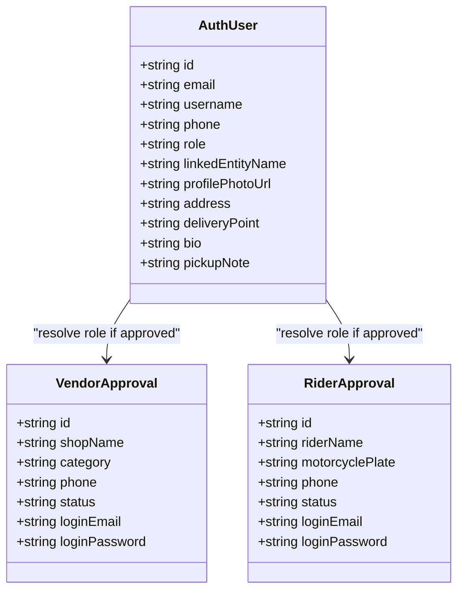
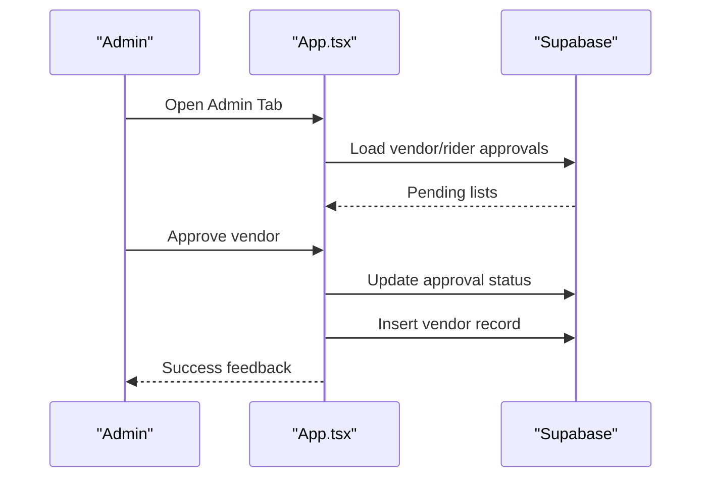
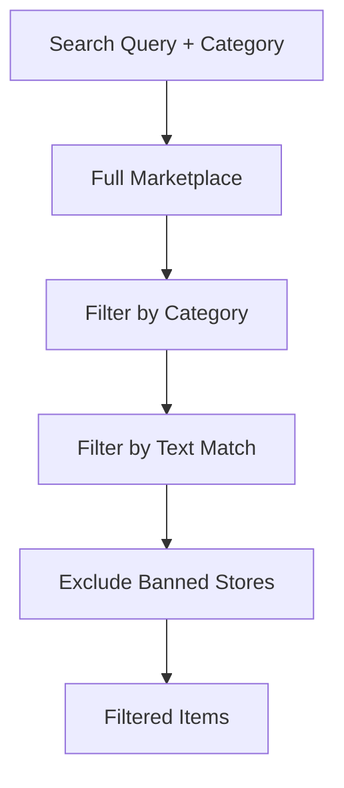
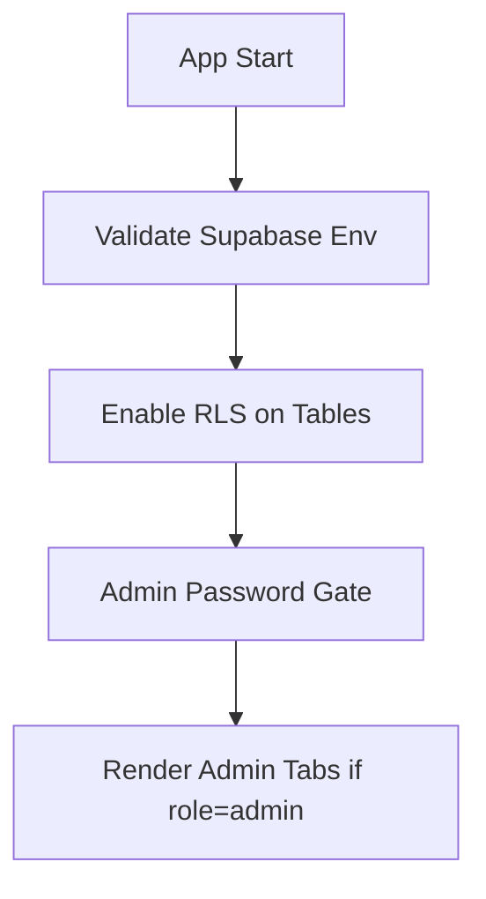
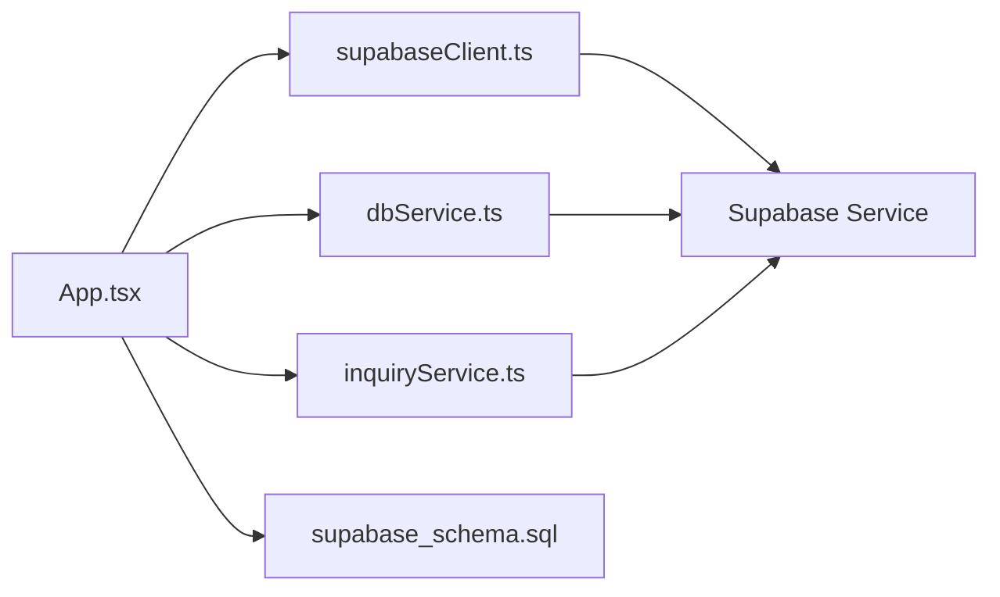

# User Administration

<cite>
**Referenced Files in This Document**
- [App.tsx](file://src/App.tsx)
- [supabaseClient.ts](file://src/supabase/supabaseClient.ts)
- [dbService.ts](file://src/supabase/dbService.ts)
- [inquiryService.ts](file://src/supabase/inquiryService.ts)
- [supabase_schema.sql](file://supabase_schema.sql)
- [SUPABASE.md](file://SUPABASE.md)
</cite>

## Table of Contents
1. [Introduction](#introduction)
2. [Project Structure](#project-structure)
3. [Core Components](#core-components)
4. [Architecture Overview](#architecture-overview)
5. [Detailed Component Analysis](#detailed-component-analysis)
6. [Dependency Analysis](#dependency-analysis)
7. [Performance Considerations](#performance-considerations)
8. [Troubleshooting Guide](#troubleshooting-guide)
9. [Conclusion](#conclusion)

## Introduction
This document describes the user administration system within the administrative dashboard of the application. It covers role management (customer, vendor, rider, admin), account lifecycle operations (creation, modification, suspension/deauthorization, and deletion via bans), bulk operations, search and filtering, profile management tools, permission checks, role-based access control, data synchronization with Supabase, activity monitoring, audit logging, and compliance features.

## Project Structure
The user administration functionality is implemented primarily in the main application component, with Supabase client configuration and database schema supporting authentication, profiles, approvals, and related entities.

**Diagram sources**
- [App.tsx:1-100](file://src/App.tsx#L1-L100)
- [supabaseClient.ts:1-38](file://src/supabase/supabaseClient.ts#L1-L38)
- [dbService.ts:1-24](file://src/supabase/dbService.ts#L1-L24)
- [inquiryService.ts:1-19](file://src/supabase/inquiryService.ts#L1-L19)
- [supabase_schema.sql:1-198](file://supabase_schema.sql#L1-L198)
- [SUPABASE.md:1-38](file://SUPABASE.md#L1-L38)

**Section sources**
- [App.tsx:1-120](file://src/App.tsx#L1-L120)
- [supabaseClient.ts:1-38](file://src/supabase/supabaseClient.ts#L1-L38)
- [supabase_schema.sql:1-198](file://supabase_schema.sql#L1-L198)

## Core Components
- Authentication and Profile Management
  - Login/signup flows, legacy fallback, profile creation/update, session persistence.
- Role Assignment and Access Control
  - Dynamic role resolution from approvals; vendor/rider access gates; admin-only sections.
- Admin Dashboard
  - Vendor and rider approval queues, store de-authorization/banning, escrow release, support replies.
- Data Synchronization
  - Supabase client usage, typed wrappers, environment validation, error handling.

Key responsibilities:
- Manage user accounts across roles and enforce RBAC at UI and data layers.
- Provide admin controls to approve, restrict, or manage platform participants.
- Persist and synchronize user data with Supabase tables and auth metadata.

**Section sources**
- [App.tsx:217-3364](file://src/App.tsx#L217-L3364)
- [supabaseClient.ts:1-38](file://src/supabase/supabaseClient.ts#L1-L38)
- [dbService.ts:1-24](file://src/supabase/dbService.ts#L1-L24)
- [supabase_schema.sql:1-198](file://supabase_schema.sql#L1-L198)

## Architecture Overview
The system combines frontend state-driven UI with Supabase Auth and Postgres-backed tables. Roles are determined by explicit user records and approval queues. Admin actions update both UI state and persisted data.

**Diagram sources**
- [App.tsx:688-956](file://src/App.tsx#L688-L956)
- [supabase_schema.sql:8-22](file://supabase_schema.sql#L8-L22)
- [supabase_schema.sql:114-143](file://supabase_schema.sql#L114-L143)

## Detailed Component Analysis

### User Account Lifecycle Management
- Creation
  - New users sign up via Supabase Auth; profile is created/updated in profiles table with role derived from approvals or defaults.
  - Legacy phone-based login falls back to profile lookup when credentials are missing.
- Modification
  - Profile updates write to both Supabase Auth metadata and profiles table using upsert by id.
- Suspension/Deactivation
  - No explicit “suspend” field exists; vendor de-authorization is achieved by banning stores, which hides their catalog items.
- Deletion
  - No direct delete endpoints exposed; effective removal is achieved through bans and revoking approvals.

**Diagram sources**
- [App.tsx:688-956](file://src/App.tsx#L688-L956)
- [supabase_schema.sql:8-22](file://supabase_schema.sql#L8-L22)

**Section sources**
- [App.tsx:688-956](file://src/App.tsx#L688-L956)
- [App.tsx:959-1036](file://src/App.tsx#L959-L1036)
- [supabase_schema.sql:8-22](file://supabase_schema.sql#L8-L22)

### Role-Based Access Control (RBAC)
- Role Resolution
  - Default role is customer unless resolved to vendor or rider via approved requests.
- Access Gates
  - Vendor Hub access requires role=vendor or an approved vendor request.
  - Rider Transit access requires role=rider or an approved rider request.
- Admin Section
  - Only visible when currentUser.role === 'admin'.

**Diagram sources**
- [App.tsx:141-153](file://src/App.tsx#L141-L153)
- [supabase_schema.sql:114-143](file://supabase_schema.sql#L114-L143)

**Section sources**
- [App.tsx:326-346](file://src/App.tsx#L326-L346)
- [App.tsx:336-346](file://src/App.tsx#L336-L346)
- [App.tsx:3191-3355](file://src/App.tsx#L3191-L3355)

### Admin Dashboard Operations
- Vendor Approvals
  - View pending requests; approve to create vendor record and enable hub access.
- Rider Approvals
  - View pending requests; approve to unlock rider dispatch board.
- Store Moderation
  - Ban/unban vendors to hide/show their listings.
- Escrow Release
  - Release held funds after delivery confirmation.
- Support Replies
  - Reply to inquiries and mark them answered.

**Diagram sources**
- [App.tsx:1452-1497](file://src/App.tsx#L1452-L1497)
- [App.tsx:1499-1512](file://src/App.tsx#L1499-L1512)
- [App.tsx:3191-3355](file://src/App.tsx#L3191-L3355)

**Section sources**
- [App.tsx:1452-1512](file://src/App.tsx#L1452-L1512)
- [App.tsx:3191-3355](file://src/App.tsx#L3191-L3355)

### Search and Filtering
- Catalog Search
  - Filter marketplace items by category and text search across name, store, description.
- Banned Stores
  - Exclude banned stores from full marketplace view.
- Notifications and Inquiries
  - Filter notifications by current user; filter inquiries by user identity.

**Diagram sources**
- [App.tsx:643-655](file://src/App.tsx#L643-L655)
- [App.tsx:643-645](file://src/App.tsx#L643-L645)

**Section sources**
- [App.tsx:643-655](file://src/App.tsx#L643-L655)

### Bulk User Operations
- Current State
  - No dedicated bulk user CRUD endpoints are exposed in the UI.
- Practical Workarounds
  - Use vendor/rider approval queues to onboard multiple participants.
  - Use ban list to hide multiple merchant listings indirectly.
- Recommendation
  - Implement batch upserts for profiles and approvals via dbService.rpc or direct Supabase calls.

**Section sources**
- [dbService.ts:1-24](file://src/supabase/dbService.ts#L1-L24)
- [supabase_schema.sql:114-143](file://supabase_schema.sql#L114-L143)

### Permission Checks and Security
- Environment Validation
  - Supabase URL and key validation with warnings for misconfiguration.
- RLS Policies
  - All tables enabled with permissive policies for development; tighten for production.
- Admin Gate
  - Hidden admin gateway protected by a password prompt.

**Diagram sources**
- [supabaseClient.ts:6-19](file://src/supabase/supabaseClient.ts#L6-L19)
- [supabase_schema.sql:172-198](file://supabase_schema.sql#L172-L198)
- [App.tsx:1432-1450](file://src/App.tsx#L1432-L1450)

**Section sources**
- [supabaseClient.ts:1-38](file://src/supabase/supabaseClient.ts#L1-L38)
- [supabase_schema.sql:172-198](file://supabase_schema.sql#L172-L198)
- [App.tsx:1432-1450](file://src/App.tsx#L1432-L1450)

### User Activity Monitoring and Audit Logging
- Activity Signals
  - Support inquiries with timestamps and statuses.
  - Escrow transactions with order IDs, amounts, payer info, and status transitions.
- Audit Trail
  - Delivery jobs track status changes and OTP verification steps.
- Recommendations
  - Add explicit audit_log table for admin actions (approvals, bans, releases).
  - Centralize logging via dbService.rpc for consistent capture.

**Section sources**
- [supabase_schema.sql:44-69](file://supabase_schema.sql#L44-L69)
- [supabase_schema.sql:98-113](file://supabase_schema.sql#L98-L113)
- [App.tsx:1144-1231](file://src/App.tsx#L1144-L1231)

### Compliance Features
- Cookie Consent
  - Collects user consent and persists choice.
- Data Minimization
  - Profiles store only necessary fields; optional photo and notes.
- Policy Enforcement
  - RLS ensures row-level permissions; ensure production policies restrict anon/service roles appropriately.

**Section sources**
- [App.tsx:1653-1657](file://src/App.tsx#L1653-L1657)
- [supabase_schema.sql:172-198](file://supabase_schema.sql#L172-L198)

## Dependency Analysis
The UI depends on Supabase client for all data operations, with typed wrappers simplifying queries. The schema defines core entities and enforces RLS.

**Diagram sources**
- [App.tsx:1-120](file://src/App.tsx#L1-L120)
- [supabaseClient.ts:1-38](file://src/supabase/supabaseClient.ts#L1-L38)
- [dbService.ts:1-24](file://src/supabase/dbService.ts#L1-L24)
- [inquiryService.ts:1-19](file://src/supabase/inquiryService.ts#L1-L19)
- [supabase_schema.sql:1-198](file://supabase_schema.sql#L1-L198)

**Section sources**
- [App.tsx:1-120](file://src/App.tsx#L1-L120)
- [supabaseClient.ts:1-38](file://src/supabase/supabaseClient.ts#L1-L38)
- [dbService.ts:1-24](file://src/supabase/dbService.ts#L1-L24)
- [inquiryService.ts:1-19](file://src/supabase/inquiryService.ts#L1-L19)
- [supabase_schema.sql:1-198](file://supabase_schema.sql#L1-L198)

## Performance Considerations
- Batch Operations
  - Prefer batch inserts/updates for approvals and catalogs to reduce round trips.
- Selective Queries
  - Use specific columns and filters to minimize payload size.
- Caching
  - Cache frequent reads (e.g., categories, featured items) locally where appropriate.
- RLS Tuning
  - Ensure policies avoid unnecessary scans; add indexes on frequently filtered columns (e.g., role, status).

[No sources needed since this section provides general guidance]

## Troubleshooting Guide
- Supabase Credentials
  - Ensure VITE_SUPABASE_URL and VITE_SUPABASE_ANON_KEY are set correctly; avoid appending /rest/v1.
- Query Returns Null
  - Confirm rows exist and RLS allows access; verify column names match schema.
- Debugging
  - Use debugSupabaseInfo to log host and key presence; check console errors for auth failures.

**Section sources**
- [SUPABASE.md:1-38](file://SUPABASE.md#L1-L38)
- [supabaseClient.ts:6-19](file://src/supabase/supabaseClient.ts#L6-L19)

## Conclusion
The user administration system integrates robust role-based access control, approval workflows, and admin controls with Supabase-backed persistence. While it lacks explicit bulk user operations and a dedicated audit log, its structure supports extension. Tightening RLS policies, adding centralized audit logging, and implementing batch operations will enhance scalability and compliance.

[No sources needed since this section summarizes without analyzing specific files]