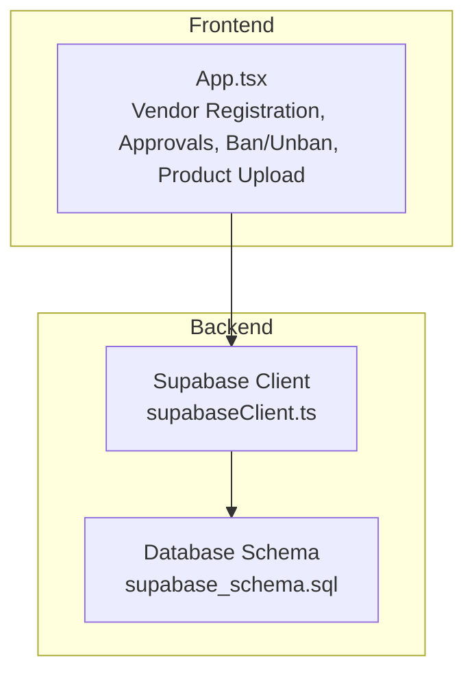
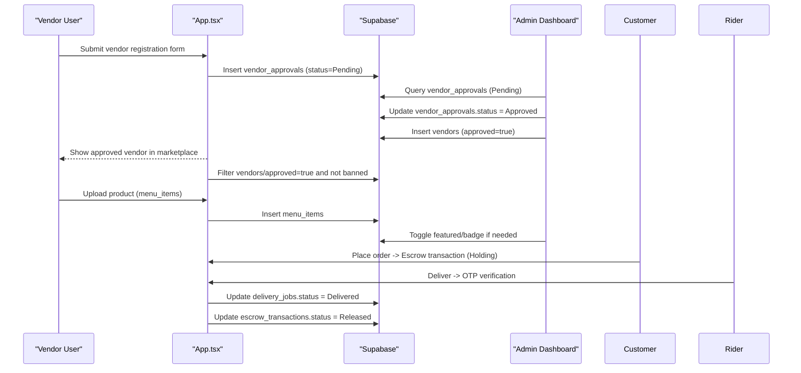
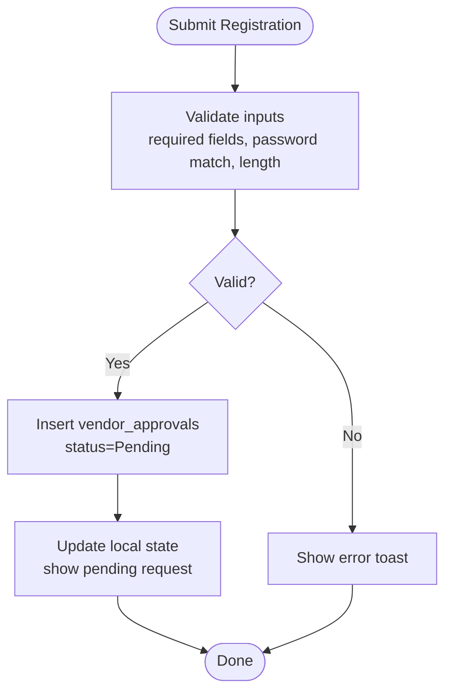
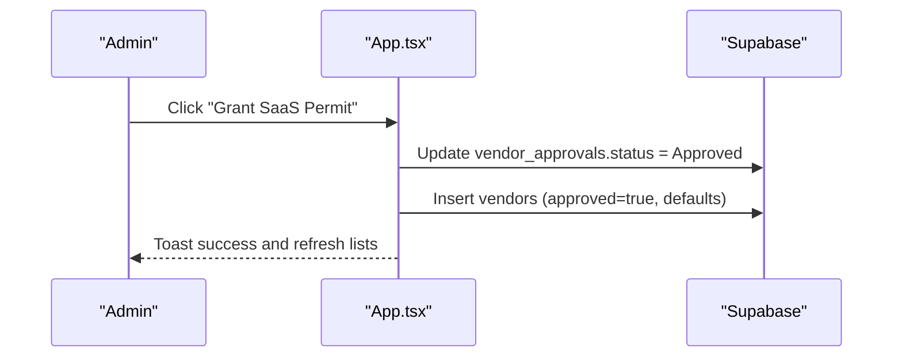
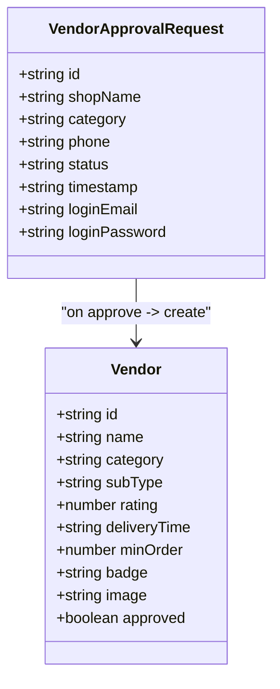
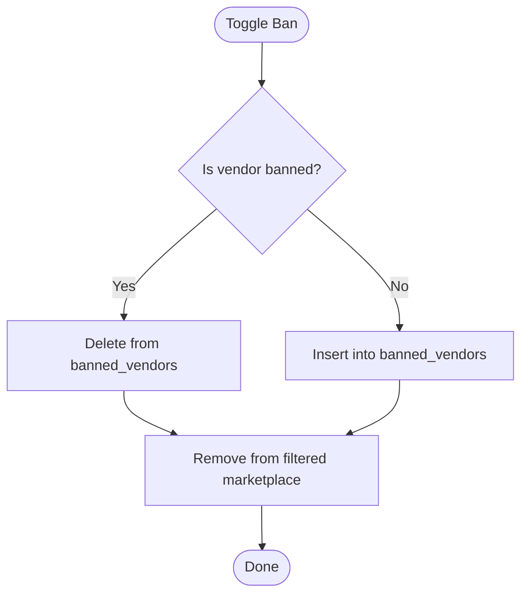
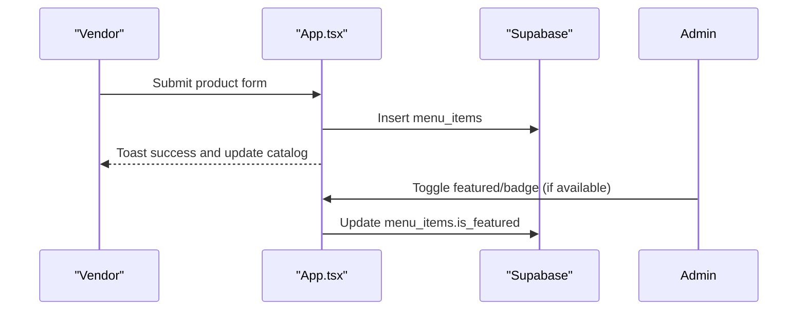
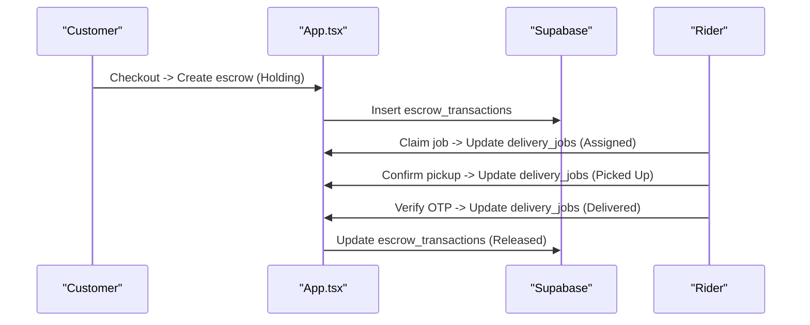
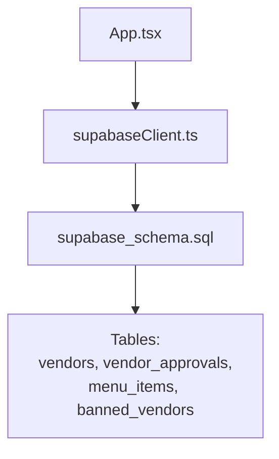

# Vendor Management

<cite>
**Referenced Files in This Document**
- [App.tsx](file://src/App.tsx)
- [supabase_schema.sql](file://supabase_schema.sql)
- [supabaseClient.ts](file://src/supabaseClient.ts)
- [SUPABASE.md](file://SUPABASE.md)
</cite>

## Table of Contents
1. [Introduction](#introduction)
2. [Project Structure](#project-structure)
3. [Core Components](#core-components)
4. [Architecture Overview](#architecture-overview)
5. [Detailed Component Analysis](#detailed-component-analysis)
6. [Dependency Analysis](#dependency-analysis)
7. [Performance Considerations](#performance-considerations)
8. [Troubleshooting Guide](#troubleshooting-guide)
9. [Conclusion](#conclusion)

## Introduction
This document explains the vendor management and approval workflows implemented in the administrative dashboard. It covers vendor registration processing, approval/rejection flows, status management, onboarding procedures, product moderation tools, compliance enforcement (ban/unban), and marketplace policy enforcement. The system uses a Supabase-backed data model with a React-based UI to manage vendors, approvals, and related marketplace content.

## Project Structure
The vendor management features are primarily implemented in the main application component and supported by the database schema and Supabase client configuration:
- Application logic and UI for vendor registration, approvals, bans, and product moderation live in the main app component.
- Database tables define the entities for vendors, approvals, menu items, and banned stores.
- Supabase client configuration provides connectivity to the backend.

**Diagram sources**
- [App.tsx](file://src/App.tsx)
- [supabaseClient.ts](file://src/supabaseClient.ts)
- [supabase_schema.sql](file://supabase_schema.sql)

**Section sources**
- [App.tsx](file://src/App.tsx)
- [supabase_schema.sql](file://supabase_schema.sql)
- [supabaseClient.ts](file://src/supabaseClient.ts)

## Core Components
- Vendor Registration Processing: Captures store details, category, contact phone, and credentials; inserts a pending request into the approvals queue.
- Approval Workflow: Admin reviews pending requests and approves them; upon approval, a vendor record is created and added to the marketplace catalog.
- Status Management: Tracks approval states (Pending, Approved, Declined) and enforces visibility based on approved flag and ban list.
- Ban/Unban Enforcement: Administrators can ban or unban vendors; banned vendors’ products are hidden from the marketplace.
- Product Moderation: Vendors upload products; admin tools allow feature toggling and category mapping.
- Escrow and Delivery Integration: Orders trigger escrow transactions; delivery jobs coordinate fulfillment and release funds upon OTP verification.

**Section sources**
- [App.tsx](file://src/App.tsx)
- [supabase_schema.sql](file://supabase_schema.sql)

## Architecture Overview
The vendor management workflow spans UI interactions, state updates, and database operations via Supabase. Key flows include:
- Vendor onboarding submission creates a pending approval request.
- Admin approval transitions the request to Approved and provisions a vendor entry.
- Marketplace filtering excludes banned vendors and shows only approved vendors.
- Product uploads add items to the marketplace catalog.
- Escrow and delivery processes ensure secure payment release after OTP verification.

**Diagram sources**
- [App.tsx](file://src/App.tsx)
- [supabase_schema.sql](file://supabase_schema.sql)

## Detailed Component Analysis

### Vendor Registration Processing
- Input fields: Store name, category, contact phone, password, confirm password.
- Validation: Required fields, password match, minimum length.
- Submission: Creates a new vendor approval request with status Pending and persists to the database.
- UI feedback: Toast notifications for success or errors.

**Diagram sources**
- [App.tsx](file://src/App.tsx)

**Section sources**
- [App.tsx](file://src/App.tsx)

### Approval/Rejection Workflow
- Admin view lists pending vendor approvals with shop name, category, phone, and status.
- Approve action updates the approval request to Approved and creates a vendor record with default attributes (rating, delivery time, badge).
- Rejection flow: Not explicitly implemented in code; the state supports Declined but no dedicated handler is present.

**Diagram sources**
- [App.tsx](file://src/App.tsx)

**Section sources**
- [App.tsx](file://src/App.tsx)

### Vendor Status Management
- States: Pending, Approved, Declined stored in vendor_approvals table.
- Visibility: Only vendors with approved=true appear in the marketplace.
- Filtering: Marketplace filters by active category and approved flag.

**Diagram sources**
- [App.tsx](file://src/App.tsx)
- [supabase_schema.sql](file://supabase_schema.sql)

**Section sources**
- [App.tsx](file://src/App.tsx)
- [supabase_schema.sql](file://supabase_schema.sql)

### Onboarding Procedures and Document Verification
- Onboarding: Vendor submits registration form; request enters approval queue.
- Document verification: Not implemented in code; admin review is manual via dashboard.
- Quality assurance checks: Not implemented in code; relies on admin discretion during approval.

[No sources needed since this section describes conceptual gaps without analyzing specific files]

### Automated Notifications
- Notification mechanism: Toast messages provide immediate feedback for actions like registration, approval, and bans.
- Persistent notifications: Not implemented; no notification table or service found.

**Section sources**
- [App.tsx](file://src/App.tsx)

### Ban/Unban Functionality
- Admin can toggle ban status per vendor name.
- Banned vendors’ products are excluded from the marketplace via filtering.
- Persistence: Banned store names stored in a dedicated table.

**Diagram sources**
- [App.tsx](file://src/App.tsx)
- [supabase_schema.sql](file://supabase_schema.sql)

**Section sources**
- [App.tsx](file://src/App.tsx)
- [supabase_schema.sql](file://supabase_schema.sql)

### Vendor Category Management and Product Moderation
- Categories: Food & Beverages, M & M Soko, M & M Services, M & M Fun Zone.
- Product upload: Vendors add items with title, price, category, store name, description.
- Feature toggles: Items can be marked as featured; admin controls visibility via UI.

**Diagram sources**
- [App.tsx](file://src/App.tsx)
- [supabase_schema.sql](file://supabase_schema.sql)

**Section sources**
- [App.tsx](file://src/App.tsx)
- [supabase_schema.sql](file://supabase_schema.sql)

### Escrow and Delivery Integration
- Escrow transactions: Created when orders are placed; status Holding until delivery confirmation.
- Delivery jobs: Track status transitions (Available, Assigned, Picked Up, Delivered).
- OTP verification: Ensures secure handover before releasing funds.

**Diagram sources**
- [App.tsx](file://src/App.tsx)
- [supabase_schema.sql](file://supabase_schema.sql)

**Section sources**
- [App.tsx](file://src/App.tsx)
- [supabase_schema.sql](file://supabase_schema.sql)

## Dependency Analysis
- Frontend dependencies: React components in App.tsx manage state and user interactions.
- Backend dependencies: Supabase client connects to the database defined in the schema.
- Data relationships: vendor_approqs link to vendors upon approval; menu_items associate with vendor names; banned_vendors filter marketplace listings.

**Diagram sources**
- [App.tsx](file://src/App.tsx)
- [supabaseClient.ts](file://src/supabaseClient.ts)
- [supabase_schema.sql](file://supabase_schema.sql)

**Section sources**
- [App.tsx](file://src/App.tsx)
- [supabaseClient.ts](file://src/supabaseClient.ts)
- [supabase_schema.sql](file://supabase_schema.sql)

## Performance Considerations
- Initial data loading: The app loads multiple tables on mount; consider pagination or lazy loading for large datasets.
- State synchronization: Local state mirrors database state; ensure efficient updates to avoid unnecessary re-renders.
- Filtering: Marketplace filtering runs on client-side arrays; optimize with memoization where applicable.

[No sources needed since this section provides general guidance]

## Troubleshooting Guide
- Authentication issues: Ensure correct Supabase URL and anon key; check RLS policies if queries return null.
- Data mismatches: Verify field names between frontend types and database columns.
- RLS policies: Temporarily allow open access for development; tighten policies before production.

**Section sources**
- [SUPABASE.md](file://SUPABASE.md)

## Conclusion
The vendor management system provides a robust foundation for onboarding, approval, and compliance enforcement. While core workflows like registration, approval, and banning are implemented, areas such as automated notifications, document verification, and quality assurance checks remain conceptual and can be extended. The integration with Supabase ensures reliable data persistence and real-time capabilities for marketplace operations.

[No sources needed since this section summarizes without analyzing specific files]