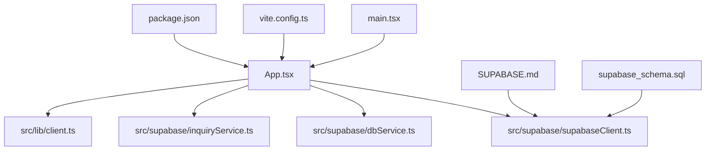
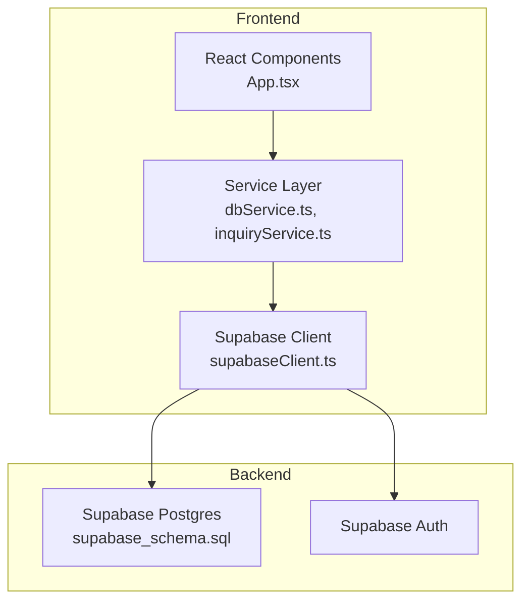
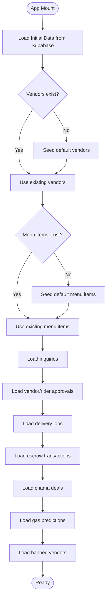
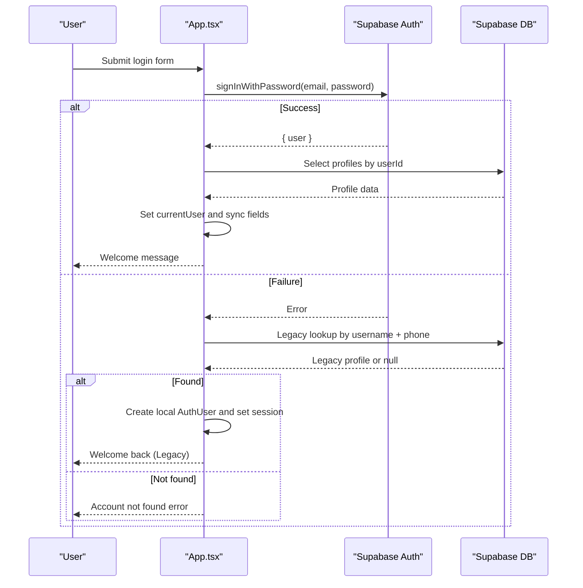
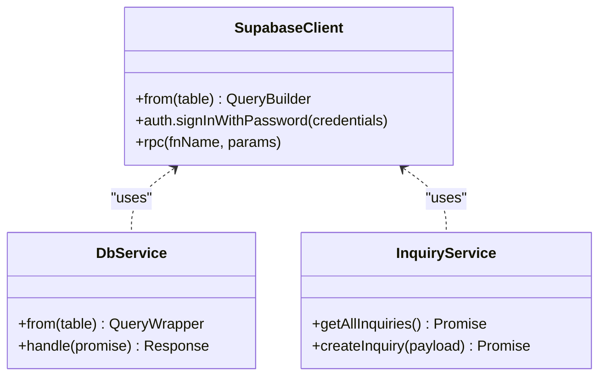
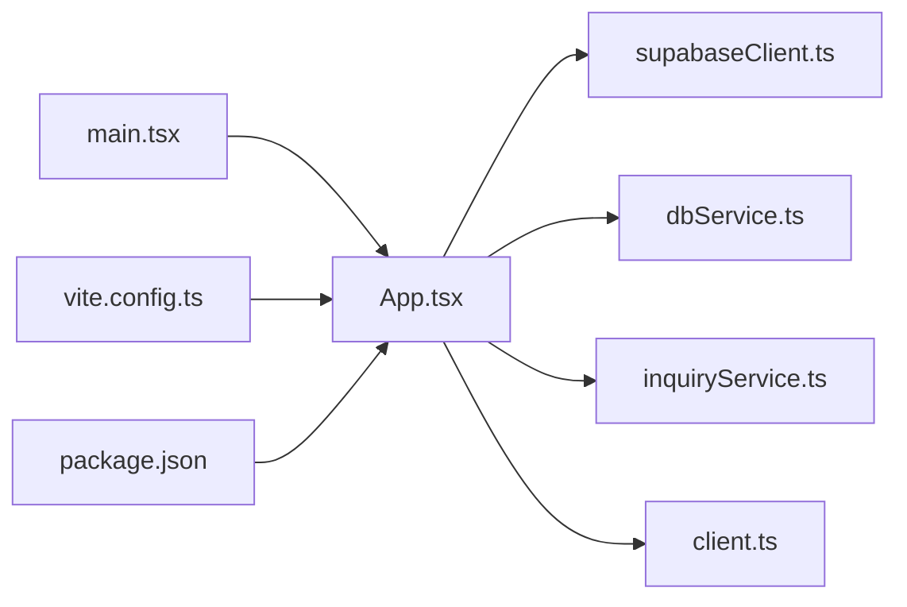

# Architecture Overview

<cite>
**Referenced Files in This Document**
- [App.tsx](file://src/App.tsx)
- [main.tsx](file://src/main.tsx)
- [supabaseClient.ts](file://src/supabase/supabaseClient.ts)
- [dbService.ts](file://src/supabase/dbService.ts)
- [inquiryService.ts](file://src/supabase/inquiryService.ts)
- [client.ts](file://src/lib/client.ts)
- [vite.config.ts](file://vite.config.ts)
- [package.json](file://package.json)
- [SUPABASE.md](file://SUPABASE.md)
- [supabase_schema.sql](file://supabase_schema.sql)
</cite>

## Table of Contents
1. [Introduction](#introduction)
2. [Project Structure](#project-structure)
3. [Core Components](#core-components)
4. [Architecture Overview](#architecture-overview)
5. [Detailed Component Analysis](#detailed-component-analysis)
6. [Dependency Analysis](#dependency-analysis)
7. [Performance Considerations](#performance-considerations)
8. [Troubleshooting Guide](#troubleshooting-guide)
9. [Conclusion](#conclusion)

## Introduction
This document describes the architecture of the Match & Market system, a React-based marketplace application with a service layer pattern and Supabase backend services. The frontend is built with React 19 and TypeScript, using Vite as the build system. The application follows a component-based architecture where App.tsx acts as the main application component managing global state and orchestrating data flows to Supabase via a shared client and service modules.

The system supports multiple roles (customer, vendor, rider, admin), marketplace browsing and cart operations, delivery job management, escrow transactions, group buying deals, and support inquiries. It integrates with Supabase for authentication, database access, and Row Level Security policies.

## Project Structure
The project is organized into clear layers:
- UI components under src/components/ui and feature-specific components
- Application entry point and global state in src/App.tsx
- Data access layer in src/supabase with a shared client and typed services
- Build configuration in vite.config.ts and package.json
- Environment and setup guidance in SUPABASE.md
- Database schema in supabase_schema.sql

**Diagram sources**
- [main.tsx:1-11](file://src/main.tsx#L1-L11)
- [App.tsx:1-100](file://src/App.tsx#L1-L100)
- [supabaseClient.ts:1-38](file://src/supabase/supabaseClient.ts#L1-L38)
- [dbService.ts:1-24](file://src/supabase/dbService.ts#L1-L24)
- [inquiryService.ts:1-19](file://src/supabase/inquiryService.ts#L1-L19)
- [client.ts:1-9](file://src/lib/client.ts#L1-L9)
- [vite.config.ts:1-8](file://vite.config.ts#L1-L8)
- [package.json:1-48](file://package.json#L1-L48)
- [SUPABASE.md:1-38](file://SUPABASE.md#L1-L38)
- [supabase_schema.sql:1-198](file://supabase_schema.sql#L1-L198)

**Section sources**
- [main.tsx:1-11](file://src/main.tsx#L1-L11)
- [package.json:1-48](file://package.json#L1-L48)
- [vite.config.ts:1-8](file://vite.config.ts#L1-L8)

## Core Components
- App.tsx: Central application component that manages global state (auth, marketplace, cart, approvals, delivery jobs, escrow, chama deals, gas predictions, banned vendors), handles user interactions, and coordinates data loading from Supabase.
- Supabase client: Shared client instance created once and exported for use across services and components.
- Service layer: dbService provides a typed wrapper around Supabase queries; inquiryService encapsulates specific domain operations.
- lib/client: Browser client creation for SSR-compatible usage patterns.

Key responsibilities:
- State management: Local React state for UI and business logic within App.tsx.
- Data fetching: Initial data load on mount and subsequent updates via Supabase client.
- Authentication flow: Supabase auth integration with fallback legacy login path.
- Business rules: Filtering, search, cart operations, role-based access checks.

**Section sources**
- [App.tsx:217-350](file://src/App.tsx#L217-L350)
- [supabaseClient.ts:1-38](file://src/supabase/supabaseClient.ts#L1-L38)
- [dbService.ts:1-24](file://src/supabase/dbService.ts#L1-L24)
- [inquiryService.ts:1-19](file://src/supabase/inquiryService.ts#L1-L19)
- [client.ts:1-9](file://src/lib/client.ts#L1-L9)

## Architecture Overview
The system uses a layered architecture:
- Presentation Layer: React components (App.tsx and UI primitives).
- Service Layer: Typed wrappers and domain services for data operations.
- Data Access Layer: Supabase client and environment configuration.
- Backend: Supabase Postgres with RLS policies defined in schema.

**Diagram sources**
- [App.tsx:1-120](file://src/App.tsx#L1-L120)
- [dbService.ts:1-24](file://src/supabase/dbService.ts#L1-L24)
- [inquiryService.ts:1-19](file://src/supabase/inquiryService.ts#L1-L19)
- [supabaseClient.ts:1-38](file://src/supabase/supabaseClient.ts#L1-L38)
- [supabase_schema.sql:1-198](file://supabase_schema.sql#L1-L198)

## Detailed Component Analysis

### App.tsx: Global State and Orchestration
App.tsx is the root component responsible for:
- Managing global state for users, marketplace items, cart, approvals, delivery jobs, escrow, chama deals, gas predictions, and banned vendors.
- Loading initial data from Supabase on mount and seeding defaults when empty.
- Handling authentication flows including Supabase sign-in and legacy profile lookup.
- Providing utility functions for cart operations, filtering, and search.
- Role-based access checks for vendor and rider hubs.

**Diagram sources**
- [App.tsx:349-602](file://src/App.tsx#L349-L602)

Authentication flow sequence:

**Diagram sources**
- [App.tsx:688-800](file://src/App.tsx#L688-L800)

**Section sources**
- [App.tsx:217-350](file://src/App.tsx#L217-L350)
- [App.tsx:349-602](file://src/App.tsx#L349-L602)
- [App.tsx:688-800](file://src/App.tsx#L688-L800)

### Supabase Client and Services
- supabaseClient.ts: Creates and exports a single Supabase client instance, validates environment variables, and warns about common misconfigurations.
- dbService.ts: Wraps Supabase client calls with a consistent Response type and helper methods for select, insert, update, delete, and rpc.
- inquiryService.ts: Encapsulates inquiry-related operations (getAllInquiries, createInquiry).

**Diagram sources**
- [supabaseClient.ts:1-38](file://src/supabase/supabaseClient.ts#L1-L38)
- [dbService.ts:1-24](file://src/supabase/dbService.ts#L1-L24)
- [inquiryService.ts:1-19](file://src/supabase/inquiryService.ts#L1-L19)

**Section sources**
- [supabaseClient.ts:1-38](file://src/supabase/supabaseClient.ts#L1-L38)
- [dbService.ts:1-24](file://src/supabase/dbService.ts#L1-L24)
- [inquiryService.ts:1-19](file://src/supabase/inquiryService.ts#L1-L19)

### UI Components
- Button and Card components provide reusable UI primitives styled with Tailwind CSS and class-variance-authority.
- Ferrofluid component demonstrates WebGL-based visual effects using OGL.

These components are presentational and do not contain business logic, adhering to separation of concerns.

**Section sources**
- [button.tsx:1-57](file://src/components/ui/button.tsx#L1-L57)
- [card.tsx:1-104](file://src/components/ui/card.tsx#L1-L104)
- [Ferrofluid.tsx:1-117](file://src/components/Ferrofluid.tsx#L1-L117)

## Dependency Analysis
The application has clear dependencies:
- main.tsx renders App.tsx as the root component.
- App.tsx depends on Supabase client and services for data operations.
- Services depend on the shared Supabase client.
- Build tooling (Vite) configures React plugin and TypeScript compilation.

**Diagram sources**
- [main.tsx:1-11](file://src/main.tsx#L1-L11)
- [App.tsx:1-120](file://src/App.tsx#L1-L120)
- [supabaseClient.ts:1-38](file://src/supabase/supabaseClient.ts#L1-L38)
- [dbService.ts:1-24](file://src/supabase/dbService.ts#L1-L24)
- [inquiryService.ts:1-19](file://src/supabase/inquiryService.ts#L1-L19)
- [client.ts:1-9](file://src/lib/client.ts#L1-L9)
- [vite.config.ts:1-8](file://vite.config.ts#L1-L8)
- [package.json:1-48](file://package.json#L1-L48)

**Section sources**
- [main.tsx:1-11](file://src/main.tsx#L1-L11)
- [package.json:1-48](file://package.json#L1-L48)
- [vite.config.ts:1-8](file://vite.config.ts#L1-L8)

## Performance Considerations
- Memoization: App.tsx uses useMemo for derived data like filtered items, featured items, and cart totals to avoid unnecessary recalculations.
- Single client instance: Supabase client is created once to reduce overhead.
- Efficient queries: Services wrap queries with consistent handling and minimal transformations.
- Rendering: React StrictMode ensures development-time checks; consider lazy loading heavy components if needed.
- Network: Batch operations where possible and leverage Supabase RPC for complex server-side logic.

[No sources needed since this section provides general guidance]

## Troubleshooting Guide
Common issues and resolutions:
- Missing Supabase credentials: Ensure VITE_SUPABASE_URL and VITE_SUPABASE_ANON_KEY are set in .env at the project root.
- Incorrect URL format: Do not append /rest/v1/ to the base URL; the client expects the project URL.
- Empty query results: Verify rows exist in Supabase Studio and check RLS policies for anon/authenticated roles.
- Debugging: Use debugSupabaseInfo to log effective host and key presence.

**Section sources**
- [SUPABASE.md:1-38](file://SUPABASE.md#L1-L38)
- [supabaseClient.ts:1-38](file://src/supabase/supabaseClient.ts#L1-L38)

## Conclusion
The Match & Market system employs a clean, component-based architecture with a dedicated service layer and a robust Supabase backend. App.tsx centralizes state and orchestration, while services encapsulate data access patterns. The technology stack leverages React 19, TypeScript, and Vite for a modern development experience. With well-defined boundaries and integration points, the system is positioned for scalability and maintainability.

[No sources needed since this section summarizes without analyzing specific files]