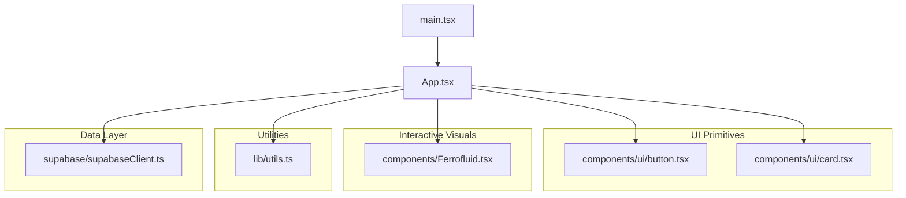
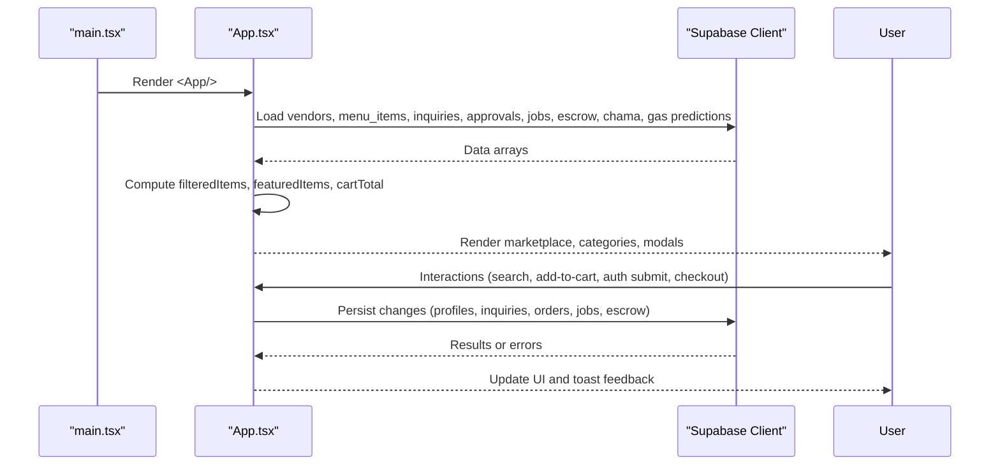
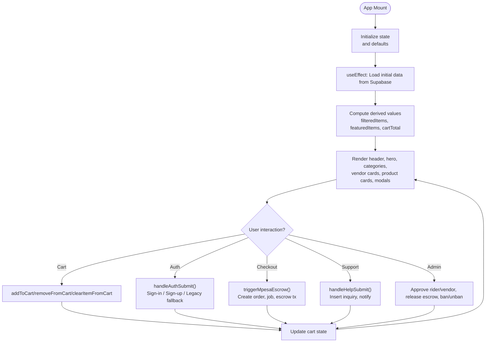
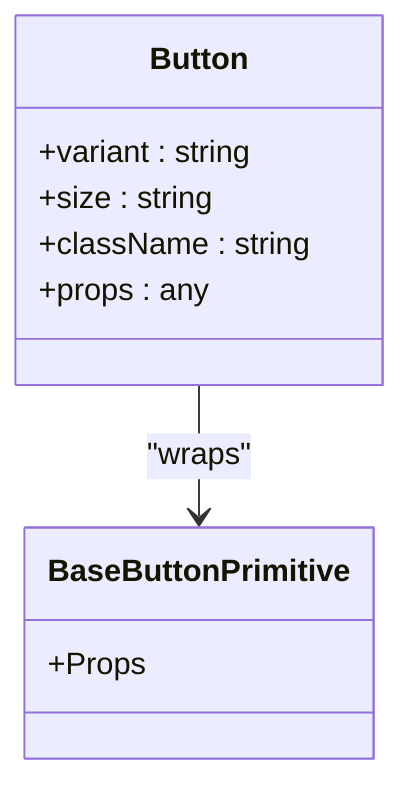
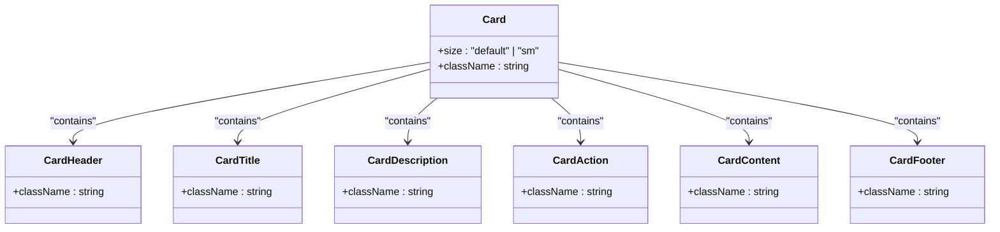
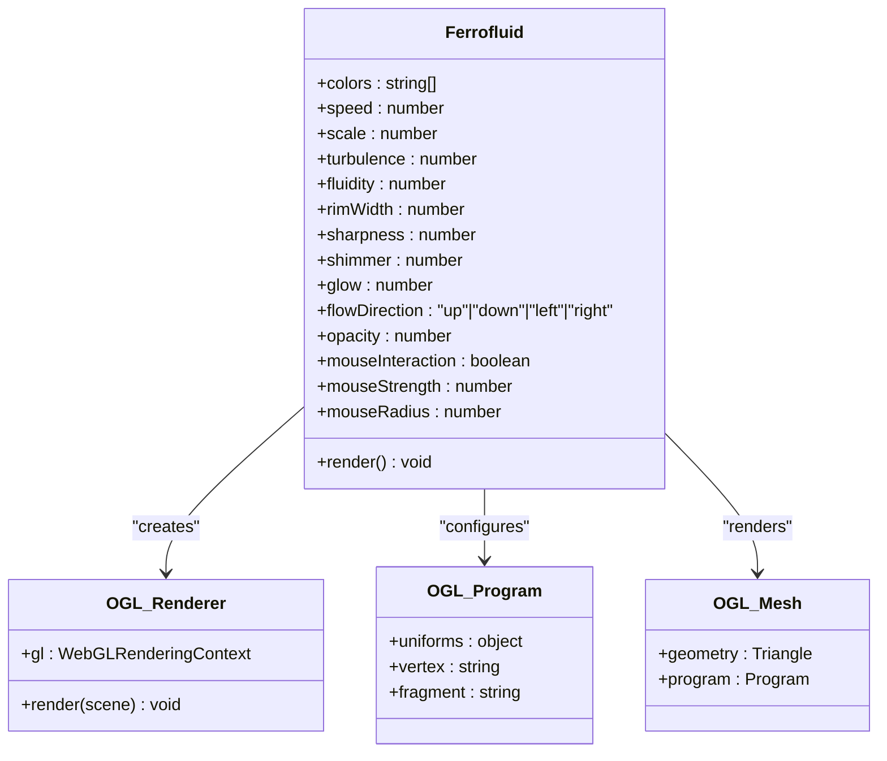
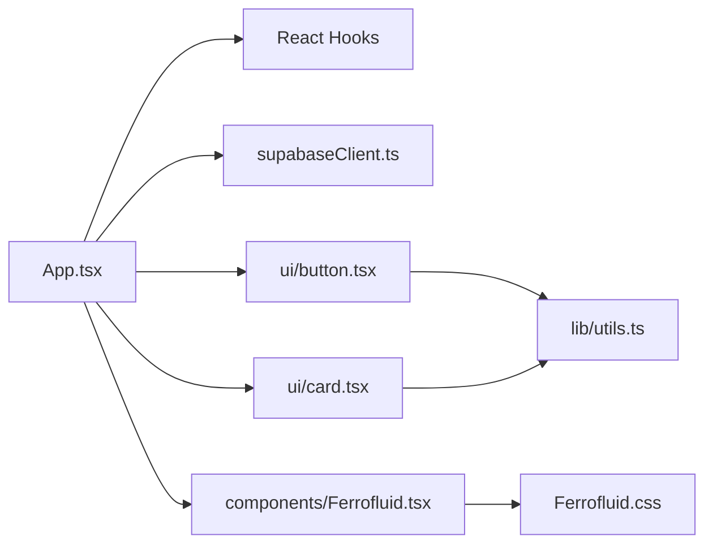

# Component Architecture

<cite>
**Referenced Files in This Document**
- [main.tsx](file://src/main.tsx)
- [App.tsx](file://src/App.tsx)
- [button.tsx](file://src/components/ui/button.tsx)
- [card.tsx](file://src/components/ui/card.tsx)
- [Ferrofluid.tsx](file://src/components/Ferrofluid.tsx)
- [utils.ts](file://src/lib/utils.ts)
- [supabaseClient.ts](file://src/supabase/supabaseClient.ts)
</cite>

## Table of Contents
1. [Introduction](#introduction)
2. [Project Structure](#project-structure)
3. [Core Components](#core-components)
4. [Architecture Overview](#architecture-overview)
5. [Detailed Component Analysis](#detailed-component-analysis)
6. [Dependency Analysis](#dependency-analysis)
7. [Performance Considerations](#performance-considerations)
8. [Troubleshooting Guide](#troubleshooting-guide)
9. [Conclusion](#conclusion)

## Introduction
This document explains the React component architecture of Match & Market with a focus on how App.tsx orchestrates global state and business logic, how UI primitives (Button, Card) are separated from complex interactive components (Ferrofluid), and how data flows through props and events. It also documents the state management approach using React hooks, composition patterns, and integration points with Supabase for persistence.

## Project Structure
The application is a single-page React app bootstrapped by main.tsx, which renders App as the root component. The App component owns most of the application state and composes UI elements, modals, dashboards, and feature panels. Reusable UI primitives live under src/components/ui, while specialized visual components like Ferrofluid reside under src/components. Utilities and client configuration are centralized in src/lib and src/supabase.

**Diagram sources**
- [main.tsx:1-11](file://src/main.tsx#L1-L11)
- [App.tsx:1-20](file://src/App.tsx#L1-L20)
- [button.tsx:1-57](file://src/components/ui/button.tsx#L1-L57)
- [card.tsx:1-104](file://src/components/ui/card.tsx#L1-L104)
- [Ferrofluid.tsx:1-117](file://src/components/Ferrofluid.tsx#L1-L117)
- [utils.ts:1-7](file://src/lib/utils.ts#L1-L7)
- [supabaseClient.ts:1-38](file://src/supabase/supabaseClient.ts#L1-L38)

**Section sources**
- [main.tsx:1-11](file://src/main.tsx#L1-L11)
- [App.tsx:1-20](file://src/App.tsx#L1-L20)

## Core Components
- App.tsx: Root application component that manages global state (auth, cart, marketplace, delivery jobs, escrow, inquiries, admin gates, toasts), performs data loading and mutations via Supabase, and composes all major UI sections and modals.
- Button (ui/button.tsx): A styled primitive built on a base button primitive with class-variance-authority variants and sizes.
- Card (ui/card.tsx): A set of semantic card parts (Card, CardHeader, CardTitle, CardDescription, CardContent, CardFooter, CardAction) for consistent layout.
- Ferrofluid (components/Ferrofluid.tsx): A WebGL-based animated canvas component using OGL shaders to render fluid-like visuals.

Key responsibilities:
- App.tsx centralizes state, event handlers, and side effects; it renders navigation, hero, category filters, vendor listings, product cards, checkout modal, help desk form, and dashboards.
- Button and Card provide reusable, accessible UI building blocks used throughout the app’s JSX.
- Ferrofluid encapsulates GPU rendering lifecycle and exposes a declarative prop interface for appearance and behavior.

**Section sources**
- [App.tsx:217-325](file://src/App.tsx#L217-L325)
- [button.tsx:1-57](file://src/components/ui/button.tsx#L1-L57)
- [card.tsx:1-104](file://src/components/ui/card.tsx#L1-L104)
- [Ferrofluid.tsx:31-46](file://src/components/Ferrofluid.tsx#L31-L46)

## Architecture Overview
At runtime, main.tsx mounts App.tsx into the DOM. App initializes state, loads initial data from Supabase, and renders layered UI sections. User interactions trigger handlers that update local state and persist changes to Supabase tables. UI primitives are composed within App to build forms, buttons, and cards.

**Diagram sources**
- [main.tsx:1-11](file://src/main.tsx#L1-L11)
- [App.tsx:349-602](file://src/App.tsx#L349-L602)
- [supabaseClient.ts:23-28](file://src/supabase/supabaseClient.ts#L23-L28)

## Detailed Component Analysis

### App.tsx: Global State and Business Logic
- State ownership: Auth user, authentication mode, profile fields, cart, search query, active category, dashboard visibility, toasts, delivery job OTP inputs, cookie consent, admin gateway, and domain-specific lists (vendors, menu items, inquiries, approvals, delivery fleet, escrow ledger, chama deals, gas predictions, banned vendors).
- Derived data: fullMarketplace (excludes banned stores), filteredItems (category + search), featuredItems (isFeatured), cartTotal.
- Side effects: Initial data load from Supabase on mount; updates to profiles, inquiries, delivery jobs, escrow transactions, and other tables based on user actions.
- Event handling: Authentication (login/signup/legacy fallback), profile updates, support inquiry submission, admin replies, escrow payment simulation, delivery job claiming and verification, vendor ban toggling, custom product upload, and cookie consent.

**Diagram sources**
- [App.tsx:349-602](file://src/App.tsx#L349-L602)
- [App.tsx:665-686](file://src/App.tsx#L665-L686)
- [App.tsx:688-957](file://src/App.tsx#L688-L957)
- [App.tsx:1038-1142](file://src/App.tsx#L1038-L1142)
- [App.tsx:1144-1200](file://src/App.tsx#L1144-L1200)
- [App.tsx:1514-1553](file://src/App.tsx#L1514-L1553)
- [App.tsx:1555-1592](file://src/App.tsx#L1555-L1592)
- [App.tsx:1594-1651](file://src/App.tsx#L1594-L1651)

**Section sources**
- [App.tsx:217-325](file://src/App.tsx#L217-L325)
- [App.tsx:349-602](file://src/App.tsx#L349-L602)
- [App.tsx:643-663](file://src/App.tsx#L643-L663)
- [App.tsx:665-686](file://src/App.tsx#L665-L686)
- [App.tsx:688-957](file://src/App.tsx#L688-L957)
- [App.tsx:1038-1142](file://src/App.tsx#L1038-L1142)
- [App.tsx:1144-1200](file://src/App.tsx#L1144-L1200)
- [App.tsx:1514-1553](file://src/App.tsx#L1514-L1553)
- [App.tsx:1555-1592](file://src/App.tsx#L1555-L1592)
- [App.tsx:1594-1651](file://src/App.tsx#L1594-L1651)

### Button (ui/button.tsx): Primitive UI Component
- Purpose: Provides a consistent, accessible button with variant and size options.
- Implementation: Wraps a base button primitive and applies class-variance-authority styles merged via cn utility.
- Composition pattern: Accepts className and spreads props to the underlying primitive, enabling flexible usage across the app.

**Diagram sources**
- [button.tsx:43-56](file://src/components/ui/button.tsx#L43-L56)

**Section sources**
- [button.tsx:1-57](file://src/components/ui/button.tsx#L1-L57)
- [utils.ts:1-7](file://src/lib/utils.ts#L1-L7)

### Card (ui/card.tsx): Semantic Layout Primitives
- Purpose: Offers a cohesive set of card-related components for structured content presentation.
- Implementation: Each part (Card, CardHeader, CardTitle, CardDescription, CardContent, CardFooter, CardAction) is a small presentational component with Tailwind classes and data-slot attributes for styling and testing.
- Composition pattern: Encourages hierarchical composition inside containers to maintain consistent spacing and typography.

**Diagram sources**
- [card.tsx:5-21](file://src/components/ui/card.tsx#L5-L21)
- [card.tsx:23-93](file://src/components/ui/card.tsx#L23-L93)

**Section sources**
- [card.tsx:1-104](file://src/components/ui/card.tsx#L1-L104)

### Ferrofluid (components/Ferrofluid.tsx): Complex Interactive Visual Component
- Purpose: Renders an animated, shader-driven fluid effect on a canvas element.
- Props interface: colors, speed, scale, turbulence, fluidity, rimWidth, sharpness, shimmer, glow, flowDirection, opacity, mouseInteraction, mouseStrength, mouseRadius.
- Implementation: Uses OGL Renderer, Program, Mesh, and Triangle to create a WebGL context; sets up vertex and fragment shaders; animates time-based uniforms; cleans up animation frame on unmount.
- Integration: Styled via Ferrofluid.css; can be embedded anywhere in the UI to add dynamic visuals.

**Diagram sources**
- [Ferrofluid.tsx:31-46](file://src/components/Ferrofluid.tsx#L31-L46)
- [Ferrofluid.tsx:56-111](file://src/components/Ferrofluid.tsx#L56-L111)

**Section sources**
- [Ferrofluid.tsx:1-117](file://src/components/Ferrofluid.tsx#L1-L117)

### Utility and Data Layer
- utils.ts: Provides a cn helper to merge class names using clsx and tailwind-merge.
- supabaseClient.ts: Creates a typed Supabase client from environment variables, validates configuration, and exports debug helpers.

**Section sources**
- [utils.ts:1-7](file://src/lib/utils.ts#L1-L7)
- [supabaseClient.ts:1-38](file://src/supabase/supabaseClient.ts#L1-L38)

## Dependency Analysis
App.tsx depends on:
- React hooks for state and lifecycle.
- Supabase client for data operations.
- UI primitives (Button, Card) for consistent styling and accessibility.
- Ferrofluid for visual enhancements.

**Diagram sources**
- [App.tsx:1-20](file://src/App.tsx#L1-L20)
- [button.tsx:1-57](file://src/components/ui/button.tsx#L1-L57)
- [card.tsx:1-104](file://src/components/ui/card.tsx#L1-L104)
- [Ferrofluid.tsx:1-117](file://src/components/Ferrofluid.tsx#L1-L117)
- [utils.ts:1-7](file://src/lib/utils.ts#L1-L7)
- [supabaseClient.ts:1-38](file://src/supabase/supabaseClient.ts#L1-L38)

**Section sources**
- [App.tsx:1-20](file://src/App.tsx#L1-L20)
- [supabaseClient.ts:1-38](file://src/supabase/supabaseClient.ts#L1-L38)

## Performance Considerations
- Memoization: App computes filteredItems, featuredItems, and cartTotal with useMemo to avoid unnecessary recalculations during re-renders.
- Canvas cleanup: Ferrofluid cancels requestAnimationFrame on unmount to prevent memory leaks.
- Conditional rendering: Modals and overlays are conditionally rendered based on state flags to reduce DOM overhead.
- Efficient list rendering: Keys are provided for lists to optimize reconciliation.

[No sources needed since this section provides general guidance]

## Troubleshooting Guide
- Supabase credentials: Ensure VITE_SUPABASE_URL and VITE_SUPABASE_ANON_KEY are set; the client logs warnings if misconfigured.
- Auth failures: handleAuthSubmit includes error handling and fallback flows; check network requests and database policies.
- Data mismatches: Verify table schemas and RLS policies when inserts or updates fail.
- Toast messages: Use triggerToast to surface user-facing errors and confirm successful operations.

**Section sources**
- [supabaseClient.ts:6-19](file://src/supabase/supabaseClient.ts#L6-L19)
- [App.tsx:688-957](file://src/App.tsx#L688-L957)
- [App.tsx:1038-1142](file://src/App.tsx#L1038-L1142)
- [App.tsx:1144-1200](file://src/App.tsx#L1144-L1200)

## Conclusion
Match & Market’s component architecture centers around App.tsx as the stateful orchestrator, leveraging React hooks for local state and side effects, and composing UI primitives (Button, Card) for consistent presentation. The Ferrofluid component demonstrates a separation between simple UI elements and complex interactive visuals. Data flows through Supabase for persistence, with clear event-driven updates and robust error handling. This structure supports scalability, readability, and maintainability across features like authentication, marketplace browsing, checkout, and admin operations.