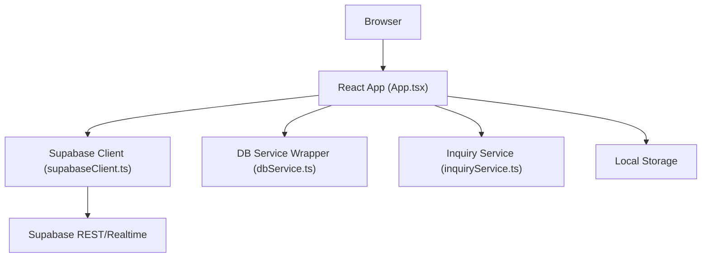
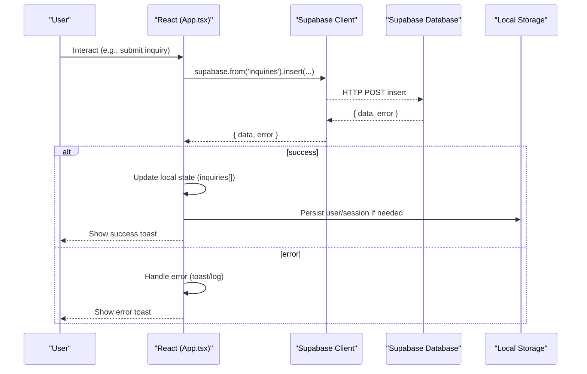
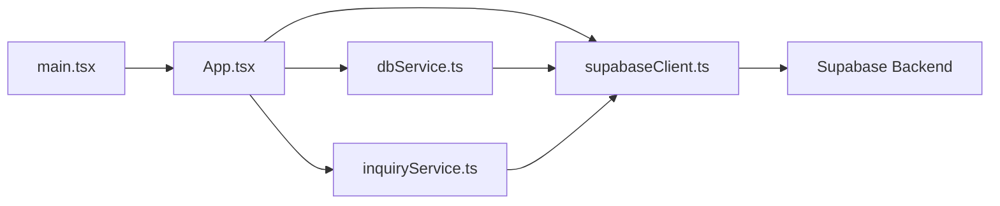

# Data Flow Patterns

<cite>
**Referenced Files in This Document**
- [App.tsx](file://src/App.tsx)
- [dbService.ts](file://src/supabase/dbService.ts)
- [supabaseClient.ts](file://src/supabase/supabaseClient.ts)
- [inquiryService.ts](file://src/supabase/inquiryService.ts)
- [main.tsx](file://src/main.tsx)
- [SUPABASE.md](file://SUPABASE.md)
</cite>

## Table of Contents
1. [Introduction](#introduction)
2. [Project Structure](#project-structure)
3. [Core Components](#core-components)
4. [Architecture Overview](#architecture-overview)
5. [Detailed Component Analysis](#detailed-component-analysis)
6. [Dependency Analysis](#dependency-analysis)
7. [Performance Considerations](#performance-considerations)
8. [Troubleshooting Guide](#troubleshooting-guide)
9. [Conclusion](#conclusion)

## Introduction
This document explains the data flow patterns in the Match & Market application, focusing on how user interactions drive React state changes, which then trigger Supabase API calls. It details the service layer pattern used for database operations, error handling strategies, and client-server synchronization. It also covers real-time update considerations, local storage persistence, validation and transformation patterns, and performance guidance for large datasets.

## Project Structure
The application is a single-page React app bootstrapped by Vite. The primary UI and business logic live in App.tsx, while Supabase integration is centralized through a client module and optional service wrappers. Local storage is used to persist user sessions and preferences.

**Diagram sources**
- [App.tsx:1-100](file://src/App.tsx#L1-L100)
- [supabaseClient.ts:1-37](file://src/supabase/supabaseClient.ts#L1-L37)
- [dbService.ts:1-23](file://src/supabase/dbService.ts#L1-L23)
- [inquiryService.ts:1-19](file://src/supabase/inquiryService.ts#L1-L19)

**Section sources**
- [main.tsx:1-11](file://src/main.tsx#L1-L11)
- [App.tsx:1-120](file://src/App.tsx#L1-L120)

## Core Components
- React Application Root: Renders App.tsx within StrictMode.
- Supabase Client: Creates a typed client from environment variables with validation helpers.
- DB Service Wrapper: Provides a consistent Response<T> shape and fluent table methods.
- Inquiry Service: Encapsulates common inquiry queries with explicit error throwing.
- App State: Centralized state for users, marketplace items, inquiries, approvals, delivery jobs, escrow ledger, and more.

Key responsibilities:
- User authentication and profile management via Supabase Auth and profiles table.
- Catalog and vendor data loading and seeding.
- Support inquiries submission and admin replies.
- Escrow payment simulation and delivery job lifecycle.
- Admin workflows for approvals and bans.

**Section sources**
- [main.tsx:1-11](file://src/main.tsx#L1-L11)
- [supabaseClient.ts:1-37](file://src/supabase/supabaseClient.ts#L1-L37)
- [dbService.ts:1-23](file://src/supabase/dbService.ts#L1-L23)
- [inquiryService.ts:1-19](file://src/supabase/inquiryService.ts#L1-L19)
- [App.tsx:217-325](file://src/App.tsx#L217-L325)

## Architecture Overview
Data flows from user actions in React components into Supabase via the client or service wrappers. Responses are transformed and stored in component state, which drives UI updates. Local storage persists session and consent states.

**Diagram sources**
- [App.tsx:1038-1094](file://src/App.tsx#L1038-L1094)
- [supabaseClient.ts:23-26](file://src/supabase/supabaseClient.ts#L23-L26)

## Detailed Component Analysis

### Supabase Client Layer
- Environment-driven configuration with validation warnings for incorrect URLs.
- Single shared client instance exported for reuse across modules.
- Debug helper available for inspecting host and key presence.

Best practices observed:
- Centralize credentials and avoid hardcoding keys in source files.
- Validate environment at startup to catch misconfiguration early.

**Section sources**
- [supabaseClient.ts:1-37](file://src/supabase/supabaseClient.ts#L1-L37)
- [SUPABASE.md:1-32](file://SUPABASE.md#L1-L32)

### DB Service Wrapper Pattern
- Wraps Supabase calls with a uniform Response<T> type: { data | null; error | null }.
- Fluent API: db.from(table).select|insert|update(...).eq|delete().rpc.
- Error normalization ensures consistent error handling downstream.

Usage implications:
- Callers can handle errors uniformly without try/catch per call.
- Type inference improves safety when specifying T for responses.

**Section sources**
- [dbService.ts:1-23](file://src/supabase/dbService.ts#L1-L23)

### Inquiry Service Pattern
- Directly uses Supabase client for CRUD on inquiries.
- Throws errors on failure, suitable for callers that prefer exceptions over Result types.

When to use:
- Simple services where exception-based error handling fits existing patterns.
- For consistency with other parts of the app, consider adopting the Response<T> wrapper.

**Section sources**
- [inquiryService.ts:1-19](file://src/supabase/inquiryService.ts#L1-L19)

### App State and Data Loading
- On mount, loads multiple tables (vendors, menu_items, inquiries, approvals, delivery_jobs, escrow_transactions, chama_deals, gas_predictions, banned_vendors).
- Maps database columns to TypeScript interfaces and seeds default data when empty.
- Maintains rich local state for cart, search, filters, dashboards, notifications, and modals.

Data transformations:
- Column name mapping (snake_case to camelCase).
- Numeric conversions (e.g., price, rating, min_order).
- Timestamp formatting for display.

State synchronization:
- After successful mutations, optimistic updates refresh local arrays/lists.
- Toast messages provide immediate feedback.

**Section sources**
- [App.tsx:348-602](file://src/App.tsx#L348-L602)
- [App.tsx:643-663](file://src/App.tsx#L643-L663)

### Authentication and Profile Management
- Login supports standard email/password via Supabase Auth with fallback legacy lookup.
- Signup creates Auth user and inserts a profile record, deriving role from approvals or context.
- Profile updates write to both Auth metadata and profiles table using upsert.
- Session persisted in localStorage under a dedicated key.

Validation and error handling:
- Frontend validation for required fields and password strength.
- Clear error toasts on failures; safe sign-out clears all related state and storage.

**Section sources**
- [App.tsx:688-956](file://src/App.tsx#L688-L956)
- [App.tsx:959-1036](file://src/App.tsx#L959-L1036)
- [App.tsx:292-313](file://src/App.tsx#L292-L313)

### Support Inquiries Flow
- Form collects name, phone, topic, message.
- Inserts into inquiries table; on success, prepends new item to local list and pushes a notification.
- Admin reply updates status and admin_response; triggers notifications for the user.

Error handling:
- Errors surfaced via toasts; logs warn about potential RLS issues when no data returned.

**Section sources**
- [App.tsx:1038-1094](file://src/App.tsx#L1038-L1094)
- [App.tsx:1096-1142](file://src/App.tsx#L1096-L1142)

### Escrow and Delivery Job Lifecycle
- Checkout validates inputs and simulates M-Pesa STK prompt.
- Inserts escrow transaction and delivery job; updates local ledgers and fleet lists.
- Rider workflow transitions: Available → Assigned → Picked Up → Delivered.
- OTP verification releases escrow funds upon successful handshake.

State synchronization:
- Optimistic updates keep UI responsive; errors revert or show toasts.

**Section sources**
- [App.tsx:1144-1231](file://src/App.tsx#L1144-L1231)
- [App.tsx:1594-1651](file://src/App.tsx#L1594-L1651)

### Vendor and Rider Approvals
- Vendor registration inserts a request; admin approval creates a vendor record and updates local lists.
- Rider registration inserts a request; admin approval updates local lists.
- Bans/unbans toggle visibility of vendor items in the marketplace.

**Section sources**
- [App.tsx:1233-1280](file://src/App.tsx#L1233-L1280)
- [App.tsx:1282-1330](file://src/App.tsx#L1282-L1330)
- [App.tsx:1452-1497](file://src/App.tsx#L1452-L1497)
- [App.tsx:1535-1553](file://src/App.tsx#L1535-L1553)

### Gas Predictions and Chama Deals
- Gas predictions compute days remaining based on household size and cylinder size; deletes previous prediction for the user before inserting new one.
- Chama deals allow joining pools by updating backers and filled portions; triggers milestone toasts.

**Section sources**
- [App.tsx:1332-1373](file://src/App.tsx#L1332-L1373)
- [App.tsx:1375-1410](file://src/App.tsx#L1375-L1410)

### Local Storage Persistence
- User session stored under a dedicated key and restored on app start.
- Cookie consent preference persisted and displayed until accepted/rejected.
- Sign-out clears session and resets relevant UI state.

**Section sources**
- [App.tsx:227-230](file://src/App.tsx#L227-L230)
- [App.tsx:254-256](file://src/App.tsx#L254-L256)
- [App.tsx:292-313](file://src/App.tsx#L292-L313)
- [App.tsx:1653-1657](file://src/App.tsx#L1653-L1657)

## Dependency Analysis
The application’s runtime dependencies center around React, Supabase JS SDK, and environment configuration.

**Diagram sources**
- [App.tsx:1-10](file://src/App.tsx#L1-L10)
- [supabaseClient.ts:1-26](file://src/supabase/supabaseClient.ts#L1-L26)
- [dbService.ts:1-21](file://src/supabase/dbService.ts#L1-L21)
- [inquiryService.ts:1-10](file://src/supabase/inquiryService.ts#L1-L10)
- [main.tsx:1-11](file://src/main.tsx#L1-L11)

**Section sources**
- [App.tsx:1-10](file://src/App.tsx#L1-L10)
- [supabaseClient.ts:1-26](file://src/supabase/supabaseClient.ts#L1-L26)
- [dbService.ts:1-21](file://src/supabase/dbService.ts#L1-L21)
- [inquiryService.ts:1-10](file://src/supabase/inquiryService.ts#L1-L10)
- [main.tsx:1-11](file://src/main.tsx#L1-L11)

## Performance Considerations
- Prefer selective column selection to reduce payload sizes.
- Use pagination for large tables (e.g., inquiries, delivery_jobs) to avoid heavy initial loads.
- Cache derived data with useMemo where appropriate (already used for filtered items and totals).
- Batch writes when possible to minimize network round-trips.
- Avoid unnecessary re-renders by splitting state into focused hooks or moving heavy computations out of render paths.
- Consider server-side functions for complex transformations or sensitive operations.

[No sources needed since this section provides general guidance]

## Troubleshooting Guide
Common issues and resolutions:
- Empty results after insert: Check Row Level Security policies and ensure correct project URL and anon key.
- Incorrect base URL: Ensure VITE_SUPABASE_URL does not include /rest/v1/.
- Missing environment variables: Verify .env contains VITE_SUPABASE_URL and VITE_SUPABASE_ANON_KEY.
- Realtime expectations: If expecting live updates, implement Supabase subscriptions; current code relies on polling and optimistic updates.

Operational tips:
- Use debug helper to log host and key presence.
- Inspect browser console for error toasts and logs.
- Confirm rows exist in Supabase Studio when SELECT returns nothing.

**Section sources**
- [SUPABASE.md:1-32](file://SUPABASE.md#L1-L32)
- [supabaseClient.ts:30-37](file://src/supabase/supabaseClient.ts#L30-L37)

## Conclusion
Match & Market follows a clear separation between UI state and data access. The Supabase client centralizes connectivity, while service wrappers standardize error handling and typing. The app demonstrates robust patterns for authentication, data seeding, optimistic updates, and local persistence. To enhance real-time behavior and scalability, adopt Supabase subscriptions and introduce pagination and caching strategies for larger datasets.