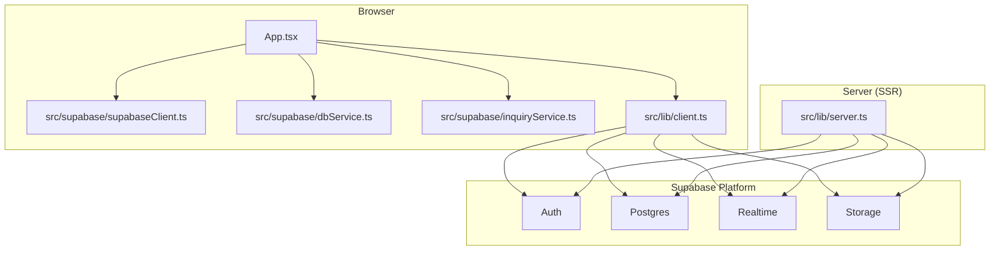
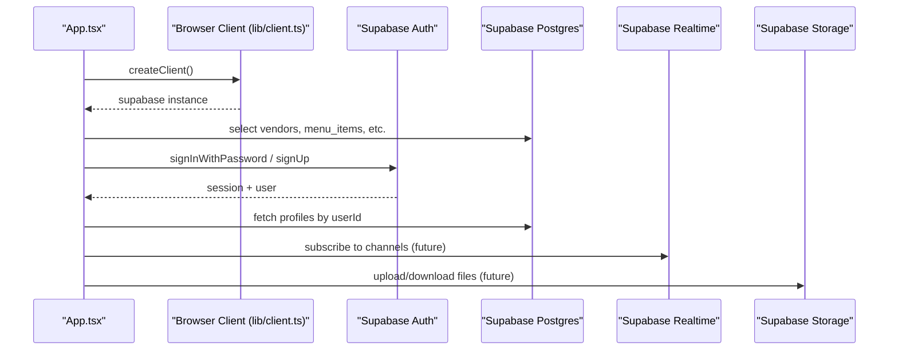
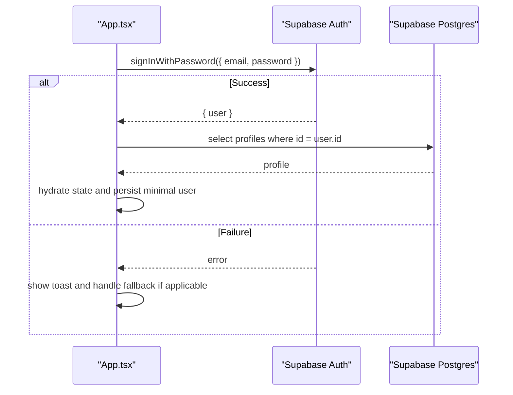
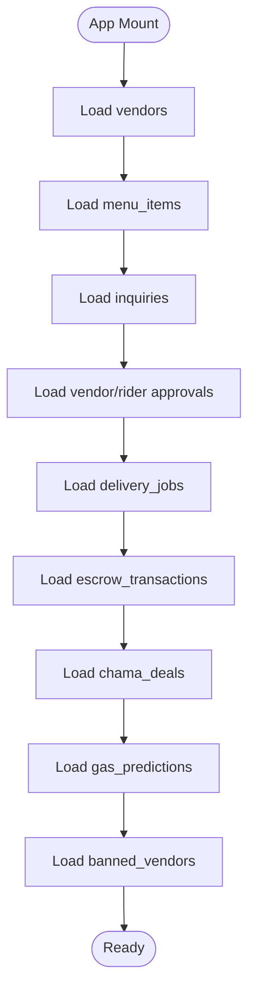
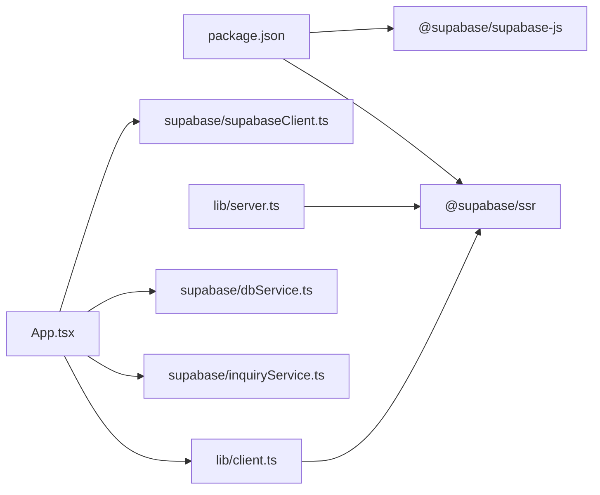

# Integration Patterns

<cite>
**Referenced Files in This Document**
- [src/supabase/supabaseClient.ts](file://src/supabase/supabaseClient.ts)
- [src/supabase/dbService.ts](file://src/supabase/dbService.ts)
- [src/supabase/inquiryService.ts](file://src/supabase/inquiryService.ts)
- [src/lib/client.ts](file://src/lib/client.ts)
- [src/lib/server.ts](file://src/lib/server.ts)
- [src/App.tsx](file://src/App.tsx)
- [supabase_schema.sql](file://supabase_schema.sql)
- [SUPABASE.md](file://SUPABASE.md)
- [package.json](file://package.json)
</cite>

## Table of Contents
1. [Introduction](#introduction)
2. [Project Structure](#project-structure)
3. [Core Components](#core-components)
4. [Architecture Overview](#architecture-overview)
5. [Detailed Component Analysis](#detailed-component-analysis)
6. [Dependency Analysis](#dependency-analysis)
7. [Performance Considerations](#performance-considerations)
8. [Troubleshooting Guide](#troubleshooting-guide)
9. [Conclusion](#conclusion)
10. [Appendices](#appendices)

## Introduction
This document explains how Match & Market integrates with external services, focusing on Supabase client configuration, authentication flows, and database access patterns. It also outlines strategies for error handling, retry mechanisms, and offline considerations, along with service abstraction patterns to keep integrations consistent and extensible.

## Project Structure
The integration spans a few key areas:
- Client initialization for browser and server environments
- A shared Supabase client with environment validation
- Database access abstractions and domain-specific services
- Application-level usage for data loading and authentication

**Diagram sources**
- [src/App.tsx](file://src/App.tsx)
- [src/supabase/supabaseClient.ts](file://src/supabase/supabaseClient.ts)
- [src/supabase/dbService.ts](file://src/supabase/dbService.ts)
- [src/supabase/inquiryService.ts](file://src/supabase/inquiryService.ts)
- [src/lib/client.ts](file://src/lib/client.ts)
- [src/lib/server.ts](file://src/lib/server.ts)

**Section sources**
- [src/supabase/supabaseClient.ts](file://src/supabase/supabaseClient.ts)
- [src/supabase/dbService.ts](file://src/supabase/dbService.ts)
- [src/supabase/inquiryService.ts](file://src/supabase/inquiryService.ts)
- [src/lib/client.ts](file://src/lib/client.ts)
- [src/lib/server.ts](file://src/lib/server.ts)
- [src/App.tsx](file://src/App.tsx)

## Core Components
- Shared Supabase client with environment validation and debug helpers
- Browser and SSR client factories using @supabase/ssr
- Database wrapper that normalizes responses and centralizes error handling
- Domain service for inquiries demonstrating typed async methods
- Application code that loads initial data and performs auth operations

Key responsibilities:
- Centralize credentials and client creation
- Provide consistent response shapes for DB calls
- Encapsulate common queries and RPC calls
- Keep UI logic decoupled from low-level network details

**Section sources**
- [src/supabase/supabaseClient.ts](file://src/supabase/supabaseClient.ts)
- [src/lib/client.ts](file://src/lib/client.ts)
- [src/lib/server.ts](file://src/lib/server.ts)
- [src/supabase/dbService.ts](file://src/supabase/dbService.ts)
- [src/supabase/inquiryService.ts](file://src/supabase/inquiryService.ts)
- [src/App.tsx](file://src/App.tsx)

## Architecture Overview
The application uses two Supabase clients:
- Browser client via @supabase/ssr for client-side requests
- Server client via @supabase/ssr for server-side rendering or API routes

Data flows:
- App initializes the client(s), then loads data from tables
- Auth flows use Supabase Auth endpoints
- Realtime subscriptions can be established through the same client instance
- Storage operations are available via the client’s storage API

**Diagram sources**
- [src/lib/client.ts](file://src/lib/client.ts)
- [src/lib/server.ts](file://src/lib/server.ts)
- [src/App.tsx](file://src/App.tsx)

## Detailed Component Analysis

### Supabase Client Configuration
- Environment-driven initialization with validation and warnings for misconfigured URLs
- Exports a single shared client instance for reuse across modules
- Provides a debug helper to log non-sensitive host information

Best practices:
- Use VITE_SUPABASE_URL and VITE_SUPABASE_ANON_KEY at runtime
- Avoid appending REST paths to the base URL
- Validate environment early to fail fast during development

**Section sources**
- [src/supabase/supabaseClient.ts](file://src/supabase/supabaseClient.ts)
- [SUPABASE.md](file://SUPABASE.md)

### Browser and Server Clients (@supabase/ssr)
- Browser client factory reads Vite env variables and returns a configured client
- Server client factory parses cookies from incoming requests and sets cookies on responses
- Ensures consistent cookie handling for authenticated sessions across SSR boundaries

Usage pattern:
- Call createClient() in the appropriate context (browser vs server)
- Pass the resulting supabase instance to components or handlers

**Section sources**
- [src/lib/client.ts](file://src/lib/client.ts)
- [src/lib/server.ts](file://src/lib/server.ts)

### Database Access Abstraction
- Wraps Supabase queries into a uniform Response<T> shape with data and error fields
- Provides a fluent interface: db.from(table).select/insert/update/delete/rpc
- Normalizes errors and ensures consistent typing across calls

Benefits:
- Simplifies error handling in callers
- Reduces boilerplate around destructuring { data, error }
- Encourages consistent query patterns

**Section sources**
- [src/supabase/dbService.ts](file://src/supabase/dbService.ts)

### Inquiry Service Example
- Demonstrates typed async methods for fetching and creating records
- Throws errors directly to propagate failures up to callers
- Serves as a template for other domain services

Patterns to follow:
- One method per operation
- Strongly typed inputs and outputs
- Clear separation between data access and UI logic

**Section sources**
- [src/supabase/inquiryService.ts](file://src/supabase/inquiryService.ts)

### Authentication Integration
- Uses Supabase Auth for sign-in and sign-up flows
- On login success, fetches profile by userId and hydrates local state
- Supports legacy phone-based fallback for backward compatibility

Flow highlights:
- Validate form inputs before calling auth APIs
- Handle both success and error branches consistently
- Persist minimal user info locally for quick rehydration

**Diagram sources**
- [src/App.tsx](file://src/App.tsx)

**Section sources**
- [src/App.tsx](file://src/App.tsx)

### Data Loading and Schema Alignment
- Initial data load fetches multiple tables and maps rows to internal types
- Inserts baseline data when tables are empty to bootstrap the app
- Aligns column names with schema definitions

Schema overview:
- Profiles, vendors, menu items, inquiries, delivery jobs, escrow transactions, chama deals, gas predictions, banned vendors
- Row Level Security policies enabled with open access for development

**Diagram sources**
- [src/App.tsx](file://src/App.tsx)
- [supabase_schema.sql](file://supabase_schema.sql)

**Section sources**
- [src/App.tsx](file://src/App.tsx)
- [supabase_schema.sql](file://supabase_schema.sql)

## Dependency Analysis
External dependencies relevant to integrations:
- @supabase/supabase-js: core client for Auth, Database, Realtime, Storage
- @supabase/ssr: browser and server client factories with cookie handling

**Diagram sources**
- [package.json](file://package.json)
- [src/App.tsx](file://src/App.tsx)
- [src/lib/client.ts](file://src/lib/client.ts)
- [src/lib/server.ts](file://src/lib/server.ts)
- [src/supabase/supabaseClient.ts](file://src/supabase/supabaseClient.ts)
- [src/supabase/dbService.ts](file://src/supabase/dbService.ts)
- [src/supabase/inquiryService.ts](file://src/supabase/inquiryService.ts)

**Section sources**
- [package.json](file://package.json)

## Performance Considerations
- Connection pooling: Use Supabase’s managed connection pooler; avoid opening new connections per request
- Query efficiency: Select only needed columns, leverage indexes, and batch inserts where possible
- RLS policies: Ensure policies are tight but not overly restrictive during development
- SSR cookie handling: Reuse the same client instance per request to minimize overhead

[No sources needed since this section provides general guidance]

## Troubleshooting Guide
Common issues and resolutions:
- Empty results with no errors: Verify table existence, RLS policies, and matching field names
- Incorrect base URL: Ensure VITE_SUPABASE_URL does not include /rest/v1
- Missing environment variables: Confirm .env values are present and loaded by Vite
- SSR cookie mismatches: Validate getAll/setAll implementations in server client

Operational tips:
- Use the provided debug helper to print non-sensitive host info
- Temporarily relax RLS for development, then tighten before production
- Inspect Supabase Studio to confirm row presence after inserts

**Section sources**
- [SUPABASE.md](file://SUPABASE.md)
- [src/supabase/supabaseClient.ts](file://src/supabase/supabaseClient.ts)

## Conclusion
Match & Market’s integration with Supabase is centered around a shared client, environment validation, and consistent abstractions for database access. Authentication is handled via Supabase Auth with clear error handling and fallbacks. The architecture supports future extensions such as real-time subscriptions and file storage while maintaining clean separation between UI and data layers.

[No sources needed since this section summarizes without analyzing specific files]

## Appendices

### Adding a New Integration Pattern
To maintain consistency:
- Create a dedicated service module under src/supabase/
- Use the db wrapper for normalized responses or call supabase directly for advanced features
- Define typed interfaces for inputs and outputs
- Centralize error handling and logging within the service
- Update App or feature modules to import the new service

Example structure:
- service file: src/supabase/<featureService>.ts
- usage: import { featureService } from './supabase/<featureService>'

[No sources needed since this section provides general guidance]