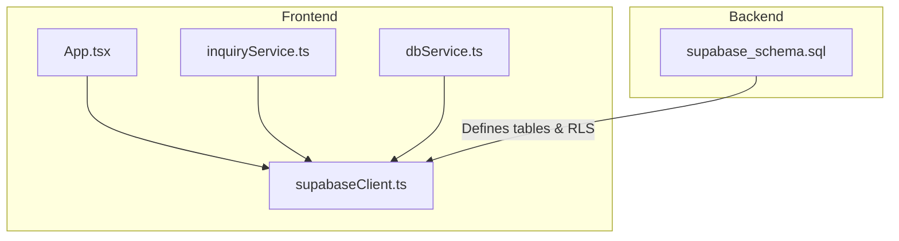
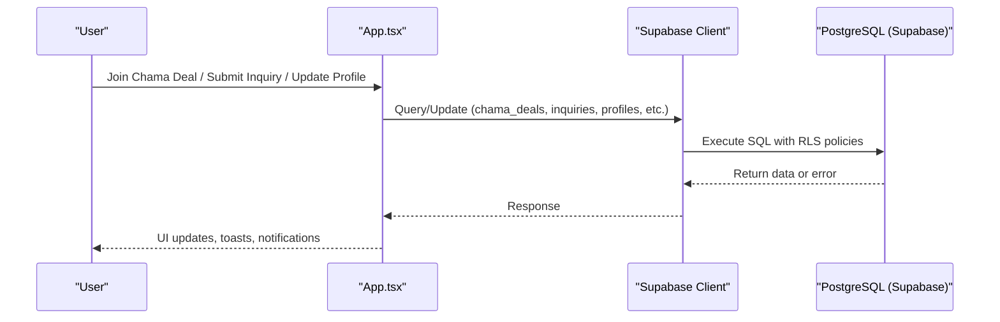
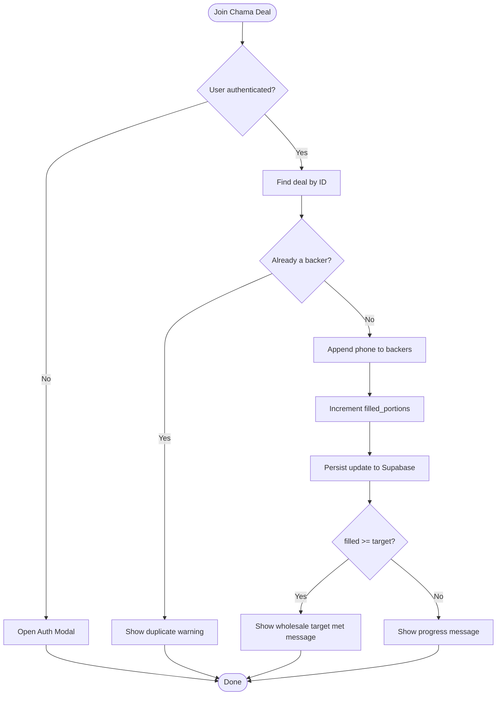
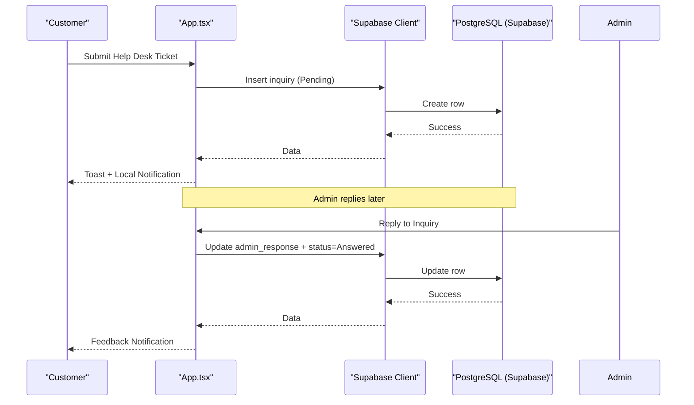
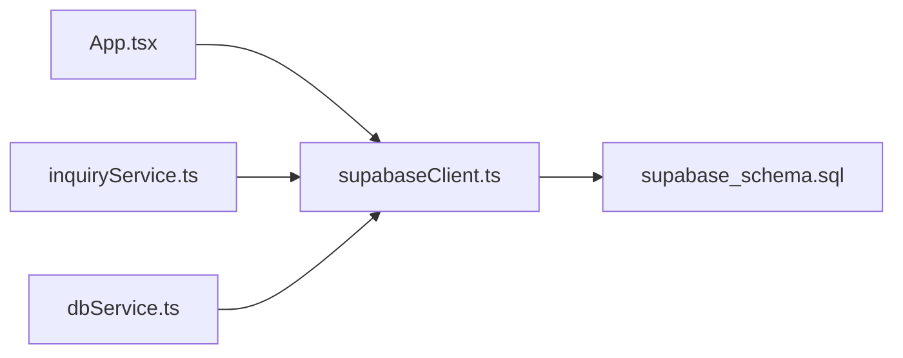

# Community Features

<cite>
**Referenced Files in This Document**
- [App.tsx](file://src/App.tsx)
- [inquiryService.ts](file://src/supabase/inquiryService.ts)
- [dbService.ts](file://src/supabase/dbService.ts)
- [supabaseClient.ts](file://src/supabaseClient.ts)
- [supabase_schema.sql](file://supabase_schema.sql)
</cite>

## Table of Contents
1. [Introduction](#introduction)
2. [Project Structure](#project-structure)
3. [Core Components](#core-components)
4. [Architecture Overview](#architecture-overview)
5. [Detailed Component Analysis](#detailed-component-analysis)
6. [Dependency Analysis](#dependency-analysis)
7. [Performance Considerations](#performance-considerations)
8. [Troubleshooting Guide](#troubleshooting-guide)
9. [Conclusion](#conclusion)

## Introduction
This document explains the community and social features implemented in the application, focusing on:
- Group buying (Chama deals): deal creation, participant management, and collective purchasing workflows
- Rating and review system: vendor ratings and product reviews, including aggregation logic
- Customer support inquiry system: ticket creation, categorization, response tracking
- Inquiry service implementation, real-time notification systems, and moderation tools for community content management

The platform uses Supabase as the backend with a React frontend. Data models are defined in SQL, while business logic is primarily implemented in the main application component.

## Project Structure
Community-related functionality spans the database schema, client services, and the main application UI:
- Database schema defines tables for inquiries, chama deals, vendors, menu items, and related entities
- The main application component manages state, user interactions, and data persistence via Supabase
- A lightweight inquiry service abstracts basic CRUD operations for inquiries
- A generic DB wrapper provides typed access to Supabase queries

**Diagram sources**
- [App.tsx](file://src/App.tsx)
- [inquiryService.ts](file://src/supabase/inquiryService.ts)
- [dbService.ts](file://src/supabase/dbService.ts)
- [supabaseClient.ts](file://src/supabaseClient.ts)
- [supabase_schema.sql](file://supabase_schema.sql)

**Section sources**
- [supabase_schema.sql](file://supabase_schema.sql)
- [App.tsx](file://src/App.tsx)
- [inquiryService.ts](file://src/supabase/inquiryService.ts)
- [dbService.ts](file://src/supabase/dbService.ts)
- [supabaseClient.ts](file://src/supabaseClient.ts)

## Core Components
- Chama Deals: Bulk group buying with portion-based participation and target fulfillment
- Vendor Ratings: Per-vendor rating stored in the vendor table; used for display and filtering
- Product Reviews: Not implemented in the current codebase
- Support Inquiries: Ticket creation, categorization by topic, admin replies, and status tracking
- Notifications: Local in-memory notifications triggered by key actions (support tickets, admin replies)
- Moderation Tools: Vendor ban/unban and approval workflows for vendors and riders

Key data models:
- ChamaDeal: id, title, merchant, category, totalPrice, portionPrice, targetPortions, filledPortions, backers
- Vendor: includes rating field
- Inquiry: id, userId, name, phone, topic, message, admin_response, status, created_at
- Notification: id, userId, content, createdAt, read, type

**Section sources**
- [supabase_schema.sql](file://supabase_schema.sql)
- [App.tsx](file://src/App.tsx)

## Architecture Overview
The community features follow a client-driven architecture:
- Frontend components manage state and user interactions
- Supabase client performs direct queries against tables defined in the schema
- Row-level security policies enable open access for development purposes

**Diagram sources**
- [App.tsx](file://src/App.tsx)
- [supabaseClient.ts](file://src/supabaseClient.ts)
- [supabase_schema.sql](file://supabase_schema.sql)

## Detailed Component Analysis

### Chama Deals (Group Buying)
- Deal creation: Default deals are seeded if none exist; users can create new deals through the UI flow
- Participant management: Users join a deal pool; their phone number is added to the backers array; filled portions increment
- Collective purchasing workflow: When filled portions meet or exceed target portions, a success toast indicates automatic execution

Implementation highlights:
- State variables track deals, targets, and participants
- Joining a deal checks authentication and duplicate participation
- Updates both local state and persisted records via Supabase

**Diagram sources**
- [App.tsx](file://src/App.tsx)

**Section sources**
- [supabase_schema.sql](file://supabase_schema.sql)
- [App.tsx](file://src/App.tsx)

### Rating and Review System
- Vendor ratings: Stored per vendor in the vendor table; default value is set during creation
- Product reviews: No explicit product review table or submission flow exists in the current codebase
- Aggregation algorithms: Not implemented; vendor rating is a single numeric field without computed averages

Notes:
- Vendors have a rating field that can be displayed and potentially used for sorting/filtering
- There is no mechanism to aggregate multiple reviews into an average score

**Section sources**
- [supabase_schema.sql](file://supabase_schema.sql)
- [App.tsx](file://src/App.tsx)

### Customer Support Inquiry System
- Ticket creation: Users submit inquiries with name, phone, topic, and message; records are inserted into the inquiries table
- Categorization: Topic field allows classification (e.g., Payment Dispute, SaaS Subscription, Rider Dispatch, General SLA)
- Response tracking: Admin replies are stored in admin_response; status transitions from Pending to Answered
- Real-time notifications: On ticket submission and admin reply, local notifications are created and displayed in the dashboard

Implementation highlights:
- handleHelpSubmit validates inputs, inserts inquiry, updates local state, and creates a notification
- handleAdminReply updates the inquiry record and posts a feedback notification to the customer’s inbox

**Diagram sources**
- [App.tsx](file://src/App.tsx)

**Section sources**
- [supabase_schema.sql](file://supabase_schema.sql)
- [App.tsx](file://src/App.tsx)

### Inquiry Service Implementation
- inquiryService.ts exposes methods to fetch all inquiries and create new ones
- dbService.ts provides a typed wrapper around Supabase queries for select, insert, update, delete, and RPC calls
- supabaseClient.ts initializes the Supabase client with URL and anon key

Usage patterns:
- Direct Supabase calls are used throughout App.tsx for most operations
- inquiryService and dbService offer reusable abstractions for future expansion

**Section sources**
- [inquiryService.ts](file://src/supabase/inquiryService.ts)
- [dbService.ts](file://src/supabase/dbService.ts)
- [supabaseClient.ts](file://src/supabaseClient.ts)

### Real-Time Notification Systems
- Notifications are managed in local state within App.tsx
- Types include support, system, and message categories
- Notifications are created when:
  - A support ticket is submitted
  - An admin replies to a ticket
- Users can mark notifications as read and view them in the customer portal

Limitations:
- Notifications are not persisted to the database; they are session-scoped
- No WebSocket or Supabase Realtime subscriptions are implemented for live updates

**Section sources**
- [App.tsx](file://src/App.tsx)

### Moderation Tools for Community Content Management
- Vendor approvals: Admins can approve vendor registration requests, creating vendor records and enabling marketplace visibility
- Rider approvals: Admins can approve rider registrations, granting delivery access
- Vendor bans: Admins can ban/unban stores; banned stores are filtered out from the marketplace catalog
- Escrow release: Admins can release held funds upon order completion

Workflow overview:
- Vendor/Rider applications are queued in approval tables
- Admin actions update statuses and create corresponding active records
- Banned vendors are tracked in a dedicated table and applied to filter listings

**Section sources**
- [supabase_schema.sql](file://supabase_schema.sql)
- [App.tsx](file://src/App.tsx)

## Dependency Analysis
- App.tsx depends on Supabase client for all data operations
- inquiryService.ts and dbService.ts depend on supabaseClient.ts
- supabase_schema.sql defines the data model and RLS policies enforced by Supabase

**Diagram sources**
- [App.tsx](file://src/App.tsx)
- [inquiryService.ts](file://src/supabase/inquiryService.ts)
- [dbService.ts](file://src/supabase/dbService.ts)
- [supabaseClient.ts](file://src/supabaseClient.ts)
- [supabase_schema.sql](file://supabase_schema.sql)

**Section sources**
- [App.tsx](file://src/App.tsx)
- [inquiryService.ts](file://src/supabase/inquiryService.ts)
- [dbService.ts](file://src/supabase/dbService.ts)
- [supabaseClient.ts](file://src/supabaseClient.ts)
- [supabase_schema.sql](file://supabase_schema.sql)

## Performance Considerations
- Queries are executed directly from the frontend; consider pagination and selective column fetching for large datasets
- Local state updates provide immediate UI feedback but do not persist notifications
- RLS policies currently allow full access; tighten permissions for production environments
- Avoid redundant re-renders by memoizing derived lists and minimizing unnecessary state updates

[No sources needed since this section provides general guidance]

## Troubleshooting Guide
Common issues and resolutions:
- Authentication failures: Ensure Supabase auth credentials and email/password are valid; legacy phone login fallback may apply
- Inquiry insertion errors: Verify RLS policies and table permissions; check network connectivity and Supabase client configuration
- Vendor/Rider approval errors: Confirm required fields and password constraints; ensure unique identifiers and proper status transitions
- Ban/unban operations: Validate store names and ensure consistent casing; confirm database updates reflect in marketplace filters

**Section sources**
- [App.tsx](file://src/App.tsx)
- [supabase_schema.sql](file://supabase_schema.sql)

## Conclusion
The community features provide foundational capabilities for group buying, support inquiries, and moderation workflows. While vendor ratings exist, product reviews and advanced aggregation are not implemented. Notifications are local and non-persistent. Future enhancements should include persistent notifications, real-time updates, product review mechanisms, and stricter access controls.

[No sources needed since this section summarizes without analyzing specific files]