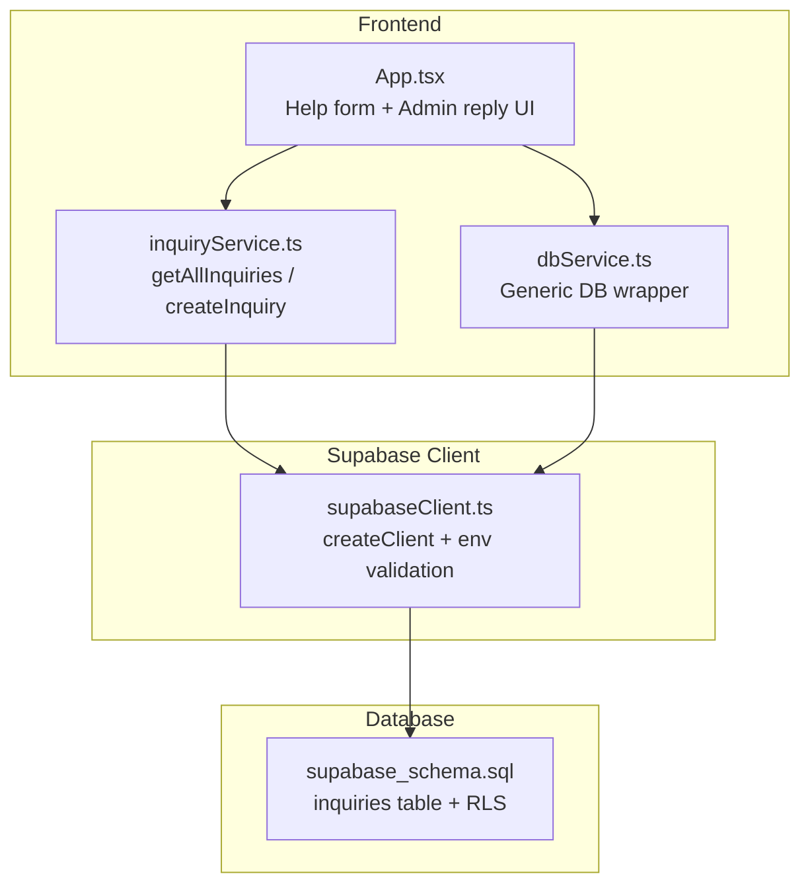
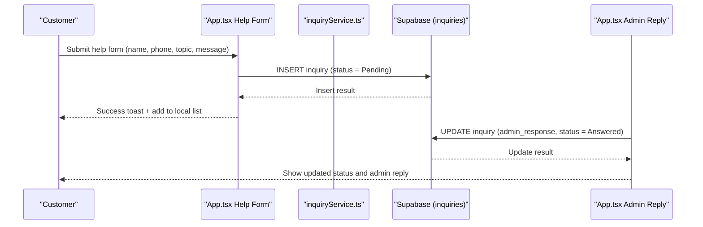
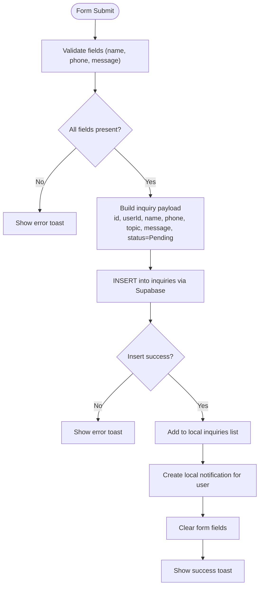
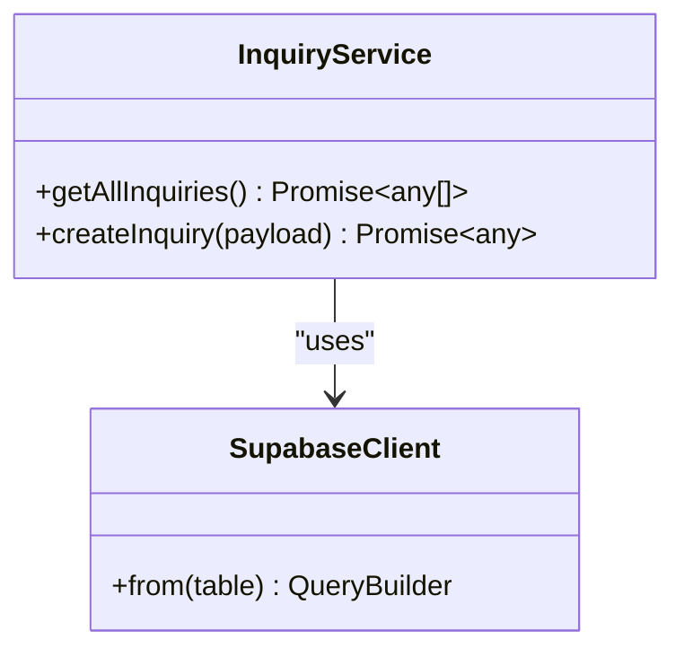
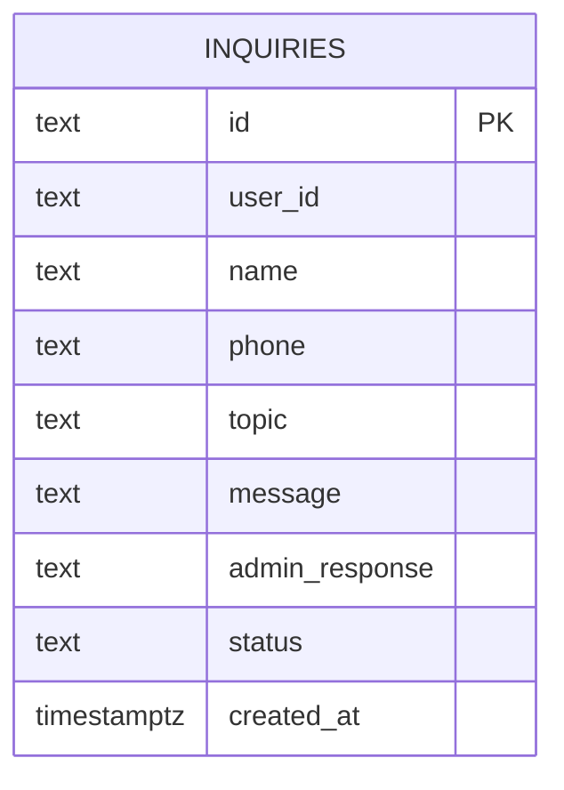
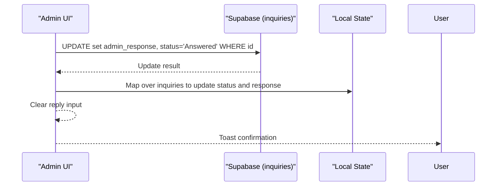
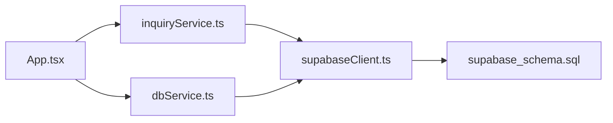

# Customer Support Inquiries

<cite>
**Referenced Files in This Document**
- [App.tsx](file://src/App.tsx)
- [inquiryService.ts](file://src/supabase/inquiryService.ts)
- [dbService.ts](file://src/supabase/dbService.ts)
- [supabaseClient.ts](file://src/supabase/supabaseClient.ts)
- [supabase_schema.sql](file://supabase_schema.sql)
- [SUPABASE.md](file://SUPABASE.md)
</cite>

## Table of Contents
1. [Introduction](#introduction)
2. [Project Structure](#project-structure)
3. [Core Components](#core-components)
4. [Architecture Overview](#architecture-overview)
5. [Detailed Component Analysis](#detailed-component-analysis)
6. [Dependency Analysis](#dependency-analysis)
7. [Performance Considerations](#performance-considerations)
8. [Troubleshooting Guide](#troubleshooting-guide)
9. [Conclusion](#conclusion)
10. [Appendices](#appendices)

## Introduction
This document explains the customer support inquiry system for the Match & Market platform. It covers how customers create tickets, how inquiries are categorized and stored, how admin staff respond and update status, and how notifications are surfaced to users. It also outlines current limitations (e.g., priority handling and advanced search/reporting) and provides guidance for extending the system with real-time updates and analytics.

## Project Structure
The inquiry feature spans UI logic in the main application component, a dedicated service module for Supabase operations, a shared database wrapper, and the Supabase schema that defines the inquiries table and Row Level Security policies.

**Diagram sources**
- [App.tsx:1038-1142](file://src/App.tsx#L1038-L1142)
- [inquiryService.ts:1-18](file://src/supabase/inquiryService.ts#L1-L18)
- [dbService.ts:1-24](file://src/supabase/dbService.ts#L1-L24)
- [supabaseClient.ts:1-38](file://src/supabase/supabaseClient.ts#L1-L38)
- [supabase_schema.sql:98-113](file://supabase_schema.sql#L98-L113)

**Section sources**
- [App.tsx:1038-1142](file://src/App.tsx#L1038-L1142)
- [inquiryService.ts:1-18](file://src/supabase/inquiryService.ts#L1-L18)
- [dbService.ts:1-24](file://src/supabase/dbService.ts#L1-L24)
- [supabaseClient.ts:1-38](file://src/supabase/supabaseClient.ts#L1-L38)
- [supabase_schema.sql:98-113](file://supabase_schema.sql#L98-L113)

## Core Components
- Inquiry submission flow: The help desk form collects name, phone, topic, and message, then inserts a new inquiry into the database and updates local state.
- Inquiry listing and admin response: The dashboard displays all inquiries and allows admins to reply, updating status from Pending to Answered.
- Service layer: A minimal service exposes methods to fetch and create inquiries via Supabase.
- Database schema: The inquiries table stores ticket details, admin responses, and status. RLS policies allow open access for development.

Key responsibilities:
- App.tsx: UI orchestration, form handling, local state updates, and direct Supabase calls for insert/update.
- inquiryService.ts: Encapsulates Supabase queries for inquiries.
- dbService.ts: Generic typed wrapper around Supabase client for consistent error handling.
- supabaseClient.ts: Centralized Supabase client configuration and environment validation.
- supabase_schema.sql: Defines the inquiries table and enables RLS policies.

**Section sources**
- [App.tsx:1038-1142](file://src/App.tsx#L1038-L1142)
- [inquiryService.ts:1-18](file://src/supabase/inquiryService.ts#L1-L18)
- [dbService.ts:1-24](file://src/supabase/dbService.ts#L1-L24)
- [supabaseClient.ts:1-38](file://src/supabase/supabaseClient.ts#L1-L38)
- [supabase_schema.sql:98-113](file://supabase_schema.sql#L98-L113)

## Architecture Overview
The inquiry system follows a straightforward client-to-database pattern with a thin service layer. The UI triggers actions that call Supabase directly or through services, which return data used to update local state and render UI.

**Diagram sources**
- [App.tsx:1038-1142](file://src/App.tsx#L1038-L1142)
- [inquiryService.ts:1-18](file://src/supabase/inquiryService.ts#L1-L18)
- [supabase_schema.sql:98-113](file://supabase_schema.sql#L98-L113)

## Detailed Component Analysis

### Inquiry Submission Flow
Customers use the help desk form to submit a ticket. The flow validates inputs, constructs an inquiry object, inserts it into the inquiries table, and updates local state. A notification is created locally to reflect the submission.

**Diagram sources**
- [App.tsx:1038-1094](file://src/App.tsx#L1038-L1094)

**Section sources**
- [App.tsx:1038-1094](file://src/App.tsx#L1038-L1094)

### Inquiry Categorization
The help form includes a topic selector with predefined categories. Current options include:
- Payment Dispute
- SaaS Subscription
- Rider Dispatch
- General SLA

These topics are stored in the topic field of the inquiries table and can be used for filtering and reporting.

**Section sources**
- [App.tsx:2098-2133](file://src/App.tsx#L2098-L2133)
- [supabase_schema.sql:98-113](file://supabase_schema.sql#L98-L113)

### Inquiry Service Implementation
The inquiryService module provides two primary methods:
- getAllInquiries: Fetches all inquiries from the inquiries table.
- createInquiry: Inserts a new inquiry record.

These methods encapsulate Supabase calls and propagate errors.

**Diagram sources**
- [inquiryService.ts:1-18](file://src/supabase/inquiryService.ts#L1-L18)
- [supabaseClient.ts:1-38](file://src/supabase/supabaseClient.ts#L1-L38)

**Section sources**
- [inquiryService.ts:1-18](file://src/supabase/inquiryService.ts#L1-L18)

### Database Operations and Schema
The inquiries table stores:
- id: Primary key
- user_id: Optional linked user
- name, phone: Contact info
- topic: Category
- message: Customer’s issue description
- admin_response: Admin’s reply
- status: Pending or Answered
- created_at: Timestamp

Row Level Security (RLS) policies are enabled for all tables including inquiries, with permissive policies for development.

**Diagram sources**
- [supabase_schema.sql:98-113](file://supabase_schema.sql#L98-L113)

**Section sources**
- [supabase_schema.sql:98-113](file://supabase_schema.sql#L98-L113)

### Status Management and Admin Response Workflow
Admins can view inquiries in the dashboard and reply to pending tickets. When a reply is submitted:
- The admin_response field is updated.
- The status changes from Pending to Answered.
- Local state reflects the change immediately.
- A notification is created for the associated user if available.

**Diagram sources**
- [App.tsx:1096-1142](file://src/App.tsx#L1096-L1142)

**Section sources**
- [App.tsx:1096-1142](file://src/App.tsx#L1096-L1142)

### Notification System
On ticket submission, a local notification is created for the current user indicating that a support ticket was filed. On admin reply, a feedback notification is created for the user whose ticket was answered. Notifications are managed in local state and displayed in the dashboard under Messages & Notifications.

**Section sources**
- [App.tsx:1078-1088](file://src/App.tsx#L1078-L1088)
- [App.tsx:1125-1135](file://src/App.tsx#L1125-L1135)

### Priority Handling and Resolution Tracking
Current implementation does not include explicit priority levels or resolution timestamps. Status transitions are limited to Pending and Answered. To implement priority handling and resolution tracking:
- Add a priority column (e.g., Low, Medium, High).
- Add a resolved_at timestamp when status becomes Answered.
- Extend the UI to select priority during submission and display it in the dashboard.
- Implement sorting/filtering by priority and status.

[No sources needed since this section proposes extensions beyond current code]

### Real-Time Updates for Support Staff
Real-time synchronization is not currently implemented. To enable live updates:
- Use Supabase subscriptions on the inquiries table to listen for inserts and updates.
- Update local state reactively when new inquiries arrive or statuses change.
- Optionally implement presence indicators for active admin sessions.

[No sources needed since this section proposes extensions beyond current code]

### Search Functionality and Reporting Capabilities
Current UI does not provide search or filters for inquiries. To add search and reporting:
- Add a search input that filters inquiries by topic, name, phone, or message.
- Implement server-side filtering using Supabase queries for performance.
- Create a reporting view that aggregates counts by topic and status, and calculates metrics like average response time.

[No sources needed since this section proposes extensions beyond current code]

## Dependency Analysis
The inquiry system depends on:
- App.tsx for UI and business logic.
- inquiryService.ts for encapsulated Supabase operations.
- dbService.ts for a generic typed wrapper around Supabase.
- supabaseClient.ts for client initialization and environment validation.
- supabase_schema.sql for table definitions and RLS policies.

**Diagram sources**
- [App.tsx:1038-1142](file://src/App.tsx#L1038-L1142)
- [inquiryService.ts:1-18](file://src/supabase/inquiryService.ts#L1-L18)
- [dbService.ts:1-24](file://src/supabase/dbService.ts#L1-L24)
- [supabaseClient.ts:1-38](file://src/supabase/supabaseClient.ts#L1-L38)
- [supabase_schema.sql:98-113](file://supabase_schema.sql#L98-L113)

**Section sources**
- [App.tsx:1038-1142](file://src/App.tsx#L1038-L1142)
- [inquiryService.ts:1-18](file://src/supabase/inquiryService.ts#L1-L18)
- [dbService.ts:1-24](file://src/supabase/dbService.ts#L1-L24)
- [supabaseClient.ts:1-38](file://src/supabase/supabaseClient.ts#L1-L38)
- [supabase_schema.sql:98-113](file://supabase_schema.sql#L98-L113)

## Performance Considerations
- Direct Supabase calls in App.tsx bypass the typed dbService wrapper; consider centralizing all inquiries operations through inquiryService or dbService for consistency and better error handling.
- Avoid unnecessary re-renders by memoizing filtered lists and minimizing state updates.
- For large datasets, implement pagination and server-side filtering to reduce payload size.
- Use Supabase indexes on frequently queried columns (e.g., topic, status, created_at) to improve query performance.

[No sources needed since this section provides general guidance]

## Troubleshooting Guide
Common issues and resolutions:
- Supabase credentials missing: Ensure VITE_SUPABASE_URL and VITE_SUPABASE_ANON_KEY are set in the root .env file.
- Incorrect URL format: Do not append /rest/v1/ to the Supabase URL; use the project base URL.
- RLS blocking operations: Verify that RLS policies allow the anon role to insert/select/update inquiries during development.
- Insert returns no data: Check that the inserted row matches expected columns and that RLS policies permit the operation.

**Section sources**
- [SUPABASE.md:1-38](file://SUPABASE.md#L1-L38)
- [supabase_schema.sql:166-198](file://supabase_schema.sql#L166-L198)

## Conclusion
The customer support inquiry system provides a functional foundation for ticket creation, categorization, and admin responses. While core features are implemented, enhancements such as priority handling, real-time updates, search, and reporting can significantly improve usability and operational efficiency. Adopting a centralized service layer and leveraging Supabase subscriptions will streamline development and enhance responsiveness.

[No sources needed since this section summarizes without analyzing specific files]

## Appendices

### Data Model Reference
- inquiries table fields: id, user_id, name, phone, topic, message, admin_response, status, created_at.
- Status values: Pending, Answered.
- Topic values: Payment Dispute, SaaS Subscription, Rider Dispatch, General SLA.

**Section sources**
- [supabase_schema.sql:98-113](file://supabase_schema.sql#L98-L113)
- [App.tsx:2098-2133](file://src/App.tsx#L2098-L2133)