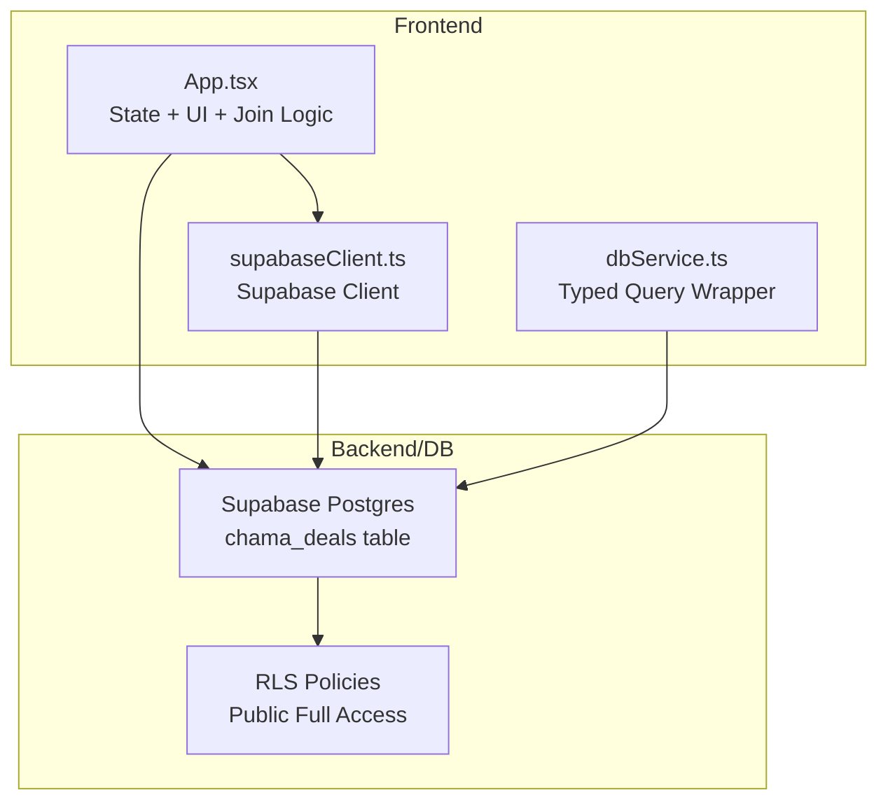
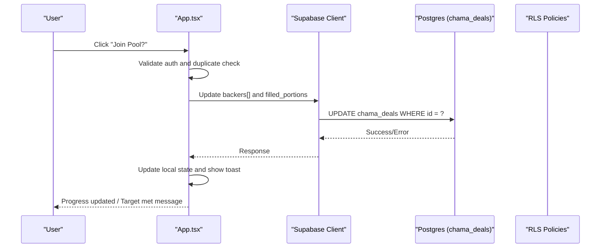
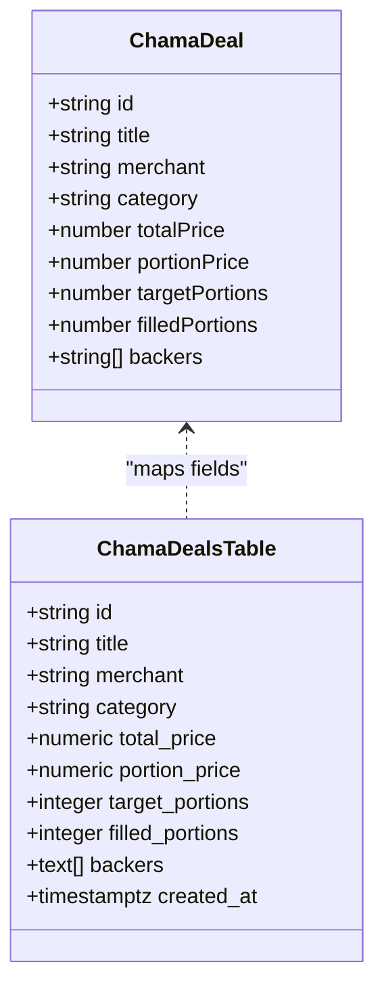
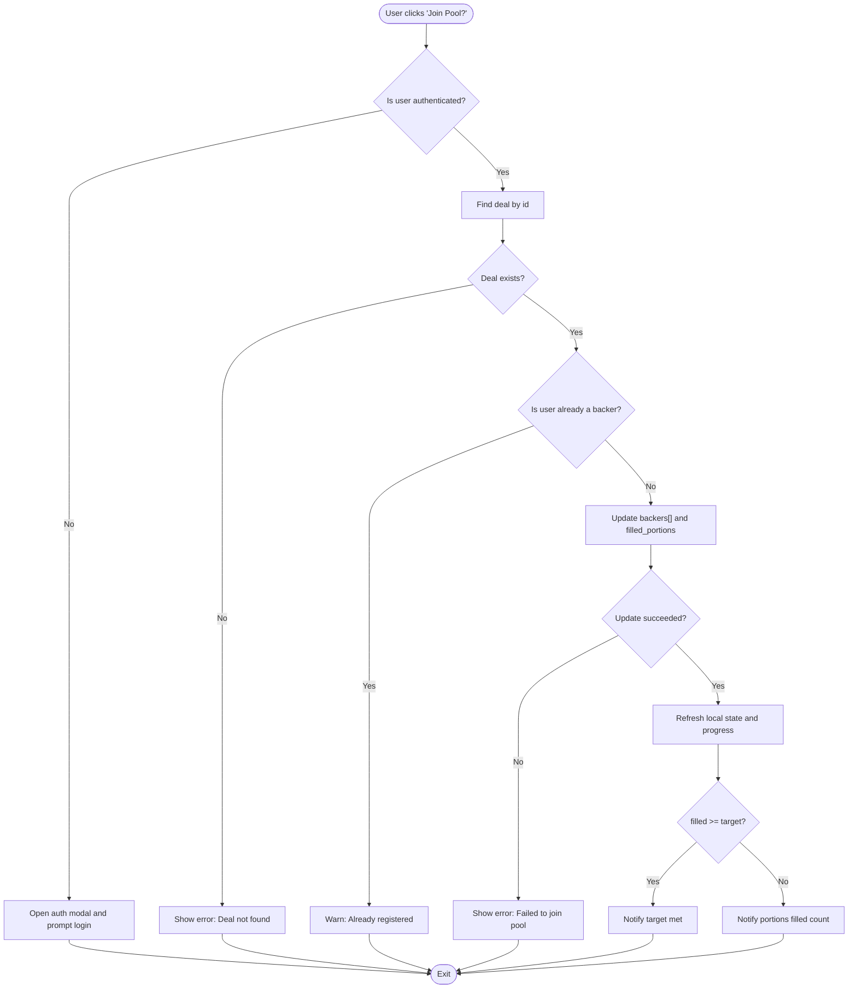
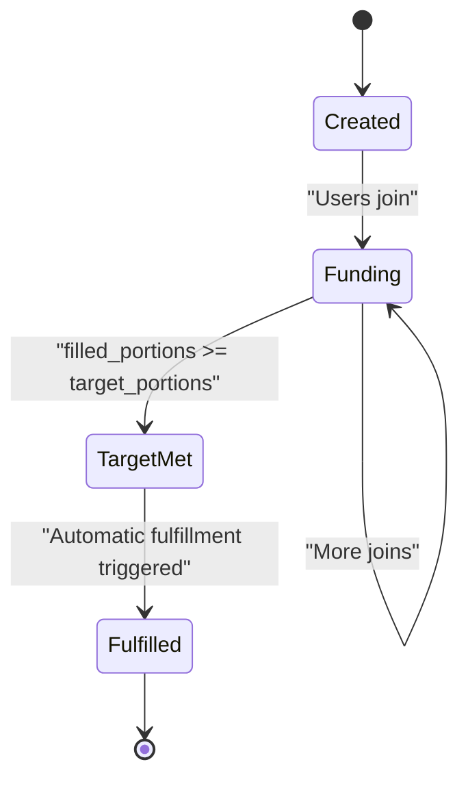
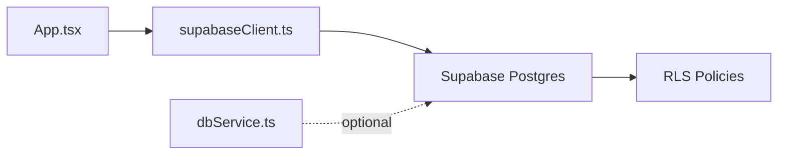

# Group Buying (Chama Deals)

<cite>
**Referenced Files in This Document**
- [App.tsx](file://src/App.tsx)
- [supabase_schema.sql](file://supabase_schema.sql)
- [supabaseClient.ts](file://src/supabase/supabaseClient.ts)
- [dbService.ts](file://src/supabase/dbService.ts)
</cite>

## Table of Contents
1. [Introduction](#introduction)
2. [Project Structure](#project-structure)
3. [Core Components](#core-components)
4. [Architecture Overview](#architecture-overview)
5. [Detailed Component Analysis](#detailed-component-analysis)
6. [Dependency Analysis](#dependency-analysis)
7. [Performance Considerations](#performance-considerations)
8. [Troubleshooting Guide](#troubleshooting-guide)
9. [Conclusion](#conclusion)

## Introduction
This document explains the group buying functionality known as Chama deals. It covers how deals are created and managed, portion pricing, target participant management, collective purchasing by multiple users, deal lifecycle from creation to fulfillment, real-time progress updates, and payment handling considerations. The implementation is built on a React frontend with Supabase for data persistence and Row Level Security policies.

## Project Structure
The Chama deals feature spans the application shell, state management, UI rendering, and database schema:
- Application shell and state: App.tsx defines the ChamaDeal interface, loads deals from Supabase, renders the wholesale pools widget, and handles joining deals.
- Database schema: supabase_schema.sql defines the chama_deals table and RLS policies enabling client access.
- Supabase client: supabaseClient.ts initializes the Supabase client using environment variables.
- Optional DB helper: dbService.ts provides a typed wrapper around Supabase queries.

**Diagram sources**
- [App.tsx](file://src/App.tsx)
- [supabaseClient.ts](file://src/supabase/supabaseClient.ts)
- [dbService.ts](file://src/supabase/dbService.ts)
- [supabase_schema.sql](file://supabase_schema.sql)

**Section sources**
- [App.tsx](file://src/App.tsx)
- [supabase_schema.sql](file://supabase_schema.sql)
- [supabaseClient.ts](file://src/supabase/supabaseClient.ts)
- [dbService.ts](file://src/supabase/dbService.ts)

## Core Components
- ChamaDeal interface and state:
  - Defines fields such as id, title, merchant, category, totalPrice, portionPrice, targetPortions, filledPortions, and backers array.
  - State holds an array of deals loaded from Supabase.
- Data loading:
  - On app mount, deals are fetched; if none exist, a default deal is inserted to seed the dataset.
- UI widget:
  - Displays each deal’s total price, per-person portion price, progress bar, current portions vs target, and a “Join Pool?” button.
- Joining a deal:
  - Validates user authentication, prevents duplicate participation, increments filled_portions, appends the user’s phone to backers, and triggers feedback messages.

**Section sources**
- [App.tsx](file://src/App.tsx)
- [supabase_schema.sql](file://supabase_schema.sql)

## Architecture Overview
The Chama deals flow combines client-side state, direct Supabase calls, and server-side schema enforcement via RLS.

**Diagram sources**
- [App.tsx](file://src/App.tsx)
- [supabase_schema.sql](file://supabase_schema.sql)
- [supabaseClient.ts](file://src/supabase/supabaseClient.ts)

## Detailed Component Analysis

### Data Model: ChamaDeal Interface and Schema
- Frontend interface includes:
  - id, title, merchant, category, totalPrice, portionPrice, targetPortions, filledPortions, backers (string array).
- Database table includes:
  - id (primary key), title, merchant, category, total_price, portion_price, target_portions, filled_portions, backers (text array), created_at.
- Mapping:
  - Frontend maps DB columns to interface fields during load and persists updates back to the same columns.

**Diagram sources**
- [App.tsx](file://src/App.tsx)
- [supabase_schema.sql](file://supabase_schema.sql)

**Section sources**
- [App.tsx](file://src/App.tsx)
- [supabase_schema.sql](file://supabase_schema.sql)

### Deal Creation Workflow
- Current behavior:
  - If no deals exist, a default deal is inserted on first load to seed the dataset.
  - There is no dedicated “Create Deal” form exposed in the UI at this time.
- Recommended approach:
  - Add a merchant-facing or admin-only form to insert new rows into chama_deals with required fields (title, merchant, category, total_price, portion_price, target_portions).
  - Validate that portion_price * target_portions equals total_price before insertion.
  - Initialize filled_portions to 0 and backers to an empty array.

[No sources needed since this section proposes enhancements not present in code]

### Portion Pricing and Target Management
- Portion pricing:
  - Each deal exposes portionPrice and targetPortions.
  - filled_portions tracks how many participants have joined.
- Target management:
  - When filled_portions reaches or exceeds target_portions, the system signals that the wholesale target has been met.
- Consistency checks:
  - Ensure portionPrice > 0 and targetPortions > 0.
  - Enforce that backers array length matches filled_portions.

**Section sources**
- [App.tsx](file://src/App.tsx)
- [supabase_schema.sql](file://supabase_schema.sql)

### Collective Purchasing System
- Multiple users can contribute to a single bulk purchase deal by joining the pool.
- Each join operation:
  - Adds the user’s phone number to the backers array.
  - Increments filled_portions by one.
  - Updates the UI immediately and shows success feedback.
- Duplicate prevention:
  - Prevents the same user from joining the same deal twice.

**Diagram sources**
- [App.tsx](file://src/App.tsx)

**Section sources**
- [App.tsx](file://src/App.tsx)

### Deal Lifecycle and Automatic Fulfillment
- Lifecycle stages:
  - Created (seeded or inserted).
  - Funding phase (users join, filled_portions increases).
  - Target met (filled_portions >= target_portions).
  - Fulfillment trigger (message indicates automatic execution).
- Current implementation:
  - On reaching the target, a success toast is shown indicating automatic execution for the merchant.
  - No backend fulfillment job is implemented yet; this is a placeholder for future automation.

**Diagram sources**
- [App.tsx](file://src/App.tsx)

**Section sources**
- [App.tsx](file://src/App.tsx)

### Real-Time Updates for Deal Progress
- Current behavior:
  - UI updates immediately after successful update to Supabase.
  - Progress bar reflects filled_portions/target_portions ratio.
- Recommendations:
  - Use Supabase subscriptions to listen for changes on chama_deals and push live updates to all clients without manual refresh.

[No sources needed since this section provides general guidance]

### Payment Handling for Collective Purchases
- Current behavior:
  - No explicit payment integration is implemented for Chama deals.
  - Joining a deal updates backers and counts but does not process payments.
- Recommendations:
  - Integrate a payment provider (e.g., mobile money or card processor) to collect portionPrice per backer.
  - Record escrow transactions for each contribution and release funds upon fulfillment.
  - Ensure idempotency and auditability for each payment event.

[No sources needed since this section provides general guidance]

### Examples: Deal Creation, Participant Joining, Status Management
- Deal creation example:
  - Insert a new row into chama_deals with title, merchant, category, total_price, portion_price, target_portions, initialized filled_portions=0 and backers=[].
- Participant joining example:
  - Call update on chama_deals to append currentUser.phone to backers and increment filled_portions.
- Status management example:
  - After update, compute progress percentage and display it in the UI.
  - When filled_portions >= target_portions, show a “Target Met” message.

**Section sources**
- [App.tsx](file://src/App.tsx)
- [supabase_schema.sql](file://supabase_schema.sql)

## Dependency Analysis
- Frontend dependencies:
  - App.tsx depends on supabaseClient.ts for Supabase operations.
  - dbService.ts provides a typed wrapper but is not used by Chama deals logic directly.
- Backend dependencies:
  - Supabase Postgres stores chama_deals with RLS policies allowing full CRUD for anon and authenticated roles.

**Diagram sources**
- [App.tsx](file://src/App.tsx)
- [supabaseClient.ts](file://src/supabase/supabaseClient.ts)
- [dbService.ts](file://src/supabase/dbService.ts)
- [supabase_schema.sql](file://supabase_schema.sql)

**Section sources**
- [App.tsx](file://src/App.tsx)
- [supabaseClient.ts](file://src/supabase/supabaseClient.ts)
- [dbService.ts](file://src/supabase/dbService.ts)
- [supabase_schema.sql](file://supabase_schema.sql)

## Performance Considerations
- Minimize redundant reads:
  - Cache deals in local state and avoid re-fetching unless necessary.
- Efficient updates:
  - Use targeted updates to only modify backers and filled_portions.
- Real-time scaling:
  - Implement Supabase subscriptions to avoid polling and reduce network overhead.
- Indexing:
  - Consider indexing frequently queried fields like id and merchant for faster lookups.

[No sources needed since this section provides general guidance]

## Troubleshooting Guide
- Common issues:
  - Missing Supabase credentials: Ensure VITE_SUPABASE_URL and VITE_SUPABASE_ANON_KEY are set.
  - Duplicate participation: Check backers array to prevent repeated entries.
  - Update failures: Inspect error responses from Supabase and validate RLS policies.
- Debugging tips:
  - Use console logs to trace joinChamaDealPool flow.
  - Verify that the default deal seeding runs when no deals exist.

**Section sources**
- [supabaseClient.ts](file://src/supabase/supabaseClient.ts)
- [App.tsx](file://src/App.tsx)

## Conclusion
The Chama deals feature provides a foundation for group buying with clear data modeling, straightforward participant joining, and immediate UI feedback. While payment processing and automated fulfillment are not yet implemented, the structure supports future enhancements such as real-time subscriptions, robust payment integrations, and backend fulfillment workflows. With careful attention to consistency checks and performance optimizations, the system can scale to support large-scale collective purchases.