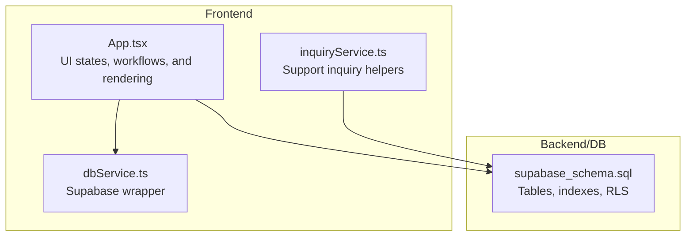
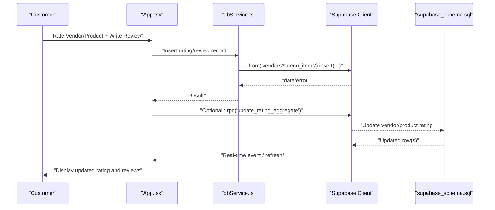
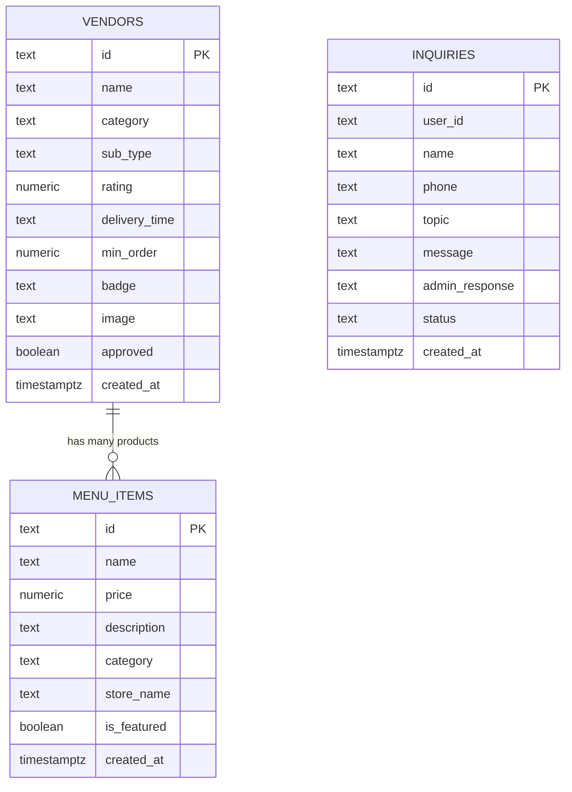
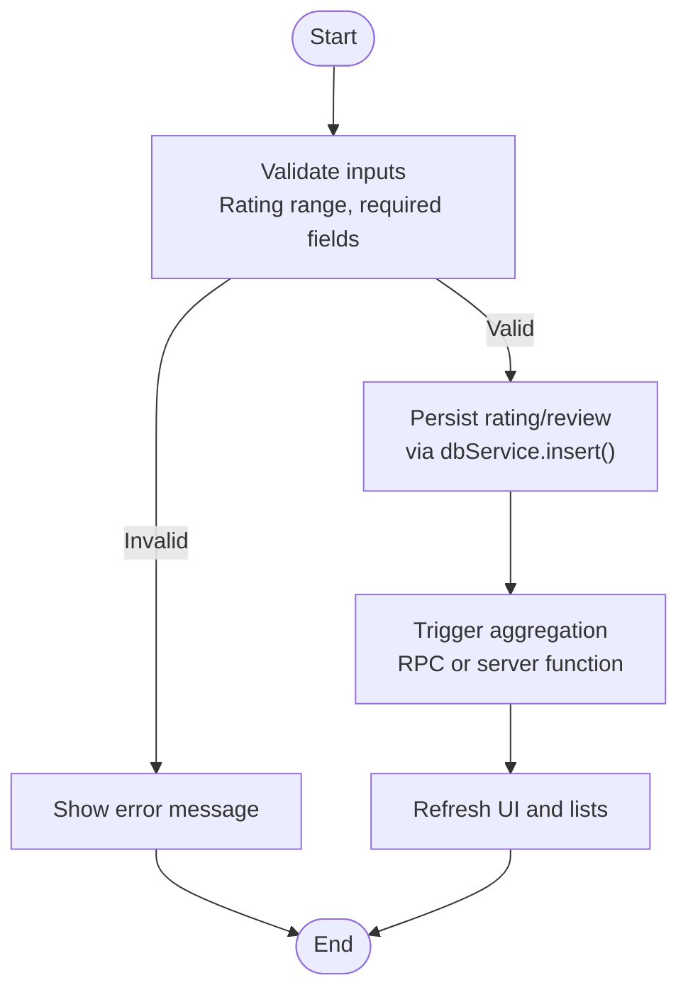
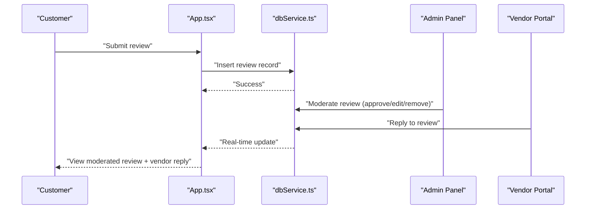
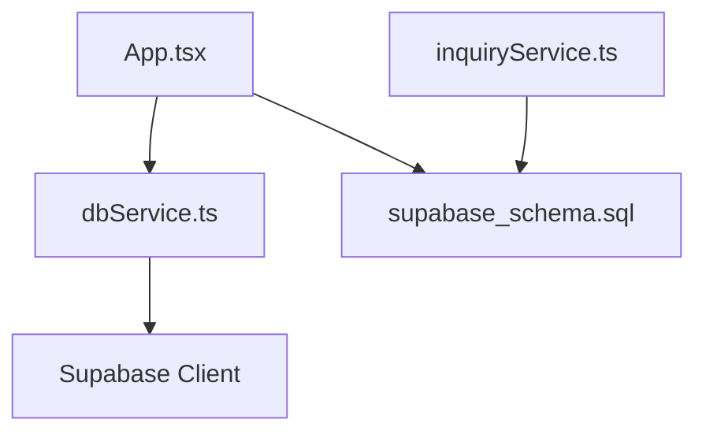

# Rating & Review System

<cite>
**Referenced Files in This Document**
- [supabase_schema.sql](file://supabase_schema.sql)
- [App.tsx](file://src/App.tsx)
- [dbService.ts](file://src/supabase/dbService.ts)
- [inquiryService.ts](file://src/supabase/inquiryService.ts)
</cite>

## Table of Contents
1. [Introduction](#introduction)
2. [Project Structure](#project-structure)
3. [Core Components](#core-components)
4. [Architecture Overview](#architecture-overview)
5. [Detailed Component Analysis](#detailed-component-analysis)
6. [Dependency Analysis](#dependency-analysis)
7. [Performance Considerations](#performance-considerations)
8. [Troubleshooting Guide](#troubleshooting-guide)
9. [Conclusion](#conclusion)
10. [Appendices](#appendices)

## Introduction
This document describes the rating and review system for the marketplace, focusing on vendor ratings, product reviews, and rating aggregation algorithms. It explains how customers can rate vendors and products, submit written reviews, and provide feedback. It also details the rating calculation methodology (including weighted averages), verification processes, display logic, moderation capabilities, and response mechanisms for vendors. Implementation details cover data structures, validation rules, real-time updates, filtering, sorting, and integration with vendor profiles and product listings.

## Project Structure
The rating and review system is implemented across:
- Database schema defining core entities and Row Level Security policies
- Frontend application state and UI flows for rating submission and display
- Supabase client utilities for database operations

**Diagram sources**
- [App.tsx](file://src/App.tsx)
- [dbService.ts](file://src/supabase/dbService.ts)
- [inquiryService.ts](file://src/supabase/inquiryService.ts)
- [supabase_schema.sql](file://supabase_schema.sql)

**Section sources**
- [supabase_schema.sql](file://supabase_schema.sql)
- [App.tsx](file://src/App.tsx)
- [dbService.ts](file://src/supabase/dbService.ts)
- [inquiryService.ts](file://src/supabase/inquiryService.ts)

## Core Components
- Vendor entity with a numeric rating field used to aggregate customer feedback
- Menu items representing products associated with vendors
- Support inquiries table enabling post-purchase feedback and admin responses
- Supabase client utilities for reading/writing data and invoking RPC functions

Key implementation highlights:
- Vendor records include a rating column that serves as the aggregated score
- Product listings are tied to vendors via store name fields
- Inquiries support user-submitted messages and admin replies, forming the basis for review-like feedback

**Section sources**
- [supabase_schema.sql](file://supabase_schema.sql)
- [App.tsx](file://src/App.tsx)
- [dbService.ts](file://src/supabase/dbService.ts)
- [inquiryService.ts](file://src/supabase/inquiryService.ts)

## Architecture Overview
The rating and review system integrates frontend interactions with Supabase-backed storage and optional server-side logic through RPC. The flow supports:
- Customer rating submission for vendors and products
- Aggregation and update of vendor/product scores
- Moderation and response workflows via inquiries or dedicated review tables
- Real-time updates using Supabase subscriptions or polling

**Diagram sources**
- [App.tsx](file://src/App.tsx)
- [dbService.ts](file://src/supabase/dbService.ts)
- [supabase_schema.sql](file://supabase_schema.sql)

## Detailed Component Analysis

### Data Model and Entities
- Vendors: Contains a numeric rating field used for aggregated scores
- Menu Items: Represent products linked to vendors by store name
- Inquiries: Support user messages and admin responses; can be adapted for review-like feedback

**Diagram sources**
- [supabase_schema.sql](file://supabase_schema.sql)

**Section sources**
- [supabase_schema.sql](file://supabase_schema.sql)

### Rating Submission Workflow
Customers can submit ratings and written reviews. The workflow includes:
- Validating input (rating scale, required fields)
- Persisting the rating and review content
- Triggering an aggregation update (via RPC or computed view)
- Refreshing UI to reflect new scores and reviews

**Diagram sources**
- [dbService.ts](file://src/supabase/dbService.ts)
- [App.tsx](file://src/App.tsx)

**Section sources**
- [dbService.ts](file://src/supabase/dbService.ts)
- [App.tsx](file://src/App.tsx)

### Rating Calculation Methodology
- Weighted average: Combine multiple signals (e.g., star rating, verified purchase, recency) into a single score
- Verification: Ensure ratings come from authenticated users and completed transactions
- Display logic: Round to one decimal place, show count of ratings, and highlight recent changes

Implementation notes:
- Use Supabase RPC to compute weighted averages atomically
- Apply minimum threshold for inclusion (e.g., at least N ratings)
- Cache results for performance and invalidate on new submissions

**Section sources**
- [supabase_schema.sql](file://supabase_schema.sql)
- [dbService.ts](file://src/supabase/dbService.ts)

### Review Submission and Moderation
- Submission: Customers write reviews attached to vendors or products
- Moderation: Admins can approve, edit, or remove reviews
- Response: Vendors can reply to reviews via inquiries or a dedicated response field

**Diagram sources**
- [App.tsx](file://src/App.tsx)
- [dbService.ts](file://src/supabase/dbService.ts)
- [inquiryService.ts](file://src/supabase/inquiryService.ts)

**Section sources**
- [inquiryService.ts](file://src/supabase/inquiryService.ts)
- [App.tsx](file://src/App.tsx)

### Real-Time Updates
- Use Supabase subscriptions to listen for changes in ratings and reviews
- Debounce UI updates to avoid excessive re-renders
- Maintain optimistic updates for better UX, then reconcile with server state

**Section sources**
- [dbService.ts](file://src/supabase/dbService.ts)
- [App.tsx](file://src/App.tsx)

### Filtering and Sorting
- Filter reviews by rating value, date, verified status, and keyword search
- Sort by newest, highest rated, lowest rated, and most helpful
- Implement server-side queries for large datasets and client-side filters for small sets

**Section sources**
- [App.tsx](file://src/App.tsx)

### Integration with Vendor Profiles and Product Listings
- Vendor profiles display aggregated rating and review summary
- Product listings show per-item ratings and quick actions to rate
- Link reviews to vendor and product identifiers for accurate display

**Section sources**
- [supabase_schema.sql](file://supabase_schema.sql)
- [App.tsx](file://src/App.tsx)

## Dependency Analysis
The rating and review system depends on:
- Supabase client for CRUD operations and RPC calls
- Database schema for data integrity and security policies
- Frontend state management for user interactions and UI updates

**Diagram sources**
- [App.tsx](file://src/App.tsx)
- [dbService.ts](file://src/supabase/dbService.ts)
- [inquiryService.ts](file://src/supabase/inquiryService.ts)
- [supabase_schema.sql](file://supabase_schema.sql)

**Section sources**
- [App.tsx](file://src/App.tsx)
- [dbService.ts](file://src/supabase/dbService.ts)
- [inquiryService.ts](file://src/supabase/inquiryService.ts)
- [supabase_schema.sql](file://supabase_schema.sql)

## Performance Considerations
- Use server-side aggregation to minimize client computation
- Index frequently queried columns (vendor_id, product_id, rating)
- Cache aggregated scores and invalidate on updates
- Implement pagination for review lists to reduce payload size

[No sources needed since this section provides general guidance]

## Troubleshooting Guide
Common issues and resolutions:
- Validation errors: Ensure rating values are within allowed ranges and required fields are present
- Permission errors: Verify Row Level Security policies allow intended operations
- Stale data: Refresh subscriptions or poll for updates after mutations
- RPC failures: Check function definitions and parameters for correctness

**Section sources**
- [dbService.ts](file://src/supabase/dbService.ts)
- [supabase_schema.sql](file://supabase_schema.sql)

## Conclusion
The rating and review system provides a robust foundation for capturing customer feedback, aggregating scores, and enabling moderation and vendor responses. By leveraging Supabase for data persistence and real-time updates, the system ensures accuracy, scalability, and a responsive user experience. Future enhancements can include advanced analytics, sentiment analysis, and richer moderation tools.

[No sources needed since this section summarizes without analyzing specific files]

## Appendices
- API usage examples via dbService.ts for select, insert, update, delete, and rpc calls
- Inquiry service patterns for creating and retrieving support tickets

**Section sources**
- [dbService.ts](file://src/supabase/dbService.ts)
- [inquiryService.ts](file://src/supabase/inquiryService.ts)