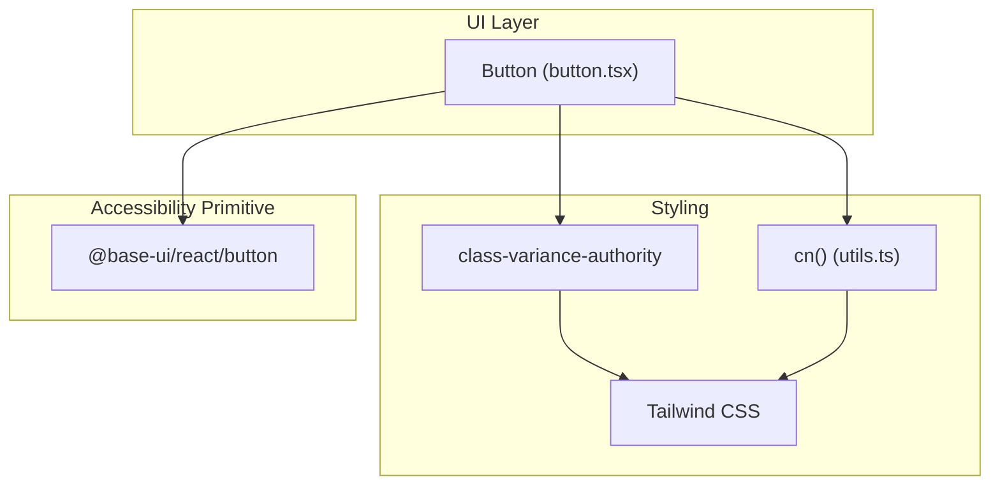
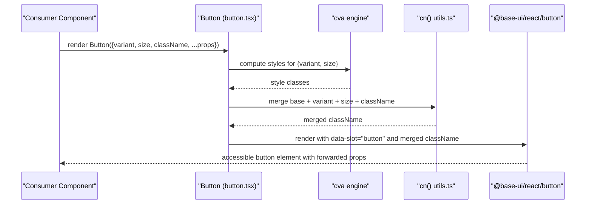
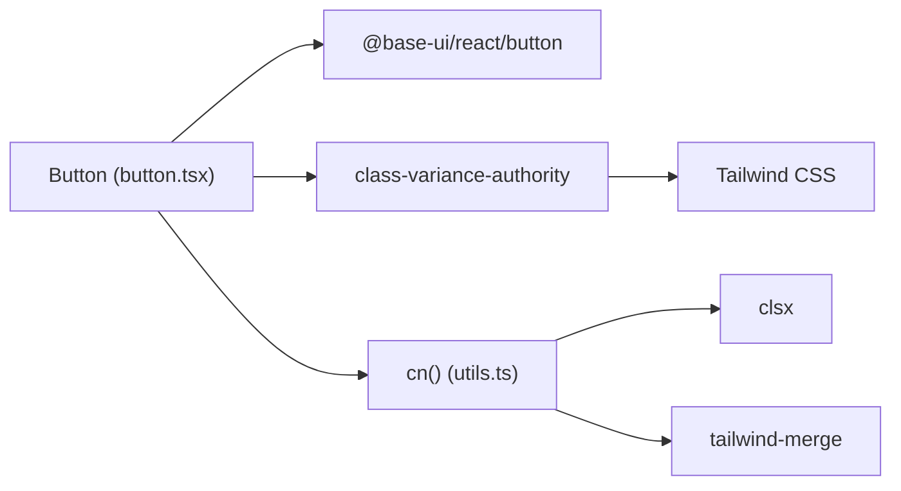

# Button Component

<cite>
**Referenced Files in This Document**
- [button.tsx](file://src/components/ui/button.tsx)
- [utils.ts](file://src/lib/utils.ts)
- [tailwind.config.cjs](file://tailwind.config.cjs)
- [package.json](file://package.json)
</cite>

## Table of Contents
1. [Introduction](#introduction)
2. [Project Structure](#project-structure)
3. [Core Components](#core-components)
4. [Architecture Overview](#architecture-overview)
5. [Detailed Component Analysis](#detailed-component-analysis)
6. [Dependency Analysis](#dependency-analysis)
7. [Performance Considerations](#performance-considerations)
8. [Troubleshooting Guide](#troubleshooting-guide)
9. [Conclusion](#conclusion)
10. [Appendices](#appendices)

## Introduction
This document provides comprehensive documentation for the Button component used in the project. It covers all available variants, size options, prop interfaces, accessibility and keyboard behavior, styling customization, responsive considerations, and integration patterns. The Button is implemented as a thin wrapper around an accessible primitive from @base-ui/react, with styles generated via class-variance-authority (cva) and Tailwind CSS utilities.

## Project Structure
The Button component lives under the UI primitives folder and composes:
- An accessible button primitive from @base-ui/react
- A variant system built with class-variance-authority
- A utility function to merge class names safely using clsx and tailwind-merge

**Diagram sources**
- [button.tsx:1-56](file://src/components/ui/button.tsx#L1-L56)
- [utils.ts:1-7](file://src/lib/utils.ts#L1-L7)
- [tailwind.config.cjs:1-17](file://tailwind.config.cjs#L1-L17)

**Section sources**
- [button.tsx:1-56](file://src/components/ui/button.tsx#L1-L56)
- [utils.ts:1-7](file://src/lib/utils.ts#L1-L7)
- [tailwind.config.cjs:1-17](file://tailwind.config.cjs#L1-L17)

## Core Components
- Button component: Exposes props for variant, size, className, and forwards all other props to the underlying accessible primitive.
- Variant system: Defines visual styles for default, outline, secondary, ghost, destructive, and link variants.
- Size system: Defines sizes default, xs, sm, lg, icon, icon-xs, icon-sm, icon-lg.
- Class merging: Uses cn() to combine base styles, variant styles, size styles, and custom className without conflicts.

Key behaviors:
- Focus-visible states are defined for keyboard navigation.
- Disabled state reduces opacity and disables pointer events.
- Invalid state applies destructive colors and ring for accessibility signaling.
- SVG icons inside buttons are sized and constrained by default when no explicit size class is provided.

**Section sources**
- [button.tsx:6-41](file://src/components/ui/button.tsx#L6-L41)
- [button.tsx:43-56](file://src/components/ui/button.tsx#L43-L56)
- [utils.ts:1-7](file://src/lib/utils.ts#L1-L7)

## Architecture Overview
The Button component composes three layers:
- Accessibility layer: @base-ui/react/button ensures correct semantics, focus management, and ARIA attributes.
- Styling layer: cva generates style classes based on variant and size; Tailwind provides utility classes.
- Composition layer: cn merges class strings deterministically, allowing overrides via className.

**Diagram sources**
- [button.tsx:6-56](file://src/components/ui/button.tsx#L6-L56)
- [utils.ts:1-7](file://src/lib/utils.ts#L1-L7)

## Detailed Component Analysis

### Variants
Available variants and their intended use cases:
- default: Primary action button with solid background color and hover effect. Use for main calls-to-action.
- outline: Transparent fill with border and subtle hover. Use for secondary actions or when you need less visual weight.
- secondary: Secondary color background with hover that mixes secondary and foreground tones. Use for supportive actions.
- ghost: No background by default, shows muted background on hover. Use for low-emphasis actions or within dense lists.
- destructive: Low-opacity background with destructive text and focus rings. Use for delete/remove actions.
- link: Text-only style with underline offset and hover underline. Use for inline actions that should look like links.

Notes:
- Some variants include expanded state styles (aria-expanded) for dropdowns or menus.
- Destructive variant includes dark mode adjustments for invalid states.

**Section sources**
- [button.tsx:9-21](file://src/components/ui/button.tsx#L9-L21)

### Sizes
Available sizes and usage scenarios:
- default: Standard height and padding for most buttons.
- xs: Compact size for tight spaces or small content areas.
- sm: Slightly smaller than default for denser layouts.
- lg: Larger height and padding for prominent actions.
- icon: Square button sized for icons only.
- icon-xs: Smallest square icon button.
- icon-sm: Medium-small square icon button.
- icon-lg: Largest square icon button.

Notes:
- Icon sizes adjust internal SVG sizing when no explicit size class is set.
- In button groups, rounded corners adapt to group context.

**Section sources**
- [button.tsx:22-34](file://src/components/ui/button.tsx#L22-L34)

### Props Interface
Props exposed by the Button component:
- variant: string — one of default, outline, secondary, ghost, destructive, link. Defaults to default.
- size: string — one of default, xs, sm, lg, icon, icon-xs, icon-sm, icon-lg. Defaults to default.
- className: string | undefined — additional Tailwind classes to merge and override styles.
- All other props: forwarded to the underlying accessible button primitive (e.g., onClick, disabled, type, aria-*).

Type composition:
- Combines ButtonPrimitive.Props from @base-ui/react with VariantProps from cva to ensure type safety for variant and size.

**Section sources**
- [button.tsx:43-56](file://src/components/ui/button.tsx#L43-L56)

### Accessibility and Keyboard Navigation
- Focus-visible: Visible focus ring and border when focused via keyboard.
- Disabled: Disables pointer events and reduces opacity.
- Invalid: Applies destructive colors and ring to signal validation errors.
- Icons: SVG elements inside buttons are non-interactive and sized consistently.
- Semantic button: Underlying primitive ensures proper role, tabindex, and event handling.

Recommendations:
- Always provide accessible labels through children or aria-label when needed.
- Use destructive variant for actions that remove or change data critically.
- Combine with form controls and validation to leverage invalid state styling.

**Section sources**
- [button.tsx:7-21](file://src/components/ui/button.tsx#L7-L21)

### Styling Customization
- Override styles via className prop; merged deterministically with existing styles.
- Tailwind variables and tokens are used for colors, radii, and spacing.
- Dark mode support included for several variants and invalid states.
- Group-aware rounding adapts when used within button groups.

Best practices:
- Prefer adding utility classes rather than replacing entire styles.
- Use semantic color tokens (primary, secondary, destructive) to maintain theme consistency.
- For icon-only buttons, prefer icon sizes to keep consistent dimensions.

**Section sources**
- [button.tsx:6-56](file://src/components/ui/button.tsx#L6-L56)
- [utils.ts:1-7](file://src/lib/utils.ts#L1-L7)

### Responsive Behavior and Mobile Considerations
- Buttons are inline-flex and shrink-0 to prevent unwanted collapsing.
- Whitespace is nowrap to avoid text wrapping inside buttons.
- Touch-friendly sizing: choose appropriate sizes (default, sm, lg) based on content density.
- Icon buttons: use icon sizes for compact touch targets.
- Ensure adequate contrast for text and backgrounds across light/dark themes.

[No sources needed since this section provides general guidance]

### Code Examples and Integration Patterns
Below are example patterns demonstrating how to configure and integrate the Button. Replace the placeholder paths with your actual usage locations.

- Basic primary button
  - Example path: [Usage example:1-800](file://src/App.tsx#L1-L800)

- Outline secondary action
  - Example path: [Usage example:1-800](file://src/App.tsx#L1-L800)

- Ghost button in a list
  - Example path: [Usage example:1-800](file://src/App.tsx#L1-L800)

- Destructive delete action
  - Example path: [Usage example:1-800](file://src/App.tsx#L1-L800)

- Link-style inline action
  - Example path: [Usage example:1-800](file://src/App.tsx#L1-L800)

- Icon-only button
  - Example path: [Usage example:1-800](file://src/App.tsx#L1-L800)

- Small and large sizes
  - Example path: [Usage example:1-800](file://src/App.tsx#L1-L800)

- Disabled and loading states
  - Example path: [Usage example:1-800](file://src/App.tsx#L1-L800)

- With icons and spacing
  - Example path: [Usage example:1-800](file://src/App.tsx#L1-L800)

Note: These paths point to the main application file where you can add examples. Adjust line ranges as needed once you insert them.

[No sources needed since this section references example placeholders]

## Dependency Analysis
The Button depends on:
- @base-ui/react/button for accessible semantics and behavior.
- class-variance-authority for generating variant-based styles.
- clsx and tailwind-merge via cn() for safe class merging.
- Tailwind CSS utilities for layout, spacing, typography, and color tokens.

**Diagram sources**
- [button.tsx:1-5](file://src/components/ui/button.tsx#L1-L5)
- [utils.ts:1-7](file://src/lib/utils.ts#L1-L7)
- [package.json:12-28](file://package.json#L12-L28)

**Section sources**
- [button.tsx:1-5](file://src/components/ui/button.tsx#L1-L5)
- [utils.ts:1-7](file://src/lib/utils.ts#L1-L7)
- [package.json:12-28](file://package.json#L12-L28)

## Performance Considerations
- Minimal runtime overhead: Button is a thin wrapper; most work happens at build time via Tailwind and cva.
- Class merging is efficient and deterministic; avoid excessive dynamic className generation in hot paths.
- Icon sizing rules prevent unnecessary reflows by constraining SVG sizes.
- Keep variant and size values static where possible to enable better tree-shaking and caching.

[No sources needed since this section provides general guidance]

## Troubleshooting Guide
Common issues and resolutions:
- Styles not applying: Ensure className is passed correctly and does not conflict with base styles. Verify Tailwind is configured and scanning the right files.
- Focus ring missing: Confirm focus-visible styles are enabled and not overridden globally. Check browser support for focus-visible.
- Disabled state not working: Ensure disabled prop is forwarded to the underlying primitive.
- Invalid state not visible: Validate that aria-invalid or equivalent validation state is applied to trigger destructive styles.
- Icon sizing unexpected: Add explicit size classes to SVGs if default sizing rules do not apply.

**Section sources**
- [button.tsx:7-21](file://src/components/ui/button.tsx#L7-L21)

## Conclusion
The Button component offers a robust, accessible, and highly customizable interface for common UI interactions. Its variant and size systems cover a wide range of design needs while maintaining consistency through Tailwind tokens and cva. By leveraging the accessible primitive and careful class merging, it supports keyboard navigation, screen readers, and responsive design out of the box.

[No sources needed since this section summarizes without analyzing specific files]

## Appendices

### Quick Reference: Variants and Sizes
- Variants: default, outline, secondary, ghost, destructive, link
- Sizes: default, xs, sm, lg, icon, icon-xs, icon-sm, icon-lg

### Accessibility Checklist
- Provide clear label via children or aria-label
- Use destructive variant for critical actions
- Ensure focus-visible is visible
- Apply disabled state appropriately
- Test with screen readers and keyboard navigation

### Integration Tips
- Use icon sizes for icon-only buttons
- Combine with form validation to leverage invalid state
- Prefer semantic color tokens for theme consistency
- Avoid overriding entire className; append utilities instead

[No sources needed since this section provides general guidance]