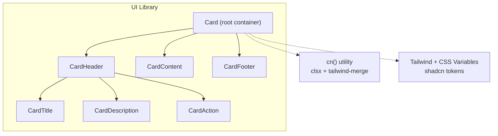
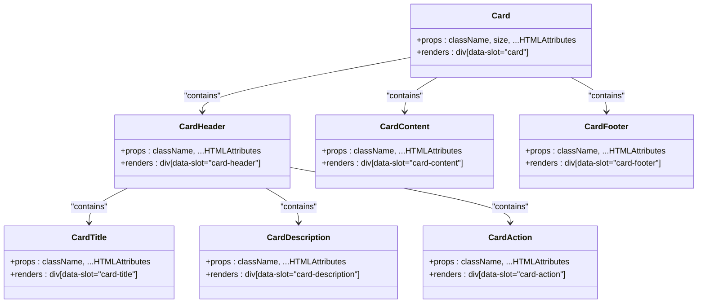
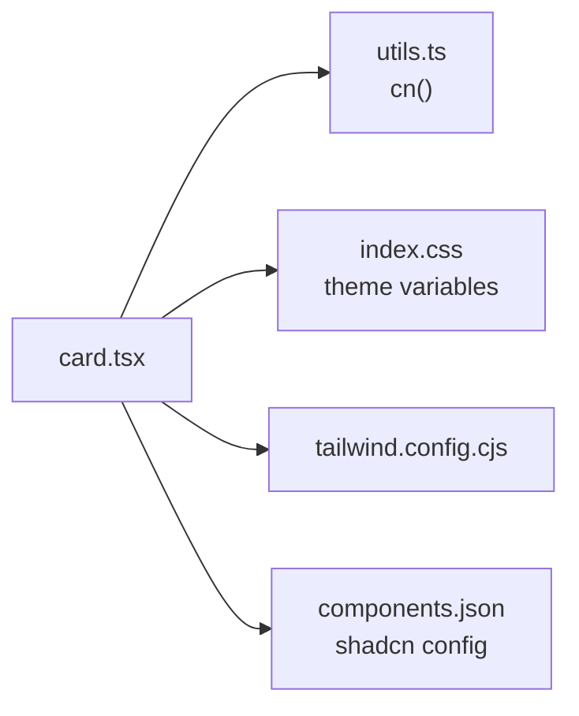

# Card Component

<cite>
**Referenced Files in This Document**
- [card.tsx](file://src/components/ui/card.tsx)
- [utils.ts](file://src/lib/utils.ts)
- [index.css](file://src/index.css)
- [tailwind.config.cjs](file://tailwind.config.cjs)
- [components.json](file://components.json)
</cite>

## Table of Contents
1. [Introduction](#introduction)
2. [Project Structure](#project-structure)
3. [Core Components](#core-components)
4. [Architecture Overview](#architecture-overview)
5. [Detailed Component Analysis](#detailed-component-analysis)
6. [Dependency Analysis](#dependency-analysis)
7. [Performance Considerations](#performance-considerations)
8. [Troubleshooting Guide](#troubleshooting-guide)
9. [Conclusion](#conclusion)
10. [Appendices](#appendices)

## Introduction
This document provides comprehensive documentation for the Card component, including its layout structure, content slots, nesting capabilities, styling options, border treatments, shadow effects, responsive behavior, and accessibility considerations. It also includes guidance on custom styling approaches and theme integration patterns using Tailwind CSS variables and shadcn design tokens.

## Project Structure
The Card component is implemented as a set of composable React components under the UI library folder. The styling system relies on Tailwind CSS with CSS variables for theming and a utility function to merge class names safely.

**Diagram sources**
- [card.tsx:5-21](file://src/components/ui/card.tsx#L5-L21)
- [card.tsx:23-34](file://src/components/ui/card.tsx#L23-L34)
- [card.tsx:36-47](file://src/components/ui/card.tsx#L36-L47)
- [card.tsx:49-57](file://src/components/ui/card.tsx#L49-L57)
- [card.tsx:59-70](file://src/components/ui/card.tsx#L59-L70)
- [card.tsx:72-80](file://src/components/ui/card.tsx#L72-L80)
- [card.tsx:82-93](file://src/components/ui/card.tsx#L82-L93)
- [utils.ts:4-6](file://src/lib/utils.ts#L4-L6)
- [index.css:121-162](file://src/index.css#L121-L162)

**Section sources**
- [card.tsx:1-104](file://src/components/ui/card.tsx#L1-L104)
- [utils.ts:1-7](file://src/lib/utils.ts#L1-L7)
- [index.css:121-162](file://src/index.css#L121-L162)
- [components.json:1-28](file://components.json#L1-L28)

## Core Components
The Card system consists of a root container and several semantic slot components that compose together to form flexible layouts. Each slot uses data attributes for internal styling hooks and supports className overrides via a shared utility.

- Card: Root container providing layout, spacing, overflow handling, and size variants.
- CardHeader: Header area with grid support for title/description/action alignment.
- CardTitle: Primary heading text with size-aware typography.
- CardDescription: Secondary descriptive text styled for muted foreground.
- CardAction: Positioned action element aligned to the top-right within the header grid.
- CardContent: Main content area with consistent horizontal padding.
- CardFooter: Bottom section with top border and subtle background.

Key behaviors:
- Spacing is controlled by a CSS variable (--card-spacing) applied across components.
- Size variant "sm" reduces spacing and adjusts typography.
- First/last image children receive automatic rounded corners at top/bottom edges.
- Footer presence influences bottom padding of the root container.

**Section sources**
- [card.tsx:5-21](file://src/components/ui/card.tsx#L5-L21)
- [card.tsx:23-34](file://src/components/ui/card.tsx#L23-L34)
- [card.tsx:36-47](file://src/components/ui/card.tsx#L36-L47)
- [card.tsx:49-57](file://src/components/ui/card.tsx#L49-L57)
- [card.tsx:59-70](file://src/components/ui/card.tsx#L59-L70)
- [card.tsx:72-80](file://src/components/ui/card.tsx#L72-L80)
- [card.tsx:82-93](file://src/components/ui/card.tsx#L82-L93)

## Architecture Overview
The Card architecture follows a composition pattern where each slot is a lightweight presentational component. Styling is declarative through Tailwind classes and CSS variables, while the cn utility ensures safe merging of class names and avoids conflicts.

**Diagram sources**
- [card.tsx:5-21](file://src/components/ui/card.tsx#L5-L21)
- [card.tsx:23-34](file://src/components/ui/card.tsx#L23-L34)
- [card.tsx:36-47](file://src/components/ui/card.tsx#L36-L47)
- [card.tsx:49-57](file://src/components/ui/card.tsx#L49-L57)
- [card.tsx:59-70](file://src/components/ui/card.tsx#L59-L70)
- [card.tsx:72-80](file://src/components/ui/card.tsx#L72-L80)
- [card.tsx:82-93](file://src/components/ui/card.tsx#L82-L93)

## Detailed Component Analysis

### Layout Structure and Content Slots
- Card establishes a vertical flex layout with consistent gap spacing and overflow hidden. It applies a ring (border-like outline) and background color from theme variables.
- CardHeader sets up a grid that can adapt when an action or description is present, enabling two-column layouts for titles and actions.
- CardContent adds horizontal padding aligned with the card’s spacing variable.
- CardFooter introduces a top border and subtle background, aligning items horizontally.

Usage patterns:
- Nest images inside Card for automatic corner rounding at top/bottom edges.
- Place CardTitle and CardDescription within CardHeader; optionally add CardAction for buttons or icons.
- Use CardContent for body text, lists, or media.
- Use CardFooter for secondary actions like links or small controls.

**Section sources**
- [card.tsx:5-21](file://src/components/ui/card.tsx#L5-L21)
- [card.tsx:23-34](file://src/components/ui/card.tsx#L23-L34)
- [card.tsx:72-80](file://src/components/ui/card.tsx#L72-L80)
- [card.tsx:82-93](file://src/components/ui/card.tsx#L82-L93)

### Styling Options, Border Treatments, and Shadow Effects
- Borders: A subtle ring is applied to the root Card using theme colors. Footer has an explicit top border.
- Shadows: No explicit box-shadow is defined in the Card itself; shadows can be added via className overrides or global styles.
- Colors: Background and text colors are derived from theme variables (e.g., bg-card, text-card-foreground).
- Spacing: Controlled by --card-spacing, which varies between default and sm sizes.
- Typography: Title uses heading font with size adjustments based on card size. Description uses muted foreground.

Customization approach:
- Pass className to any slot to override styles.
- Adjust theme variables for consistent changes across cards.

**Section sources**
- [card.tsx:5-21](file://src/components/ui/card.tsx#L5-L21)
- [card.tsx:36-47](file://src/components/ui/card.tsx#L36-L47)
- [card.tsx:49-57](file://src/components/ui/card.tsx#L49-L57)
- [card.tsx:82-93](file://src/components/ui/card.tsx#L82-L93)
- [index.css:121-162](file://src/index.css#L121-L162)

### Responsive Behavior and Content Overflow Handling
- Overflow: The root Card sets overflow-hidden to contain content and ensure consistent corner rounding.
- Grid: CardHeader uses grid to manage layout; it adapts when action or description slots are present.
- Container queries: A container query token is used in the header for potential responsive behavior.
- Sizing: The size prop switches spacing and typography for compact layouts.

Best practices:
- Avoid excessive nested scrolling; rely on Card’s overflow behavior.
- Use responsive utilities in className to adjust layout at breakpoints.

**Section sources**
- [card.tsx:5-21](file://src/components/ui/card.tsx#L5-L21)
- [card.tsx:23-34](file://src/components/ui/card.tsx#L23-L34)

### Accessibility Features and Semantic HTML Structure
- Semantic elements: All slots render divs with data-slot attributes for internal styling hooks. For better semantics, consider wrapping titles in headings and descriptions in paragraphs when composing content.
- Keyboard navigation: Cards themselves are not interactive; interactivity should be provided by child elements (buttons, links). Ensure focus states are visible via theme ring variables.
- Contrast: Text colors use theme foreground variables to maintain contrast.
- Screen readers: Provide meaningful labels for actions inside CardAction.

Recommendations:
- Use native heading levels for CardTitle when appropriate.
- Add aria-labels or accessible names to interactive elements within the card.

**Section sources**
- [card.tsx:5-21](file://src/components/ui/card.tsx#L5-L21)
- [card.tsx:23-34](file://src/components/ui/card.tsx#L23-L34)
- [card.tsx:36-47](file://src/components/ui/card.tsx#L36-L47)
- [card.tsx:49-57](file://src/components/ui/card.tsx#L49-L57)
- [card.tsx:59-70](file://src/components/ui/card.tsx#L59-L70)
- [card.tsx:72-80](file://src/components/ui/card.tsx#L72-L80)
- [card.tsx:82-93](file://src/components/ui/card.tsx#L82-L93)

### Custom Styling Approaches and Theme Integration Patterns
- Class merging: The cn utility merges multiple class inputs safely, allowing overrides without conflicts.
- Theme variables: Tailwind theme variables define colors and radii; update these to change card appearance globally.
- Shadcn configuration: The project uses shadcn schema with CSS variables enabled, ensuring consistent design tokens.

Patterns:
- Override specific slots via className props.
- Extend theme variables for brand-specific colors and spacing.
- Combine with global styles (e.g., glassmorphism) by applying additional classes to Card.

**Section sources**
- [utils.ts:4-6](file://src/lib/utils.ts#L4-L6)
- [index.css:121-162](file://src/index.css#L121-L162)
- [components.json:1-28](file://components.json#L1-L28)

## Dependency Analysis
The Card components depend on:
- React for rendering and props handling.
- The cn utility for class name merging.
- Tailwind CSS and theme variables for styling.
- shadcn configuration for design tokens.

**Diagram sources**
- [card.tsx:1-3](file://src/components/ui/card.tsx#L1-L3)
- [utils.ts:1-7](file://src/lib/utils.ts#L1-L7)
- [index.css:121-162](file://src/index.css#L121-L162)
- [tailwind.config.cjs:1-17](file://tailwind.config.cjs#L1-L17)
- [components.json:1-28](file://components.json#L1-L28)

**Section sources**
- [card.tsx:1-3](file://src/components/ui/card.tsx#L1-L3)
- [utils.ts:1-7](file://src/lib/utils.ts#L1-L7)
- [index.css:121-162](file://src/index.css#L121-L162)
- [tailwind.config.cjs:1-17](file://tailwind.config.cjs#L1-L17)
- [components.json:1-28](file://components.json#L1-L28)

## Performance Considerations
- Composition overhead: Each slot is a lightweight component; avoid unnecessary re-renders by memoizing parent state where needed.
- Class merging: The cn utility efficiently merges classes; prefer passing arrays or objects to reduce string concatenation.
- Image handling: Automatic corner rounding for first/last images avoids extra wrapper elements.
- Theme variables: Using CSS variables minimizes style recalculations and improves performance across theme changes.

[No sources needed since this section provides general guidance]

## Troubleshooting Guide
Common issues and resolutions:
- Overlapping content: Ensure Card’s overflow-hidden is not clipping important content; adjust padding or remove overflow if necessary.
- Inconsistent spacing: Verify --card-spacing is correctly set and not overridden unintentionally.
- Missing borders: Footer border may be hidden if custom backgrounds override defaults; check z-index and background layers.
- Focus visibility: Ensure interactive elements have visible focus rings; leverage theme ring variables.
- Theme mismatches: Confirm shadcn theme variables are loaded and not conflicting with custom styles.

**Section sources**
- [card.tsx:5-21](file://src/components/ui/card.tsx#L5-L21)
- [card.tsx:82-93](file://src/components/ui/card.tsx#L82-L93)
- [index.css:121-162](file://src/index.css#L121-L162)

## Conclusion
The Card component offers a flexible, theme-driven foundation for building consistent UI surfaces. Its composable slots enable rich layouts while maintaining simplicity. By leveraging Tailwind CSS variables and the cn utility, developers can customize appearance and behavior effectively. Adhering to accessibility best practices ensures inclusive experiences across devices and assistive technologies.

[No sources needed since this section summarizes without analyzing specific files]

## Appendices

### Example Layouts and Use Cases
- Product Card:
  - CardHeader with CardTitle and CardAction (e.g., favorite button).
  - CardContent containing product image and short description.
  - CardFooter with price and “Add to Cart” button.
- Profile Card:
  - CardHeader with avatar image and CardTitle for name.
  - CardDescription for role or location.
  - CardContent with bio or summary.
  - CardFooter with social links or edit button.
- Information Panel:
  - CardHeader with CardTitle and optional CardAction for settings.
  - CardContent with key-value pairs or bullet points.
  - CardFooter with help link or status indicator.

[No sources needed since this section provides conceptual examples]

### Accessibility Checklist
- Use semantic headings for titles when possible.
- Provide accessible names for interactive elements.
- Ensure sufficient color contrast using theme variables.
- Test keyboard navigation and focus order.

[No sources needed since this section provides conceptual guidance]