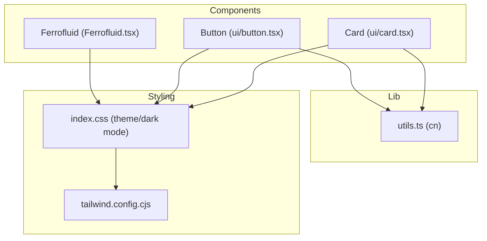
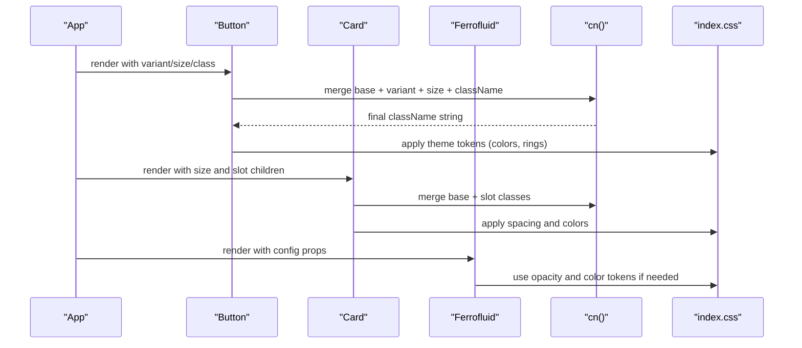
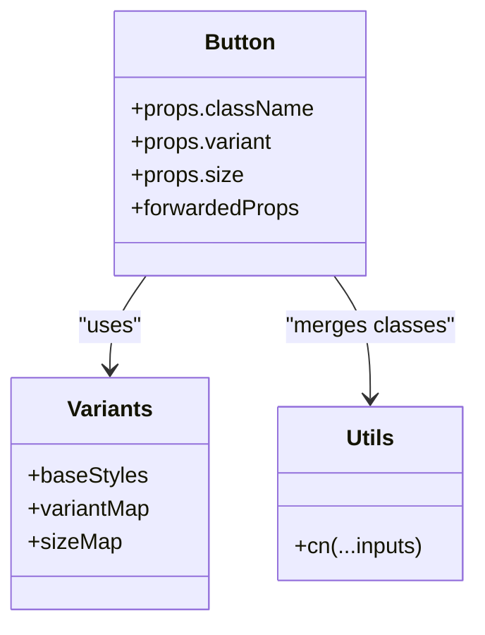
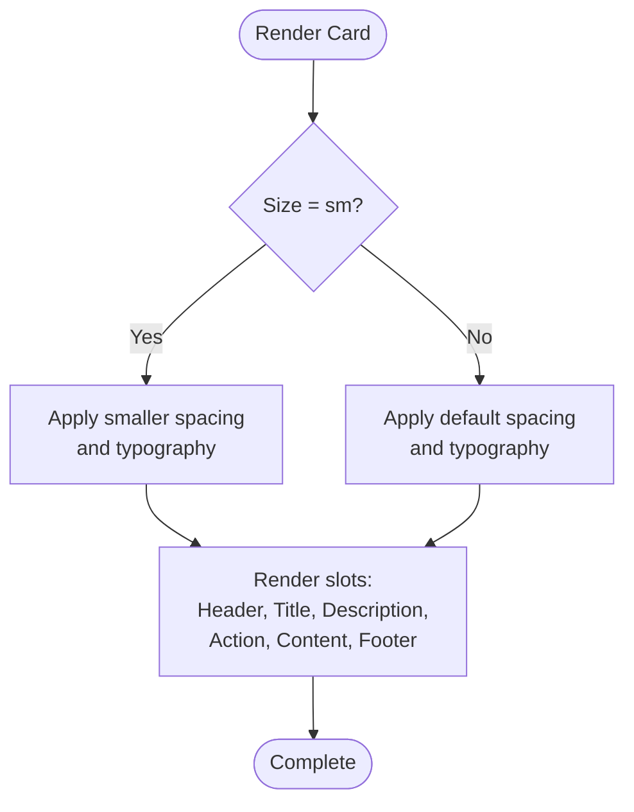
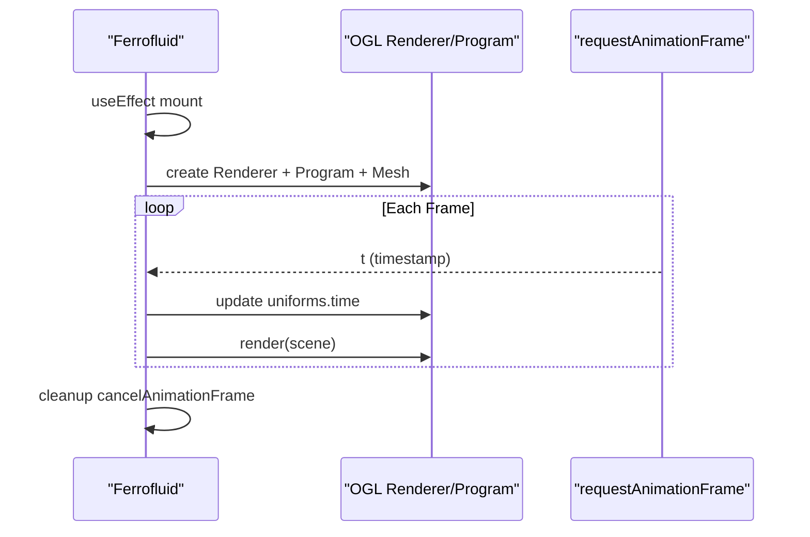
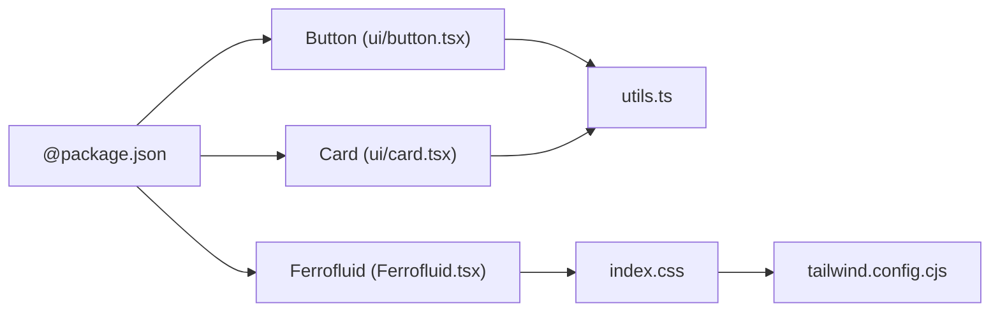

# Component Library

<cite>
**Referenced Files in This Document**
- [button.tsx](file://src/components/ui/button.tsx)
- [card.tsx](file://src/components/ui/card.tsx)
- [Ferrofluid.tsx](file://src/components/Ferrofluid.tsx)
- [utils.ts](file://src/lib/utils.ts)
- [index.css](file://src/index.css)
- [tailwind.config.cjs](file://tailwind.config.cjs)
- [package.json](file://package.json)
</cite>

## Table of Contents
1. [Introduction](#introduction)
2. [Project Structure](#project-structure)
3. [Core Components](#core-components)
4. [Architecture Overview](#architecture-overview)
5. [Detailed Component Analysis](#detailed-component-analysis)
6. [Dependency Analysis](#dependency-analysis)
7. [Performance Considerations](#performance-considerations)
8. [Troubleshooting Guide](#troubleshooting-guide)
9. [Conclusion](#conclusion)
10. [Appendices](#appendices)

## Introduction
This document describes the reusable component library with a focus on:
- Button: props, variants, sizes, styling, and accessibility
- Card: layout options, content slots, and responsive behavior
- Ferrofluid 3D animated background: configuration, performance, and browser compatibility
- Utility functions from utils.ts for class name merging and helper usage
It also includes usage examples, customization guidelines, theming support (including dark mode), and cross-browser testing considerations.

## Project Structure
The component library lives under src/components and src/lib:
- UI primitives are implemented as React components using Tailwind CSS and shadcn-style tokens
- The Ferrofluid component is a WebGL-based animated background using OGL
- Utilities provide class name merging via clsx and tailwind-merge

**Diagram sources**
- [button.tsx](file://src/components/ui/button.tsx)
- [card.tsx](file://src/components/ui/card.tsx)
- [Ferrofluid.tsx](file://src/components/Ferrofluid.tsx)
- [utils.ts](file://src/lib/utils.ts)
- [index.css](file://src/index.css)
- [tailwind.config.cjs](file://tailwind.config.cjs)

**Section sources**
- [button.tsx](file://src/components/ui/button.tsx)
- [card.tsx](file://src/components/ui/card.tsx)
- [Ferrofluid.tsx](file://src/components/Ferrofluid.tsx)
- [utils.ts](file://src/lib/utils.ts)
- [index.css](file://src/index.css)
- [tailwind.config.cjs](file://tailwind.config.cjs)

## Core Components
- Button: A styled, accessible button built on Base UI primitives with class-variance-authority for variants and sizes.
- Card: A composable card system with header, title, description, action, content, and footer slots.
- Ferrofluid: A WebGL canvas-based animated background component using OGL.
- Utils: A single utility function to merge class names safely with Tailwind precedence.

**Section sources**
- [button.tsx](file://src/components/ui/button.tsx)
- [card.tsx](file://src/components/ui/card.tsx)
- [Ferrofluid.tsx](file://src/components/Ferrofluid.tsx)
- [utils.ts](file://src/lib/utils.ts)

## Architecture Overview
The components follow a consistent pattern:
- Styling via Tailwind classes merged through cn()
- Theme variables defined in index.css for light/dark modes
- Optional CSS imports per component (e.g., Ferrofluid.css referenced by the component)

**Diagram sources**
- [button.tsx](file://src/components/ui/button.tsx)
- [card.tsx](file://src/components/ui/card.tsx)
- [Ferrofluid.tsx](file://src/components/Ferrofluid.tsx)
- [utils.ts](file://src/lib/utils.ts)
- [index.css](file://src/index.css)

## Detailed Component Analysis

### Button Component
- Purpose: Accessible, theme-aware button with multiple visual variants and sizes.
- Props:
  - className: additional Tailwind classes
  - variant: default | outline | secondary | ghost | destructive | link
  - size: default | xs | sm | lg | icon | icon-xs | icon-sm | icon-lg
  - All other props are forwarded to the underlying Base UI button primitive
- Styling:
  - Uses cva to compose base styles with variant and size-specific classes
  - Integrates focus-visible ring, disabled states, aria-invalid handling, and dark mode overrides
  - Icons scale automatically when no explicit size class is provided
- Accessibility:
  - Built on an accessible button primitive
  - Focus ring and keyboard navigation supported
  - aria-invalid styles applied when invalid state is set by parent logic
- Usage example:
  - Import and render <Button variant="outline" size="sm">Save</Button>
  - Add icons via slot or child elements; ensure proper sizing
- Customization:
  - Extend variants/sizes by updating the cva definition
  - Override theme tokens in index.css for global color changes

**Diagram sources**
- [button.tsx](file://src/components/ui/button.tsx)
- [utils.ts](file://src/lib/utils.ts)

**Section sources**
- [button.tsx](file://src/components/ui/button.tsx)
- [utils.ts](file://src/lib/utils.ts)

### Card Component
- Purpose: Composable container for structured content with consistent spacing and responsive layout.
- Slots:
  - CardHeader: grid layout with optional action placement
  - CardTitle: heading text with size-aware typography
  - CardDescription: muted description text
  - CardAction: positioned action element (e.g., menu, button)
  - CardContent: main content area with padding
  - CardFooter: bottom bar with border-top and background
- Props:
  - className: additional classes
  - size: default | sm (adjusts spacing and typography)
- Layout and responsiveness:
  - Uses CSS Grid in header to align title/description and action
  - Image-first-child rules adjust padding and border radius
  - Spacing controlled via CSS variable (--card-spacing)
- Usage example:
  - Wrap content in Card, then add Header, Title, Description, Action, Content, Footer as needed
- Customization:
  - Adjust --card-spacing via inline style or CSS
  - Override slot classes via className prop

**Diagram sources**
- [card.tsx](file://src/components/ui/card.tsx)

**Section sources**
- [card.tsx](file://src/components/ui/card.tsx)

### Ferrofluid 3D Animated Background
- Purpose: WebGL-powered animated background using OGL with shader-driven visuals.
- Configuration props:
  - colors: array of hex strings used by the shader palette
  - speed: animation time multiplier
  - opacity: overall canvas opacity
  - Additional props exist in the type but only colors, speed, and opacity are actively used in the effect
- Rendering:
  - Creates an OGL Renderer and Program with vertex/fragment shaders
  - Updates time uniform each frame via requestAnimationFrame
  - Renders a full-screen triangle mesh
- Browser compatibility:
  - Requires WebGL2; falls back to empty canvas if not available
- Performance considerations:
  - Single draw call per frame
  - Avoid heavy computations in fragment shader
  - Limit re-renders by memoizing props where appropriate
- Usage example:
  - Place <Ferrofluid colors={['#4F46E5','#06B6D4','#E0F2FE']} speed={0.5} opacity={1} /> behind content
- Customization:
  - Extend shader uniforms and logic for advanced effects
  - Ensure CSS class ferrofluid-canvas positions the canvas appropriately

**Diagram sources**
- [Ferrofluid.tsx](file://src/components/Ferrofluid.tsx)

**Section sources**
- [Ferrofluid.tsx](file://src/components/Ferrofluid.tsx)

### Utility Functions (utils.ts)
- Function: cn(...inputs)
- Purpose: Safely merges class values with Tailwind precedence using clsx and tailwind-merge
- Usage:
  - Combine base styles, conditional classes, and user-provided className
  - Ensures later classes override earlier ones deterministically

**Section sources**
- [utils.ts](file://src/lib/utils.ts)

## Dependency Analysis
Key dependencies:
- @base-ui/react: provides accessible primitives for Button
- class-variance-authority: defines Button variants and sizes
- clsx and tailwind-merge: power the cn utility
- ogl: WebGL rendering for Ferrofluid
- Tailwind CSS and shadcn theme: define design tokens and dark mode

**Diagram sources**
- [package.json](file://package.json)
- [button.tsx](file://src/components/ui/button.tsx)
- [card.tsx](file://src/components/ui/card.tsx)
- [Ferrofluid.tsx](file://src/components/Ferrofluid.tsx)
- [utils.ts](file://src/lib/utils.ts)
- [index.css](file://src/index.css)
- [tailwind.config.cjs](file://tailwind.config.cjs)

**Section sources**
- [package.json](file://package.json)

## Performance Considerations
- Button and Card:
  - Lightweight; rely on Tailwind utilities and minimal runtime logic
  - Keep className composition simple to avoid unnecessary recompositions
- Ferrofluid:
  - Runs a continuous render loop; consider pausing animations when offscreen
  - Use WebGL2 detection to avoid initialization on unsupported browsers
  - Minimize prop churn to prevent re-creating programs and meshes
- Theming:
  - CSS variables enable fast theme switching without JS overhead
  - Dark mode toggling should be done at the root level to minimize reflows

[No sources needed since this section provides general guidance]

## Troubleshooting Guide
- Button not showing expected variant:
  - Verify variant value matches one of the defined options
  - Check that className does not override critical styles unintentionally
- Card spacing looks off:
  - Confirm --card-spacing is set correctly
  - Ensure slot order follows expected structure (header before content)
- Ferrofluid not visible:
  - Ensure WebGL2 is supported in the target environment
  - Verify the canvas has dimensions and is not hidden by CSS
  - Confirm the imported CSS file exists if required by the component
- Class conflicts:
  - Use cn() to merge classes consistently
  - Place custom overrides after base classes to take precedence

**Section sources**
- [button.tsx](file://src/components/ui/button.tsx)
- [card.tsx](file://src/components/ui/card.tsx)
- [Ferrofluid.tsx](file://src/components/Ferrofluid.tsx)
- [utils.ts](file://src/lib/utils.ts)

## Conclusion
The component library provides accessible, theme-aware UI primitives and a performant animated background. By leveraging Tailwind, shadcn tokens, and a small set of utilities, it offers a consistent and customizable foundation. Follow the usage patterns and customization guidelines to integrate these components effectively across your application.

[No sources needed since this section summarizes without analyzing specific files]

## Appendices

### Theming and Dark Mode
- Global theme variables are defined in index.css for both light and dark modes
- Components inherit colors and tokens via Tailwind utilities and CSS variables
- Toggle dark mode by adding/removing the .dark class at the root level

**Section sources**
- [index.css](file://src/index.css)

### Cross-Browser Testing Considerations
- Test Button focus rings and aria-invalid states across browsers
- Validate Card grid layouts and image-first-child behaviors
- For Ferrofluid, verify WebGL2 availability and fallback behavior
- Ensure backdrop-filter and mask properties work as expected in target browsers

**Section sources**
- [index.css](file://src/index.css)
- [Ferrofluid.tsx](file://src/components/Ferrofluid.tsx)

### Integration Patterns
- Import components from their respective paths and use them within your app tree
- Pass theme tokens via CSS variables for consistent appearance
- Use cn() whenever composing dynamic classes

**Section sources**
- [button.tsx](file://src/components/ui/button.tsx)
- [card.tsx](file://src/components/ui/card.tsx)
- [utils.ts](file://src/lib/utils.ts)