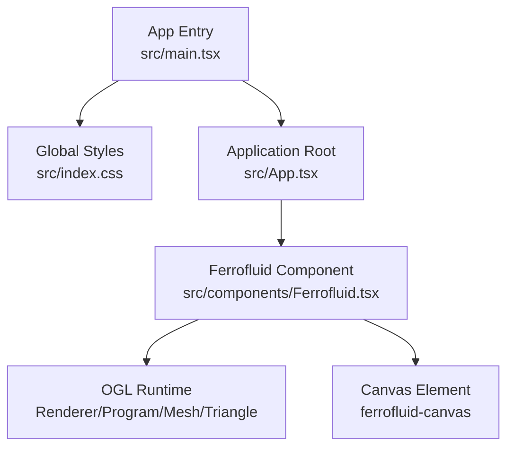
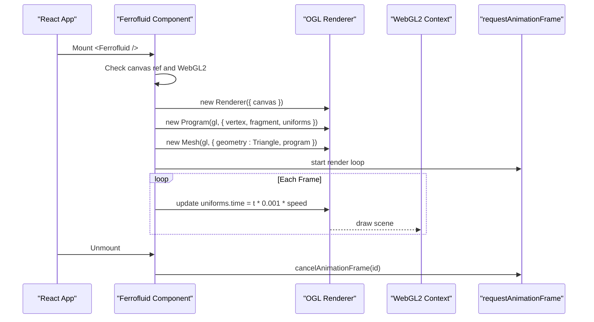
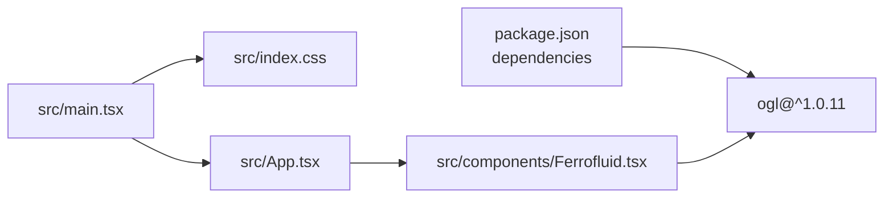

# Ferrofluid 3D Background

<cite>
**Referenced Files in This Document**
- [Ferrofluid.tsx](file://src/components/Ferrofluid.tsx)
- [package.json](file://package.json)
- [index.css](file://src/index.css)
- [main.tsx](file://src/main.tsx)
</cite>

## Table of Contents
1. [Introduction](#introduction)
2. [Project Structure](#project-structure)
3. [Core Components](#core-components)
4. [Architecture Overview](#architecture-overview)
5. [Detailed Component Analysis](#detailed-component-analysis)
6. [Dependency Analysis](#dependency-analysis)
7. [Performance Considerations](#performance-considerations)
8. [Troubleshooting Guide](#troubleshooting-guide)
9. [Conclusion](#conclusion)
10. [Appendices](#appendices)

## Introduction
This document provides comprehensive documentation for the Ferrofluid 3D animated background component used in the project. It explains how to set up and integrate the component, its configuration options (animation speed, color schemes, opacity), performance settings, browser compatibility requirements, WebGL dependencies, and optimization techniques. It also includes guidance on memory management, common issues, and integration examples with different page layouts and themes.

## Project Structure
The Ferrofluid component is implemented as a React functional component that renders a canvas and uses OGL (a lightweight WebGL library) to run a shader-based animation loop. The application entry point initializes React and imports global styles.

**Diagram sources**
- [main.tsx:1-11](file://src/main.tsx#L1-L11)
- [index.css:1-20](file://src/index.css#L1-L20)
- [Ferrofluid.tsx:1-116](file://src/components/Ferrofluid.tsx#L1-L116)

**Section sources**
- [main.tsx:1-11](file://src/main.tsx#L1-L11)
- [index.css:1-20](file://src/index.css#L1-L20)

## Core Components
- Ferrofluid component: A React component that sets up an OGL renderer, compiles vertex and fragment shaders, creates a full-screen triangle mesh, and animates using requestAnimationFrame. It accepts props for colors, speed, and opacity, and renders a canvas element with class ferrofluid-canvas.

Key responsibilities:
- Validate WebGL2 availability and bail out if unsupported.
- Create OGL Renderer and Program with uniforms (time, resolution, opacity, colors).
- Render a single triangle geometry covering the viewport.
- Update time uniform per frame based on speed prop.
- Clean up animation frame on unmount.

**Section sources**
- [Ferrofluid.tsx:1-116](file://src/components/Ferrofluid.tsx#L1-L116)

## Architecture Overview
The Ferrofluid component integrates into the React tree via the main entry point and global styles. At runtime, it initializes OGL and runs a GPU-accelerated shader loop.

**Diagram sources**
- [Ferrofluid.tsx:56-111](file://src/components/Ferrofluid.tsx#L56-L111)

## Detailed Component Analysis

### Prop Interface and Defaults
The component exposes a typed prop interface for customization. Only colors, speed, and opacity are actively used in the current implementation; other declared props are reserved for future enhancements.

- colors: Array of hex color strings (default three-color palette). Internally converted to normalized RGB arrays and passed as a uniform array.
- speed: Number controlling animation time scaling (default 0.5).
- opacity: Number controlling fragment alpha (default 1).
- Additional props defined in the type include scale, turbulence, fluidity, rimWidth, sharpness, shimmer, glow, flowDirection, mouseInteraction, mouseStrength, mouseRadius. These are not wired into the shader or logic in the current code.

Usage example (conceptual):
- Provide a custom palette by passing colors.
- Adjust speed to make the animation faster or slower.
- Control overall visibility with opacity.

**Section sources**
- [Ferrofluid.tsx:31-53](file://src/components/Ferrofluid.tsx#L31-L53)
- [Ferrofluid.tsx:48-53](file://src/components/Ferrofluid.tsx#L48-L53)

### Shader and Rendering Pipeline
- Vertex shader: Maps UV coordinates to clip space for a full-screen triangle.
- Fragment shader: Uses a simple noise function to blend between two colors from the provided palette and applies opacity. Resolution and time uniforms drive visual variation.
- Uniforms:
  - time: Updated each frame based on timestamp and speed.
  - resolution: Canvas width and height.
  - opacity: Controlled by prop.
  - colors: Flattened array of RGB triples prepared from input hex colors.

Rendering loop:
- Creates a Mesh with a Triangle geometry and the compiled Program.
- Calls renderer.render each frame.
- Schedules next frame via requestAnimationFrame.

Memory management:
- Animation frame ID is stored and canceled on cleanup to prevent leaks.
- OGL resources are tied to the canvas lifecycle; ensure the canvas is removed when the component unmounts.

**Section sources**
- [Ferrofluid.tsx:64-106](file://src/components/Ferrofluid.tsx#L64-L106)
- [Ferrofluid.tsx:101-111](file://src/components/Ferrofluid.tsx#L101-L111)

### CSS and Styling
- The component imports a local CSS file (Ferrofluid.css) which is not present in the repository. The canvas element receives the class ferrofluid-canvas.
- Global styles define base body background and theme variables. You can style the canvas container to position the background behind content.

Integration tips:
- Use absolute positioning and z-index to place the canvas behind UI layers.
- Ensure the canvas fills its container and respects aspect ratio.

**Section sources**
- [Ferrofluid.tsx:3](file://src/components/Ferrofluid.tsx#L3)
- [Ferrofluid.tsx:113](file://src/components/Ferrofluid.tsx#L113)
- [index.css:10-16](file://src/index.css#L10-L16)

### Browser Compatibility and WebGL Dependencies
- Requires WebGL2 support; the component checks getContext('webgl2') and returns early without rendering if unavailable.
- Modern browsers support WebGL2; older browsers may fall back to an empty canvas.

Recommendations:
- Detect WebGL2 capability before mounting heavy visuals.
- Provide a graceful fallback (e.g., static gradient background) when WebGL2 is missing.

**Section sources**
- [Ferrofluid.tsx:56-59](file://src/components/Ferrofluid.tsx#L56-L59)

### Integration Examples
Conceptual usage patterns:
- Full-page background: Place the component at the root of your layout with absolute positioning and a high z-index behind content.
- Section background: Wrap a section with a container that positions the canvas absolutely within it.
- Theme-aware colors: Pass colors derived from Tailwind theme variables or CSS custom properties.

Note: These are conceptual examples; actual implementation depends on your layout structure.

[No sources needed since this section doesn't analyze specific files]

## Dependency Analysis
The component relies on OGL for WebGL operations and React for lifecycle management. The application’s package manifest declares OGL as a dependency.

**Diagram sources**
- [package.json:12-28](file://package.json#L12-L28)
- [main.tsx:1-11](file://src/main.tsx#L1-L11)
- [Ferrofluid.tsx:1-3](file://src/components/Ferrofluid.tsx#L1-L3)

**Section sources**
- [package.json:12-28](file://package.json#L12-L28)
- [Ferrofluid.tsx:1-3](file://src/components/Ferrofluid.tsx#L1-L3)

## Performance Considerations
Optimization strategies:
- Keep the shader simple: The current fragment shader uses basic noise and color blending, which is efficient. Avoid heavy computations in the fragment shader.
- Limit re-renders: The effect depends on colors, speed, and opacity. Avoid frequent prop changes to reduce re-initialization.
- Resize handling: If the canvas size changes, update resolution uniforms accordingly. Currently, resolution is set once at mount.
- Throttling animations: On low-power devices, consider reducing frame rate or pausing animation when the tab is hidden.
- Memory cleanup: Ensure animation frames are canceled and OGL resources are released when the component unmounts. The current implementation cancels the animation frame correctly.

Potential improvements:
- Add resize observer to update resolution dynamically.
- Debounce or throttle updates to uniforms when props change frequently.
- Implement visibility API to pause rendering when the canvas is off-screen or the tab is inactive.

[No sources needed since this section provides general guidance]

## Troubleshooting Guide
Common issues and resolutions:
- Blank canvas:
  - Cause: WebGL2 not available or canvas dimensions are zero.
  - Resolution: Verify getContext('webgl2') succeeds; ensure the canvas has non-zero width/height.
- No animation:
  - Cause: Animation loop not started or speed set to zero.
  - Resolution: Confirm requestAnimationFrame is called and speed > 0.
- Colors not updating:
  - Cause: Props changed but effect did not re-run due to reference equality.
  - Resolution: Ensure colors array is stable or memoized; avoid creating new arrays on every render.
- Performance drops:
  - Cause: Excessive re-renders or heavy shader work.
  - Resolution: Reduce prop churn, simplify shader, and consider pausing when off-screen.

**Section sources**
- [Ferrofluid.tsx:56-59](file://src/components/Ferrofluid.tsx#L56-L59)
- [Ferrofluid.tsx:101-111](file://src/components/Ferrofluid.tsx#L101-L111)

## Conclusion
The Ferrofluid component provides a lightweight, GPU-accelerated animated background using OGL and WebGL2. It supports configurable colors, speed, and opacity, with a straightforward integration pattern. For best results, ensure WebGL2 support, manage canvas sizing, and optimize prop stability to maintain smooth performance across devices.

[No sources needed since this section summarizes without analyzing specific files]

## Appendices

### Setup Instructions
- Install dependencies: Ensure ogl is listed in package.json dependencies.
- Import and render the component where you want the background.
- Style the canvas container to overlay content appropriately.

**Section sources**
- [package.json:12-28](file://package.json#L12-L28)
- [Ferrofluid.tsx:113](file://src/components/Ferrofluid.tsx#L113)

### Prop Reference Summary
- colors: string[] — Hex color palette for the shader.
- speed: number — Time scaling factor for animation.
- opacity: number — Fragment alpha value.
- Reserved props (not wired yet): scale, turbulence, fluidity, rimWidth, sharpness, shimmer, glow, flowDirection, mouseInteraction, mouseStrength, mouseRadius.

**Section sources**
- [Ferrofluid.tsx:31-46](file://src/components/Ferrofluid.tsx#L31-L46)
- [Ferrofluid.tsx:48-53](file://src/components/Ferrofluid.tsx#L48-L53)