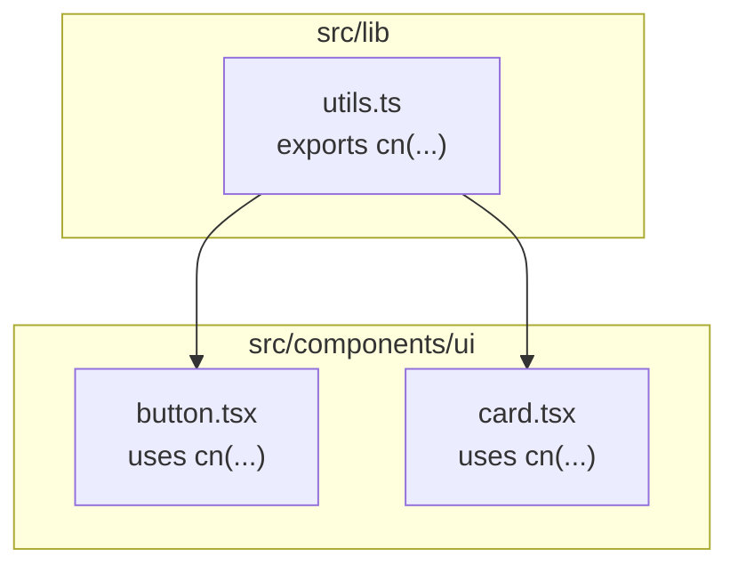
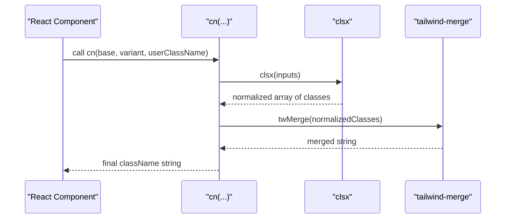
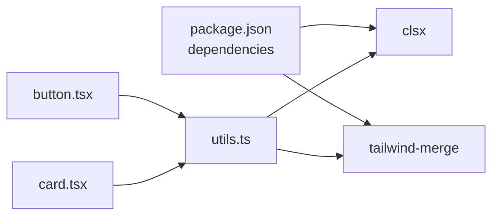

# Utility Functions

<cite>
**Referenced Files in This Document**
- [utils.ts](file://src/lib/utils.ts)
- [button.tsx](file://src/components/ui/button.tsx)
- [card.tsx](file://src/components/ui/card.tsx)
- [package.json](file://package.json)
</cite>

## Table of Contents
1. [Introduction](#introduction)
2. [Project Structure](#project-structure)
3. [Core Components](#core-components)
4. [Architecture Overview](#architecture-overview)
5. [Detailed Component Analysis](#detailed-component-analysis)
6. [Dependency Analysis](#dependency-analysis)
7. [Performance Considerations](#performance-considerations)
8. [Troubleshooting Guide](#troubleshooting-guide)
9. [Conclusion](#conclusion)

## Introduction
This document explains the utility functions exposed from src/lib/utils.ts, with a focus on the cn function used to merge Tailwind CSS class names safely and efficiently. It also covers how these utilities are used across React components, TypeScript typing patterns, performance considerations, and best practices.

## Project Structure
The project is a React + TypeScript application using Vite. The utility layer lives under src/lib, where utils.ts provides a single, focused helper for class name merging. UI components under src/components/ui consume this helper to compose dynamic styles based on props and state.

**Diagram sources**
- [utils.ts:1-7](file://src/lib/utils.ts#L1-L7)
- [button.tsx:1-57](file://src/components/ui/button.tsx#L1-L57)
- [card.tsx:1-104](file://src/components/ui/card.tsx#L1-L104)

**Section sources**
- [utils.ts:1-7](file://src/lib/utils.ts#L1-L7)
- [button.tsx:1-57](file://src/components/ui/button.tsx#L1-L57)
- [card.tsx:1-104](file://src/components/ui/card.tsx#L1-L104)

## Core Components
- cn(...inputs: ClassValue[]): string
  - Purpose: Safely merges multiple class values into a single, deduplicated, conflict-resolved class string suitable for className attributes.
  - Inputs: One or more ClassValue items (strings, arrays, objects, null/undefined).
  - Output: A single string of merged classes.
  - Behavior: Uses clsx to normalize inputs and tailwind-merge to resolve conflicts deterministically.

Usage highlights:
- Accepts any combination of strings, arrays, and conditional objects.
- Resolves conflicting Tailwind classes so that later classes override earlier ones.
- Ignores falsy values like null and undefined.

TypeScript types:
- Input type is ClassValue from clsx, which includes string, Record<string, boolean>, Array<ClassValue>, null, undefined.
- Return type is string.

Error handling:
- No runtime errors expected; invalid inputs are ignored per clsx semantics.
- If unexpected non-ClassValue types are passed, behavior follows clsx rules (typically ignored or coerced).

Practical examples in React components:
- Button component composes base styles with variant/size variants and user-provided className via cn.
- Card components pass default classes and allow overrides through className prop.

Best practices:
- Always pass a base class string first, then variant classes, then user className last to ensure proper override order.
- Prefer object syntax for conditional classes to keep code readable.
- Avoid passing duplicate or conflicting classes manually; let cn handle resolution.

**Section sources**
- [utils.ts:4-6](file://src/lib/utils.ts#L4-L6)
- [button.tsx:44-56](file://src/components/ui/button.tsx#L44-L56)
- [card.tsx:5-21](file://src/components/ui/card.tsx#L5-L21)

## Architecture Overview
The cn utility is a thin wrapper around two libraries:
- clsx: Normalizes and filters class inputs (handles arrays, objects, falsy values).
- tailwind-merge: Merges Tailwind classes deterministically, resolving conflicts by specificity and order.

**Diagram sources**
- [utils.ts:1-6](file://src/lib/utils.ts#L1-L6)

## Detailed Component Analysis

### cn Function
- Signature: cn(...inputs: ClassValue[]): string
- Responsibilities:
  - Normalize inputs via clsx.
  - Resolve Tailwind conflicts via tailwind-merge.
  - Return a deterministic, minimal class string.

Complexity:
- Time complexity: O(n) over number of input tokens due to normalization and merging.
- Space complexity: O(n) for intermediate arrays and resulting string.

Optimization opportunities:
- Keep inputs small and avoid unnecessary arrays or deeply nested conditionals.
- Memoize computed class lists when used in frequently re-rendered components.

Error handling:
- Gracefully ignores null/undefined and other falsy values.
- Non-string/class-like inputs are handled by clsx; prefer explicit types to avoid surprises.

Type definitions and generics:
- Uses ClassValue from clsx for strong typing.
- No custom generics; leverages existing union types for flexibility.

Example usage patterns:
- Conditional classes: cn("base", isActive && "active")
- Variant composition: cn(variantClass, sizeClass, className)
- Object-based conditions: cn("base", { active: isActive, disabled: isDisabled })

**Section sources**
- [utils.ts:1-7](file://src/lib/utils.ts#L1-L7)

### Button Component Usage
- Composes base styles with variant and size variants defined via class-variance-authority.
- Passes user className through cn to allow overrides while preserving internal defaults.

Key points:
- Variants define mutually exclusive style sets.
- cn ensures user className takes precedence when provided.

**Section sources**
- [button.tsx:6-41](file://src/components/ui/button.tsx#L6-L41)
- [button.tsx:43-56](file://src/components/ui/button.tsx#L43-L56)

### Card Components Usage
- Multiple subcomponents (Card, CardHeader, CardTitle, etc.) use cn to combine default layout classes with optional overrides.
- Consistent pattern: default classes first, then className prop.

Key points:
- Enables consistent styling across card parts while allowing customization.
- Keeps component APIs simple with className prop.

**Section sources**
- [card.tsx:5-21](file://src/components/ui/card.tsx#L5-L21)
- [card.tsx:23-34](file://src/components/ui/card.tsx#L23-L34)
- [card.tsx:36-47](file://src/components/ui/card.tsx#L36-L47)
- [card.tsx:49-57](file://src/components/ui/card.tsx#L49-L57)
- [card.tsx:59-70](file://src/components/ui/card.tsx#L59-L70)
- [card.tsx:72-80](file://src/components/ui/card.tsx#L72-L80)
- [card.tsx:82-93](file://src/components/ui/card.tsx#L82-L93)

## Dependency Analysis
External dependencies relevant to utilities:
- clsx: Input normalization and filtering.
- tailwind-merge: Deterministic Tailwind class merging.

These are declared in package.json and imported directly by utils.ts.

**Diagram sources**
- [package.json:12-28](file://package.json#L12-L28)
- [utils.ts:1-2](file://src/lib/utils.ts#L1-L2)
- [button.tsx:4](file://src/components/ui/button.tsx#L4)
- [card.tsx:3](file://src/components/ui/card.tsx#L3)

**Section sources**
- [package.json:12-28](file://package.json#L12-L28)
- [utils.ts:1-2](file://src/lib/utils.ts#L1-L2)

## Performance Considerations
- cn is lightweight but still performs normalization and merging on every render.
- For high-frequency updates, consider memoizing class arrays or derived class strings using useMemo.
- Avoid large conditional expressions inside className; precompute them outside render when possible.
- Ensure variant systems (like class-variance-authority) return stable class strings to minimize churn.

[No sources needed since this section provides general guidance]

## Troubleshooting Guide
Common issues and resolutions:
- Classes not overriding as expected:
  - Ensure user className is passed last to cn so it has highest priority.
  - Verify variant classes do not unintentionally include conflicting modifiers.
- Unexpected empty className:
  - Check for incorrect conditional logic producing falsy values.
  - Confirm inputs are valid ClassValue types.
- Type errors in TypeScript:
  - Use object syntax for conditional classes to satisfy ClassValue typing.
  - Avoid passing raw numbers or non-class-like values.

Debugging tips:
- Log the result of cn(...) during development to inspect merged output.
- Use browser DevTools to verify applied classes and specificity.

**Section sources**
- [utils.ts:4-6](file://src/lib/utils.ts#L4-L6)
- [button.tsx:44-56](file://src/components/ui/button.tsx#L44-L56)
- [card.tsx:5-21](file://src/components/ui/card.tsx#L5-L21)

## Conclusion
The cn utility centralizes class name merging across the application, providing a consistent, type-safe, and performant way to compose Tailwind classes. By leveraging clsx and tailwind-merge, it simplifies conditional styling and ensures predictable overrides. Following the recommended usage patterns and performance tips will help maintain clean, efficient, and scalable UI code.

[No sources needed since this section summarizes without analyzing specific files]