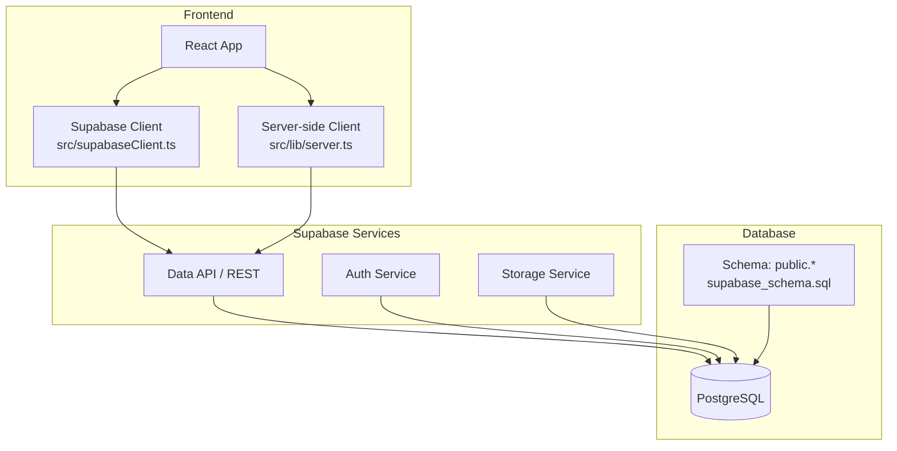
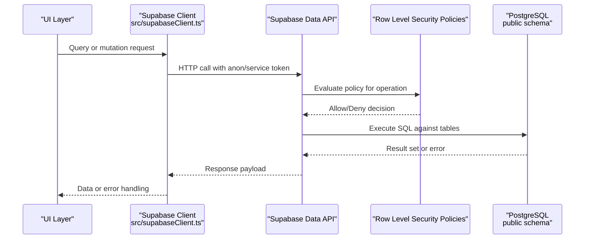
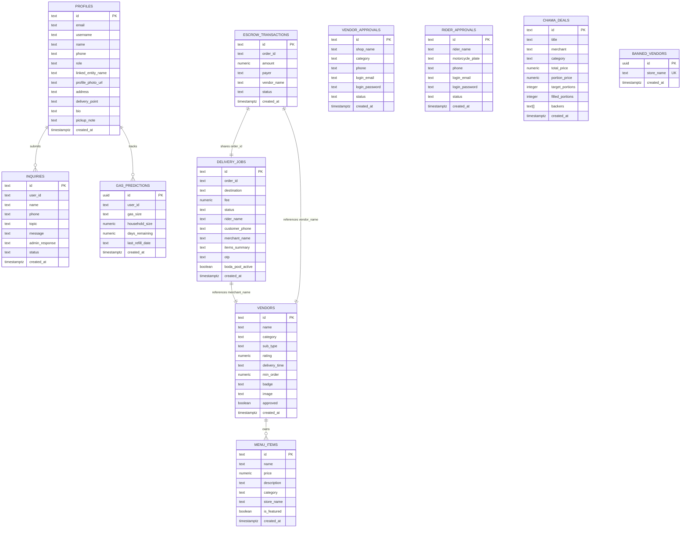
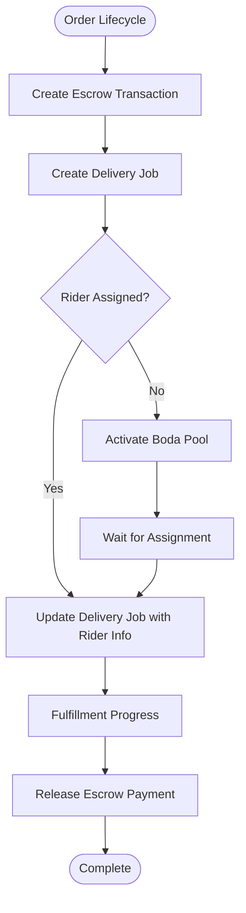
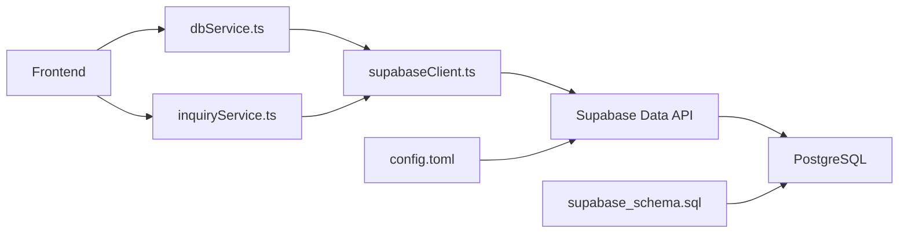

# Database Schema Design

<cite>
**Referenced Files in This Document**
- [supabase_schema.sql](file://supabase_schema.sql)
- [config.toml](file://supabase/config.toml)
- [SUPABASE.md](file://SUPABASE.md)
- [supabaseClient.ts](file://src/supabaseClient.ts)
- [server.ts](file://src/lib/server.ts)
- [dbService.ts](file://src/supabase/dbService.ts)
- [inquiryService.ts](file://src/supabase/inquiryService.ts)
- [security-rls-basics.md](file://.agents/skills/supabase-postgres-best-practices/references/security-rls-basics.md)
- [security-rls-performance.md](file://.agents/skills/supabase-postgres-best-practices/references/security-rls-performance.md)
- [schema-constraints.md](file://.agents/skills/supabase-postgres-best-practices/references/schema-constraints.md)
- [query-index-types.md](file://.agents/skills/supabase-postgres-best-practices/references/query-index-types.md)
- [data-batch-inserts.md](file://.agents/skills/supabase-postgres-best-practices/references/data-batch-inserts.md)
</cite>

## Table of Contents
1. [Introduction](#introduction)
2. [Project Structure](#project-structure)
3. [Core Components](#core-components)
4. [Architecture Overview](#architecture-overview)
5. [Detailed Component Analysis](#detailed-component-analysis)
6. [Dependency Analysis](#dependency-analysis)
7. [Performance Considerations](#performance-considerations)
8. [Troubleshooting Guide](#troubleshooting-guide)
9. [Conclusion](#conclusion)
10. [Appendices](#appendices)

## Introduction
This document provides comprehensive data model documentation for the Match & Market database schema hosted on Supabase/PostgreSQL. It details entity relationships among users, vendors, products (menu items), orders (via escrow and delivery jobs), deliveries, and payments, along with table structures, field definitions, data types, constraints, Row Level Security (RLS) policies, and access permissions. It also includes schema diagrams, data validation rules, referential integrity measures, migration strategies, backup procedures, and performance optimization techniques such as indexing and query tuning.

## Project Structure
The project uses a Supabase-backed PostgreSQL database with a declarative SQL schema file that defines tables, indexes, and RLS policies. The frontend integrates via a shared Supabase client and service wrappers to perform CRUD operations. Configuration for local development is provided through a Supabase configuration file.

**Diagram sources**
- [supabase_schema.sql:1-198](file://supabase_schema.sql#L1-L198)
- [supabaseClient.ts:1-7](file://src/supabaseClient.ts#L1-L7)
- [server.ts:1-29](file://src/lib/server.ts#L1-L29)
- [config.toml:1-120](file://supabase/config.toml#L1-L120)

**Section sources**
- [supabase_schema.sql:1-198](file://supabase_schema.sql#L1-L198)
- [config.toml:1-120](file://supabase/config.toml#L1-L120)
- [SUPABASE.md:1-38](file://SUPABASE.md#L1-L38)

## Core Components
The database schema defines the following core entities:
- Profiles (users)
- Vendors (stores/merchants)
- Menu Items (products/dishes)
- Escrow Transactions (payments ledger)
- Delivery Jobs (dispatch and rider assignments)
- Gas Predictions (utility tracker)
- Inquiries (support messages)
- Vendor Approvals (registration queue)
- Rider Approvals (onboarding queue)
- Chama Deals (bulk buying groups)
- Banned Vendors (blacklist)

Key characteristics:
- Primary keys are defined per table; most use TEXT identifiers, while some use UUIDs.
- Timestamps default to current time using TIMESTAMPTZ.
- Numeric fields store monetary values and counts.
- Boolean flags control features like approvals and pool activation.
- Arrays support backing lists for group deals.

**Section sources**
- [supabase_schema.sql:8-163](file://supabase_schema.sql#L8-L163)

## Architecture Overview
The system architecture connects the React frontend to Supabase services and the underlying PostgreSQL database. The schema script establishes all tables and applies RLS policies to enforce data access controls.

**Diagram sources**
- [supabaseClient.ts:1-7](file://src/supabaseClient.ts#L1-L7)
- [supabase_schema.sql:166-198](file://supabase_schema.sql#L166-L198)

## Detailed Component Analysis

### Entity Relationship Model
The primary entities and their relationships are modeled as follows:
- Users (profiles) interact with inquiries and gas predictions.
- Vendors own menu items.
- Orders are represented indirectly via escrow transactions and delivery jobs.
- Deliveries reference orders and may include rider information.
- Payments are tracked through escrow transactions.

**Diagram sources**
- [supabase_schema.sql:8-163](file://supabase_schema.sql#L8-L163)

**Section sources**
- [supabase_schema.sql:8-163](file://supabase_schema.sql#L8-L163)

### Table Structures and Field Definitions
- profiles: User identity and preferences; supports roles and linked entities.
- gas_predictions: Utility tracking per user with consumption metrics.
- escrow_transactions: Payment ledger capturing amounts, statuses, and parties.
- delivery_jobs: Order fulfillment records including destinations and fees.
- vendors: Marketplace stores with categories and approval states.
- menu_items: Product catalog entries tied to vendors by store name.
- inquiries: Support tickets with optional user linkage and admin responses.
- vendor_approvals: Registration queue for new vendors.
- rider_approvals: Onboarding queue for delivery riders.
- chama_deals: Group purchase campaigns with portion tracking and backers array.
- banned_vendors: Blacklist of stores with unique store names.

Constraints and defaults:
- Primary keys ensure uniqueness and enable efficient lookups.
- NOT NULL constraints enforce required fields.
- Default values provide sensible baselines for timestamps, booleans, and numeric fields.
- Unique constraints prevent duplicate entries where necessary (e.g., banned_vendors.store_name).

Indexes:
- Primary key indexes are automatically created.
- Additional indexes should be added for frequently queried columns (see Performance section).

**Section sources**
- [supabase_schema.sql:8-163](file://supabase_schema.sql#L8-L163)

### Row Level Security (RLS) and Access Permissions
RLS is enabled across all tables with open policies allowing full CRUD for anon, authenticated, and service_role. This simplifies development but must be tightened for production.

Key points:
- RLS is enforced at the database level.
- Policies currently allow unrestricted access for all roles.
- GRANT statements ensure roles can read/write to tables.

Recommendations:
- Replace open policies with role-specific policies enforcing tenant isolation.
- Use auth.uid() checks to restrict data visibility to the current user.
- Add indexes on columns used in RLS conditions to improve performance.

**Section sources**
- [supabase_schema.sql:166-198](file://supabase_schema.sql#L166-L198)
- [security-rls-basics.md:1-51](file://.agents/skills/supabase-postgres-best-practices/references/security-rls-basics.md#L1-L51)
- [security-rls-performance.md:1-64](file://.agents/skills/supabase-postgres-best-practices/references/security-rls-performance.md#L1-L64)

### Data Validation Rules and Business Constraints
- Monetary fields use NUMERIC to avoid floating-point inaccuracies.
- Status fields have default values to indicate initial states (e.g., Holding, Available, Pending).
- Boolean flags control feature toggles (approved, boda_pool_active, is_featured).
- Arrays support dynamic lists (backers in chama_deals).
- Unique constraints prevent duplicates (banned_vendors.store_name).

Referential integrity:
- Foreign keys are not explicitly declared in the schema; relationships rely on logical links (e.g., order_id across escrow and delivery).
- To strengthen integrity, consider adding explicit foreign key constraints and cascading rules.

**Section sources**
- [supabase_schema.sql:8-163](file://supabase_schema.sql#L8-L163)
- [schema-constraints.md:1-81](file://.agents/skills/supabase-postgres-best-practices/references/schema-constraints.md#L1-L81)

### Data Flow Patterns
Common flows:
- User submits an inquiry: INSERT into inquiries with user_id and metadata.
- Vendor registers: INSERT into vendor_approvals; upon approval, create vendor record.
- Customer places order: Create escrow transaction and delivery job; update status as fulfillment progresses.
- Rider assignment: Update delivery_jobs with rider_name and OTP for verification.

[No sources needed since this diagram shows conceptual workflow, not actual code structure]

## Dependency Analysis
The application depends on Supabase clients and services to interact with the database. The schema script defines the data model and security policies.

**Diagram sources**
- [dbService.ts:1-24](file://src/supabase/dbService.ts#L1-L24)
- [inquiryService.ts:1-19](file://src/supabase/inquiryService.ts#L1-L19)
- [supabaseClient.ts:1-7](file://src/supabaseClient.ts#L1-L7)
- [supabase_schema.sql:1-198](file://supabase_schema.sql#L1-L198)
- [config.toml:1-120](file://supabase/config.toml#L1-L120)

**Section sources**
- [dbService.ts:1-24](file://src/supabase/dbService.ts#L1-L24)
- [inquiryService.ts:1-19](file://src/supabase/inquiryService.ts#L1-L19)
- [supabaseClient.ts:1-7](file://src/supabaseClient.ts#L1-L7)
- [supabase_schema.sql:1-198](file://supabase_schema.sql#L1-L198)
- [config.toml:1-120](file://supabase/config.toml#L1-L120)

## Performance Considerations
Optimization strategies:
- Indexing:
  - Add indexes on frequently queried columns (user_id, order_id, status, category).
  - Use GIN indexes for JSONB or arrays if applicable.
  - Consider BRIN indexes for large time-series tables.
- Query patterns:
  - Avoid per-row function calls in RLS policies; wrap in SELECT for caching.
  - Use batch inserts for bulk operations to reduce round trips.
- RLS policies:
  - Ensure policies leverage indexed columns to minimize scans.
- Monitoring:
  - Use EXPLAIN ANALYZE to identify slow queries.
  - Monitor pg_stat_statements for hotspots.

Best practices references:
- Choosing appropriate index types for different data patterns.
- Batch insert techniques for improved throughput.
- Optimizing RLS policies for performance.

**Section sources**
- [query-index-types.md:1-49](file://.agents/skills/supabase-postgres-best-practices/references/query-index-types.md#L1-L49)
- [data-batch-inserts.md:1-55](file://.agents/skills/supabase-postgres-best-practices/references/data-batch-inserts.md#L1-L55)
- [security-rls-performance.md:1-64](file://.agents/skills/supabase-postgres-best-practices/references/security-rls-performance.md#L1-L64)

## Troubleshooting Guide
Common issues and resolutions:
- Empty results from queries:
  - Verify row existence in Supabase Studio.
  - Check RLS policies and table permissions for the anon role.
  - Ensure environment variables match between operations.
- Incorrect Supabase URL:
  - Use project URL without /rest/v1 suffix.
- RLS blocking writes:
  - Temporarily allow open policies during development; tighten before production.

Debugging steps:
- Log effective environment values at runtime.
- Confirm schema alignment between local and remote databases.
- Validate primary key and field names in payloads.

**Section sources**
- [SUPABASE.md:1-38](file://SUPABASE.md#L1-L38)
- [security-rls-basics.md:1-51](file://.agents/skills/supabase-postgres-best-practices/references/security-rls-basics.md#L1-L51)

## Conclusion
The Match & Market database schema provides a solid foundation for managing users, vendors, products, orders, deliveries, and payments within a Supabase/PostgreSQL environment. While the current RLS policies are open for development, they should be refined to enforce strict access controls in production. Implementing proper indexing, batch operations, and monitoring will enhance performance and reliability. Adhering to best practices ensures scalability and maintainability as the platform grows.

## Appendices

### Migration Strategies
- Use idempotent migrations to add constraints safely.
- Leverage Supabase CLI for schema diffs and deployments.
- Maintain separate seed files for test data.

Backup Procedures:
- Schedule regular backups using Supabase’s built-in tools or external scripts.
- Test restore procedures periodically to ensure data recovery.

Security Hardening:
- Replace open RLS policies with role-based restrictions.
- Enforce strong password requirements and MFA where applicable.
- Audit GRANT statements to limit unnecessary privileges.

**Section sources**
- [schema-constraints.md:1-81](file://.agents/skills/supabase-postgres-best-practices/references/schema-constraints.md#L1-L81)
- [config.toml:59-71](file://supabase/config.toml#L59-L71)