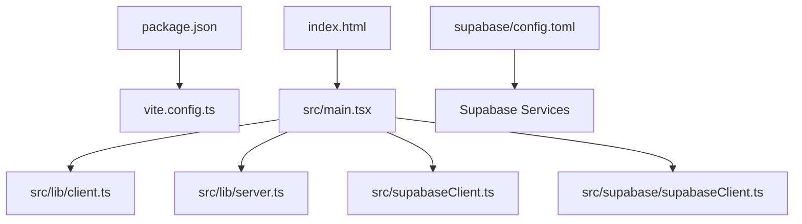
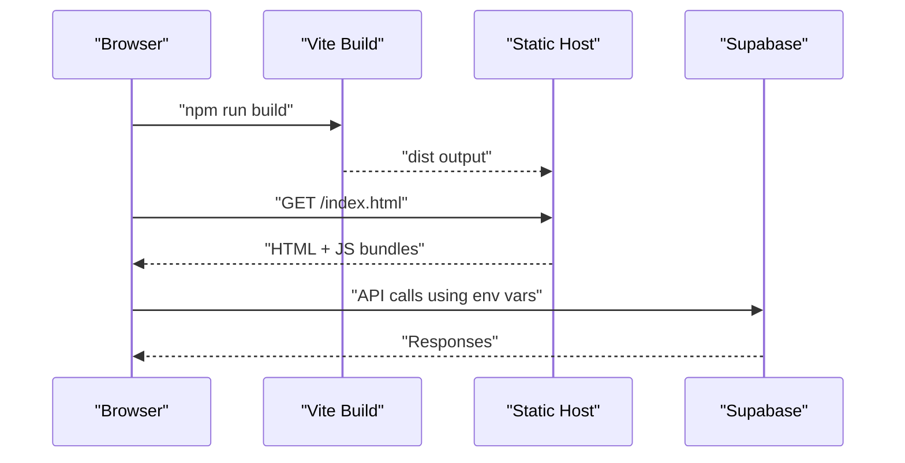
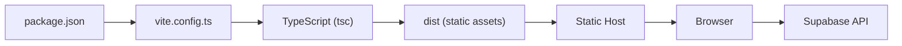

# Deployment & Production

<cite>
**Referenced Files in This Document**
- [package.json](file://package.json)
- [vite.config.ts](file://vite.config.ts)
- [index.html](file://index.html)
- [src/main.tsx](file://src/main.tsx)
- [src/lib/client.ts](file://src/lib/client.ts)
- [src/lib/server.ts](file://src/lib/server.ts)
- [src/supabaseClient.ts](file://src/supabaseClient.ts)
- [src/supabase/supabaseClient.ts](file://src/supabase/supabaseClient.ts)
- [SUPABASE.md](file://SUPABASE.md)
- [supabase/config.toml](file://supabase/config.toml)
- [tsconfig.json](file://tsconfig.json)
</cite>

## Table of Contents
1. Introduction
2. Project Structure
3. Core Components
4. Architecture Overview
5. Detailed Component Analysis
6. Dependency Analysis
7. Performance Considerations
8. Troubleshooting Guide
9. Conclusion
10. Appendices

## Introduction
This document provides production-grade deployment guidance for a React + TypeScript + Vite application that integrates Supabase. It covers the build process, environment configuration, static hosting, containerization, cloud deployment, monitoring and logging, error tracking, CI/CD pipelines, automated testing, rollback strategies, security hardening, SSL management, and production debugging techniques. The goal is to enable reliable, secure, and observable deployments across multiple environments.

## Project Structure
The project is a minimal Vite + React setup with Supabase client integrations. Key files relevant to deployment include:
- Build and scripts: package.json
- Vite configuration: vite.config.ts
- HTML entry: index.html
- App bootstrap: src/main.tsx
- Supabase clients: src/lib/client.ts, src/lib/server.ts, src/supabaseClient.ts, src/supabase/supabaseClient.ts
- Supabase local config: supabase/config.toml
- TypeScript configuration: tsconfig.json

**Diagram sources**
- [package.json:1-48](file://package.json#L1-L48)
- [vite.config.ts:1-8](file://vite.config.ts#L1-L8)
- [index.html:1-16](file://index.html#L1-L16)
- [src/main.tsx:1-11](file://src/main.tsx#L1-L11)
- [src/lib/client.ts:1-9](file://src/lib/client.ts#L1-L9)
- [src/lib/server.ts:1-29](file://src/lib/server.ts#L1-L29)
- [src/supabaseClient.ts:1-7](file://src/supabaseClient.ts#L1-L7)
- [src/supabase/supabaseClient.ts:1-37](file://src/supabase/supabaseClient.ts#L1-L37)
- [supabase/config.toml:1-415](file://supabase/config.toml#L1-L415)

**Section sources**
- [package.json:1-48](file://package.json#L1-L48)
- [vite.config.ts:1-8](file://vite.config.ts#L1-L8)
- [index.html:1-16](file://index.html#L1-L16)
- [src/main.tsx:1-11](file://src/main.tsx#L1-L11)
- [src/lib/client.ts:1-9](file://src/lib/client.ts#L1-L9)
- [src/lib/server.ts:1-29](file://src/lib/server.ts#L1-L29)
- [src/supabaseClient.ts:1-7](file://src/supabaseClient.ts#L1-L7)
- [src/supabase/supabaseClient.ts:1-37](file://src/supabase/supabaseClient.ts#L1-L37)
- [supabase/config.toml:1-415](file://supabase/config.toml#L1-L415)
- [tsconfig.json:1-14](file://tsconfig.json#L1-L14)

## Core Components
- Build system: Vite with React plugin; TypeScript compilation via tsc before build.
- Environment variables: Vite exposes variables prefixed with VITE_ to the browser; server-side code uses Node’s process.env.
- Supabase integration: Multiple client implementations exist; ensure consistent usage of environment variables for credentials.
- Static assets: index.html serves as the SPA entry point.

Key responsibilities:
- package.json defines scripts for development, building, linting, and preview.
- vite.config.ts configures plugins (React).
- src/lib/client.ts and src/lib/server.ts create Supabase clients for browser and server contexts using environment variables.
- src/supabase/supabaseClient.ts validates environment presence and warns about common misconfigurations.

**Section sources**
- [package.json:1-48](file://package.json#L1-L48)
- [vite.config.ts:1-8](file://vite.config.ts#L1-L8)
- [src/lib/client.ts:1-9](file://src/lib/client.ts#L1-L9)
- [src/lib/server.ts:1-29](file://src/lib/server.ts#L1-L29)
- [src/supabase/supabaseClient.ts:1-37](file://src/supabase/supabaseClient.ts#L1-L37)

## Architecture Overview
The application is a client-side SPA built by Vite and served statically. Supabase is accessed from the browser using environment-based credentials. For server-side rendering or API routes (if added), the server client reads Node environment variables.

**Diagram sources**
- [package.json:1-48](file://package.json#L1-L48)
- [vite.config.ts:1-8](file://vite.config.ts#L1-L8)
- [src/lib/client.ts:1-9](file://src/lib/client.ts#L1-L9)
- [src/lib/server.ts:1-29](file://src/lib/server.ts#L1-L29)

## Detailed Component Analysis

### Build Process with Vite
- Scripts:
  - Development: runs Vite dev server.
  - Build: compiles TypeScript then builds optimized assets with Vite.
  - Preview: serves the built dist locally.
- Vite configuration:
  - Uses @vitejs/plugin-react for JSX/TSX support.
  - No additional optimization flags are currently set; consider enabling production defaults and advanced optimizations.

Recommendations:
- Ensure NODE_ENV=production during builds.
- Add Vite optimization flags such as minify, sourcemap control, chunk splitting, and asset compression if needed.
- Configure base path for static hosting platforms that require non-root paths.

**Section sources**
- [package.json:1-48](file://package.json#L1-L48)
- [vite.config.ts:1-8](file://vite.config.ts#L1-L8)

### Environment Variables and Secrets
- Client-side variables:
  - Vite exposes variables prefixed with VITE_ via import.meta.env.
  - Current client uses VITE_SUPABASE_URL and VITE_SUPABASE_PUBLISHABLE_KEY.
- Server-side variables:
  - Node process.env used for server-side client creation.
- Supabase documentation recommends:
  - VITE_SUPABASE_URL and VITE_SUPABASE_ANON_KEY at the root .env file.
  - Avoid including /rest/v1 in the URL.

Best practices:
- Centralize environment variable definitions per environment (development, staging, production).
- Never commit secrets; use platform secret managers or CI/CD secret stores.
- Validate required variables at runtime and fail fast with clear messages.

**Section sources**
- [src/lib/client.ts:1-9](file://src/lib/client.ts#L1-L9)
- [src/lib/server.ts:1-29](file://src/lib/server.ts#L1-L29)
- [src/supabase/supabaseClient.ts:1-37](file://src/supabase/supabaseClient.ts#L1-L37)
- [SUPABASE.md:1-38](file://SUPABASE.md#L1-L38)

### Supabase Client Configuration
- Multiple client files exist:
  - src/supabaseClient.ts hardcodes credentials (not recommended for production).
  - src/supabase/supabaseClient.ts reads VITE_SUPABASE_URL and VITE_SUPABASE_ANON_KEY from environment and validates them.
  - src/lib/client.ts and src/lib/server.ts use VITE_SUPABASE_URL and VITE_SUPABASE_PUBLISHABLE_KEY.

Recommendations:
- Standardize on a single client module that reads environment variables consistently.
- Remove hardcoded credentials and enforce validation.
- Use VITE_SUPABASE_ANON_KEY for browser access; avoid exposing service role keys.

**Section sources**
- [src/supabaseClient.ts:1-7](file://src/supabaseClient.ts#L1-L7)
- [src/supabase/supabaseClient.ts:1-37](file://src/supabase/supabaseClient.ts#L1-L37)
- [src/lib/client.ts:1-9](file://src/lib/client.ts#L1-L9)
- [src/lib/server.ts:1-29](file://src/lib/server.ts#L1-L29)

### Static Hosting Deployment
- Build output:
  - npm run build produces a dist directory suitable for static hosting.
- Common platforms:
  - Vercel, Netlify, GitHub Pages, Cloudflare Pages, AWS S3 + CloudFront.
- Configuration tips:
  - Set base path if deploying to a subpath.
  - Enable caching headers for long-term cacheability of hashed assets.
  - Redirect all routes to index.html for SPA routing.

**Section sources**
- [package.json:1-48](file://package.json#L1-L48)
- [index.html:1-16](file://index.html#L1-L16)

### Containerization with Docker
- Multi-stage Dockerfile approach:
  - Stage 1: Install dependencies and build the app with Vite.
  - Stage 2: Serve static files with a lightweight HTTP server (e.g., nginx or caddy).
- Environment injection:
  - Pass VITE_* variables at build time via docker build --build-arg.
  - For runtime-only values, use reverse proxy or runtime configuration injection.

Example steps:
- Create a Dockerfile with two stages.
- Copy only the dist folder into the final image.
- Expose port 80 and serve static content.

[No sources needed since this section provides general guidance]

### Cloud Deployment Options
- Platform-as-a-Service:
  - Vercel: Connect repository, configure build command (npm run build), output directory (dist).
  - Netlify: Configure build command and publish directory.
  - Cloudflare Pages: Link repo, set build command and output directory.
- Infrastructure-as-a-Service:
  - AWS S3 + CloudFront: Upload dist, configure distribution settings and cache behaviors.
  - Google Cloud Storage + CDN: Similar approach with appropriate caching rules.

[No sources needed since this section provides general guidance]

### Monitoring and Logging
- Frontend monitoring:
  - Integrate performance monitoring tools (e.g., Web Vitals, RUM) to track user experience.
- Error tracking:
  - Use services like Sentry to capture unhandled exceptions and errors in the browser.
- Logging:
  - For server-side components (if any), centralize logs with structured formats and ship to log aggregation services.

[No sources needed since this section provides general guidance]

### Error Tracking with Sentry
- Setup steps:
  - Initialize Sentry SDK in the application entry point.
  - Configure release version matching the deployed build.
  - Filter sensitive data and map source maps for accurate stack traces.
- Best practices:
  - Use environment-specific DSNs.
  - Enable source map upload in CI/CD.

[No sources needed since this section provides general guidance]

### Performance Monitoring Tools
- Frontend metrics:
  - Track Core Web Vitals (LCP, FID, CLS) and custom KPIs.
- Backend metrics (if applicable):
  - Monitor Supabase API latency and error rates via platform dashboards.

[No sources needed since this section provides general guidance]

### CI/CD Pipeline Configuration
- Stages:
  - Install dependencies, lint, type-check, test, build, and deploy.
- Automated testing:
  - Run unit tests and integration tests before building.
- Build artifacts:
  - Publish dist directory to the hosting platform.
- Secret management:
  - Store environment variables and tokens in CI/CD secret stores.

[No sources needed since this section provides general guidance]

### Rollback Strategies
- Versioned deployments:
  - Maintain previous versions and switch traffic back quickly.
- Blue/green or canary releases:
  - Gradually roll out changes and monitor for issues.
- Artifact immutability:
  - Tag builds with commit hashes and revert by redeploying the previous artifact.

[No sources needed since this section provides general guidance]

### Security Hardening
- Secrets:
  - Never embed secrets in code; use environment variables and secret managers.
- CORS and RLS:
  - Configure Supabase Row Level Security policies strictly for production.
- Headers:
  - Set security headers (CSP, HSTS, X-Frame-Options) via hosting platform or reverse proxy.
- Dependencies:
  - Regularly update dependencies and scan for vulnerabilities.

[No sources needed since this section provides general guidance]

### SSL Certificate Management
- Managed platforms:
  - Most platforms provide automatic HTTPS; ensure custom domains are configured correctly.
- Self-hosted:
  - Use Let’s Encrypt or managed certificates via reverse proxy (nginx/caddy).

[No sources needed since this section provides general guidance]

### Production Debugging Techniques
- Source maps:
  - Upload source maps to error tracking services for readable stack traces.
- Runtime checks:
  - Validate environment variables and log non-sensitive diagnostics.
- Feature flags:
  - Toggle features safely without redeployments.

[No sources needed since this section provides general guidance]

## Dependency Analysis
The build pipeline depends on Vite, React plugin, and TypeScript. Supabase clients depend on environment variables for credentials.

**Diagram sources**
- [package.json:1-48](file://package.json#L1-L48)
- [vite.config.ts:1-8](file://vite.config.ts#L1-L8)
- [src/lib/client.ts:1-9](file://src/lib/client.ts#L1-L9)
- [src/lib/server.ts:1-29](file://src/lib/server.ts#L1-L29)

**Section sources**
- [package.json:1-48](file://package.json#L1-L48)
- [vite.config.ts:1-8](file://vite.config.ts#L1-L8)
- [src/lib/client.ts:1-9](file://src/lib/client.ts#L1-L9)
- [src/lib/server.ts:1-29](file://src/lib/server.ts#L1-L29)

## Performance Considerations
- Build optimizations:
  - Enable minification, tree-shaking, and code splitting.
  - Configure asset hashing and long-term caching.
- Bundle size:
  - Analyze bundle size and remove unused dependencies.
- Network requests:
  - Cache Supabase responses where appropriate; use pagination and selective fields.
- Rendering:
  - Optimize React components and avoid unnecessary re-renders.

[No sources needed since this section provides general guidance]

## Troubleshooting Guide
Common issues and resolutions:
- Missing environment variables:
  - Ensure VITE_SUPABASE_URL and VITE_SUPABASE_ANON_KEY are set in the correct .env file.
- Incorrect Supabase URL:
  - Do not append /rest/v1 to the base URL.
- Hardcoded credentials:
  - Replace hardcoded values in src/supabaseClient.ts with environment variables.
- Client mismatch:
  - Standardize on one client module and consistent variable names across browser and server contexts.

**Section sources**
- [src/supabase/supabaseClient.ts:1-37](file://src/supabase/supabaseClient.ts#L1-L37)
- [SUPABASE.md:1-38](file://SUPABASE.md#L1-L38)
- [src/supabaseClient.ts:1-7](file://src/supabaseClient.ts#L1-L7)

## Conclusion
This deployment guide outlines how to build, configure, and deploy the Vite + React application securely and efficiently. By standardizing environment variables, optimizing the build, and integrating monitoring and error tracking, you can achieve reliable production deployments across various platforms. Follow the recommendations for security, performance, and observability to maintain a robust application lifecycle.

## Appendices

### Environment Variables Reference
- VITE_SUPABASE_URL: Supabase project URL (without /rest/v1).
- VITE_SUPABASE_ANON_KEY: Anonymous key for browser access.
- VITE_SUPABASE_PUBLISHABLE_KEY: Used by SSR client in server context.

**Section sources**
- [src/lib/client.ts:1-9](file://src/lib/client.ts#L1-L9)
- [src/lib/server.ts:1-29](file://src/lib/server.ts#L1-L29)
- [src/supabase/supabaseClient.ts:1-37](file://src/supabase/supabaseClient.ts#L1-L37)
- [SUPABASE.md:1-38](file://SUPABASE.md#L1-L38)

### Supabase Local Configuration
- supabase/config.toml includes local development settings for API, database, auth, storage, and analytics.
- Adjust TLS, network restrictions, and email settings as needed for local testing.

**Section sources**
- [supabase/config.toml:1-415](file://supabase/config.toml#L1-L415)

### TypeScript Configuration
- tsconfig.json sets path aliases and references for app and node configurations.
- Ensure baseUrl and paths align with your project structure for clean imports.

**Section sources**
- [tsconfig.json:1-14](file://tsconfig.json#L1-L14)