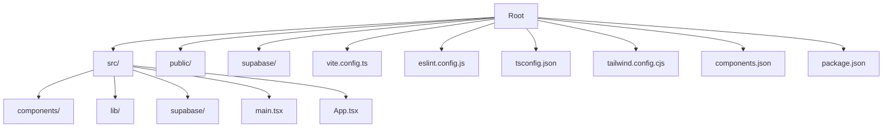
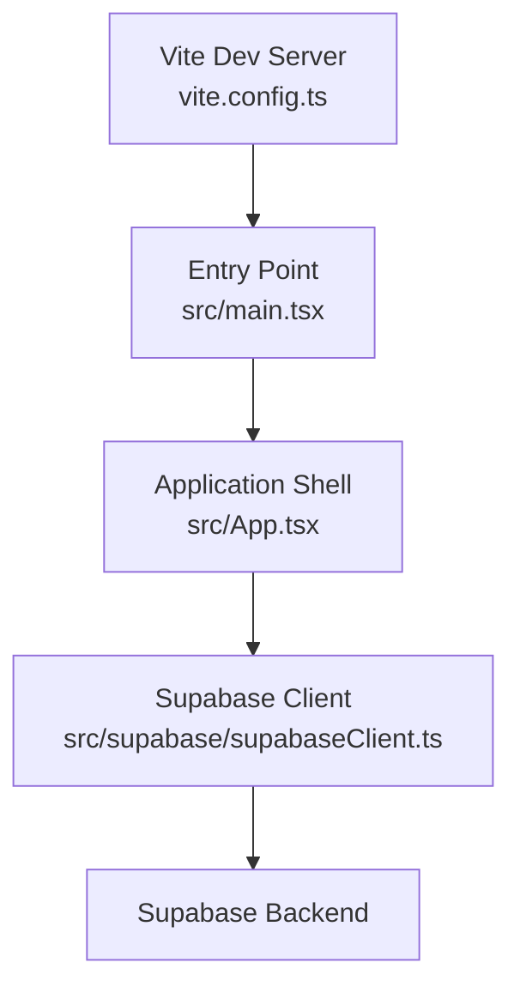
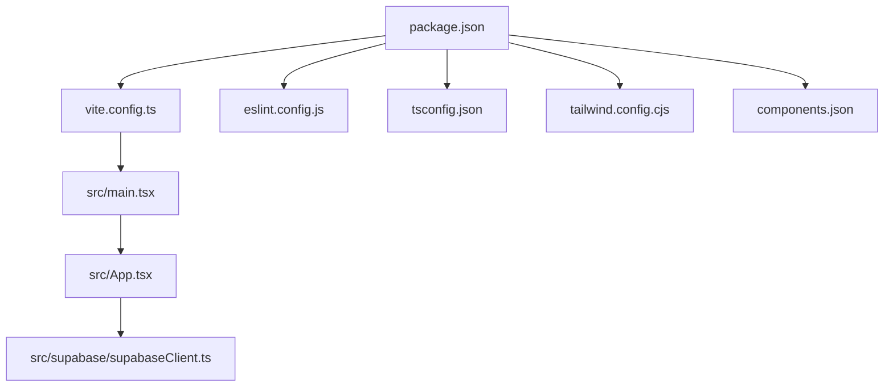

# Development Guidelines

<cite>
**Referenced Files in This Document**
- [package.json](file://package.json)
- [eslint.config.js](file://eslint.config.js)
- [tsconfig.json](file://tsconfig.json)
- [tsconfig.app.json](file://tsconfig.app.json)
- [tsconfig.node.json](file://tsconfig.node.json)
- [vite.config.ts](file://vite.config.ts)
- [tailwind.config.cjs](file://tailwind.config.cjs)
- [components.json](file://components.json)
- [README.md](file://README.md)
- [SUPABASE.md](file://SUPABASE.md)
- [src/main.tsx](file://src/main.tsx)
- [src/App.tsx](file://src/App.tsx)
- [src/supabase/supabaseClient.ts](file://src/supabase/supabaseClient.ts)
- [src/components/ui/button.tsx](file://src/components/ui/button.tsx)
</cite>

## Table of Contents
1. [Introduction](#introduction)
2. [Project Structure](#project-structure)
3. [Core Components](#core-components)
4. [Architecture Overview](#architecture-overview)
5. [Detailed Component Analysis](#detailed-component-analysis)
6. [Dependency Analysis](#dependency-analysis)
7. [Performance Considerations](#performance-considerations)
8. [Troubleshooting Guide](#troubleshooting-guide)
9. [Conclusion](#conclusion)
10. [Appendices](#appendices)

## Introduction
This document defines the development standards and guidelines for the project, covering TypeScript best practices, React component patterns, file organization, ESLint configuration, code formatting, pre-commit hooks, Git workflow, testing strategies, debugging techniques, logging standards, tooling recommendations, code review processes, documentation standards, and contribution guidelines. It is intended to ensure consistent, maintainable, and high-quality code across the team.

## Project Structure
The project follows a modern Vite + React + TypeScript setup with Tailwind CSS and shadcn/ui components. Key directories:
- src/: Application source code (components, lib, supabase client, styles)
- public/: Static assets
- supabase/: Supabase configuration files
- Root config files: package.json, eslint.config.js, tsconfig.*.json, vite.config.ts, tailwind.config.cjs, components.json

**Diagram sources**
- [package.json:1-48](file://package.json#L1-L48)
- [vite.config.ts:1-8](file://vite.config.ts#L1-L8)
- [eslint.config.js:1-23](file://eslint.config.js#L1-L23)
- [tsconfig.json:1-14](file://tsconfig.json#L1-L14)
- [tailwind.config.cjs:1-17](file://tailwind.config.cjs#L1-L17)
- [components.json:1-28](file://components.json#L1-L28)

**Section sources**
- [package.json:1-48](file://package.json#L1-L48)
- [vite.config.ts:1-8](file://vite.config.ts#L1-L8)
- [eslint.config.js:1-23](file://eslint.config.js#L1-L23)
- [tsconfig.json:1-14](file://tsconfig.json#L1-L14)
- [tailwind.config.cjs:1-17](file://tailwind.config.cjs#L1-L17)
- [components.json:1-28](file://components.json#L1-L28)

## Core Components
- Entry point: src/main.tsx initializes the React app with StrictMode and renders App.
- Application shell: src/App.tsx contains core UI logic, state management, and data fetching from Supabase.
- UI primitives: src/components/ui/button.tsx demonstrates shadcn/ui pattern using class-variance-authority and Tailwind classes.
- Data layer: src/supabase/supabaseClient.ts provides a centralized Supabase client with environment validation.

Key conventions:
- Use functional components with hooks.
- Centralize environment variables and client initialization.
- Keep UI components small, composable, and styled via Tailwind and cva variants.

**Section sources**
- [src/main.tsx:1-11](file://src/main.tsx#L1-L11)
- [src/App.tsx:1-800](file://src/App.tsx#L1-L800)
- [src/components/ui/button.tsx:1-57](file://src/components/ui/button.tsx#L1-L57)
- [src/supabase/supabaseClient.ts:1-38](file://src/supabase/supabaseClient.ts#L1-L38)

## Architecture Overview
High-level architecture shows how Vite builds the React application, which interacts with Supabase for data operations. The entrypoint renders the root component, which manages state and fetches data through the shared Supabase client.

**Diagram sources**
- [vite.config.ts:1-8](file://vite.config.ts#L1-L8)
- [src/main.tsx:1-11](file://src/main.tsx#L1-L11)
- [src/App.tsx:1-800](file://src/App.tsx#L1-L800)
- [src/supabase/supabaseClient.ts:1-38](file://src/supabase/supabaseClient.ts#L1-L38)

## Detailed Component Analysis

### TypeScript Best Practices
- Target ES2023 with strict compiler options; enable noUnusedLocals, noUnusedParameters, erasableSyntaxOnly, noFallthroughCasesInSwitch.
- Use moduleResolution bundler and verbatimModuleSyntax for modern TS behavior.
- JSX set to react-jsx for optimized rendering.
- Path aliases configured via baseUrl and paths mapping @/* to src/*.

Recommendations:
- Prefer explicit types for props and state.
- Use discriminated unions for state machines where applicable.
- Avoid any; use unknown and narrow with type guards.
- Centralize shared types in lib/types.ts when growing.

**Section sources**
- [tsconfig.app.json:1-27](file://tsconfig.app.json#L1-L27)
- [tsconfig.node.json:1-24](file://tsconfig.node.json#L1-L24)
- [tsconfig.json:1-14](file://tsconfig.json#L1-L14)

### React Component Patterns
- Functional components with hooks for state and side effects.
- Memoization with useMemo for derived data and filtering.
- Controlled forms with local state and validation before API calls.
- UI composition using shadcn/ui primitives and Tailwind utility classes.

Patterns observed:
- State synchronization between local storage and UI.
- Centralized toast notifications for user feedback.
- Role-based access checks computed from approvals and current user.

**Section sources**
- [src/App.tsx:1-800](file://src/App.tsx#L1-L800)
- [src/components/ui/button.tsx:1-57](file://src/components/ui/button.tsx#L1-L57)

### File Organization Principles
- Place reusable UI components under src/components/ui.
- Keep utilities and helpers in src/lib.
- Centralize Supabase client and services under src/supabase.
- Use path aliases (@/*) to simplify imports and avoid relative path hell.

Guidelines:
- One feature per directory as the app grows; co-locate tests and docs near features.
- Keep index files minimal; export only what is needed.
- Separate concerns: UI, business logic, data layer.

**Section sources**
- [components.json:1-28](file://components.json#L1-L28)
- [tailwind.config.cjs:1-17](file://tailwind.config.cjs#L1-L17)

### ESLint Configuration and Code Formatting
- ESLint flat config extends recommended rules for JS, TypeScript, React Hooks, and React Refresh.
- Browser globals enabled for Vite dev environment.
- Recommended to enable type-aware linting for production by switching to tseslint configs with project references.

Formatting:
- No dedicated formatter configured here; recommend Prettier integration alongside ESLint.
- Enforce consistent style via editor settings and CI checks.

Pre-commit hooks:
- Not present in repository; recommend Husky + lint-staged to run ESLint and type checks on commit.

**Section sources**
- [eslint.config.js:1-23](file://eslint.config.js#L1-L23)
- [README.md:14-44](file://README.md#L14-L44)

### Git Workflow
Recommended strategy:
- Branching: main (protected), develop, feature/*, bugfix/*, hotfix/*
- Commit messages: Conventional Commits (feat:, fix:, chore:, docs:)
- Pull requests: Require reviews, CI passes (lint, build, tests), squash merges for clean history

Process:
- Create branch from develop for features.
- Open PR against develop; link issues; include description and screenshots if UI changes.
- Merge after approval and CI success.

Note: Pre-commit hooks are not configured; add them to enforce quality gates.

[No sources needed since this section provides general guidance]

### Testing Strategies
- Unit tests: Recommend Vitest or Jest with React Testing Library for components and hooks.
- Integration tests: Test Supabase interactions with mocks or test database instances.
- End-to-end tests: Playwright or Cypress for critical user flows (auth, checkout).

Setup recommendations:
- Add vitest.config.ts and jest.config.js depending on chosen framework.
- Configure coverage thresholds and report generation.
- Seed test data and reset state between runs.

[No sources needed since this section provides general guidance]

### Debugging Techniques and Logging Standards
- Use console.error for errors and console.info for diagnostics.
- Validate environment variables at startup (Supabase client validates URL and key presence).
- Add structured logs for critical flows (auth, data load, errors).
- Leverage browser dev tools and network tab for API inspection.

Best practices:
- Avoid sensitive data in logs.
- Include context like userId, orderId, and operation name.
- Centralize logging utility for consistent format.

**Section sources**
- [src/supabase/supabaseClient.ts:1-38](file://src/supabase/supabaseClient.ts#L1-L38)
- [src/App.tsx:1-800](file://src/App.tsx#L1-L800)

### Development Tooling Recommendations
- Vite for fast dev server and build.
- Tailwind CSS for utility-first styling.
- shadcn/ui for accessible, customizable UI primitives.
- ESLint for static analysis; consider adding Prettier for formatting.
- Optional: React Compiler disabled by default due to performance impact; enable selectively if needed.

**Section sources**
- [vite.config.ts:1-8](file://vite.config.ts#L1-L8)
- [tailwind.config.cjs:1-17](file://tailwind.config.cjs#L1-L17)
- [components.json:1-28](file://components.json#L1-L28)
- [README.md:10-12](file://README.md#L10-L12)

### Code Review Processes
- Require at least one reviewer for all PRs.
- Checklists: type safety, linting, tests, accessibility, performance implications.
- Verify environment variable usage and secrets handling.
- Ensure changes align with coding standards and architectural decisions.

[No sources needed since this section provides general guidance]

### Documentation Standards
- Inline comments for complex logic; avoid obvious comments.
- Maintain README updates for new features and environment setup.
- Use JSDoc for exported functions and components where helpful.
- Keep SUPABASE.md updated for backend-related guidance.

**Section sources**
- [README.md:1-76](file://README.md#L1-L76)
- [SUPABASE.md:1-32](file://SUPABASE.md#L1-L32)

### Contribution Guidelines
- Fork the repo, create a feature branch, and submit a PR.
- Follow commit message conventions and keep commits atomic.
- Run linters and type checks locally before pushing.
- Provide clear descriptions and acceptance criteria in PRs.

[No sources needed since this section provides general guidance]

## Dependency Analysis
The application depends on Vite, React, TypeScript, ESLint, Tailwind CSS, and Supabase client. The build pipeline uses Vite with React plugin; linting uses ESLint flat config; styling uses Tailwind with shadcn/ui configuration.

**Diagram sources**
- [package.json:1-48](file://package.json#L1-L48)
- [vite.config.ts:1-8](file://vite.config.ts#L1-L8)
- [eslint.config.js:1-23](file://eslint.config.js#L1-L23)
- [tsconfig.json:1-14](file://tsconfig.json#L1-L14)
- [tailwind.config.cjs:1-17](file://tailwind.config.cjs#L1-L17)
- [components.json:1-28](file://components.json#L1-L28)
- [src/main.tsx:1-11](file://src/main.tsx#L1-L11)
- [src/App.tsx:1-800](file://src/App.tsx#L1-L800)
- [src/supabase/supabaseClient.ts:1-38](file://src/supabase/supabaseClient.ts#L1-L38)

**Section sources**
- [package.json:1-48](file://package.json#L1-L48)

## Performance Considerations
- Use useMemo for expensive computations and filtered lists.
- Avoid unnecessary re-renders by splitting components and memoizing callbacks.
- Prefer lazy loading for large modules if the app grows significantly.
- Keep bundle size small by tree-shaking unused dependencies.
- Monitor network requests and cache responses where appropriate.

[No sources needed since this section provides general guidance]

## Troubleshooting Guide
Common issues and resolutions:
- Supabase credentials missing: Ensure .env contains VITE_SUPABASE_URL and VITE_SUPABASE_ANON_KEY; do not append /rest/v1 to URL.
- Query returns null data: Confirm rows exist in Supabase Studio and RLS policies allow anon reads/writes during development.
- Linting errors: Enable type-aware ESLint rules for stricter checks; install additional plugins as needed.
- Build failures: Verify TypeScript configurations and module resolution settings.

Steps:
- Inspect console logs from Supabase client validation.
- Use browser dev tools to inspect network requests and responses.
- Temporarily relax RLS policies for development; tighten before production.

**Section sources**
- [src/supabase/supabaseClient.ts:1-38](file://src/supabase/supabaseClient.ts#L1-L38)
- [SUPABASE.md:1-32](file://SUPABASE.md#L1-L32)
- [README.md:14-44](file://README.md#L14-L44)

## Conclusion
Adopting these development standards ensures consistency, reliability, and scalability. By following TypeScript best practices, React patterns, robust linting, and structured workflows, the team can deliver high-quality features efficiently. Continuous improvement through testing, debugging, and code reviews will strengthen the codebase over time.

[No sources needed since this section summarizes without analyzing specific files]

## Appendices

### Scripts and Commands
- Development: npm run dev
- Build: npm run build (TypeScript check then Vite build)
- Lint: npm run lint
- Preview: npm run preview

**Section sources**
- [package.json:1-48](file://package.json#L1-L48)

### Environment Variables
- VITE_SUPABASE_URL: Supabase project URL (without /rest/v1)
- VITE_SUPABASE_ANON_KEY: Supabase anonymous key

**Section sources**
- [SUPABASE.md:1-32](file://SUPABASE.md#L1-L32)
- [src/supabase/supabaseClient.ts:1-38](file://src/supabase/supabaseClient.ts#L1-L38)