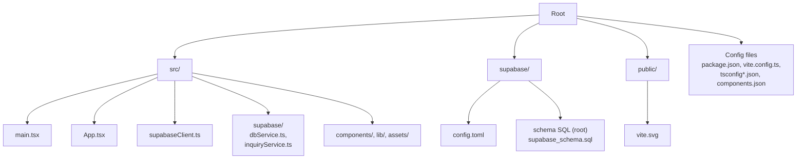
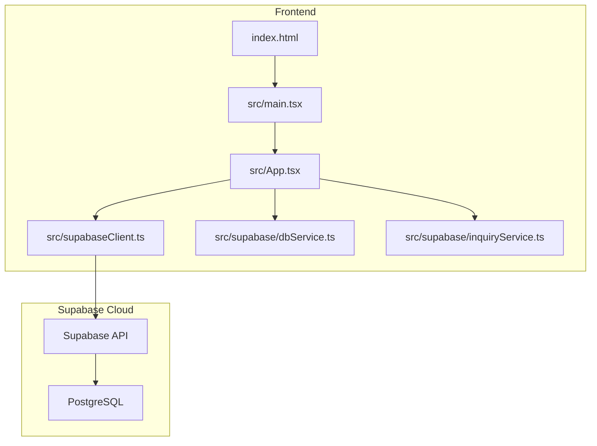
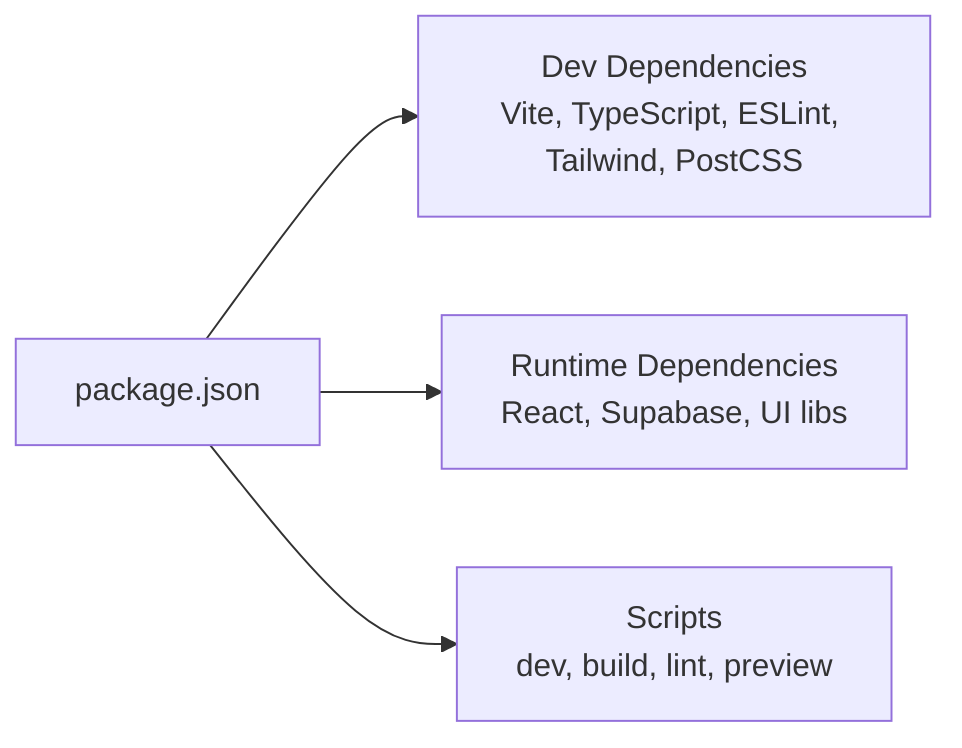

# Getting Started

<cite>
**Referenced Files in This Document**
- [package.json](file://package.json)
- [vite.config.ts](file://vite.config.ts)
- [tsconfig.json](file://tsconfig.json)
- [tsconfig.app.json](file://tsconfig.app.json)
- [tsconfig.node.json](file://tsconfig.node.json)
- [index.html](file://index.html)
- [src/main.tsx](file://src/main.tsx)
- [SUPABASE.md](file://SUPABASE.md)
- [supabase_schema.sql](file://supabase_schema.sql)
- [supabase\config.toml](file://supabase/config.toml)
- [src\supabaseClient.ts](file://src/supabaseClient.ts)
- [src\supabase\dbService.ts](file://src/supabase/dbService.ts)
- [src\supabase\inquiryService.ts](file://src/supabase/inquiryService.ts)
- [components.json](file://components.json)
</cite>

## Table of Contents
1. [Introduction](#introduction)
2. [Project Structure](#project-structure)
3. [Core Components](#core-components)
4. [Architecture Overview](#architecture-overview)
5. [Detailed Component Analysis](#detailed-component-analysis)
6. [Dependency Analysis](#dependency-analysis)
7. [Performance Considerations](#performance-considerations)
8. [Troubleshooting Guide](#troubleshooting-guide)
9. [Conclusion](#conclusion)
10. [Appendices](#appendices)

## Introduction
This guide helps you set up and run the Match & Market project locally. You will install Node.js, install dependencies, configure environment variables for Supabase, initialize the database schema, and start the development server powered by Vite. The document also explains the project structure, key configuration files, and provides troubleshooting steps to ensure a smooth setup.

## Project Structure
At a high level:
- Frontend build tooling is configured with Vite and React.
- TypeScript is used across the app with separate configs for app and node tooling.
- Supabase client and services are centralized under src/supabase.
- Database schema and local Supabase configuration are provided for quick initialization.

**Diagram sources**
- [package.json](file://package.json)
- [vite.config.ts](file://vite.config.ts)
- [tsconfig.json](file://tsconfig.json)
- [tsconfig.app.json](file://tsconfig.app.json)
- [tsconfig.node.json](file://tsconfig.node.json)
- [index.html](file://index.html)
- [src/main.tsx](file://src/main.tsx)
- [src/supabaseClient.ts](file://src/supabaseClient.ts)
- [src/supabase/dbService.ts](file://src/supabase/dbService.ts)
- [src/supabase/inquiryService.ts](file://src/supabase/inquiryService.ts)
- [supabase/config.toml](file://supabase/config.toml)
- [supabase_schema.sql](file://supabase_schema.sql)
- [components.json](file://components.json)

**Section sources**
- [package.json](file://package.json)
- [vite.config.ts](file://vite.config.ts)
- [tsconfig.json](file://tsconfig.json)
- [tsconfig.app.json](file://tsconfig.app.json)
- [tsconfig.node.json](file://tsconfig.node.json)
- [index.html](file://index.html)
- [src/main.tsx](file://src/main.tsx)
- [src/supabaseClient.ts](file://src/supabaseClient.ts)
- [src/supabase/dbService.ts](file://src/supabase/dbService.ts)
- [src/supabase/inquiryService.ts](file://src/supabase/inquiryService.ts)
- [supabase/config.toml](file://supabase/config.toml)
- [supabase_schema.sql](file://supabase_schema.sql)
- [components.json](file://components.json)

## Core Components
- Build and scripts: Vite dev server, TypeScript build, linting, and preview are defined in package.json scripts.
- Vite config: React plugin is enabled; default configuration is minimal and ready to extend.
- TypeScript: Root tsconfig references app and node configs; path alias @/* maps to src/*.
- Entry point: index.html loads main.tsx which renders App inside StrictMode.
- Supabase client: Centralized client creation and optional env validation helper.
- Services: dbService wraps Supabase queries; inquiryService demonstrates CRUD patterns.

Key responsibilities:
- package.json: Defines npm/yarn scripts and dependencies.
- vite.config.ts: Configures Vite with React plugin.
- tsconfig.*: Enforces module resolution, JSX, and type checking.
- index.html + src/main.tsx: Bootstraps the React application.
- src/supabaseClient.ts: Creates and exports the Supabase client.
- src/supabase/dbService.ts: Provides a typed wrapper around Supabase queries.
- src/supabase/inquiryService.ts: Example service for inquiries table operations.

**Section sources**
- [package.json](file://package.json)
- [vite.config.ts](file://vite.config.ts)
- [tsconfig.json](file://tsconfig.json)
- [tsconfig.app.json](file://tsconfig.app.json)
- [tsconfig.node.json](file://tsconfig.node.json)
- [index.html](file://index.html)
- [src/main.tsx](file://src/main.tsx)
- [src/supabaseClient.ts](file://src/supabaseClient.ts)
- [src/supabase/dbService.ts](file://src/supabase/dbService.ts)
- [src/supabase/inquiryService.ts](file://src/supabase/inquiryService.ts)

## Architecture Overview
The frontend runs on Vite with React and TypeScript. It connects to Supabase via the official JS client. Environment variables supply credentials at runtime. The database schema defines core entities like profiles, vendors, menu items, delivery jobs, and more.

**Diagram sources**
- [index.html](file://index.html)
- [src/main.tsx](file://src/main.tsx)
- [src/supabaseClient.ts](file://src/supabaseClient.ts)
- [src/supabase/dbService.ts](file://src/supabase/dbService.ts)
- [src/supabase/inquiryService.ts](file://src/supabase/inquiryService.ts)

## Detailed Component Analysis

### Installation and Environment Setup
- Install Node.js: Use a recent LTS version compatible with modern tooling.
- Install dependencies: Run your preferred package manager from the repository root.
- Environment variables: Create a .env file at the project root with Supabase credentials.
- Verify environment: Ensure no conflicting .env files exist elsewhere in the project.

Steps:
1. Open a terminal in the repository root.
2. Install dependencies using npm or yarn.
3. Create a .env file with the required variables.
4. Initialize the database schema in Supabase.

Verification:
- Start the dev server and open the browser.
- Confirm that the app loads without console errors related to missing credentials.

**Section sources**
- [package.json](file://package.json)
- [SUPABASE.md](file://SUPABASE.md)

### Development Server Startup with Vite
- Scripts available:
  - Development server with hot module replacement.
  - Production build with TypeScript check.
  - Linting.
  - Preview built output.

How to start:
- Run the development script from the repository root.
- Open the URL shown in the terminal.

Notes:
- Vite uses the React plugin configured in vite.config.ts.
- The entrypoint is index.html which loads src/main.tsx.

**Section sources**
- [package.json](file://package.json)
- [vite.config.ts](file://vite.config.ts)
- [index.html](file://index.html)
- [src/main.tsx](file://src/main.tsx)

### TypeScript Configuration
- Root tsconfig aggregates app and node configurations and sets path aliases.
- App config targets ES2023, enables JSX, and enforces strict linting rules.
- Node config targets ES2023 and is used for tooling like Vite config.

Highlights:
- Path alias @/* resolves to src/* for cleaner imports.
- Module resolution is set to bundler mode for compatibility with Vite.

**Section sources**
- [tsconfig.json](file://tsconfig.json)
- [tsconfig.app.json](file://tsconfig.app.json)
- [tsconfig.node.json](file://tsconfig.node.json)

### Supabase Integration
Environment variables:
- VITE_SUPABASE_URL: Your Supabase project URL (without /rest/v1).
- VITE_SUPABASE_ANON_KEY: Your anon key for client-side access.

Client setup:
- The Supabase client is created centrally and exported for use across the app.
- Optional validation warns if REST endpoint is mistakenly used as base URL.

Database schema:
- Execute the provided schema SQL in Supabase SQL Editor to create tables and policies.
- Policies enable full access for development; tighten them before production.

Services:
- dbService wraps common queries with consistent error handling.
- inquiryService demonstrates fetching and inserting records.

Initialization steps:
1. Add environment variables to .env at the project root.
2. Run the schema SQL in Supabase Studio.
3. Import the supabase client from src/supabaseClient.ts in your modules.
4. Use dbService or inquiryService for data operations.

**Section sources**
- [SUPABASE.md](file://SUPABASE.md)
- [src/supabaseClient.ts](file://src/supabaseClient.ts)
- [supabase_schema.sql](file://supabase_schema.sql)
- [src/supabase/dbService.ts](file://src/supabase/dbService.ts)
- [src/supabase/inquiryService.ts](file://src/supabase/inquiryService.ts)

### Local Supabase Configuration
- supabase/config.toml defines local development settings for API, database, auth, storage, and more.
- Useful for running Supabase locally during development.

Key sections:
- api: Exposed schemas and max rows.
- db: Port and major version.
- auth: Site URL, token expiry, sign-up behavior.
- storage: Enabled and size limits.

Note:
- For cloud usage, rely on environment variables and remote schema.
- For local development, you can start Supabase CLI services using this config.

**Section sources**
- [supabase/config.toml](file://supabase/config.toml)

### UI and Styling Configuration
- Tailwind CSS is integrated through PostCSS and Vite.
- shadcn/ui configuration is present for component registry and aliases.

What to know:
- Tailwind config path and CSS entry are specified in components.json.
- Icons library is set to lucide.

**Section sources**
- [components.json](file://components.json)

## Dependency Analysis
High-level dependency categories:
- Runtime dependencies include React, Supabase client, UI utilities, and animation libraries.
- Dev dependencies include Vite, TypeScript, ESLint, Tailwind, and PostCSS.

Scripts overview:
- dev: Starts Vite dev server.
- build: Runs TypeScript build then Vite build.
- lint: Runs ESLint.
- preview: Serves the built output locally.

**Diagram sources**
- [package.json](file://package.json)

**Section sources**
- [package.json](file://package.json)

## Performance Considerations
- Keep dependencies updated to benefit from performance improvements.
- Avoid unnecessary re-renders in React components.
- Use efficient queries and leverage Supabase indexes where appropriate.
- Prefer lazy loading for heavy components or routes when scaling the app.

[No sources needed since this section provides general guidance]

## Troubleshooting Guide
Common issues and resolutions:
- Missing environment variables:
  - Ensure VITE_SUPABASE_URL and VITE_SUPABASE_ANON_KEY are set in the root .env file.
  - Remove duplicate or conflicting .env files elsewhere.
- Incorrect Supabase URL:
  - Do not append /rest/v1 to the base URL; use the project URL only.
- Query returns null data:
  - Verify the row exists in Supabase Studio.
  - Check Row Level Security policies and permissions for anon role.
  - Confirm field names match between insert and select payloads.
- Console warnings about REST path:
  - Fix the URL to exclude the REST suffix.

Verification steps:
- Start the dev server and confirm the app loads.
- Open the browser console to see any Supabase host info logs.
- Test a simple query using inquiryService or dbService to validate connectivity.

**Section sources**
- [SUPABASE.md](file://SUPABASE.md)
- [src/supabaseClient.ts](file://src/supabaseClient.ts)

## Conclusion
You now have everything needed to set up, run, and integrate Supabase with the Match & Market project. Follow the installation steps, configure environment variables, initialize the database schema, and start the development server. Use the troubleshooting tips to resolve common setup issues quickly.

[No sources needed since this section summarizes without analyzing specific files]

## Appendices

### Quick Start Checklist
- Install Node.js and a package manager (npm or yarn).
- Install dependencies from the repository root.
- Create a .env file with Supabase credentials.
- Run the schema SQL in Supabase SQL Editor.
- Start the development server and verify the app loads.

**Section sources**
- [package.json](file://package.json)
- [SUPABASE.md](file://SUPABASE.md)
- [supabase_schema.sql](file://supabase_schema.sql)