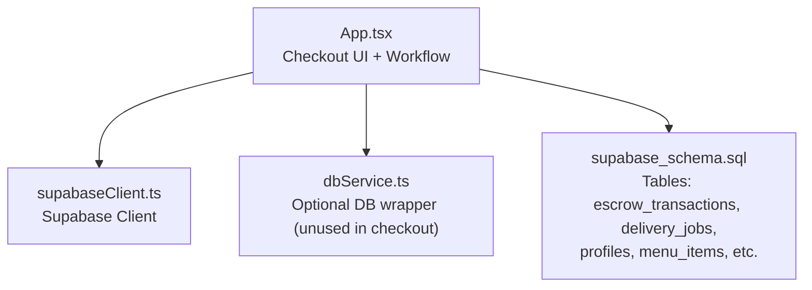
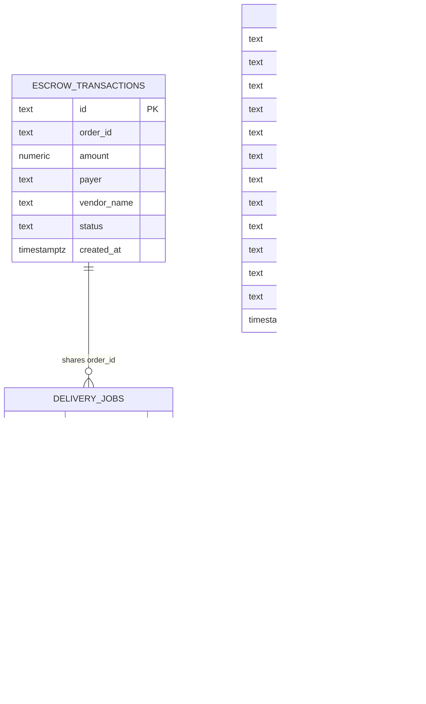
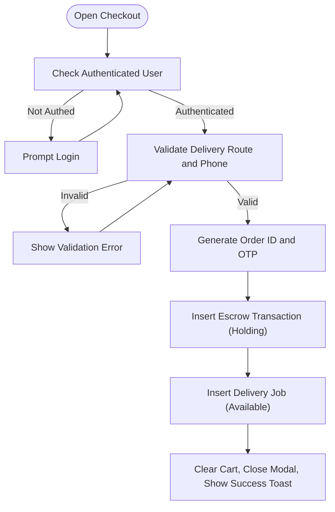
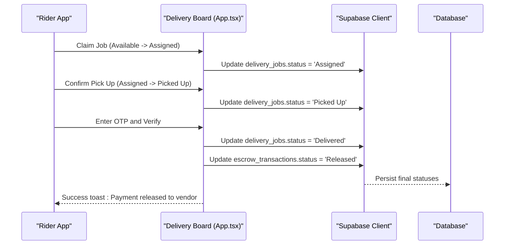
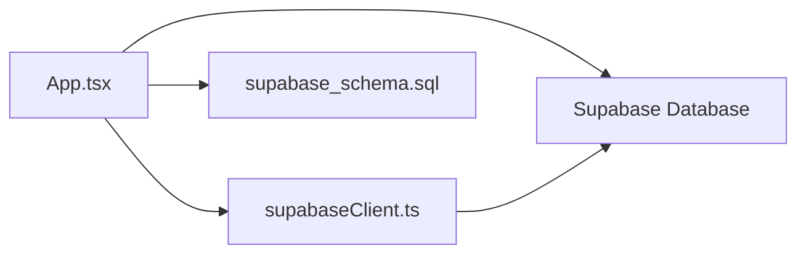

# Checkout & Order Creation

<cite>
**Referenced Files in This Document**
- [App.tsx](file://src/App.tsx)
- [supabaseClient.ts](file://src/supabase/supabaseClient.ts)
- [dbService.ts](file://src/supabase/dbService.ts)
- [supabase_schema.sql](file://supabase_schema.sql)
</cite>

## Table of Contents
1. [Introduction](#introduction)
2. [Project Structure](#project-structure)
3. [Core Components](#core-components)
4. [Architecture Overview](#architecture-overview)
5. [Detailed Component Analysis](#detailed-component-analysis)
6. [Dependency Analysis](#dependency-analysis)
7. [Performance Considerations](#performance-considerations)
8. [Troubleshooting Guide](#troubleshooting-guide)
9. [Conclusion](#conclusion)

## Introduction
This document explains the checkout and order creation process for the platform, focusing on:
- The checkout form: delivery address collection, customer phone verification, and order summary display
- The end-to-end order creation workflow from cart validation to database insertion
- Order ID generation and timestamp management
- Payment initiation with escrow transaction creation and status tracking
- The order data model including orderId, customer information, delivery details, and item summaries
- Form validation, error handling during order processing, and integration with the payment system
- Examples of successful flows, failure scenarios, and user feedback mechanisms

## Project Structure
The checkout and order creation logic is implemented primarily within the main application component and supported by Supabase client utilities and a SQL schema that defines the database tables used throughout the flow.



**Diagram sources**
- [App.tsx](file://src/App.tsx)
- [supabaseClient.ts](file://src/supabase/supabaseClient.ts)
- [dbService.ts](file://src/supabase/dbService.ts)
- [supabase_schema.sql](file://supabase_schema.sql)

**Section sources**
- [App.tsx](file://src/App.tsx)
- [supabaseClient.ts](file://src/supabase/supabaseClient.ts)
- [dbService.ts](file://src/supabase/dbService.ts)
- [supabase_schema.sql](file://supabase_schema.sql)

## Core Components
- Checkout Modal and State Management
  - Delivery route selection, M-Pesa phone input, and order summary are rendered inside a modal controlled by state flags and inputs.
  - Cart totals and items are computed and displayed before submission.
- Escrow Payment Initiation
  - On submit, the app validates inputs, simulates an STK prompt, generates an order ID and OTP, then persists an escrow transaction and a delivery job.
- Delivery Job Lifecycle
  - Jobs progress through statuses: Available → Assigned → Picked Up → Delivered.
  - Final delivery requires OTP verification to release escrow funds.

Key implementation references:
- Checkout modal rendering and fields: [App.tsx](file://src/App.tsx)
- Escrow trigger and persistence: [App.tsx](file://src/App.tsx)
- Delivery job lifecycle functions: [App.tsx](file://src/App.tsx)
- Supabase client initialization: [supabaseClient.ts](file://src/supabase/supabaseClient.ts)
- Database schema for escrow and delivery: [supabase_schema.sql](file://supabase_schema.sql)

**Section sources**
- [App.tsx](file://src/App.tsx)
- [supabaseClient.ts](file://src/supabase/supabaseClient.ts)
- [supabase_schema.sql](file://supabase_schema.sql)

## Architecture Overview
The checkout flow integrates React state, Supabase client calls, and server-side table policies defined in the schema.

```mermaid
sequenceDiagram
participant U as "User"
participant UI as "Checkout Modal (App.tsx)"
participant S as "Supabase Client (supabaseClient.ts)"
participant DB as "Database Tables"
U->>UI : Open checkout modal
UI->>UI : Validate delivery route and phone
UI->>S : Insert escrow_transactions
S-->>DB : Write escrow record (status=Holding)
UI->>S : Insert delivery_jobs
S-->>DB : Write delivery job (status=Available)
UI->>U : Show success toast with OTP
Note over UI,DB : Order created; payment held in escrow
```

**Diagram sources**
- [App.tsx](file://src/App.tsx)
- [supabaseClient.ts](file://src/supabase/supabaseClient.ts)
- [supabase_schema.sql](file://supabase_schema.sql)

## Detailed Component Analysis

### Checkout Form: Delivery Address, Phone Verification, Order Summary
- Delivery Address Collection
  - A dropdown selects a predefined route; each option implies a fixed delivery fee.
  - Validation ensures a route is selected before proceeding.
- Customer Phone Verification
  - An input field captures the M-Pesa mobile number; validation enforces minimum length.
- Order Summary Display
  - Items subtotal, delivery fee (standard or pooled), and total payable are shown dynamically.
  - Users can adjust quantities and remove items before checkout.

Implementation references:
- Delivery route select and validation: [App.tsx](file://src/App.tsx)
- Phone input and validation: [App.tsx](file://src/App.tsx)
- Order summary calculations: [App.tsx](file://src/App.tsx)

**Section sources**
- [App.tsx](file://src/App.tsx)

### Order Creation Workflow: From Cart Validation to Database Insertion
- Pre-submission checks
  - Ensures the user is authenticated.
  - Validates delivery route selection and phone number format.
- Order ID Generation
  - A simple numeric prefix plus random digits creates a unique order ID string.
- Timestamp Management
  - Server-side timestamps are applied automatically via schema defaults for created_at fields.
- Persistence
  - Inserts an escrow transaction record with amount, payer info, vendor name, and initial status Holding.
  - Inserts a delivery job record with destination, fee, customer phone, merchant name, items summary, and OTP.

Implementation references:
- Authentication check and input validation: [App.tsx](file://src/App.tsx)
- Order ID and OTP generation: [App.tsx](file://src/App.tsx)
- Escrow and delivery inserts: [App.tsx](file://src/App.tsx)
- Schema default timestamps: [supabase_schema.sql](file://supabase_schema.sql)

**Section sources**
- [App.tsx](file://src/App.tsx)
- [supabase_schema.sql](file://supabase_schema.sql)

### Payment Initiation: Escrow Transaction Creation and Status Tracking
- Payment Trigger
  - Simulates pushing an STK prompt to the provided M-Pesa number.
- Escrow Record
  - Created with status Holding; amount includes cart total plus delivery fee.
- Status Tracking
  - Admin can release funds when delivery is confirmed.
  - Rider flow uses OTP verification to transition to Released upon successful handover.

Implementation references:
- STK prompt simulation and escrow creation: [App.tsx](file://src/App.tsx)
- Admin release function: [App.tsx](file://src/App.tsx)
- OTP verification and release: [App.tsx](file://src/App.tsx)
- Escrow schema and RLS policies: [supabase_schema.sql](file://supabase_schema.sql)

**Section sources**
- [App.tsx](file://src/App.tsx)
- [supabase_schema.sql](file://supabase_schema.sql)

### Order Data Model
The following entities are central to the order and payment lifecycle:

- Escrow Transaction
  - Fields: id, order_id, amount, payer, vendor_name, status, created_at
  - Purpose: Records payment holding and release/refund states.
- Delivery Job
  - Fields: id, order_id, destination, fee, status, rider_name, customer_phone, merchant_name, items_summary, otp, boda_pool_active, created_at
  - Purpose: Tracks dispatch and delivery progression, including OTP-based handover.
- Profile (Customer Information)
  - Fields: id, email, username, name, phone, role, linked_entity_name, profile_photo_url, address, delivery_point, bio, pickup_note, created_at
  - Purpose: Stores user identity and preferences used in payer identification and delivery routing.

Schema references:
- Escrow transactions table: [supabase_schema.sql](file://supabase_schema.sql)
- Delivery jobs table: [supabase_schema.sql](file://supabase_schema.sql)
- Profiles table: [supabase_schema.sql](file://supabase_schema.sql)



**Diagram sources**
- [supabase_schema.sql](file://supabase_schema.sql)

**Section sources**
- [supabase_schema.sql](file://supabase_schema.sql)

### Implementation Details: Form Validation, Error Handling, and Integration
- Form Validation
  - Delivery route must be selected; phone must meet minimum length requirements.
  - User must be authenticated before initiating payment.
- Error Handling
  - Database insert errors are caught and surfaced via toast notifications.
  - Processing state prevents duplicate submissions and provides visual feedback.
- Integration with Payment System
  - The flow simulates an STK prompt; actual integration would call a backend service or Supabase RPC to initiate M-Pesa payments.
  - OTP handshake ensures secure handover between rider and customer.

Implementation references:
- Input validation and auth gating: [App.tsx](file://src/App.tsx)
- Error handling and toast messages: [App.tsx](file://src/App.tsx)
- Supabase client usage: [supabaseClient.ts](file://src/supabase/supabaseClient.ts)

**Section sources**
- [App.tsx](file://src/App.tsx)
- [supabaseClient.ts](file://src/supabase/supabaseClient.ts)

### Successful Order Creation Flow


**Diagram sources**
- [App.tsx](file://src/App.tsx)

**Section sources**
- [App.tsx](file://src/App.tsx)

### Failure Scenarios and User Feedback
- Missing delivery route: Immediate error toast prompting selection.
- Invalid phone number: Immediate error toast prompting correction.
- Database insert failure: Error toast indicating failure to log escrow transaction; processing flag reset.
- OTP mismatch: Error toast indicating verification code mismatch; funds remain locked.

Implementation references:
- Validation and error toasts: [App.tsx](file://src/App.tsx)
- OTP verification logic: [App.tsx](file://src/App.tsx)

**Section sources**
- [App.tsx](file://src/App.tsx)

### Rider Handshake and Escrow Release


**Diagram sources**
- [App.tsx](file://src/App.tsx)
- [supabase_schema.sql](file://supabase_schema.sql)

**Section sources**
- [App.tsx](file://src/App.tsx)
- [supabase_schema.sql](file://supabase_schema.sql)

## Dependency Analysis
The checkout and order creation depend on:
- React state for UI and workflow control
- Supabase client for database operations
- Schema-defined tables and RLS policies for data integrity and access control



**Diagram sources**
- [App.tsx](file://src/App.tsx)
- [supabaseClient.ts](file://src/supabase/supabaseClient.ts)
- [supabase_schema.sql](file://supabase_schema.sql)

**Section sources**
- [App.tsx](file://src/App.tsx)
- [supabaseClient.ts](file://src/supabase/supabaseClient.ts)
- [supabase_schema.sql](file://supabase_schema.sql)

## Performance Considerations
- Avoid redundant network calls by batching inserts where possible.
- Use optimistic UI updates sparingly; prefer consistent state synchronization with server responses.
- Ensure proper indexing on frequently queried columns like order_id and status to improve lookup performance.
- Minimize client-side computations for large datasets; leverage server-side filtering and pagination.

[No sources needed since this section provides general guidance]

## Troubleshooting Guide
Common issues and resolutions:
- Supabase credentials missing
  - Ensure environment variables VITE_SUPABASE_URL and VITE_SUPABASE_ANON_KEY are set correctly.
  - Validate URL does not include /rest/v1 path.
- RLS policy failures
  - Confirm policies allow required operations for anon/authenticated roles.
- Insert errors
  - Check payload structure matches schema fields and types.
  - Review error messages from Supabase responses and surface them via toast notifications.

Implementation references:
- Environment validation and warnings: [supabaseClient.ts](file://src/supabase/supabaseClient.ts)
- Error handling patterns: [App.tsx](file://src/App.tsx)
- RLS policies and grants: [supabase_schema.sql](file://supabase_schema.sql)

**Section sources**
- [supabaseClient.ts](file://src/supabase/supabaseClient.ts)
- [App.tsx](file://src/App.tsx)
- [supabase_schema.sql](file://supabase_schema.sql)

## Conclusion
The checkout and order creation process combines robust form validation, secure payment initiation via escrow, and a clear delivery job lifecycle. The implementation leverages Supabase for reliable data persistence and enforces security through RLS policies. By following the documented workflows and troubleshooting steps, developers can ensure a smooth and secure user experience from cart to delivery completion.

[No sources needed since this section summarizes without analyzing specific files]