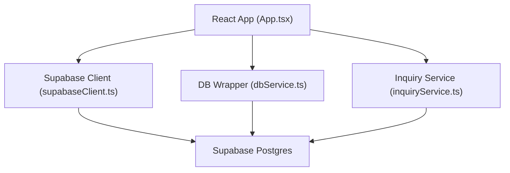
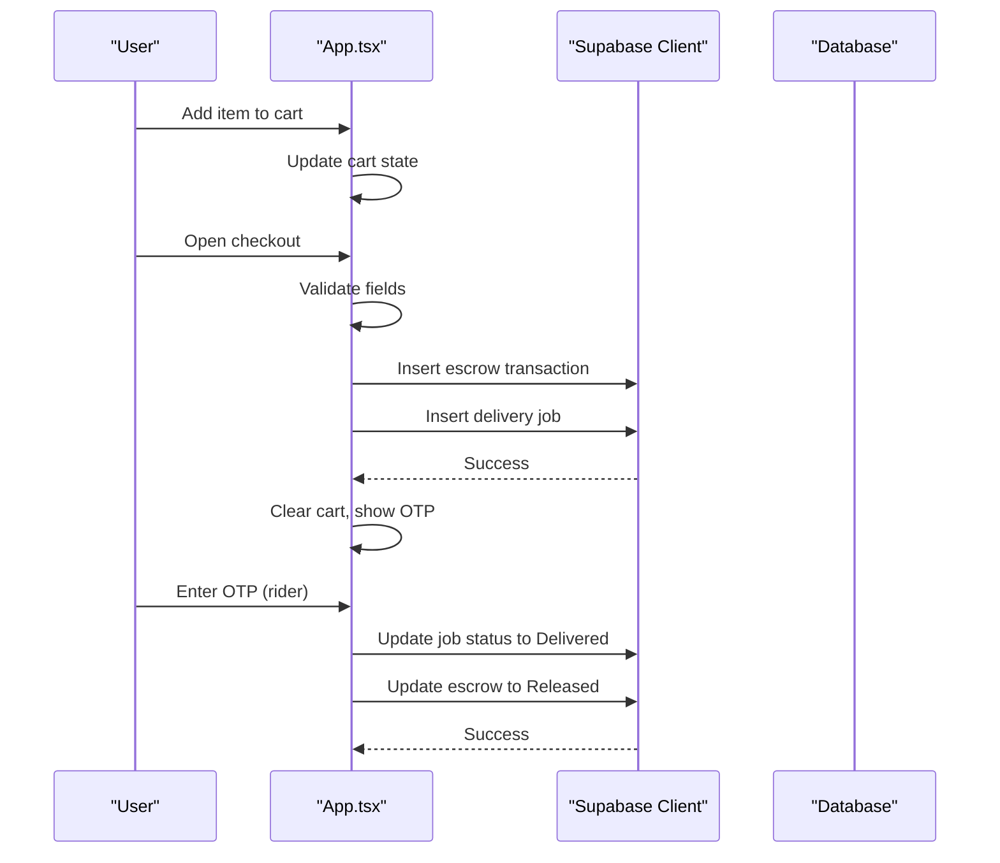
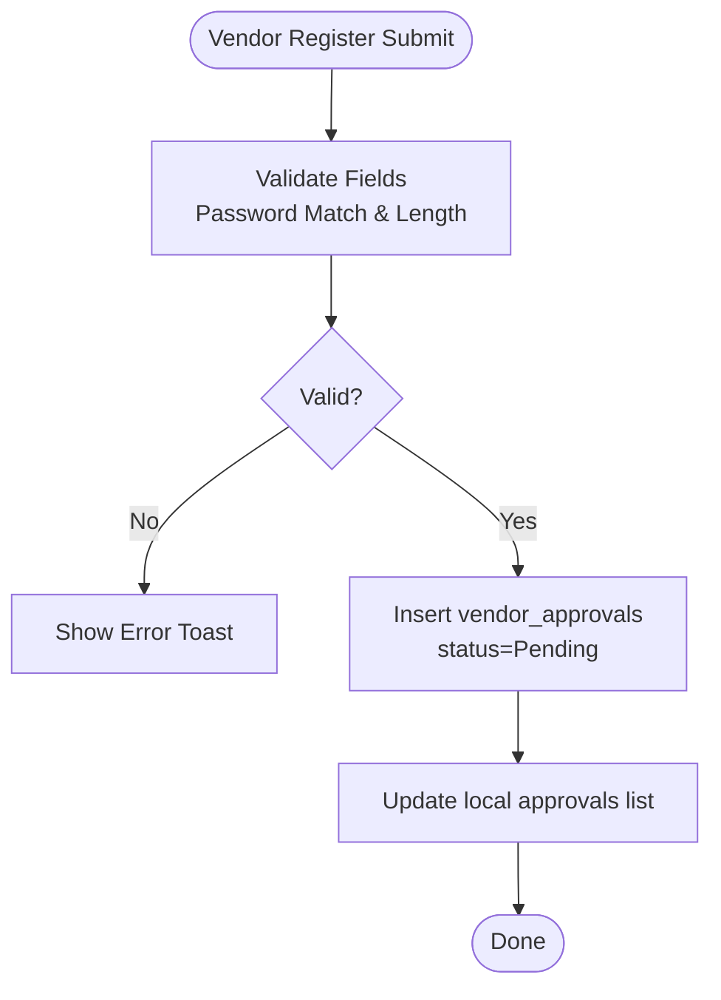
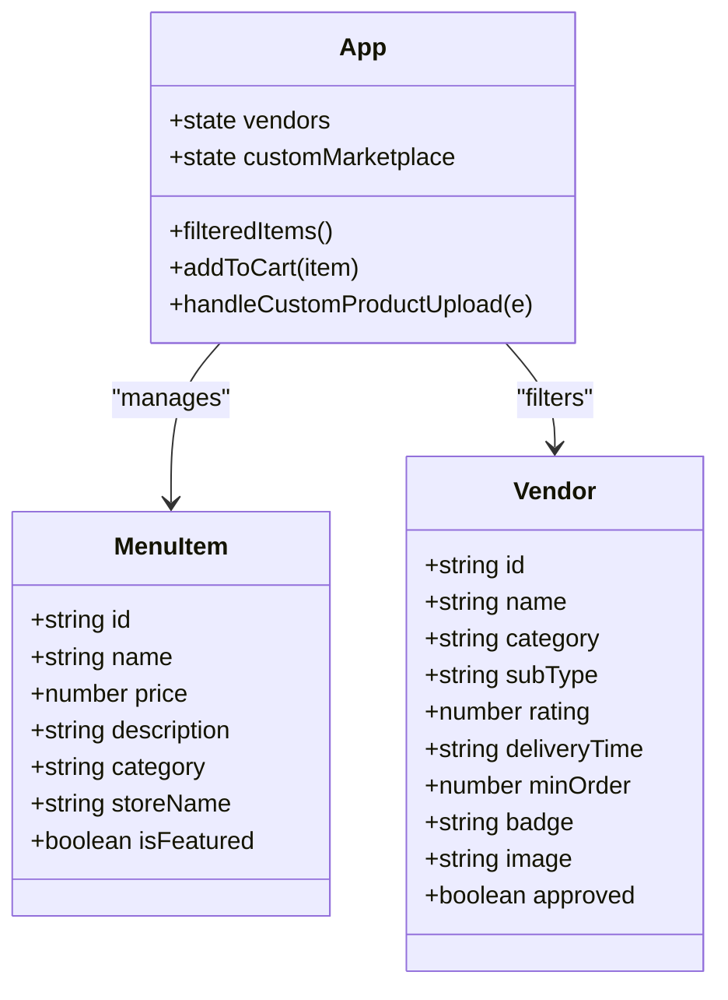
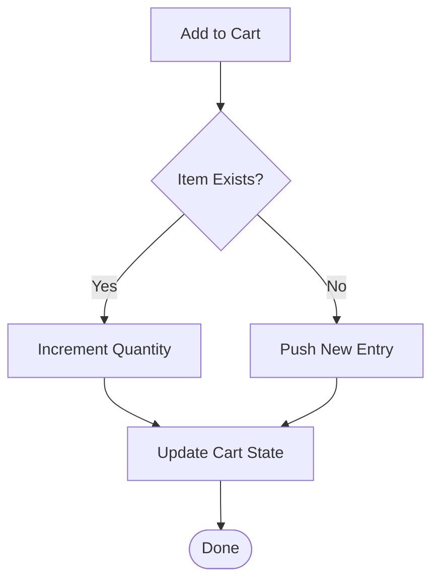
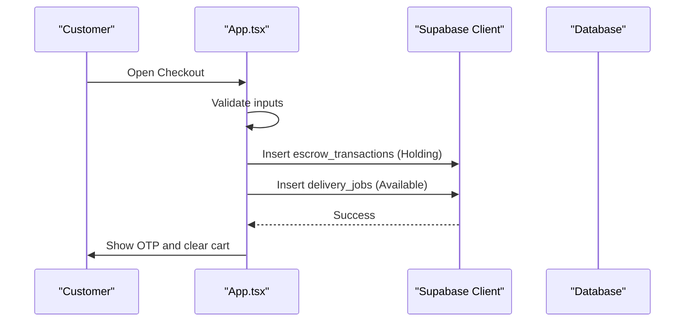
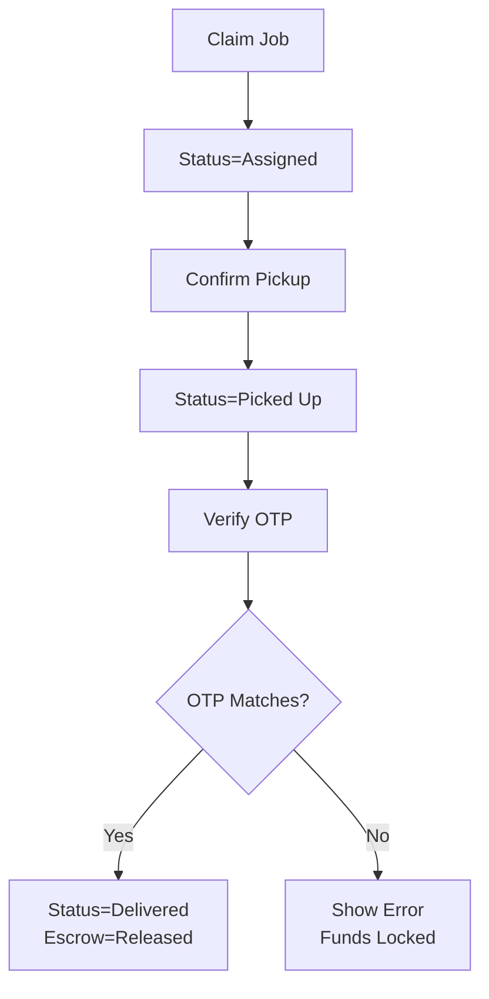
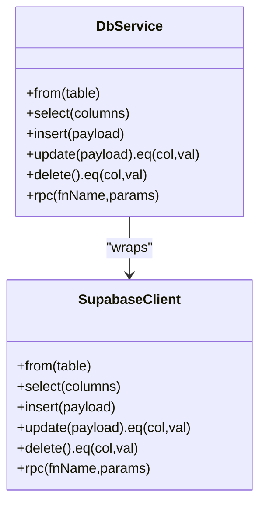
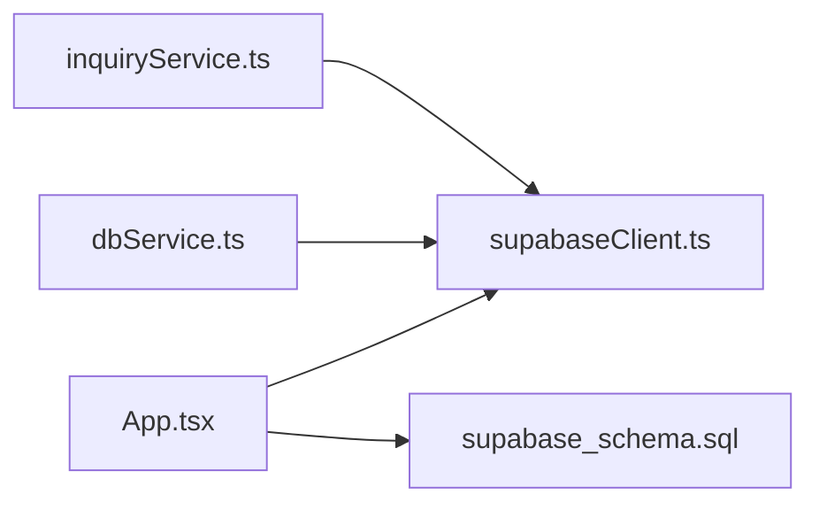

# Marketplace Core

<cite>
**Referenced Files in This Document**
- [App.tsx](file://src/App.tsx)
- [supabaseClient.ts](file://src/supabase/supabaseClient.ts)
- [dbService.ts](file://src/supabase/dbService.ts)
- [inquiryService.ts](file://src/supabase/inquiryService.ts)
- [supabase_schema.sql](file://supabase_schema.sql)
</cite>

## Table of Contents
1. [Introduction](#introduction)
2. [Project Structure](#project-structure)
3. [Core Components](#core-components)
4. [Architecture Overview](#architecture-overview)
5. [Detailed Component Analysis](#detailed-component-analysis)
6. [Dependency Analysis](#dependency-analysis)
7. [Performance Considerations](#performance-considerations)
8. [Troubleshooting Guide](#troubleshooting-guide)
9. [Conclusion](#conclusion)

## Introduction
This document explains the marketplace core functionality implemented in the application, focusing on:
- Vendor registration and approval workflow with form validation, status tracking, and administrative review
- Product catalog management (CRUD), category organization, and inventory visibility
- Shopping cart operations including item addition/removal, quantity management, and persistent storage
- Checkout process, order creation, and payment initiation via escrow holding and OTP handshake
- Database operations using Supabase client and a dbService wrapper, error handling strategies, and real-time updates for inventory changes

The implementation is primarily contained within a single React application component that orchestrates UI state, user flows, and database interactions through Supabase.

## Project Structure
At a high level:
- The main application logic and UI are implemented in App.tsx
- Supabase client configuration is centralized in supabaseClient.ts
- A lightweight dbService wrapper provides consistent data access patterns
- An inquiry service demonstrates direct Supabase usage for support tickets
- The database schema defines tables for vendors, menu items, approvals, delivery jobs, escrow transactions, inquiries, and more

**Diagram sources**
- [App.tsx](file://src/App.tsx)
- [supabaseClient.ts](file://src/supabase/supabaseClient.ts)
- [dbService.ts](file://src/supabase/dbService.ts)
- [inquiryService.ts](file://src/supabase/inquiryService.ts)

**Section sources**
- [App.tsx](file://src/App.tsx)
- [supabaseClient.ts](file://src/supabase/supabaseClient.ts)
- [dbService.ts](file://src/supabase/dbService.ts)
- [inquiryService.ts](file://src/supabase/inquiryService.ts)
- [supabase_schema.sql](file://supabase_schema.sql)

## Core Components
- Vendor Registration and Approval
  - Form collects shop name, category, phone, and password; validates inputs and inserts into vendor_approvals with Pending status
  - Admin reviews requests and approves, which creates a vendor record in vendors and updates approval status to Approved
- Product Catalog Management
  - Menu items are loaded from menu_items and displayed by category; CRUD operations include adding new products and promoting featured items
  - Categories are used to filter listings; banned stores are hidden from the catalog
- Shopping Cart
  - In-memory cart supports add, remove, clear, and quantity adjustments; totals computed reactively
  - Persistent storage is not implemented in the current codebase; cart resets on sign-out
- Checkout and Order Creation
  - Validates delivery route and M-Pesa phone number; simulates STK prompt and generates an OTP
  - Creates escrow_transactions (Holding) and delivery_jobs (Available); clears cart and shows OTP to customer
- Escrow Release and Delivery Handshake
  - Rider flow transitions job states (Assigned -> Picked Up -> Delivered)
  - OTP verification releases escrow funds to Released status

**Section sources**
- [App.tsx](file://src/App.tsx)
- [supabase_schema.sql](file://supabase_schema.sql)

## Architecture Overview
The application follows a client-side orchestration pattern:
- UI state drives user flows (auth, catalog browsing, cart, checkout, admin dashboards)
- Data layer uses Supabase directly in many places and optionally via dbService wrapper
- Schema enforces RLS policies for open access during development

**Diagram sources**
- [App.tsx](file://src/App.tsx)
- [supabaseClient.ts](file://src/supabase/supabaseClient.ts)

## Detailed Component Analysis

### Vendor Registration and Approval Workflow
- Form Validation
  - Required fields: shop name, category, phone, password, confirm password
  - Password length and match checks enforced
  - Generates login email from phone and sets status to Pending
- Submission and Status Tracking
  - Inserts request into vendor_approvals table
  - Updates local state to reflect Pending status
- Administrative Review
  - Admin view lists pending requests with Approve action
  - On approve: updates vendor_approvals status to Approved and inserts vendor into vendors table
  - Local state reflects both approval and new vendor listing

**Diagram sources**
- [App.tsx](file://src/App.tsx)

**Section sources**
- [App.tsx](file://src/App.tsx)
- [supabase_schema.sql](file://supabase_schema.sql)

### Product Catalog Management (CRUD, Categories, Inventory Visibility)
- Loading and Filtering
  - Loads menu_items from database; maps to frontend types
  - Filters by activeCategory and searchQuery; excludes banned stores
- CRUD Operations
  - Create: Upload new product via form; inserts into menu_items
  - Read: Display filtered listings; featured items shown in sponsor banner
  - Update: Promote item to featured (is_featured flag)
  - Delete: Not implemented in current UI
- Category Organization
  - Categories drive filtering and vendor display
  - Banned vendors are excluded from fullMarketplace

**Diagram sources**
- [App.tsx](file://src/App.tsx)

**Section sources**
- [App.tsx](file://src/App.tsx)
- [supabase_schema.sql](file://supabase_schema.sql)

### Shopping Cart Functionality
- Item Addition/Removal
  - addToCart increments quantity if exists or adds new entry
  - removeFromCart decrements quantity or removes item when quantity reaches 0
  - clearItemFromCart removes specific item
- Quantity Management
  - Quantities updated via setCart with immutable updates
- Persistent Storage
  - Not implemented; cart resets on sign-out and page reload

**Diagram sources**
- [App.tsx](file://src/App.tsx)

**Section sources**
- [App.tsx](file://src/App.tsx)

### Checkout Process, Order Creation, and Payment Initiation
- Validation
  - Requires authenticated user, delivery route selection, and valid M-Pesa phone number
- Order Creation
  - Generates unique order ID and OTP
  - Inserts escrow_transactions with Holding status
  - Inserts delivery_jobs with Available status
- Payment Initiation
  - Simulates STK prompt delay and shows OTP to customer
  - Clears cart and closes checkout modal

**Diagram sources**
- [App.tsx](file://src/App.tsx)
- [supabaseClient.ts](file://src/supabase/supabaseClient.ts)

**Section sources**
- [App.tsx](file://src/App.tsx)

### Escrow Release and Delivery Handshake
- Job Lifecycle
  - Rider claims job (Assigned), confirms pickup (Picked Up), verifies OTP (Delivered)
- OTP Verification
  - Compares entered OTP with stored OTP; on match, updates job to Delivered and escrow to Released
- Real-Time Updates
  - Local state updates immediately after successful database operations

**Diagram sources**
- [App.tsx](file://src/App.tsx)

**Section sources**
- [App.tsx](file://src/App.tsx)

### Database Operations Using dbService Wrapper
- Wrapper Capabilities
  - Provides typed select, insert, update, delete, and rpc methods
  - Normalizes responses into { data, error } structure
- Usage Patterns
  - Direct Supabase calls are used extensively in App.tsx
  - dbService can be adopted for consistent error handling and typing across modules

**Diagram sources**
- [dbService.ts](file://src/supabase/dbService.ts)
- [supabaseClient.ts](file://src/supabase/supabaseClient.ts)

**Section sources**
- [dbService.ts](file://src/supabase/dbService.ts)
- [supabaseClient.ts](file://src/supabase/supabaseClient.ts)

### Inquiry Service Example
- Demonstrates direct Supabase usage for creating and fetching inquiries
- Useful pattern for future services requiring simple CRUD operations

**Section sources**
- [inquiryService.ts](file://src/supabase/inquiryService.ts)

## Dependency Analysis
- App.tsx depends on:
  - Supabase client for authentication and data operations
  - Local state for UI and business logic
  - Schema-defined tables for persistence
- dbService.ts depends on Supabase client for standardized queries
- inquiryService.ts depends on Supabase client for direct table access

**Diagram sources**
- [App.tsx](file://src/App.tsx)
- [supabaseClient.ts](file://src/supabase/supabaseClient.ts)
- [dbService.ts](file://src/supabase/dbService.ts)
- [inquiryService.ts](file://src/supabase/inquiryService.ts)
- [supabase_schema.sql](file://supabase_schema.sql)

**Section sources**
- [App.tsx](file://src/App.tsx)
- [supabaseClient.ts](file://src/supabase/supabaseClient.ts)
- [dbService.ts](file://src/supabase/dbService.ts)
- [inquiryService.ts](file://src/supabase/inquiryService.ts)
- [supabase_schema.sql](file://supabase_schema.sql)

## Performance Considerations
- Use useMemo for derived data like filtered items and totals to avoid unnecessary recalculations
- Batch database operations where possible to reduce network overhead
- Avoid heavy computations inside render loops; offload to handlers
- Consider implementing pagination for large catalogs and approvals queues
- Persist cart and user preferences to localStorage or server-side storage for resilience

[No sources needed since this section provides general guidance]

## Troubleshooting Guide
- Authentication Issues
  - Ensure Supabase credentials are configured correctly in environment variables
  - Check for legacy phone-based fallback behavior and profile creation paths
- Database Errors
  - Inspect RLS policies and ensure proper permissions for tables
  - Validate field mappings between frontend types and database columns
- Checkout Failures
  - Verify required fields (delivery route, phone number) before submission
  - Confirm database inserts for escrow and delivery jobs succeed
- Real-Time Updates
  - Ensure local state updates mirror database operations
  - Handle errors gracefully with informative toasts

**Section sources**
- [supabaseClient.ts](file://src/supabase/supabaseClient.ts)
- [App.tsx](file://src/App.tsx)
- [supabase_schema.sql](file://supabase_schema.sql)

## Conclusion
The marketplace core functionality is implemented as a cohesive React application that manages vendor onboarding, product catalog operations, shopping cart workflows, and secure checkout processes. The use of Supabase for authentication and data persistence, combined with a structured schema and optional dbService wrapper, provides a solid foundation for scaling and enhancing the platform. Future improvements should focus on persistent storage, real-time synchronization, and advanced error handling to improve reliability and user experience.

[No sources needed since this section summarizes without analyzing specific files]