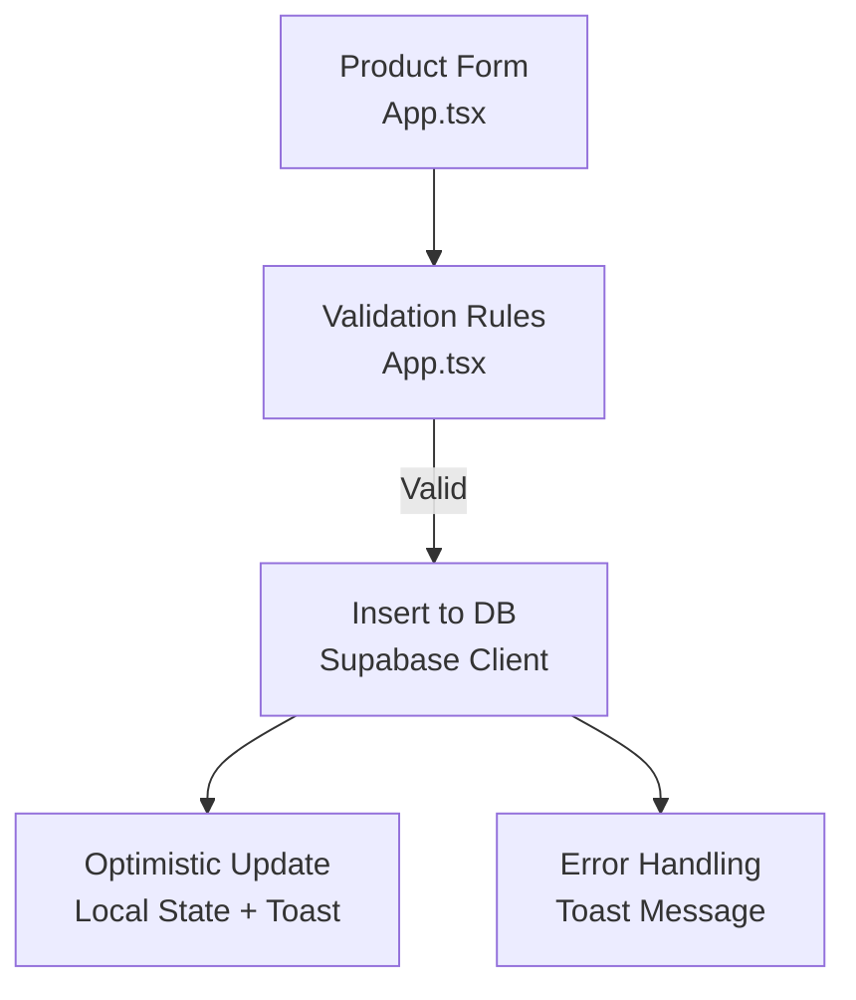
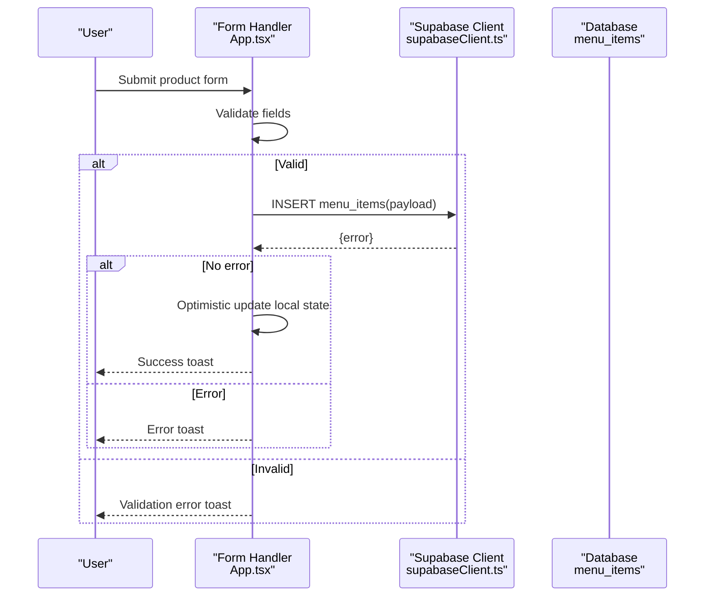
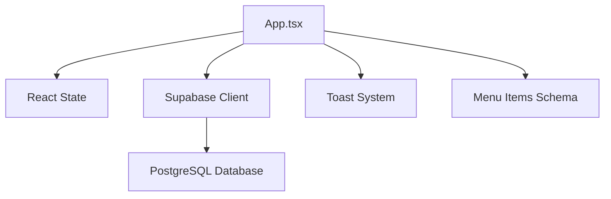

# CRUD Operations

<cite>
**Referenced Files in This Document**
- [App.tsx](file://src/App.tsx)
- [dbService.ts](file://src/supabase/dbService.ts)
- [supabaseClient.ts](file://src/supabaseClient.ts)
- [supabase_schema.sql](file://supabase_schema.sql)
- [inquiryService.ts](file://src/supabase/inquiryService.ts)
</cite>

## Table of Contents
1. [Introduction](#introduction)
2. [Project Structure](#project-structure)
3. [Core Components](#core-components)
4. [Architecture Overview](#architecture-overview)
5. [Detailed Component Analysis](#detailed-component-analysis)
6. [Dependency Analysis](#dependency-analysis)
7. [Performance Considerations](#performance-considerations)
8. [Troubleshooting Guide](#troubleshooting-guide)
9. [Conclusion](#conclusion)

## Introduction
This document explains how the product catalog (menu items) is created, updated, deleted, and managed in bulk within the application. It covers form handling, validation rules, database insertion via the Supabase client, optimistic UI updates, error handling patterns, and integration with the database schema. It also documents the MenuItem interface fields and constraints.

## Project Structure
The product catalog functionality is primarily implemented in the main application component, which handles:
- Form state for creating new products
- Validation before submission
- Inserting records into the menu_items table
- Optimistic updates to the local state
- Error handling and user feedback

**Diagram sources**
- [App.tsx:1555-1592](file://src/App.tsx#L1555-L1592)
- [supabaseClient.ts:1-7](file://src/supabaseClient.ts#L1-L7)

**Section sources**
- [App.tsx:1555-1592](file://src/App.tsx#L1555-L1592)
- [supabaseClient.ts:1-7](file://src/supabaseClient.ts#L1-L7)

## Core Components
- Product creation form and handler:
  - Binds form inputs to state variables
  - Validates required fields
  - Inserts a new menu item record
  - Updates local state optimistically
  - Shows success or error toasts
- Database layer:
  - Uses Supabase client directly for inserts
  - Schema enforces constraints on menu_items

Key implementation references:
- Create product form and handler: [App.tsx:1555-1592](file://src/App.tsx#L1555-L1592)
- Menu items loading and mapping: [App.tsx:384-408](file://src/App.tsx#L384-L408)
- Supabase client initialization: [supabaseClient.ts:1-7](file://src/supabaseClient.ts#L1-L7)
- Menu items schema: [supabase_schema.sql:86-96](file://supabase_schema.sql#L86-L96)

**Section sources**
- [App.tsx:1555-1592](file://src/App.tsx#L1555-L1592)
- [App.tsx:384-408](file://src/App.tsx#L384-L408)
- [supabaseClient.ts:1-7](file://src/supabaseClient.ts#L1-L7)
- [supabase_schema.sql:86-96](file://supabase_schema.sql#L86-L96)

## Architecture Overview
The product catalog uses a straightforward client-side flow:
- User fills out the product form
- Frontend validates input
- Application calls Supabase insert API
- On success, local state is updated immediately (optimistic update)
- Errors are caught and surfaced via toast notifications

**Diagram sources**
- [App.tsx:1555-1592](file://src/App.tsx#L1555-L1592)
- [supabaseClient.ts:1-7](file://src/supabaseClient.ts#L1-L7)

## Detailed Component Analysis

### Create Operation
- Form fields:
  - Product Title (required)
  - Price (required, numeric)
  - Category (required)
  - Store Name (required)
  - Description (optional)
- Validation rules:
  - Required fields must be non-empty
  - Price must be a valid number
- Database insertion:
  - Inserts a new row into menu_items using Supabase client
  - Maps frontend fields to database columns (e.g., storeName -> store_name)
- Optimistic update:
  - Adds the new item to local customMarketplace array immediately
  - Clears form fields after successful insertion
  - Displays success toast

Implementation reference:
- Create handler and form binding: [App.tsx:1555-1592](file://src/App.tsx#L1555-L1592)

Code example path:
- See [App.tsx:1555-1592](file://src/App.tsx#L1555-L1592) for the complete create flow

**Section sources**
- [App.tsx:1555-1592](file://src/App.tsx#L1555-L1592)

### Update Operation
Current status:
- There is no dedicated update function for individual menu items in the codebase.
- The only related update is promoting an item to featured status via purchaseAdBanner, which sets is_featured to true.

Promote to featured:
- Updates menu_items.is_featured to true for a given id
- Optimistically updates local state
- Shows success toast

Implementation reference:
- Promote to featured: [App.tsx:1412-1430](file://src/App.tsx#L1412-L1430)

Recommendation:
- Implement a full edit flow similar to create:
  - Add edit mode in the vendor dashboard
  - Validate changes
  - Use supabase.from('menu_items').update({ ... }).eq('id', itemId)
  - Optimistically update local state
  - Handle errors with toast messages

**Section sources**
- [App.tsx:1412-1430](file://src/App.tsx#L1412-L1430)

### Delete Operation
Current status:
- There is no delete operation for menu items in the codebase.
- Items are not soft-deleted; they remain in the database until manually removed.

Recommendation:
- Implement soft delete by adding a deleted_at column to menu_items
- When deleting, set deleted_at to current timestamp instead of removing the row
- Filter out soft-deleted items from queries
- Provide admin tools to permanently remove soft-deleted items

**Section sources**
- [supabase_schema.sql:86-96](file://supabase_schema.sql#L86-L96)

### Bulk Operations
Current status:
- No bulk create/update/delete operations for menu items are implemented.
- Initial data seeding inserts multiple items at once during first load.

Initial seeding:
- Inserts baseline menu items if none exist
- Maps frontend types to database columns
- Sets is_featured based on initial data

Implementation reference:
- Initial seeding: [App.tsx:396-408](file://src/App.tsx#L396-L408)

Recommendation:
- Implement bulk upload functionality:
  - Allow CSV/JSON import for multiple products
  - Batch insert using supabase.from('menu_items').insert([...])
  - Handle partial failures gracefully
  - Show progress indicators

**Section sources**
- [App.tsx:396-408](file://src/App.tsx#L396-L408)

### dbService Wrapper
The dbService provides a typed wrapper around Supabase operations:
- from(table) returns a query builder
- select(columns) performs SELECT operations
- insert(payload) performs INSERT operations
- update(payload).eq(column, value) performs UPDATE operations
- delete().eq(column, value) performs DELETE operations
- rpc(functionName, params) calls Supabase functions

However, this wrapper is not currently used for menu item operations. The application uses Supabase client directly.

Implementation reference:
- dbService wrapper: [dbService.ts:1-24](file://src/supabase/dbService.ts#L1-L24)

Recommendation:
- Refactor menu item operations to use dbService for consistency:
  - Replace direct Supabase calls with dbService methods
  - Leverage type safety provided by the wrapper
  - Centralize error handling through the handle utility

**Section sources**
- [dbService.ts:1-24](file://src/supabase/dbService.ts#L1-L24)

## Dependency Analysis
The product catalog system has the following dependencies:
- React state management for UI updates
- Supabase client for database operations
- Local storage for user session persistence
- Toast notification system for user feedback

**Diagram sources**
- [App.tsx:1555-1592](file://src/App.tsx#L1555-L1592)
- [supabaseClient.ts:1-7](file://src/supabaseClient.ts#L1-L7)
- [supabase_schema.sql:86-96](file://supabase_schema.sql#L86-L96)

**Section sources**
- [App.tsx:1555-1592](file://src/App.tsx#L1555-L1592)
- [supabaseClient.ts:1-7](file://src/supabaseClient.ts#L1-L7)
- [supabase_schema.sql:86-96](file://supabase_schema.sql#L86-L96)

## Performance Considerations
- Optimistic updates provide immediate UI feedback without waiting for database responses
- Initial data seeding prevents empty states on first load
- Local filtering and search operations are performed client-side for better responsiveness
- Consider implementing pagination for large product catalogs
- Use Supabase RLS policies for security and performance optimization

## Troubleshooting Guide
Common issues and solutions:
- Validation errors: Ensure all required fields are filled correctly
- Database connection errors: Check Supabase configuration and network connectivity
- Permission errors: Verify RLS policies allow the required operations
- Data mapping errors: Ensure proper field name mapping between frontend and database

Error handling patterns:
- All operations show toast notifications for success and error cases
- Console logging is used for debugging database operations
- Form validation prevents invalid submissions

**Section sources**
- [App.tsx:1555-1592](file://src/App.tsx#L1555-L1592)

## Conclusion
The product catalog system implements a solid foundation for creating menu items with proper validation, optimistic updates, and error handling. While update and delete operations are not fully implemented, the architecture supports easy extension. The dbService wrapper provides a consistent interface that can be adopted across the application for better maintainability and type safety.

Key recommendations:
- Implement full CRUD operations for menu items
- Adopt the dbService wrapper for consistent database interactions
- Add bulk operations for efficient data management
- Implement soft delete functionality for data recovery
- Enhance validation rules and error handling