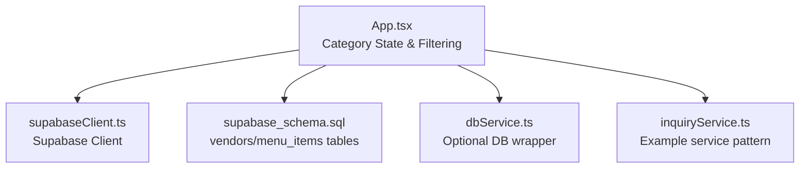
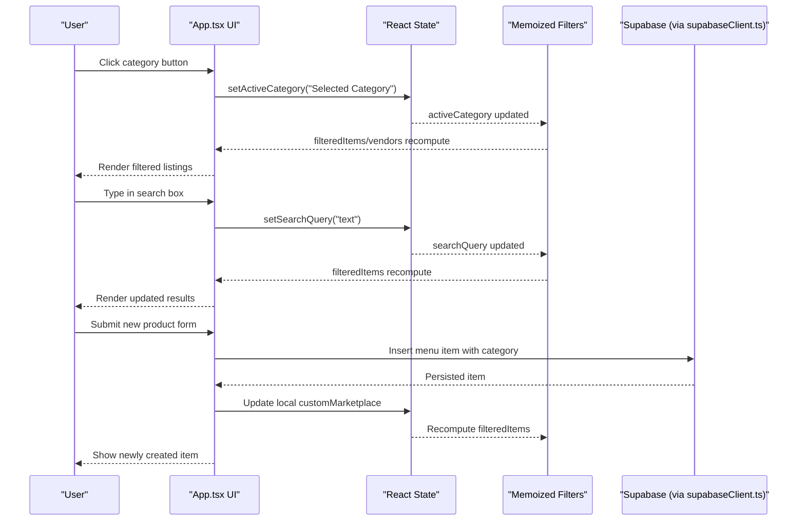
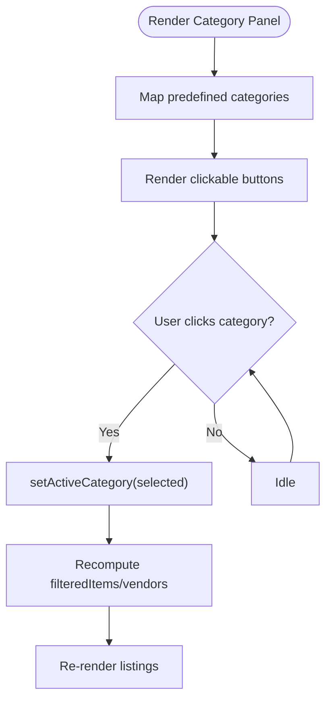
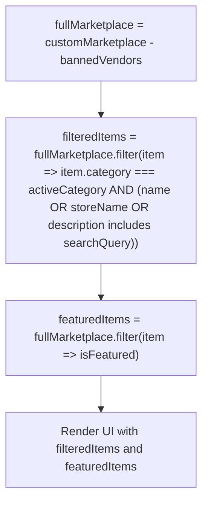
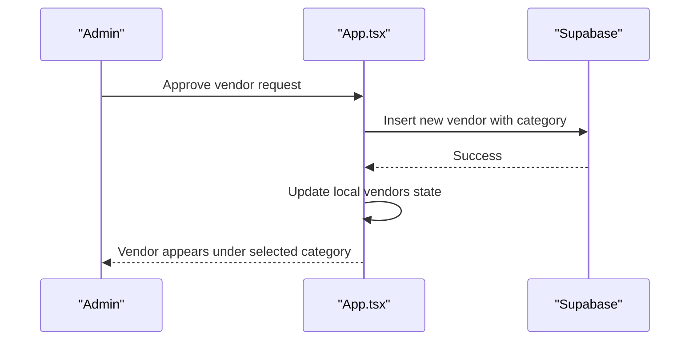
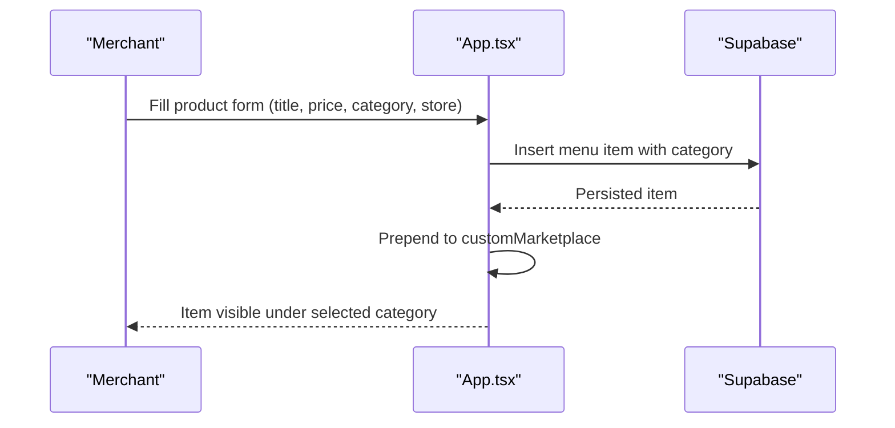
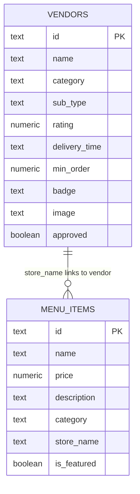
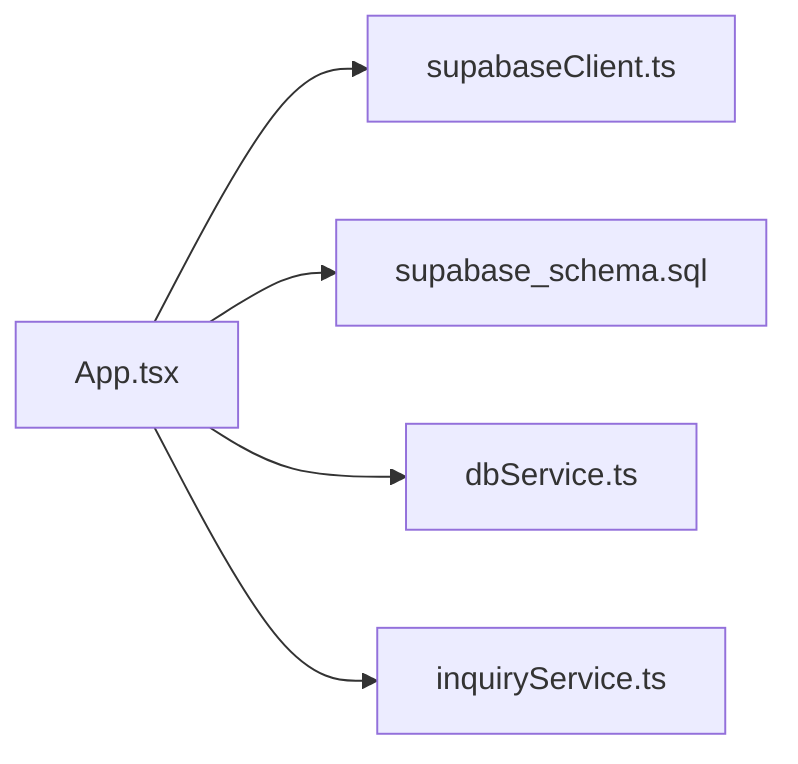

# Category Management

<cite>
**Referenced Files in This Document**
- [App.tsx](file://src/App.tsx)
- [supabaseClient.ts](file://src/supabaseClient.ts)
- [dbService.ts](file://src/supabase/dbService.ts)
- [inquiryService.ts](file://src/supabase/inquiryService.ts)
- [supabase_schema.sql](file://supabase_schema.sql)
</cite>

## Table of Contents
1. [Introduction](#introduction)
2. [Project Structure](#project-structure)
3. [Core Components](#core-components)
4. [Architecture Overview](#architecture-overview)
5. [Detailed Component Analysis](#detailed-component-analysis)
6. [Dependency Analysis](#dependency-analysis)
7. [Performance Considerations](#performance-considerations)
8. [Troubleshooting Guide](#troubleshooting-guide)
9. [Conclusion](#conclusion)
10. [Appendices](#appendices)

## Introduction
This document explains the category management system used to organize vendors and products across predefined categories, filter listings by category and search terms, and support dynamic product creation with automatic categorization based on store types. It covers state management, filtering logic, UI components for category selection, and database relationships that tie categories to vendors and menu items.

## Project Structure
The category system is implemented primarily within the main application component and supported by Supabase client utilities and a SQL schema defining the data model for vendors and menu items.

**Diagram sources**
- [App.tsx](file://src/App.tsx)
- [supabaseClient.ts](file://src/supabaseClient.ts)
- [dbService.ts](file://src/supabase/dbService.ts)
- [inquiryService.ts](file://src/supabase/inquiryService.ts)
- [supabase_schema.sql](file://supabase_schema.sql)

**Section sources**
- [App.tsx](file://src/App.tsx)
- [supabaseClient.ts](file://src/supabaseClient.ts)
- [supabase_schema.sql](file://supabase_schema.sql)

## Core Components
- Predefined Categories: The UI defines four top-level categories: "Food & Beverages", "M & M Soko", "M & M Services", and "M & M Fun Zone". These are rendered as selectable buttons that update the active category state.
- Category State: A single string state holds the currently selected category; it drives both vendor listing and product listing filters.
- Product Listing Filter: Products (menu items) are filtered by exact category match and combined with a text search across name, store name, and description.
- Vendor Listing Filter: Vendors are filtered by matching the active category and an approval flag.
- Dynamic Product Creation: A form allows creating new menu items with a chosen category from the same set of predefined values.
- Database Model: The schema defines vendors and menu_items tables with a category field, enabling persistence and retrieval of categorized entities.

**Section sources**
- [App.tsx:1867-1886](file://src/App.tsx#L1867-L1886)
- [App.tsx:647-655](file://src/App.tsx#L647-L655)
- [App.tsx:1972-2007](file://src/App.tsx#L1972-L2007)
- [App.tsx:2957-2977](file://src/App.tsx#L2957-L2977)
- [supabase_schema.sql:72-96](file://supabase_schema.sql#L72-L96)

## Architecture Overview
The category system follows a unidirectional data flow: user interactions update React state, which recomputes derived lists via memoized filters, and then renders the UI. Data persistence uses Supabase through a shared client instance.

**Diagram sources**
- [App.tsx:1867-1886](file://src/App.tsx#L1867-L1886)
- [App.tsx:647-655](file://src/App.tsx#L647-L655)
- [App.tsx:2957-2977](file://src/App.tsx#L2957-L2977)
- [supabaseClient.ts](file://src/supabaseClient.ts)

## Detailed Component Analysis

### Category State and UI Selection
- Active Category State: Holds the current category string.
- Category Buttons: Rendered from a static array of predefined categories; clicking updates the active category.
- Visual Feedback: The selected category receives distinct styling to indicate the active state.

**Diagram sources**
- [App.tsx:1867-1886](file://src/App.tsx#L1867-L1886)
- [App.tsx:647-655](file://src/App.tsx#L647-L655)

**Section sources**
- [App.tsx:1867-1886](file://src/App.tsx#L1867-L1886)

### Filtering Logic
- Full Marketplace: Derived list excluding banned stores.
- Filtered Items: Combines exact category match with case-insensitive search across item name, store name, and description.
- Featured Items: Separate derived list for promotional banners.

**Diagram sources**
- [App.tsx:643-659](file://src/App.tsx#L643-L659)

**Section sources**
- [App.tsx:643-659](file://src/App.tsx#L643-L659)

### Vendor Listing and Automatic Categorization
- Vendor Cards: Display only approved vendors whose category matches the active category.
- Approval Flow: When a vendor request is approved, a new vendor record is inserted into the database with the requested category, making it appear under the corresponding category automatically.

**Diagram sources**
- [App.tsx:1972-2007](file://src/App.tsx#L1972-L2007)
- [App.tsx:1452-1497](file://src/App.tsx#L1452-L1497)

**Section sources**
- [App.tsx:1972-2007](file://src/App.tsx#L1972-L2007)
- [App.tsx:1452-1497](file://src/App.tsx#L1452-L1497)

### Dynamic Product Creation and Category Assignment
- Product Form: Allows selecting one of the predefined categories when creating a new menu item.
- Persistence: On submit, the new item is inserted into the menu_items table with the chosen category.
- Immediate Visibility: Local state updates ensure the new item appears in the filtered listings right away.

**Diagram sources**
- [App.tsx:2957-2977](file://src/App.tsx#L2957-L2977)
- [App.tsx:1555-1592](file://src/App.tsx#L1555-L1592)

**Section sources**
- [App.tsx:2957-2977](file://src/App.tsx#L2957-L2977)
- [App.tsx:1555-1592](file://src/App.tsx#L1555-L1592)

### Data Model Relationships
- Vendors: Each vendor has a category field determining its section.
- Menu Items: Each menu item has a category field and a store_name linking it to a vendor.
- Banned Stores: Excluded from the marketplace to hide their items.

**Diagram sources**
- [supabase_schema.sql:72-96](file://supabase_schema.sql#L72-L96)

**Section sources**
- [supabase_schema.sql:72-96](file://supabase_schema.sql#L72-L96)

## Dependency Analysis
- App.tsx depends on supabaseClient.ts for all database operations.
- Optional dbService.ts provides a typed wrapper around Supabase queries; inquiryService.ts demonstrates a service pattern for specific tables.
- The schema defines constraints and RLS policies that affect how data can be read/written.

**Diagram sources**
- [App.tsx](file://src/App.tsx)
- [supabaseClient.ts](file://src/supabaseClient.ts)
- [dbService.ts](file://src/supabase/dbService.ts)
- [inquiryService.ts](file://src/supabase/inquiryService.ts)
- [supabase_schema.sql](file://supabase_schema.sql)

**Section sources**
- [supabaseClient.ts](file://src/supabaseClient.ts)
- [dbService.ts](file://src/supabase/dbService.ts)
- [inquiryService.ts](file://src/supabase/inquiryService.ts)
- [supabase_schema.sql](file://supabase_schema.sql)

## Performance Considerations
- Memoization: Use useMemo for derived lists (fullMarketplace, filteredItems, featuredItems) to avoid unnecessary recalculations.
- Minimal Re-renders: Keep category and search state at the top level to prevent deep tree re-renders.
- Efficient Filtering: Exact category match is O(n); consider indexing or server-side filtering if datasets grow large.
- Avoid Redundant Queries: Batch inserts/updates where possible and rely on local state updates for immediate UI feedback.

[No sources needed since this section provides general guidance]

## Troubleshooting Guide
- Empty Category Listings: Ensure the active category matches the stored category values exactly; verify that items have correct category strings.
- Search Not Working: Confirm search input is trimmed and comparisons are case-insensitive; check that fields exist and are populated.
- New Items Not Visible: Verify insert succeeded and local state was updated; confirm banned stores list does not include the new store.
- Vendor Not Appearing: Check vendor.approved flag and category alignment; ensure approval flow inserts the vendor with the correct category.

**Section sources**
- [App.tsx:647-655](file://src/App.tsx#L647-L655)
- [App.tsx:1972-2007](file://src/App.tsx#L1972-L2007)
- [App.tsx:1555-1592](file://src/App.tsx#L1555-L1592)
- [App.tsx:1452-1497](file://src/App.tsx#L1452-L1497)

## Conclusion
The category management system centers on a simple, robust approach: predefined categories drive UI selection, memoized filters provide responsive browsing, and Supabase persists categorized entities. Vendors and products are linked via category and store names, enabling automatic categorization upon approval and creation. For scalability, consider moving filtering to the server and introducing hierarchical categories if business needs evolve.

[No sources needed since this section summarizes without analyzing specific files]

## Appendices

### Category Validation Rules and Business Constraints
- Allowed Categories: Only the four predefined categories are accepted in UI forms and filters.
- Case Sensitivity: Category comparisons are exact; ensure consistent casing in data.
- Approval Requirement: Only approved vendors display under their category.
- Banned Stores: Items from banned stores are excluded from the marketplace.
- Required Fields: Product creation requires title, price, and store name; category must be one of the predefined values.

**Section sources**
- [App.tsx:2957-2977](file://src/App.tsx#L2957-L2977)
- [App.tsx:1972-2007](file://src/App.tsx#L1972-L2007)
- [App.tsx:643-659](file://src/App.tsx#L643-L659)