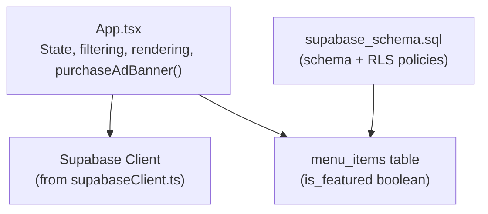
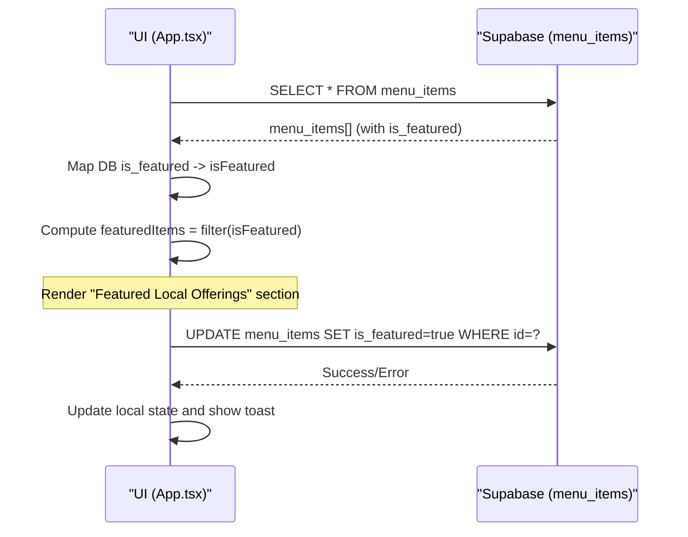
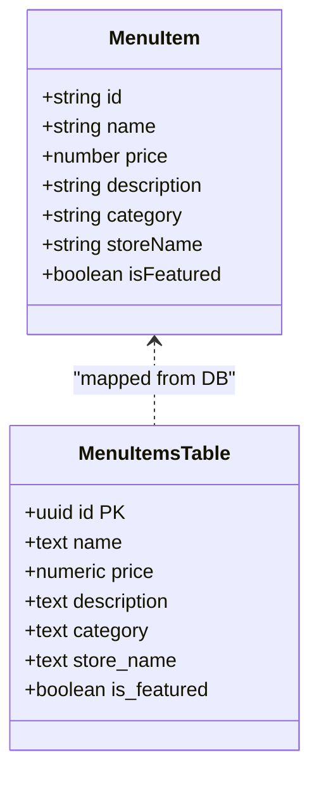
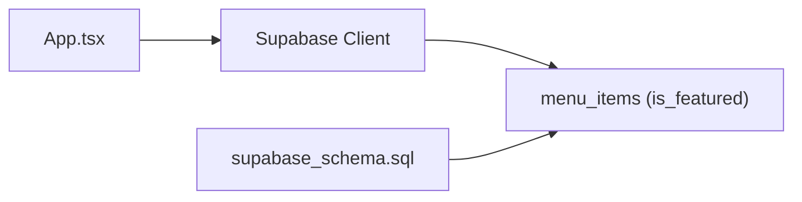

# Featured Items System

<cite>
**Referenced Files in This Document**
- [App.tsx](file://src/App.tsx)
- [supabase_schema.sql](file://supabase_schema.sql)
</cite>

## Table of Contents
1. [Introduction](#introduction)
2. [Project Structure](#project-structure)
3. [Core Components](#core-components)
4. [Architecture Overview](#architecture-overview)
5. [Detailed Component Analysis](#detailed-component-analysis)
6. [Dependency Analysis](#dependency-analysis)
7. [Performance Considerations](#performance-considerations)
8. [Troubleshooting Guide](#troubleshooting-guide)
9. [Conclusion](#conclusion)

## Introduction
This document explains the featured items system used to highlight premium or promotional products across the marketplace. It covers:
- The isFeatured flag mechanism and how it controls visibility and promotion
- How featured items are rendered separately from regular listings
- How search results are filtered and whether featured status influences prioritization
- Vendor workflow for marking items as featured, including payment flow and admin approval context
- Visual indicators and badges for featured items
- Business rules for eligibility and rotation strategies (current implementation and recommended enhancements)

## Project Structure
The featured items feature spans a small set of files:
- UI and business logic live in the main application component
- Database schema defines the menu_items table with an is_featured column
- Supabase client is used to persist changes to the database



**Diagram sources**
- [App.tsx:217-408](file://src/App.tsx#L217-L408)
- [supabase_schema.sql:86-96](file://supabase_schema.sql#L86-L96)

**Section sources**
- [App.tsx:217-408](file://src/App.tsx#L217-L408)
- [supabase_schema.sql:86-96](file://supabase_schema.sql#L86-L96)

## Core Components
- MenuItem interface includes an optional isFeatured field that drives featured behavior on the frontend.
- The app loads menu items from Supabase and maps the database is_featured column to the frontend isFeatured property.
- Featured items are computed via a memoized filter and displayed in a dedicated “Featured Local Offerings” section.
- Vendors can mark items as featured through a paid action that updates the database and refreshes local state.

Key responsibilities:
- Data mapping: map DB is_featured to UI isFeatured
- Filtering: compute featuredItems from fullMarketplace
- Rendering: render featured section separately from general listings
- Promotion: update is_featured via Supabase when vendors pay for promotion

**Section sources**
- [App.tsx:25-34](file://src/App.tsx#L25-L34)
- [App.tsx:384-408](file://src/App.tsx#L384-L408)
- [App.tsx:643-659](file://src/App.tsx#L643-L659)
- [App.tsx:1412-1430](file://src/App.tsx#L1412-L1430)

## Architecture Overview
The featured items system follows a simple client-driven flow:
- On mount, the app fetches menu items from Supabase and initializes state
- The app computes featuredItems by filtering fullMarketplace where isFeatured is true
- The UI renders a separate featured section above the general listings
- Vendors trigger a promotion action that updates is_featured in the database and updates local state



**Diagram sources**
- [App.tsx:384-408](file://src/App.tsx#L384-L408)
- [App.tsx:643-659](file://src/App.tsx#L643-L659)
- [App.tsx:1412-1430](file://src/App.tsx#L1412-L1430)

## Detailed Component Analysis

### Data Model and Persistence
- The menu_items table contains an is_featured boolean column that persists the featured status server-side.
- During initialization, the app reads menu_items and maps is_featured to isFeatured in the UI model.
- When a vendor promotes an item, the app issues an update to set is_featured to true.



**Diagram sources**
- [App.tsx:25-34](file://src/App.tsx#L25-L34)
- [supabase_schema.sql:86-96](file://supabase_schema.sql#L86-L96)

**Section sources**
- [supabase_schema.sql:86-96](file://supabase_schema.sql#L86-L96)
- [App.tsx:384-408](file://src/App.tsx#L384-L408)

### Featured Items Display Logic
- featuredItems is computed by filtering fullMarketplace where isFeatured is true.
- The UI renders a distinct “Featured Local Offerings” section with a sponsor ad banner style.
- Each featured item shows store name, product name, and price, with an add-to-cart button.

Behavioral notes:
- Featured items are not automatically included in search result prioritization; they appear in their own section and also within general listings if they match filters.
- There is no explicit sorting or weighting applied to featured items in the search results.

**Section sources**
- [App.tsx:643-659](file://src/App.tsx#L643-L659)
- [App.tsx:1799-1819](file://src/App.tsx#L1799-L1819)

### Search Results and Prioritization
- filteredItems applies category and text-based filters but does not reorder based on isFeatured.
- As a result, featured items do not receive special ranking in search results beyond appearing in both sections.

Recommendation:
- If prioritization is desired, implement a sort step that places featured items first within filtered results.

**Section sources**
- [App.tsx:647-655](file://src/App.tsx#L647-L655)

### Vendor Workflow for Marking Items as Featured
- Vendors access a dashboard tab where they can see their listed catalog and promote items.
- Clicking “Feature Ad” triggers purchaseAdBanner(itemId), which:
  - Updates menu_items.is_featured to true via Supabase
  - Updates local customMarketplace state to reflect isFeatured
  - Shows a success toast indicating the promotion fee and effect

```mermaid
flowchart TD
Start([Vendor clicks "Feature Ad"]) --> CallAPI["Call Supabase UPDATE menu_items<br/>SET is_featured=true WHERE id=..."]
CallAPI --> APIError{"Update error?"}
APIError --> |Yes| ShowError["Show error toast"]
APIError --> |No| UpdateLocal["Update local state<br/>set isFeatured=true"]
UpdateLocal --> ShowSuccess["Show success toast<br/>Promotion active"]
ShowSuccess --> End([Done])
```

**Diagram sources**
- [App.tsx:1412-1430](file://src/App.tsx#L1412-L1430)

**Section sources**
- [App.tsx:1412-1430](file://src/App.tsx#L1412-L1430)

### Admin Approval Processes
- The current codebase includes vendor and rider approval workflows, but there is no explicit admin approval gate for individual featured items.
- Promoting an item is directly available to vendors without a separate admin review step.

Implications:
- To enforce quality control, consider adding an admin approval step before allowing is_featured updates.

**Section sources**
- [App.tsx:1452-1483](file://src/App.tsx#L1452-L1483)

### Visual Indicators and Badges
- The featured section uses a sponsor-style badge (“Sponsor Ad banner”) and a highlighted header (“Featured Local Offerings”).
- Individual cards display store name, product name, and price; there is no per-item “featured” badge overlay in the card itself.

Enhancement opportunities:
- Add a visible “Featured” badge on each featured card
- Use distinct colors or borders to differentiate featured items in search results

**Section sources**
- [App.tsx:1799-1819](file://src/App.tsx#L1799-L1819)

### Special Pricing Displays
- Prices are shown as plain numeric values with currency formatting in the UI.
- No special pricing logic is implemented for featured items; prices remain unchanged.

Potential improvements:
- Introduce a promo discount field and display discounted vs original prices for featured items

[No sources needed since this section provides general guidance]

### Business Rules and Rotation Strategies
Current rules:
- Any item can be marked as featured by the vendor via the promotion action
- No expiration or rotation is enforced; once featured, an item remains featured until manually changed

Recommended rules:
- Enforce eligibility criteria (e.g., approved vendor, valid category, minimum rating)
- Implement rotation schedules (start/end dates) and automatic de-promotion
- Limit number of featured items per category to avoid overcrowding

[No sources needed since this section provides general guidance]

## Dependency Analysis
- App.tsx depends on the Supabase client to read and write menu_items
- The schema defines the is_featured column and enables RLS policies for all tables
- State management is centralized in App.tsx using React hooks and useMemo for derived data



**Diagram sources**
- [App.tsx:384-408](file://src/App.tsx#L384-L408)
- [supabase_schema.sql:166-198](file://supabase_schema.sql#L166-L198)

**Section sources**
- [App.tsx:384-408](file://src/App.tsx#L384-L408)
- [supabase_schema.sql:166-198](file://supabase_schema.sql#L166-L198)

## Performance Considerations
- featuredItems and filteredItems are memoized to avoid unnecessary recomputation
- Using useMemo ensures efficient filtering when dependencies change
- For large catalogs, consider pagination and server-side filtering to reduce payload size

[No sources needed since this section provides general guidance]

## Troubleshooting Guide
Common issues and resolutions:
- Item not appearing as featured after promotion:
  - Verify the Supabase update succeeded and returned no errors
  - Confirm the local state was updated and re-rendered
  - Check RLS policies allow authenticated users to update menu_items
- Featured items not showing in expected order:
  - Remember that search results do not prioritize featured items by default
  - Implement explicit sorting if prioritization is required

**Section sources**
- [App.tsx:1412-1430](file://src/App.tsx#L1412-L1430)
- [supabase_schema.sql:166-198](file://supabase_schema.sql#L166-L198)

## Conclusion
The featured items system leverages a simple isFeatured flag to highlight premium or promotional products. It provides a clear separation between featured and general listings, with a straightforward vendor promotion workflow. While the current implementation lacks search prioritization and admin approval gates, it offers a solid foundation for enhancements such as visual badges, special pricing displays, eligibility checks, and rotation strategies.