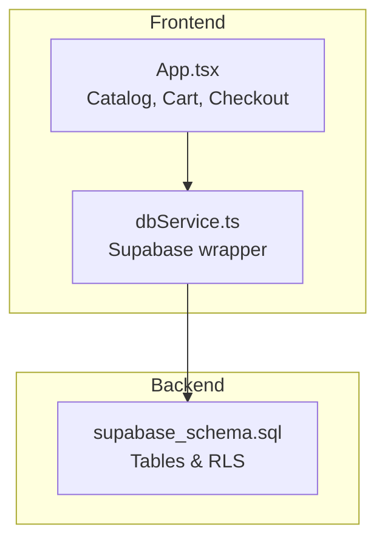
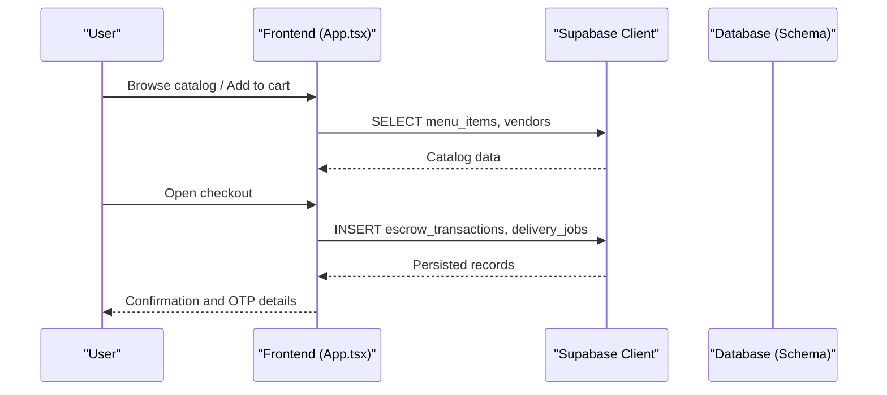
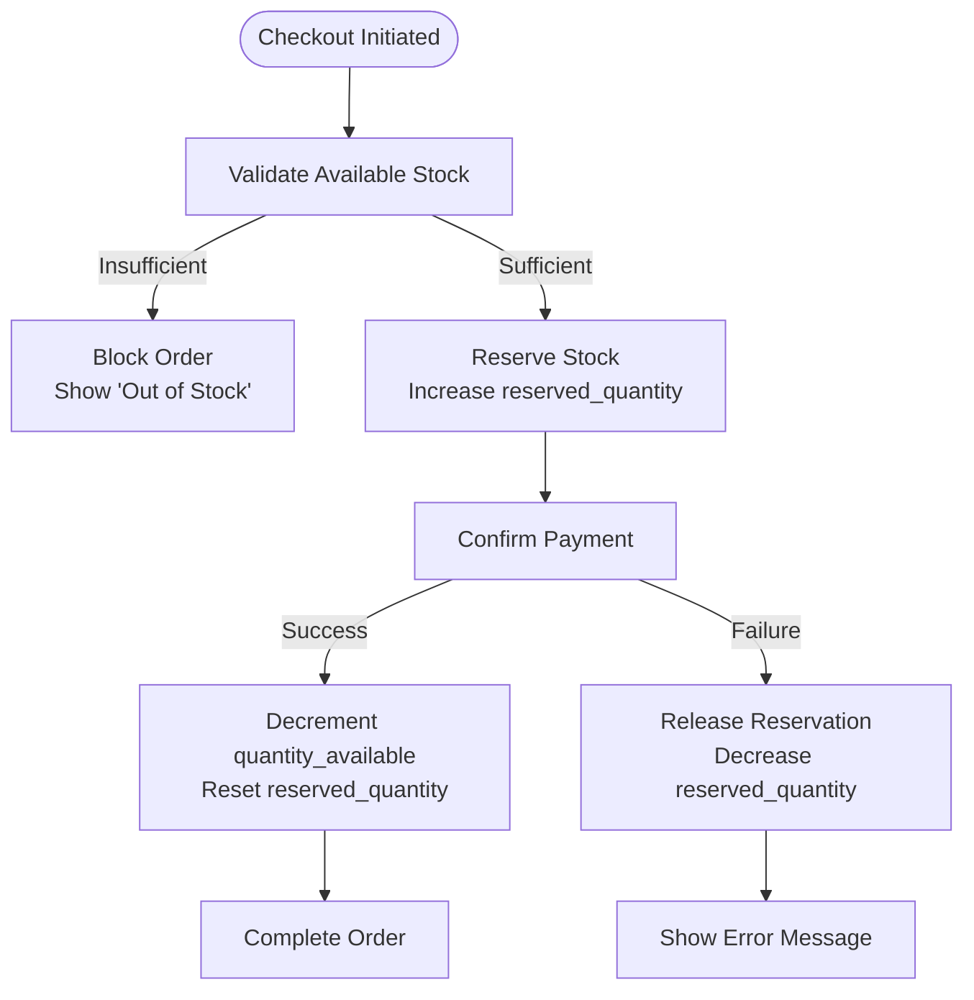
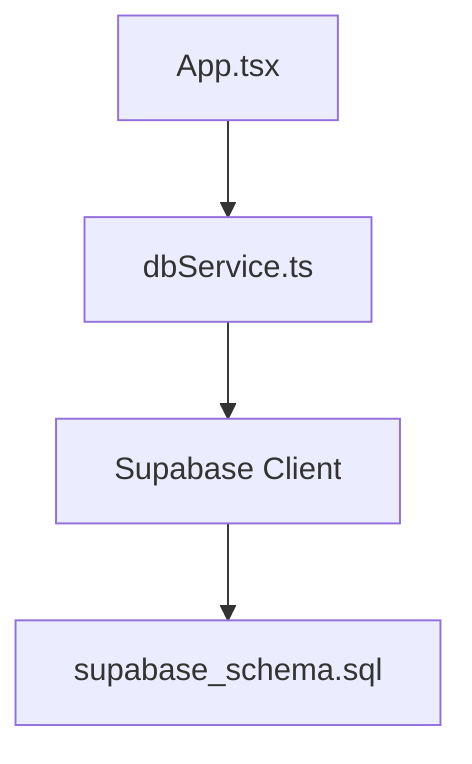

# Inventory Tracking

<cite>
**Referenced Files in This Document**
- [supabase_schema.sql](file://supabase_schema.sql)
- [App.tsx](file://src/App.tsx)
- [dbService.ts](file://src/supabase/dbService.ts)
</cite>

## Table of Contents
1. [Introduction](#introduction)
2. [Project Structure](#project-structure)
3. [Core Components](#core-components)
4. [Architecture Overview](#architecture-overview)
5. [Detailed Component Analysis](#detailed-component-analysis)
6. [Dependency Analysis](#dependency-analysis)
7. [Performance Considerations](#performance-considerations)
8. [Troubleshooting Guide](#troubleshooting-guide)
9. [Conclusion](#conclusion)
10. [Appendices](#appendices)

## Introduction
This document describes the inventory tracking system for the marketplace application, focusing on stock level management, availability indicators, low-stock alerts, synchronization between frontend state and database, order integration to prevent overselling, validation and reservation during checkout, restock notifications, data model considerations, and performance optimization techniques for large catalogs.

The current codebase implements a catalog (menu_items), vendor listings (vendors), cart operations, and an escrow-based checkout flow that records orders and delivery jobs. While explicit per-item stock fields are not present in the schema or UI, the system can be extended to support robust inventory tracking by adding dedicated stock columns, validations, reservations, and alerting mechanisms.

## Project Structure
The project is a React + TypeScript application with Supabase as the backend. The key files relevant to inventory tracking include:
- Database schema defining core tables (menu_items, vendors, etc.)
- Frontend application logic handling catalog display, cart, and checkout
- A lightweight database service wrapper around Supabase

**Diagram sources**
- [App.tsx](file://src/App.tsx)
- [dbService.ts](file://src/supabase/dbService.ts)
- [supabase_schema.sql](file://supabase_schema.sql)

**Section sources**
- [supabase_schema.sql](file://supabase_schema.sql)
- [App.tsx](file://src/App.tsx)
- [dbService.ts](file://src/supabase/dbService.ts)

## Core Components
- Catalog and Menu Items: The menu_items table stores product metadata used to render the marketplace catalog.
- Vendors: The vendors table represents merchants; items are associated via store_name.
- Cart and Checkout: The frontend maintains a local cart and triggers an escrow-based checkout flow that persists order and delivery job records.
- Database Service: A typed wrapper around Supabase queries for select/insert/update/delete and RPC calls.

Key responsibilities:
- Display and filter catalog items
- Manage cart quantities locally
- Initiate checkout and persist order-related records
- Provide a foundation for adding inventory fields and validations

**Section sources**
- [supabase_schema.sql](file://supabase_schema.sql)
- [App.tsx](file://src/App.tsx)
- [dbService.ts](file://src/supabase/dbService.ts)

## Architecture Overview
The inventory tracking architecture integrates frontend state, database schema, and checkout flows:

**Diagram sources**
- [App.tsx](file://src/App.tsx)
- [supabase_schema.sql](file://supabase_schema.sql)

## Detailed Component Analysis

### Data Model for Inventory Tracking
Current schema elements relevant to inventory:
- menu_items: id, name, price, description, category, store_name, is_featured, created_at
- vendors: id, name, category, sub_type, rating, delivery_time, min_order, badge, image, approved, created_at
- escrow_transactions: id, order_id, amount, payer, vendor_name, status, created_at
- delivery_jobs: id, order_id, destination, fee, status, rider_name, customer_phone, merchant_name, items_summary, otp, boda_pool_active, created_at

To implement inventory tracking, extend menu_items with:
- quantity_available: integer (non-negative)
- reserved_quantity: integer (non-negative)
- reorder_threshold: integer (for low-stock alerts)
- last_restocked_at: timestamp
- updated_at: timestamp

These fields enable real-time stock levels, reservation during checkout, and low-stock alerts.

**Section sources**
- [supabase_schema.sql](file://supabase_schema.sql)

### Stock Level Management and Availability Indicators
- Real-time quantity updates:
  - On successful order completion, decrement quantity_available by ordered quantities.
  - During checkout reservation, increment reserved_quantity and temporarily reduce visible availability.
- Availability status indicators:
  - In-stock: quantity_available > 0
  - Low stock: 0 < quantity_available <= reorder_threshold
  - Out-of-stock: quantity_available = 0
- Low stock alerts:
  - Trigger UI warnings and admin notifications when quantity_available <= reorder_threshold.

Implementation approach:
- Add server-side checks to ensure quantity_available >= requested quantity before confirming orders.
- Use optimistic UI updates for immediate feedback, then reconcile with server responses.

**Section sources**
- [supabase_schema.sql](file://supabase_schema.sql)
- [App.tsx](file://src/App.tsx)

### Inventory Synchronization Between Frontend State and Database
- Initial load:
  - Fetch menu_items and vendors from the database and map to frontend types.
- Optimistic updates:
  - Update local cart and availability indicators immediately upon user actions.
  - On success, persist changes to the database; on failure, revert local state and show error messages.
- Conflict resolution:
  - If concurrent modifications occur, re-fetch affected items and reconcile differences.
  - Use timestamps or version fields to detect conflicts and prompt users to refresh.

**Section sources**
- [App.tsx](file://src/App.tsx)
- [dbService.ts](file://src/supabase/dbService.ts)

### Integration with Order Processing to Prevent Overselling
- Validation:
  - Before confirming an order, verify that quantity_available >= sum of requested quantities.
- Decrement stock:
  - After payment confirmation, decrement quantity_available by the ordered amounts.
- Reservation during checkout:
  - Temporarily reserve stock by increasing reserved_quantity while the checkout window is active.
  - Release reservation if checkout is abandoned or fails within a timeout.

Flow overview:

**Diagram sources**
- [App.tsx](file://src/App.tsx)
- [supabase_schema.sql](file://supabase_schema.sql)

### Implementation of Inventory Validation, Stock Reservation, and Restock Notifications
- Inventory validation:
  - Server-side check ensures sufficient stock before order confirmation.
  - Frontend displays availability status based on quantity_available and reorder_threshold.
- Stock reservation:
  - During checkout, increase reserved_quantity to prevent other users from purchasing the same stock.
  - Implement a timeout to release reservations if checkout is not completed.
- Restock notifications:
  - When quantity_available <= reorder_threshold, trigger low-stock alerts to admins and vendors.
  - Upon restocking, send notifications to stakeholders and update UI indicators.

**Section sources**
- [supabase_schema.sql](file://supabase_schema.sql)
- [App.tsx](file://src/App.tsx)

### Performance Optimization Techniques for Large Catalogs
- Pagination:
  - Implement server-side pagination for menu_items to reduce payload size.
- Indexing:
  - Add indexes on frequently queried columns (e.g., category, store_name).
- Caching:
  - Cache catalog data at the client side with invalidation strategies.
- Query optimization:
  - Use selective column fetching and avoid unnecessary joins.
- Concurrency control:
  - Use short transactions and advisory locks for high-contention updates.

[No sources needed since this section provides general guidance]

## Dependency Analysis
The inventory tracking components depend on:
- Database schema for data definitions and constraints
- Frontend application for user interactions and state management
- Supabase client for data access and persistence

**Diagram sources**
- [App.tsx](file://src/App.tsx)
- [dbService.ts](file://src/supabase/dbService.ts)
- [supabase_schema.sql](file://supabase_schema.sql)

**Section sources**
- [App.tsx](file://src/App.tsx)
- [dbService.ts](file://src/supabase/dbService.ts)
- [supabase_schema.sql](file://supabase_schema.sql)

## Performance Considerations
- Use efficient queries to minimize latency.
- Implement caching strategies to reduce redundant requests.
- Optimize database schema with appropriate indexes.
- Monitor query performance and adjust as needed.

[No sources needed since this section provides general guidance]

## Troubleshooting Guide
Common issues and resolutions:
- Stock discrepancies:
  - Verify server-side validation and reconciliation logic.
- Checkout failures:
  - Check reservation timeouts and error handling paths.
- UI inconsistencies:
  - Ensure optimistic updates are properly reverted on errors.

**Section sources**
- [App.tsx](file://src/App.tsx)
- [dbService.ts](file://src/supabase/dbService.ts)

## Conclusion
The inventory tracking system builds upon the existing catalog and checkout infrastructure. By extending the data model with stock fields, implementing validation and reservation logic, and optimizing performance, the system can provide robust inventory management capabilities. The outlined approach ensures data consistency, prevents overselling, and supports scalability for large catalogs.

[No sources needed since this section summarizes without analyzing specific files]

## Appendices
- Additional recommendations:
  - Implement audit logs for stock changes.
  - Provide vendor dashboards for inventory management.
  - Integrate automated restocking workflows.

[No sources needed since this section provides general guidance]