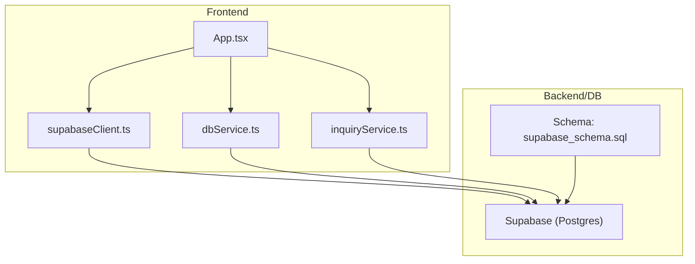
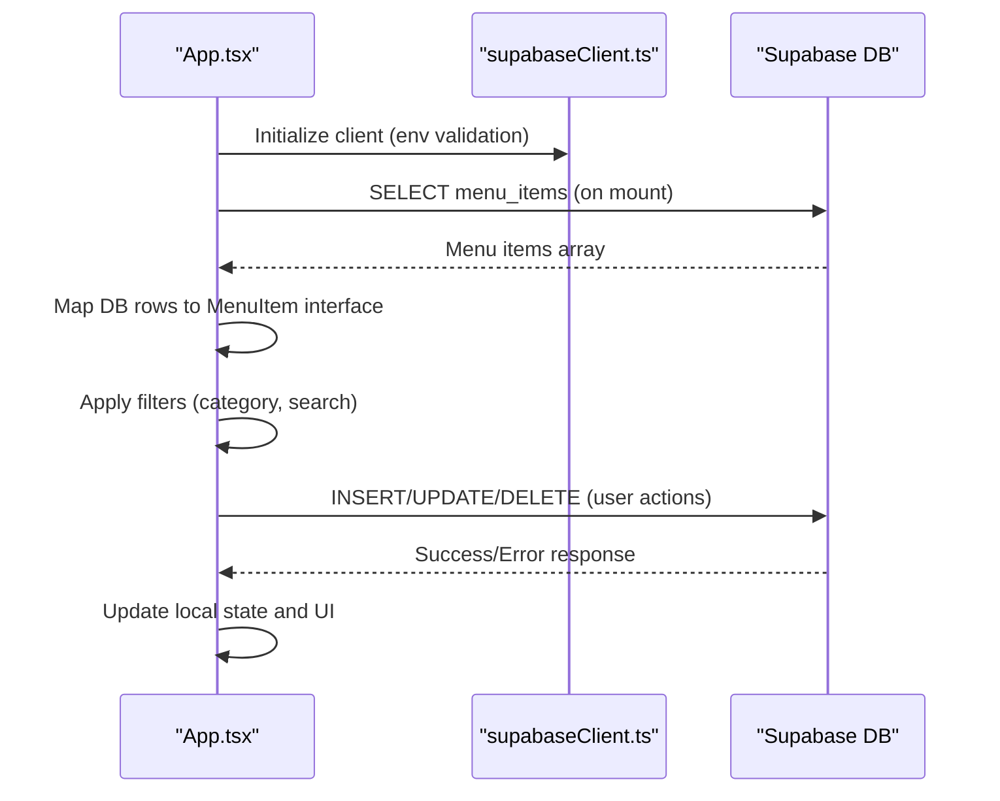
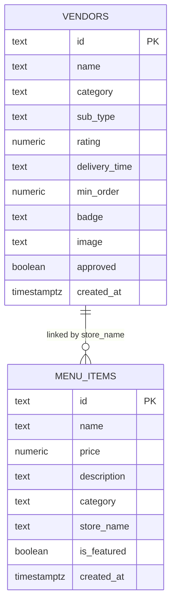
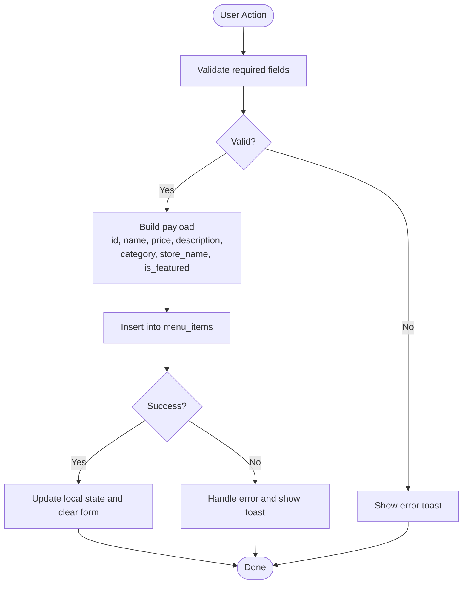
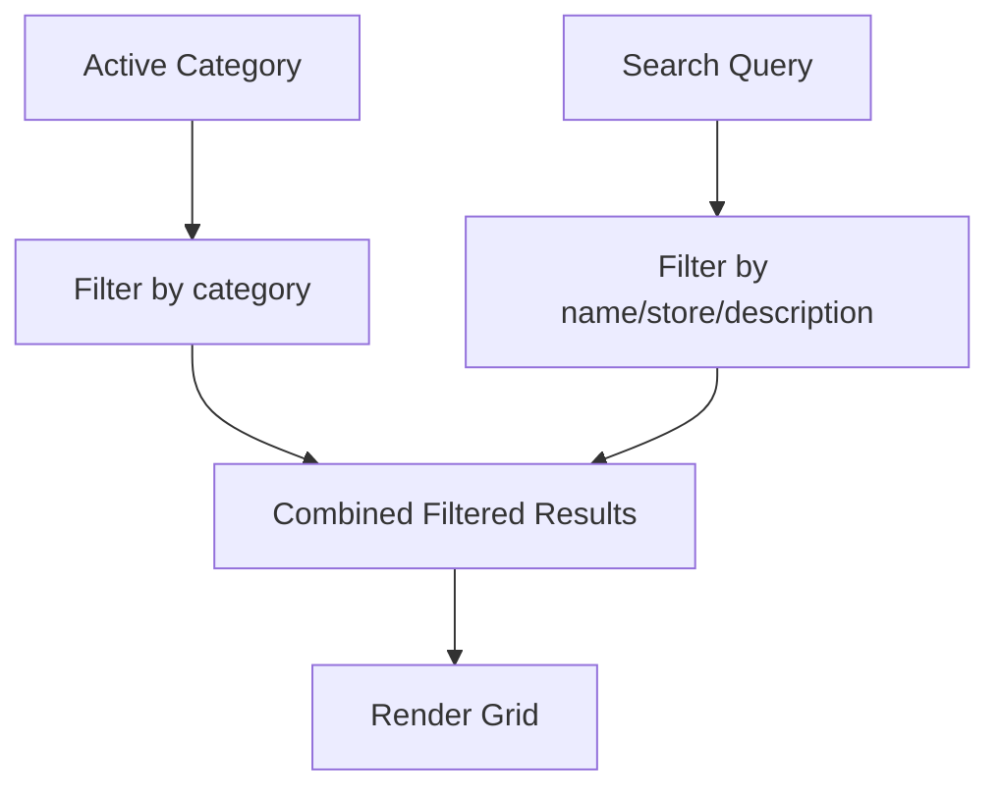
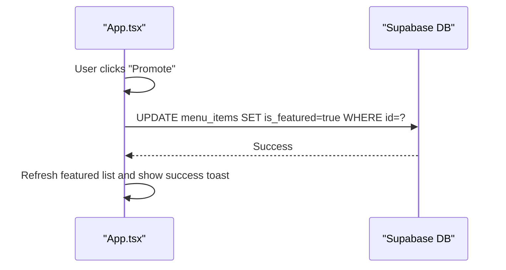
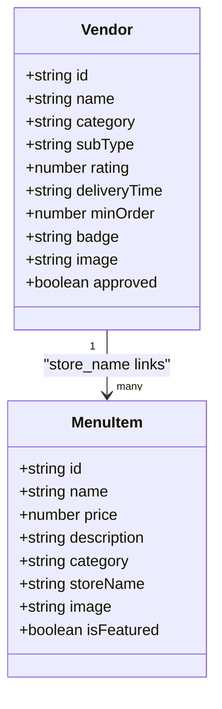
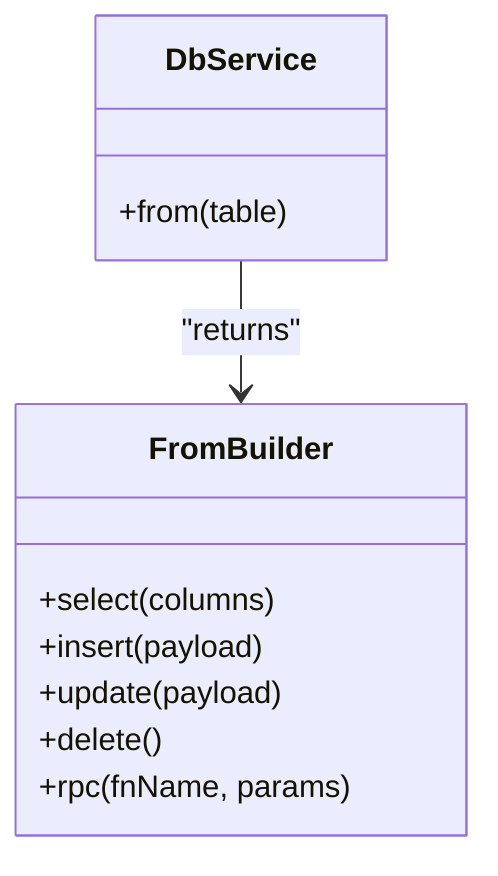
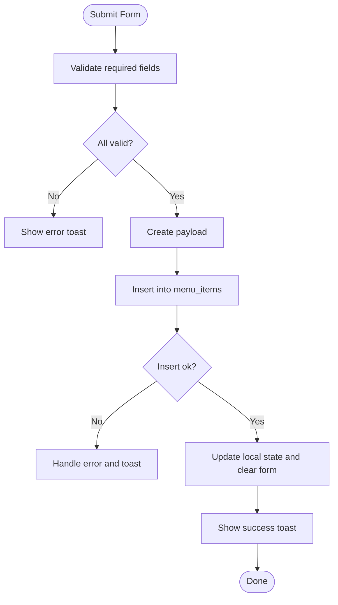
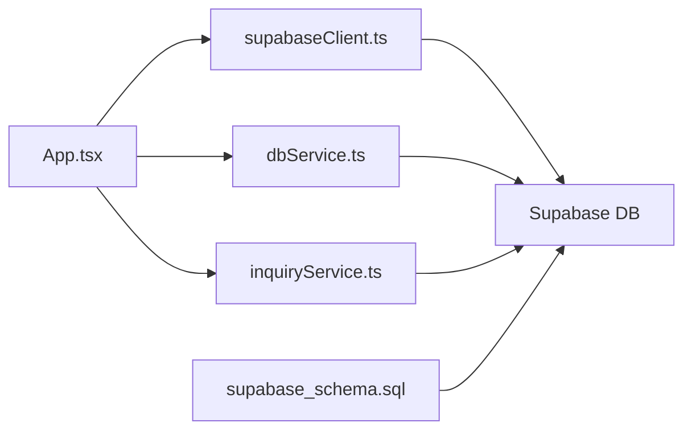

# Product Catalog Management

<cite>
**Referenced Files in This Document**
- [App.tsx](file://src/App.tsx)
- [supabaseClient.ts](file://src/supabase/supabaseClient.ts)
- [dbService.ts](file://src/supabase/dbService.ts)
- [inquiryService.ts](file://src/supabase/inquiryService.ts)
- [supabase_schema.sql](file://supabase_schema.sql)
</cite>

## Table of Contents
1. [Introduction](#introduction)
2. [Project Structure](#project-structure)
3. [Core Components](#core-components)
4. [Architecture Overview](#architecture-overview)
5. [Detailed Component Analysis](#detailed-component-analysis)
6. [Dependency Analysis](#dependency-analysis)
7. [Performance Considerations](#performance-considerations)
8. [Troubleshooting Guide](#troubleshooting-guide)
9. [Conclusion](#conclusion)
10. [Appendices](#appendices)

## Introduction
This document explains the product catalog management system for menu items, including CRUD operations, category organization, featured highlighting, search, and vendor integration. It also outlines data models, database interactions via Supabase, filtering and sorting capabilities, and performance optimization techniques suitable for large catalogs. While inventory tracking is not implemented in the current schema, this guide clarifies where and how to extend it.

## Project Structure
The application is a React + TypeScript app using Vite. The core UI and business logic live in App.tsx. Database connectivity is provided by Supabase client configuration and optional service wrappers. The database schema is defined in a SQL migration file.

**Diagram sources**
- [App.tsx](file://src/App.tsx)
- [supabaseClient.ts](file://src/supabase/supabaseClient.ts)
- [dbService.ts](file://src/supabase/dbService.ts)
- [inquiryService.ts](file://src/supabase/inquiryService.ts)
- [supabase_schema.sql](file://supabase_schema.sql)

**Section sources**
- [App.tsx](file://src/App.tsx)
- [supabaseClient.ts](file://src/supabase/supabaseClient.ts)
- [supabase_schema.sql](file://supabase_schema.sql)

## Core Components
- Data model for menu items: name, price, description, category, store association, featured flag, and image URL.
- Category organization: top-level categories with filtering and search across name, store, and description.
- Featured highlighting: boolean flag used to surface promoted items.
- Vendor integration: items are associated with a store name; vendors are modeled separately and linked through store_name.
- Database operations: direct Supabase calls from the UI; an optional dbService wrapper provides consistent error handling.

Key responsibilities:
- App.tsx manages state, UI flows, and persistence for menu items and related entities.
- supabaseClient.ts configures the Supabase client and validates environment variables.
- dbService.ts wraps Supabase calls with typed responses and error normalization.
- inquiryService.ts demonstrates a simple service pattern for DB operations.
- supabase_schema.sql defines tables, columns, and Row Level Security policies.

**Section sources**
- [App.tsx](file://src/App.tsx)
- [supabaseClient.ts](file://src/supabase/supabaseClient.ts)
- [dbService.ts](file://src/supabase/dbService.ts)
- [inquiryService.ts](file://src/supabase/inquiryService.ts)
- [supabase_schema.sql](file://supabase_schema.sql)

## Architecture Overview
The frontend loads initial data on mount, maintains local state for the marketplace, and persists changes directly to Supabase. Filtering and search are performed client-side using memoized computations.

**Diagram sources**
- [App.tsx](file://src/App.tsx)
- [supabaseClient.ts](file://src/supabase/supabaseClient.ts)

## Detailed Component Analysis

### Data Model and Schema
- Menu item fields: id, name, price, description, category, store_name, is_featured, created_at.
- Vendor fields: id, name, category, sub_type, rating, delivery_time, min_order, badge, image, approved, created_at.
- RLS policies enable full access for all roles in the current setup.

**Diagram sources**
- [supabase_schema.sql](file://supabase_schema.sql)

**Section sources**
- [supabase_schema.sql](file://supabase_schema.sql)

### CRUD Operations for Menu Items
- Create: Upload new product form constructs a payload and inserts into menu_items.
- Read: On mount, fetch all menu_items and map to local types.
- Update: Promote an item to featured by updating is_featured.
- Delete: Not currently exposed in the UI; can be added by extending the UI and adding a delete operation.

**Diagram sources**
- [App.tsx](file://src/App.tsx)

**Section sources**
- [App.tsx](file://src/App.tsx)

### Category Organization and Search
- Categories are selected via UI buttons that update activeCategory.
- Search queries filter across name, storeName, and description.
- Filtering is computed with useMemo for performance.

**Diagram sources**
- [App.tsx](file://src/App.tsx)

**Section sources**
- [App.tsx](file://src/App.tsx)

### Featured Item Highlighting
- Featured items are filtered by is_featured and displayed in a dedicated section.
- Promotion action updates is_featured to true for a given item.

**Diagram sources**
- [App.tsx](file://src/App.tsx)

**Section sources**
- [App.tsx](file://src/App.tsx)

### Inventory Tracking Mechanisms
- Current schema does not include stock levels or availability status.
- To implement:
  - Add columns such as stock_quantity, available (boolean), updated_at to menu_items.
  - Extend UI to adjust stock on add/remove and reflect availability.
  - Use optimistic UI updates and server-side validation for consistency.

[No sources needed since this section proposes extensions beyond current code]

### Integration with Vendor Profiles
- Items are associated with store_name; vendors are stored in a separate table.
- The UI displays vendors per category and shows their products when selected.

**Diagram sources**
- [supabase_schema.sql](file://supabase_schema.sql)
- [App.tsx](file://src/App.tsx)

**Section sources**
- [supabase_schema.sql](file://supabase_schema.sql)
- [App.tsx](file://src/App.tsx)

### Database Operations Using dbService Wrapper
- dbService wraps Supabase calls with a consistent Response type and error handling.
- Methods: select, insert, update.eq, delete.eq, rpc.
- Usage example pattern: db.from('menu_items').insert(payload).then(...)

**Diagram sources**
- [dbService.ts](file://src/supabase/dbService.ts)

**Section sources**
- [dbService.ts](file://src/supabase/dbService.ts)

### Validation Rules and Upload Workflow
- Required fields for upload: title (name), price, store name.
- Optional fields: description, category defaults to a preset.
- On success, local state updates and a success toast is shown.

**Diagram sources**
- [App.tsx](file://src/App.tsx)

**Section sources**
- [App.tsx](file://src/App.tsx)

## Dependency Analysis
- App.tsx depends on supabaseClient.ts for DB access and uses direct Supabase calls.
- dbService.ts is an alternative wrapper that encapsulates error handling and typing.
- inquiryService.ts demonstrates a service pattern similar to what could be used for catalog operations.
- supabase_schema.sql defines the data model and security policies.

**Diagram sources**
- [App.tsx](file://src/App.tsx)
- [supabaseClient.ts](file://src/supabase/supabaseClient.ts)
- [dbService.ts](file://src/supabase/dbService.ts)
- [inquiryService.ts](file://src/supabase/inquiryService.ts)
- [supabase_schema.sql](file://supabase_schema.sql)

**Section sources**
- [App.tsx](file://src/App.tsx)
- [supabaseClient.ts](file://src/supabase/supabaseClient.ts)
- [dbService.ts](file://src/supabase/dbService.ts)
- [inquiryService.ts](file://src/supabase/inquiryService.ts)
- [supabase_schema.sql](file://supabase_schema.sql)

## Performance Considerations
- Client-side filtering and search are memoized with useMemo to avoid unnecessary re-renders.
- For large catalogs:
  - Implement pagination or infinite scrolling to limit DOM size.
  - Add server-side filtering and indexing on frequently queried columns (e.g., category, store_name, name).
  - Use partial selects to reduce payload size.
  - Consider caching strategies (client cache or CDN for images).
  - Debounce search input to reduce frequent state updates.

[No sources needed since this section provides general guidance]

## Troubleshooting Guide
- Environment configuration: Ensure VITE_SUPABASE_URL and VITE_SUPABASE_ANON_KEY are set correctly.
- Common errors:
  - Missing credentials will cause client initialization warnings.
  - Network failures result in error responses handled by try/catch blocks and toast notifications.
  - RLS misconfiguration may block operations; verify policies allow intended actions.

**Section sources**
- [supabaseClient.ts](file://src/supabase/supabaseClient.ts)
- [App.tsx](file://src/App.tsx)

## Conclusion
The product catalog system provides a solid foundation for managing menu items with category-based browsing, search, and featured promotions. Extending the schema to support inventory tracking and implementing server-side optimizations will enhance scalability and user experience.

[No sources needed since this section summarizes without analyzing specific files]

## Appendices

### API Reference Summary
- Create menu item: POST insert to menu_items with required fields.
- Read menu items: SELECT all or filtered by category/search.
- Update menu item: UPDATE is_featured or other fields by id.
- Delete menu item: DELETE by id (not currently exposed in UI).

**Section sources**
- [App.tsx](file://src/App.tsx)
- [supabase_schema.sql](file://supabase_schema.sql)