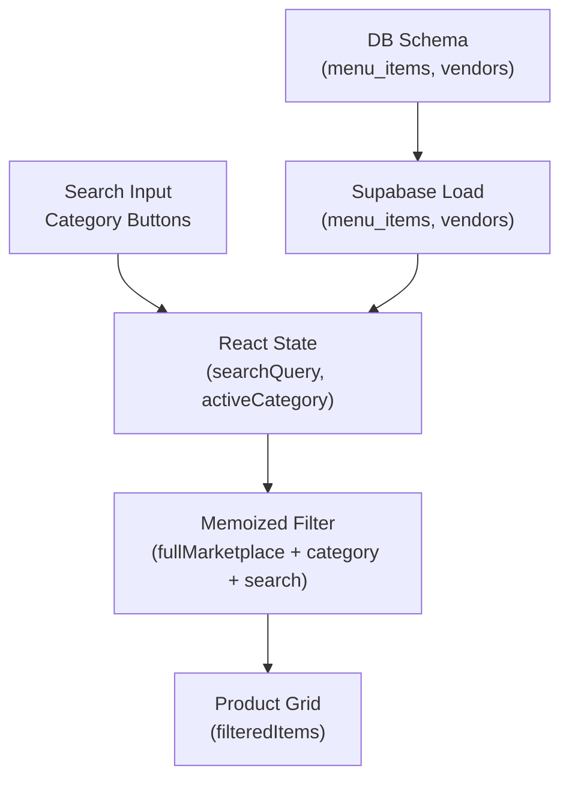
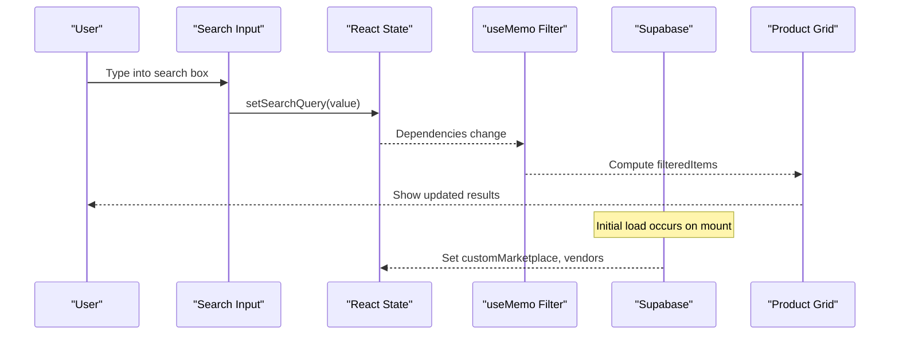
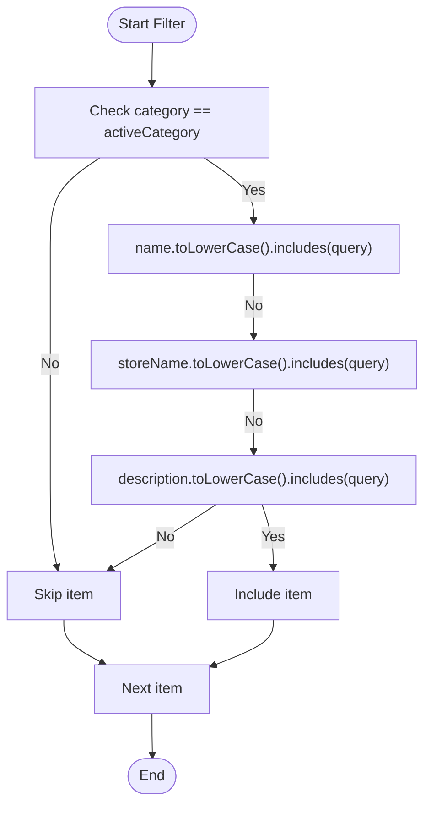
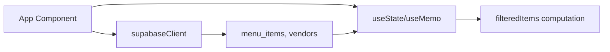

# Search and Filtering

<cite>
**Referenced Files in This Document**
- [App.tsx](file://src/App.tsx)
- [supabase_schema.sql](file://supabase_schema.sql)
- [supabaseClient.ts](file://src/supabaseClient.ts)
- [dbService.ts](file://src/supabase/dbService.ts)
</cite>

## Table of Contents
1. [Introduction](#introduction)
2. [Project Structure](#project-structure)
3. [Core Components](#core-components)
4. [Architecture Overview](#architecture-overview)
5. [Detailed Component Analysis](#detailed-component-analysis)
6. [Dependency Analysis](#dependency-analysis)
7. [Performance Considerations](#performance-considerations)
8. [Troubleshooting Guide](#troubleshooting-guide)
9. [Conclusion](#conclusion)

## Introduction
This document explains the search and filtering system used to find products by name, store name, and description with case-insensitive matching, category-based filtering with active category state management, real-time filtering updates, combination of search queries with category filters, result ranking approaches, debounced search input, performance optimization for large datasets, and user experience enhancements such as search suggestions. It also provides examples of complex search scenarios and guidance for extending the system.

## Project Structure
The search and filtering logic is implemented primarily within the main application component and relies on Supabase for data persistence. The core elements include:
- Stateful UI for search query and active category selection
- In-memory filtering over a curated marketplace dataset
- Data loading from Supabase tables (menu_items, vendors, etc.)
- Optional server-side full-text search patterns documented in schema references

**Diagram sources**
- [App.tsx:643-655](file://src/App.tsx#L643-L655)
- [supabase_schema.sql:86-96](file://supabase_schema.sql#L86-L96)

**Section sources**
- [App.tsx:643-655](file://src/App.tsx#L643-L655)
- [supabase_schema.sql:86-96](file://supabase_schema.sql#L86-L96)

## Core Components
- Search input: Captures user text and updates searchQuery state.
- Category buttons: Update activeCategory state to filter results by exact category match.
- Memoized filtering: Computes filteredItems based on fullMarketplace, activeCategory, and searchQuery using useMemo for efficient re-renders.
- Featured items: Separate derived list for promotional content.
- Cart operations: Independent of search but interact with product cards.

Key behaviors:
- Case-insensitive substring matching across name, storeName, and description fields.
- Exact category equality against activeCategory.
- Real-time updates as the user types or changes categories.

**Section sources**
- [App.tsx:643-655](file://src/App.tsx#L643-L655)
- [App.tsx:1743-1750](file://src/App.tsx#L1743-L1750)
- [App.tsx:1871-1885](file://src/App.tsx#L1871-L1885)

## Architecture Overview
The search pipeline combines client-side state and memoization to deliver instant feedback. Data is loaded once from Supabase and cached in React state; filtering runs in memory.

**Diagram sources**
- [App.tsx:643-655](file://src/App.tsx#L643-L655)
- [App.tsx:1743-1750](file://src/App.tsx#L1743-L1750)

## Detailed Component Analysis

### Search Algorithm
- Matching criteria:
  - Name contains searchQuery (case-insensitive)
  - Store name contains searchQuery (case-insensitive)
  - Description contains searchQuery (case-insensitive)
- Category filter:
  - Only items whose category equals activeCategory are included
- Combined logic:
  - Both conditions must be true for an item to appear in filteredItems

Complexity:
- Time complexity per filter run: O(N), where N is the number of items in fullMarketplace
- Space complexity: O(K) for the resulting array of K matches

Optimization:
- useMemo ensures filtering only recomputes when dependencies change
- Banned vendor exclusion is applied before filtering via fullMarketplace

**Diagram sources**
- [App.tsx:647-655](file://src/App.tsx#L647-L655)

**Section sources**
- [App.tsx:647-655](file://src/App.tsx#L647-L655)

### Category-Based Filtering and Active State Management
- Categories are defined as static labels in the UI
- Clicking a category sets activeCategory
- Filtering uses strict equality against item.category
- Real-time updates occur immediately upon category change

UX considerations:
- Visual highlight indicates the active category
- Empty state message shown when no items match current filters

**Section sources**
- [App.tsx:1871-1885](file://src/App.tsx#L1871-L1885)
- [App.tsx:2018-2023](file://src/App.tsx#L2018-L2023)

### Combination of Search Queries with Category Filters
- The filter applies both constraints simultaneously
- If searchQuery is empty, all items in the selected category are returned
- If activeCategory is not set (not applicable here due to default), behavior would need explicit handling; currently defaults to a specific category

Example scenarios:
- Query “pilau” returns all pilau items across stores within the active category
- Query “gas” returns LPG-related items if the active category includes them
- Combining both narrows results further

**Section sources**
- [App.tsx:647-655](file://src/App.tsx#L647-L655)

### Result Ranking Algorithms
Current implementation does not implement ranking; it returns matches in original order. Potential enhancements:
- Relevance scoring based on field priority (e.g., name > storeName > description)
- Boost featured items
- Sort by price or rating if needed

Note: These are recommendations; they are not currently implemented.

[No sources needed since this section proposes enhancements not present in code]

### Debounced Search Input
Current implementation updates searchQuery directly on every keystroke without debounce. Recommendations:
- Introduce a debounce utility to delay filtering until typing pauses
- Use a stable timer ID to avoid race conditions
- Keep UI responsive while reducing unnecessary computations

Implementation outline:
- Maintain a ref for the debounce timer
- On input change, clear previous timer and start a new one
- After delay, update a debouncedSearchQuery that feeds the filter

[No sources needed since this section provides general guidance]

### Performance Optimization for Large Datasets
Recommendations:
- Virtualize lists to render only visible items
- Paginate or lazy-load initial batches
- Precompute lowercase versions of searchable fields at load time
- Consider server-side full-text search with Postgres tsvector for scalability

Data model context:
- menu_items table holds name, description, category, store_name, and is_featured flags

**Section sources**
- [supabase_schema.sql:86-96](file://supabase_schema.sql#L86-L96)

### User Experience Enhancements: Search Suggestions
Current implementation does not include suggestions. Recommended features:
- Autocomplete dropdown with top-matching names and stores
- Quick-filter chips for popular terms
- Highlight matched substrings in results

[No sources needed since this section provides general guidance]

## Dependency Analysis
The search and filtering flow depends on:
- React state for searchQuery and activeCategory
- Supabase client for initial data load
- Menu items and vendors tables for data

**Diagram sources**
- [App.tsx:643-655](file://src/App.tsx#L643-L655)
- [supabaseClient.ts:1-7](file://src/supabaseClient.ts#L1-L7)
- [supabase_schema.sql:86-96](file://supabase_schema.sql#L86-L96)

**Section sources**
- [App.tsx:643-655](file://src/App.tsx#L643-L655)
- [supabaseClient.ts:1-7](file://src/supabaseClient.ts#L1-L7)
- [supabase_schema.sql:86-96](file://supabase_schema.sql#L86-L96)

## Performance Considerations
- Use useMemo to avoid redundant filtering
- Avoid heavy string operations inside tight loops; pre-normalize fields if necessary
- For large catalogs, consider virtualization and pagination
- Implement debounced search to reduce re-renders during typing
- Evaluate server-side full-text search for scale

[No sources needed since this section provides general guidance]

## Troubleshooting Guide
Common issues and resolutions:
- No results found:
  - Verify activeCategory matches item.category values
  - Ensure searchQuery is trimmed and normalized
  - Confirm bannedVendors do not exclude all items
- Slow filtering:
  - Add debouncing to input handler
  - Reduce dataset size via pagination or virtualization
- Incorrect case sensitivity:
  - Confirm lowercasing is applied consistently to both query and fields

**Section sources**
- [App.tsx:647-655](file://src/App.tsx#L647-L655)
- [App.tsx:643-645](file://src/App.tsx#L643-L645)

## Conclusion
The current search and filtering system provides fast, client-side, case-insensitive matching across product name, store name, and description, combined with category-based filtering. It leverages React state and memoization for real-time updates. To enhance scalability and UX, consider implementing debounced search, virtualization, pagination, and server-side full-text search with ranking. These improvements will support larger datasets and richer user experiences while maintaining responsiveness.