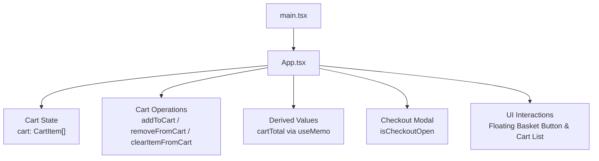
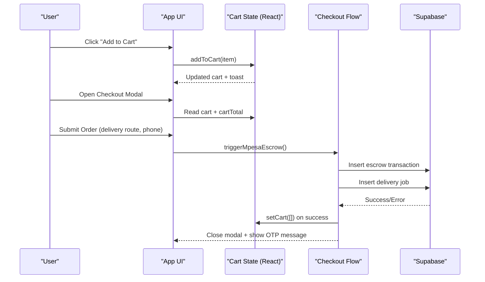
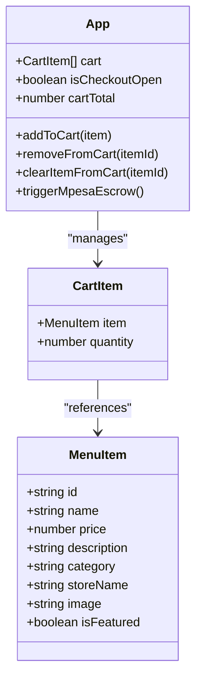
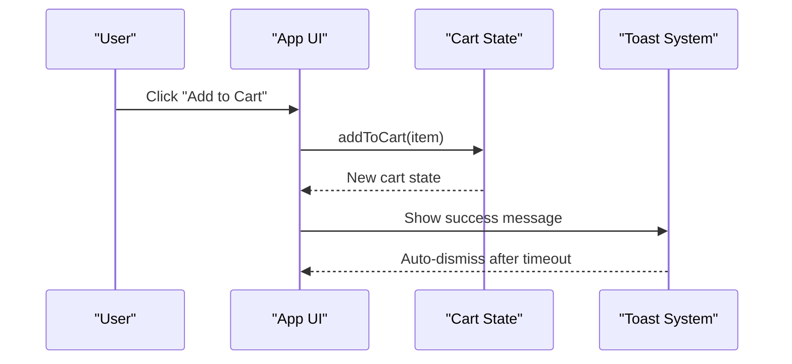
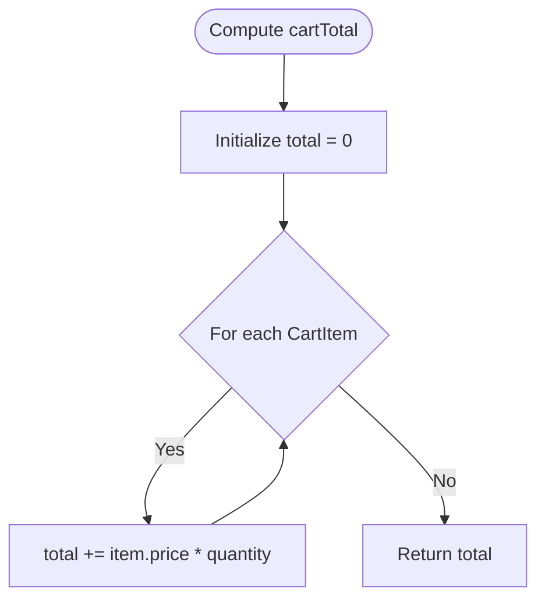

# Shopping Cart System

<cite>
**Referenced Files in This Document**
- [App.tsx](file://src/App.tsx)
- [main.tsx](file://src/main.tsx)
</cite>

## Table of Contents
1. [Introduction](#introduction)
2. [Project Structure](#project-structure)
3. [Core Components](#core-components)
4. [Architecture Overview](#architecture-overview)
5. [Detailed Component Analysis](#detailed-component-analysis)
6. [Dependency Analysis](#dependency-analysis)
7. [Performance Considerations](#performance-considerations)
8. [Troubleshooting Guide](#troubleshooting-guide)
9. [Conclusion](#conclusion)

## Introduction
This document explains the shopping cart functionality implemented in the application. It covers the cart data model, state management with React, core operations (add, remove, clear), total calculation, checkout integration, and UI interactions. The implementation is contained within a single React component that manages local state for the cart and orchestrates checkout flows.

## Project Structure
The shopping cart logic resides in the main application component. The entry point renders this component into the DOM.

**Diagram sources**
- [main.tsx:1-11](file://src/main.tsx#L1-L11)
- [App.tsx:217-221](file://src/App.tsx#L217-L221)
- [App.tsx:661-686](file://src/App.tsx#L661-L686)
- [App.tsx:2138-2156](file://src/App.tsx#L2138-L2156)
- [App.tsx:2430-2557](file://src/App.tsx#L2430-L2557)

**Section sources**
- [main.tsx:1-11](file://src/main.tsx#L1-L11)
- [App.tsx:217-221](file://src/App.tsx#L217-L221)

## Core Components
- Data Model:
  - MenuItem: Represents an item available in the marketplace.
  - CartItem: Represents an entry in the cart with a reference to a MenuItem and its quantity.
- State:
  - cart: Array of CartItem objects stored in React state.
  - isCheckoutOpen: Controls visibility of the checkout modal.
- Derived Computation:
  - cartTotal: Memoized sum of price × quantity across all cart entries.
- Operations:
  - addToCart(item): Adds or increments an item’s quantity.
  - removeFromCart(itemId): Decrements quantity or removes the item if quantity reaches zero.
  - clearItemFromCart(itemId): Removes an item entirely from the cart.

Key responsibilities:
- Maintain consistent cart state across the app.
- Provide immediate UI feedback via toast notifications on add actions.
- Compute totals efficiently using memoization.

**Section sources**
- [App.tsx:25-52](file://src/App.tsx#L25-L52)
- [App.tsx:220](file://src/App.tsx#L220)
- [App.tsx:661-686](file://src/App.tsx#L661-L686)

## Architecture Overview
The cart system is a client-side feature managed by React state. There is no localStorage persistence for the cart; it exists only in memory during the session. Checkout integrates with Supabase to record escrow transactions and delivery jobs, then clears the cart upon successful processing.

**Diagram sources**
- [App.tsx:665-686](file://src/App.tsx#L665-L686)
- [App.tsx:1144-1231](file://src/App.tsx#L1144-L1231)
- [App.tsx:2430-2557](file://src/App.tsx#L2430-L2557)

## Detailed Component Analysis

### Cart Data Model
- MenuItem fields include id, name, price, description, category, storeName, optional image, and optional isFeatured flag.
- CartItem contains a reference to a MenuItem and a numeric quantity.

Complexity:
- Lookup by id uses linear search over cart array (O(n)).
- Update operations create new arrays via map/filter (O(n)).

Optimization opportunities:
- Use a Map keyed by item.id for O(1) lookups and updates.
- Normalize frequently accessed fields to reduce re-renders.

**Section sources**
- [App.tsx:25-52](file://src/App.tsx#L25-L52)

### Cart State Management
- cart is initialized as an empty array in React state.
- All mutations are performed through dedicated functions that return new arrays to maintain immutability.
- Toast notifications provide user feedback after adding items.

Real-time updates:
- Because cart is local state, any component reading cart props/state will update immediately when the parent state changes.

Persistence:
- No localStorage persistence for cart is implemented. Cart resets on page reload.

**Section sources**
- [App.tsx:220](file://src/App.tsx#L220)
- [App.tsx:665-686](file://src/App.tsx#L665-L686)

### Cart Operations

#### addToCart(item)
- Parameters:
  - item: MenuItem object to add or increment.
- Behavior:
  - If item already exists in cart, increments quantity by 1.
  - Otherwise, adds a new CartItem with quantity 1.
  - Shows a success toast notification.
- Return value: None (side effect updates state).

Complexity:
- Search for existing item: O(n).
- Update via map: O(n).

Edge cases:
- Duplicate addition handled by incrementing quantity.

**Section sources**
- [App.tsx:665-673](file://src/App.tsx#L665-L673)

#### removeFromCart(itemId)
- Parameters:
  - itemId: string id of the cart item to decrement or remove.
- Behavior:
  - If item exists and quantity > 1, decrements quantity by 1.
  - Otherwise, removes the item from the cart.
- Return value: None (side effect updates state).

Complexity:
- Search: O(n).
- Update via map/filter: O(n).

Edge cases:
- Removing last unit removes the entry entirely.

**Section sources**
- [App.tsx:675-682](file://src/App.tsx#L675-L682)

#### clearItemFromCart(itemId)
- Parameters:
  - itemId: string id of the cart item to remove.
- Behavior:
  - Filters out the matching entry from the cart.
- Return value: None (side effect updates state).

Complexity:
- Filter: O(n).

**Section sources**
- [App.tsx:684-686](file://src/App.tsx#L684-L686)

### Cart Total Calculation
- cartTotal is computed using useMemo to avoid unnecessary recalculations.
- Formula: Sum of (item.price × quantity) for all entries.

Complexity:
- Linear scan O(n).

Optimization:
- Already memoized; consider caching per item subtotal if needed.

**Section sources**
- [App.tsx:661-663](file://src/App.tsx#L661-L663)

### Minimum Order Validation
- No explicit minimum order validation is enforced in the cart or checkout flow.
- Vendor-level minOrder values exist in vendor metadata but are not applied to cart validation.

Recommendation:
- Add validation before checkout submission to enforce minimums per vendor or globally.

**Section sources**
- [App.tsx:1144-1157](file://src/App.tsx#L1144-L1157)

### Checkout Integration
- The checkout modal displays the current cart list, allows quantity adjustments, and shows subtotal and delivery fee.
- On submit:
  - Validates presence of delivery route and valid phone number.
  - Simulates payment prompt delay.
  - Creates an escrow transaction and a delivery job in Supabase.
  - Clears the cart and closes the modal.
  - Displays a one-time password (OTP) message for rider handoff.

Data written:
- Escrow transaction includes orderId, amount (cartTotal + delivery fee), payer info, vendor name, status.
- Delivery job includes destination, fee, customer phone, merchant name, items summary, otp, and pooling option.

Error handling:
- Database insertion errors trigger error toasts and abort the process.

**Section sources**
- [App.tsx:1144-1231](file://src/App.tsx#L1144-L1231)
- [App.tsx:2430-2557](file://src/App.tsx#L2430-L2557)

### UI Interactions
- Floating basket button:
  - Visible when cart has items.
  - Opens checkout modal; requires authentication before proceeding.
- Cart list in checkout modal:
  - Shows item name, store, quantity controls (+/-), line total, and delete action.
- Totals breakdown:
  - Items subtotal, standard delivery fee (based on selected route and pooling option), and final total.

Accessibility and UX:
- Immediate feedback via toasts on add/remove actions.
- Clear labels and disabled states during processing.

**Section sources**
- [App.tsx:2138-2156](file://src/App.tsx#L2138-L2156)
- [App.tsx:2446-2544](file://src/App.tsx#L2446-L2544)

### Class Diagram

**Diagram sources**
- [App.tsx:25-52](file://src/App.tsx#L25-L52)
- [App.tsx:661-686](file://src/App.tsx#L661-L686)

### Sequence Diagram: Add to Cart

**Diagram sources**
- [App.tsx:665-673](file://src/App.tsx#L665-L673)

### Flowchart: Cart Total Calculation

**Diagram sources**
- [App.tsx:661-663](file://src/App.tsx#L661-L663)

## Dependency Analysis
- Internal dependencies:
  - React state hooks manage cart and UI flags.
  - useMemo computes derived values.
  - Supabase client used in checkout to persist orders and payments.
- External integrations:
  - Supabase tables: escrow_transactions, delivery_jobs.
- Coupling:
  - Cart operations are encapsulated within the component, minimizing external coupling.
  - Checkout logic depends on Supabase service calls and global state updates.

Potential circular dependencies:
- None observed; cart operations do not import other modules beyond React and Supabase client.

**Section sources**
- [App.tsx:1144-1231](file://src/App.tsx#L1144-L1231)

## Performance Considerations
- Current complexity:
  - Each operation scans the cart array (O(n)) for lookup and updates.
  - For large carts, frequent re-renders may occur due to state updates.
- Recommendations:
  - Replace array-based storage with a Map keyed by item.id for O(1) access and updates.
  - Normalize cart state to avoid deep object copies where possible.
  - Debounce rapid add/remove actions to reduce render churn.
  - Consider virtualizing long lists in the checkout modal for better scrolling performance.

[No sources needed since this section provides general guidance]

## Troubleshooting Guide
Common issues and resolutions:
- Cart not persisting across reloads:
  - Cause: Cart is stored in memory only.
  - Resolution: Implement localStorage persistence for cart state.
- Checkout fails silently:
  - Cause: Missing required fields (delivery route, phone) or database errors.
  - Resolution: Validate inputs and check toast messages; inspect Supabase insert results.
- Incorrect totals:
  - Cause: Miscalculation or stale data.
  - Resolution: Verify cartTotal memoization and ensure quantities are updated correctly.
- Authentication required to checkout:
  - Cause: Checkout requires a logged-in user.
  - Resolution: Ensure user is authenticated before opening checkout modal.

**Section sources**
- [App.tsx:1144-1157](file://src/App.tsx#L1144-L1157)
- [App.tsx:1190-1231](file://src/App.tsx#L1190-L1231)

## Conclusion
The shopping cart system is implemented as a React-managed, in-memory feature with robust operations for adding, removing, and clearing items. Totals are computed efficiently using memoization, and checkout integrates with Supabase to record transactions and delivery jobs. While effective for session-based usage, adding localStorage persistence and optimizing data structures would improve durability and scalability for larger carts.