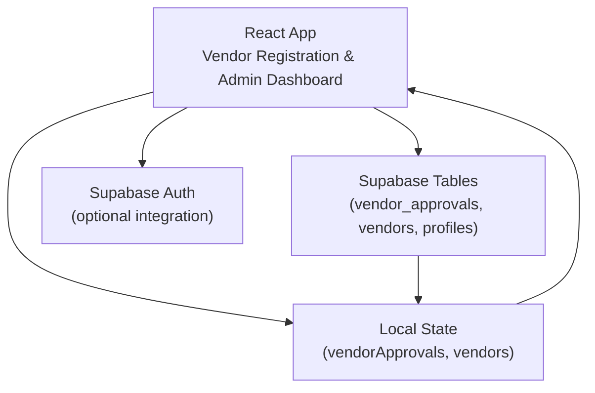
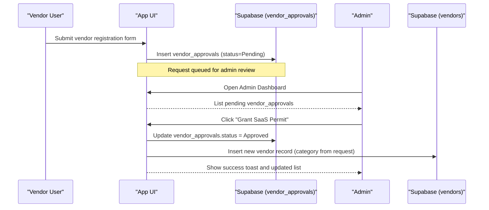
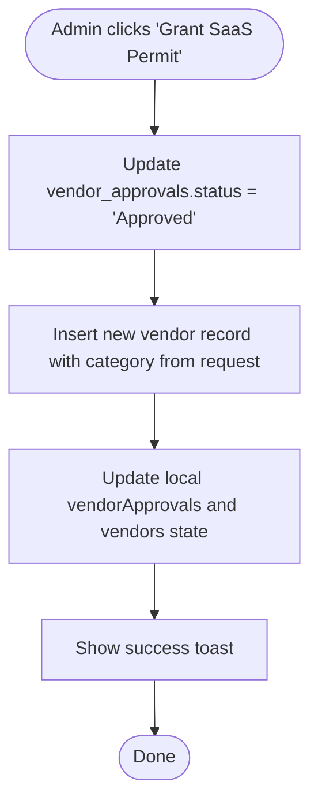
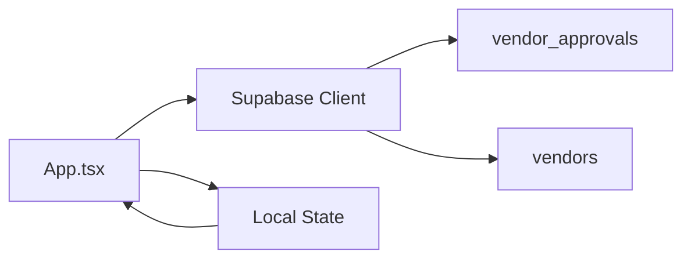

# Vendor Approval Workflow

<cite>
**Referenced Files in This Document**
- [App.tsx](file://src/App.tsx)
- [supabase_schema.sql](file://supabase_schema.sql)
- [SUPABASE.md](file://SUPABASE.md)
</cite>

## Table of Contents
1. [Introduction](#introduction)
2. [Project Structure](#project-structure)
3. [Core Components](#core-components)
4. [Architecture Overview](#architecture-overview)
5. [Detailed Component Analysis](#detailed-component-analysis)
6. [Dependency Analysis](#dependency-analysis)
7. [Performance Considerations](#performance-considerations)
8. [Troubleshooting Guide](#troubleshooting-guide)
9. [Conclusion](#conclusion)

## Introduction
This document explains the vendor approval workflow system implemented in the application. It covers:
- The three-state approval process (Pending, Approved, Declined).
- The VendorApprovalRequest interface structure and how it maps to the database table.
- The administrative review interface for approving or declining vendor applications, including status updates and automated category assignment upon approval.
- Integration with the vendor_approvals database table, real-time status updates, and notification systems.
- Examples of approval decision logic, automated vendor account creation upon approval, and the relationship between approval status and marketplace access permissions.

## Project Structure
The vendor approval workflow is primarily implemented within the main application component and backed by a Supabase schema that defines the vendor_approvals table and related tables.

**Diagram sources**
- [App.tsx:1233-1280](file://src/App.tsx#L1233-L1280)
- [App.tsx:1452-1497](file://src/App.tsx#L1452-L1497)
- [supabase_schema.sql:114-128](file://supabase_schema.sql#L114-L128)

**Section sources**
- [App.tsx:1233-1280](file://src/App.tsx#L1233-L1280)
- [App.tsx:1452-1497](file://src/App.tsx#L1452-L1497)
- [supabase_schema.sql:114-128](file://supabase_schema.sql#L114-L128)

## Core Components
- VendorApprovalRequest interface: Defines the shape of a vendor approval request with fields id, shopName, category, phone, status, timestamp, loginEmail, and loginPassword.
- Vendor registration flow: Captures vendor details and inserts a Pending request into vendor_approvals.
- Administrative review interface: Displays pending requests and allows admins to approve them; on approval, a new vendor record is created and mapped to the selected category.
- Access control: Marketplace access for vendors is gated by approval status and role resolution.

Key implementation highlights:
- Vendor registration submission creates a vendor_approvals row with status "Pending".
- Admin approval updates the vendor_approvals status to "Approved" and inserts a corresponding vendor record with the same category.
- Role resolution uses approved approvals to grant vendor hub access.

**Section sources**
- [App.tsx:75-84](file://src/App.tsx#L75-L84)
- [App.tsx:1233-1280](file://src/App.tsx#L1233-L1280)
- [App.tsx:1452-1497](file://src/App.tsx#L1452-L1497)
- [App.tsx:326-346](file://src/App.tsx#L326-L346)

## Architecture Overview
The vendor approval workflow integrates the frontend state with Supabase tables. On vendor registration, a request is persisted to vendor_approvals. Administrators review these requests in the admin dashboard and can approve them, which triggers automatic creation of a vendor entry and updates local state for immediate UI feedback.

**Diagram sources**
- [App.tsx:1233-1280](file://src/App.tsx#L1233-L1280)
- [App.tsx:1452-1497](file://src/App.tsx#L1452-L1497)
- [supabase_schema.sql:114-128](file://supabase_schema.sql#L114-L128)

## Detailed Component Analysis

### VendorApprovalRequest Interface and Data Model
- Interface fields: id, shopName, category, phone, status, timestamp, loginEmail, loginPassword.
- Database mapping: vendor_approvals table columns include id, shop_name, category, phone, login_email, login_password, status, created_at.
- Status values: Pending, Approved, Declined.

Notes:
- The interface uses camelCase while the database uses snake_case; the app maps between these when reading/writing data.
- Timestamps are stored as created_at and converted to a user-friendly string in the UI.

**Section sources**
- [App.tsx:75-84](file://src/App.tsx#L75-L84)
- [supabase_schema.sql:114-128](file://supabase_schema.sql#L114-L128)

### Vendor Registration Flow
- The vendor registration form collects shop name, category, phone, and password.
- On submit, the app constructs a vendor_approvals payload with status "Pending" and inserts it into the database.
- Local state vendorApprovals is updated to reflect the new request immediately.

Behavioral details:
- Validation ensures required fields and password strength.
- A toast message confirms successful submission.

**Section sources**
- [App.tsx:1233-1280](file://src/App.tsx#L1233-L1280)

### Administrative Review Interface
- Admin dashboard lists pending vendor_approvals with key details (shop name, category, phone).
- For each pending request, an action button allows granting approval.
- Upon approval:
  - vendor_approvals status is updated to "Approved".
  - A new vendor record is inserted with the same category and default metadata.
  - Local state updates reflect both the approval and the new vendor listing.

Decision logic:
- Only requests with status "Pending" show the approval action.
- Approving a request automatically assigns the vendor to the requested category.

**Section sources**
- [App.tsx:3191-3221](file://src/App.tsx#L3191-L3221)
- [App.tsx:1452-1497](file://src/App.tsx#L1452-L1497)

### Automated Vendor Account Creation Upon Approval
- When an admin approves a vendor request, the app inserts a new vendor record into the vendors table.
- The new vendor inherits the category from the approval request and includes default attributes such as rating, delivery time, badge, and image URL.
- The local vendors state is updated to display the newly approved vendor immediately.

Operational notes:
- The approval function handles errors and shows appropriate toasts.
- The vendor record is marked as approved.

**Section sources**
- [App.tsx:1452-1497](file://src/App.tsx#L1452-L1497)

### Relationship Between Approval Status and Marketplace Access Permissions
- Marketplace access for vendors is determined by:
  - Current user role being "vendor", or
  - Having an approved vendor_approvals entry matching the user's phone number, or
  - Being linked to an approved vendor via profile linkage.
- The resolveRoleFromApprovals function checks approved approvals to assign roles accordingly.

Access gating:
- hasVendorHubAccess evaluates whether the current user should see vendor features based on approvals and existing vendor records.

**Section sources**
- [App.tsx:326-346](file://src/App.tsx#L326-L346)

### Real-Time Status Updates and Notifications
- After approval, the UI updates vendorApprovals and vendors states synchronously, providing immediate feedback.
- Toast notifications confirm actions like store approval and category mapping.
- While there is no explicit push notification system implemented, the UI provides visual confirmation through toasts and state-driven rendering.

**Section sources**
- [App.tsx:1452-1497](file://src/App.tsx#L1452-L1497)

### Example Approval Decision Logic
- The admin interface displays only pending requests with actionable buttons.
- Clicking "Grant SaaS Permit" triggers:
  - Updating vendor_approvals status to "Approved".
  - Creating a vendor record with the same category.
  - Refreshing local state and showing a success toast.

Flowchart of approval logic:

**Diagram sources**
- [App.tsx:1452-1497](file://src/App.tsx#L1452-L1497)

## Dependency Analysis
- Frontend dependencies:
  - React state manages vendorApprovals and vendors lists.
  - Supabase client performs CRUD operations on vendor_approvals and vendors.
- Backend dependencies:
  - Supabase schema defines vendor_approvals and vendors tables.
  - Row Level Security policies allow open access during development.

**Diagram sources**
- [App.tsx:1233-1280](file://src/App.tsx#L1233-L1280)
- [App.tsx:1452-1497](file://src/App.tsx#L1452-L1497)
- [supabase_schema.sql:114-128](file://supabase_schema.sql#L114-L128)

**Section sources**
- [App.tsx:1233-1280](file://src/App.tsx#L1233-L1280)
- [App.tsx:1452-1497](file://src/App.tsx#L1452-L1497)
- [supabase_schema.sql:114-128](file://supabase_schema.sql#L114-L128)

## Performance Considerations
- Local state updates provide immediate UI feedback without waiting for network responses.
- Batch operations are not used for approvals; each approval triggers two writes (update vendor_approvals, insert vendors).
- Consider adding optimistic updates and error rollback for better UX if needed.

[No sources needed since this section provides general guidance]

## Troubleshooting Guide
Common issues and resolutions:
- Query returns null data: Ensure rows exist in vendor_approvals and RLS policies allow reads/writes for the anon role during development.
- Incorrect Supabase URL: Verify environment variables match the project URL format.
- RLS blocking operations: Temporarily enable open policies for testing, then tighten before production.

Recommended steps:
- Check effective environment values at runtime.
- Confirm rows exist using Supabase Studio.
- Validate field names and primary keys match payloads.

**Section sources**
- [SUPABASE.md:14-28](file://SUPABASE.md#L14-L28)

## Conclusion
The vendor approval workflow implements a clear three-state process with robust administrative controls. Vendor registrations create pending requests, which administrators can approve to automatically onboard vendors into the marketplace with correct category assignments. Access permissions are tied to approval status, ensuring only approved vendors gain marketplace access. The system leverages Supabase for persistence and provides immediate UI feedback through state updates and notifications.

[No sources needed since this section summarizes without analyzing specific files]