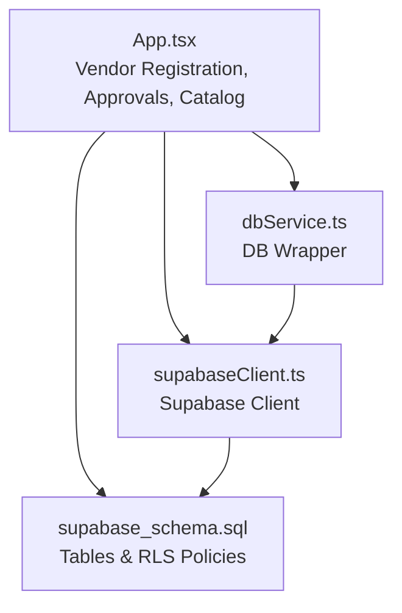
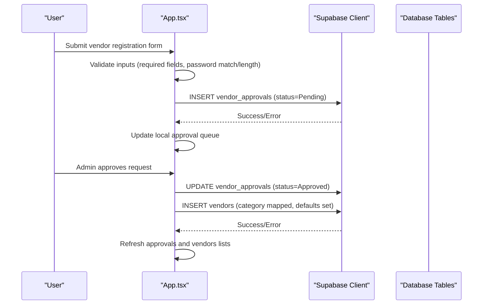
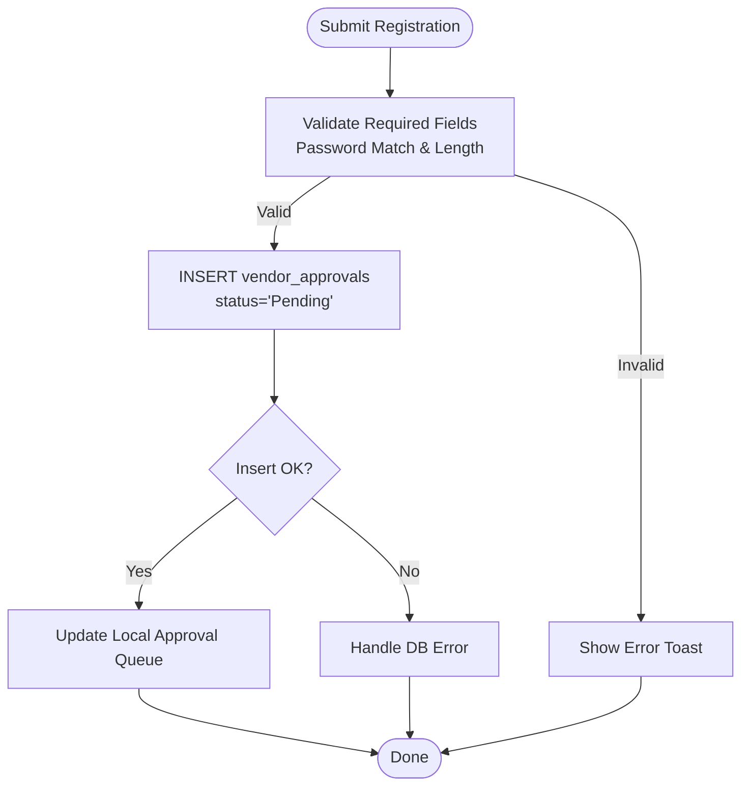
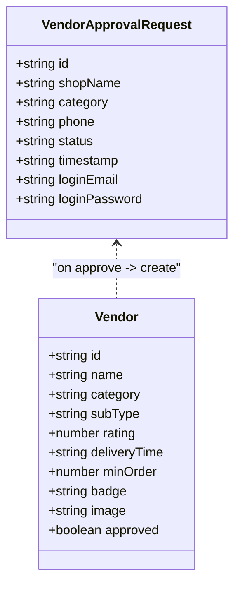
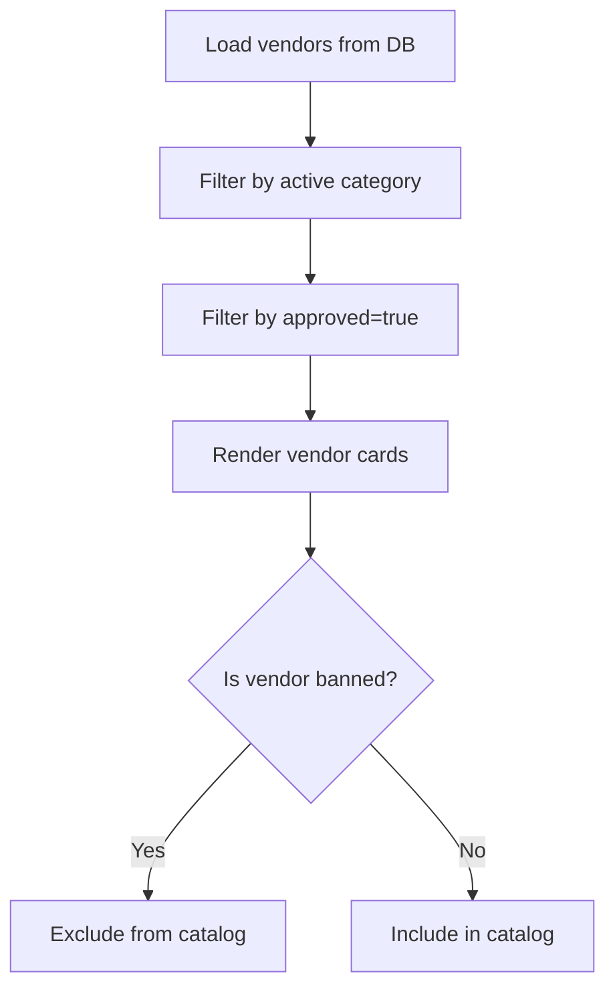
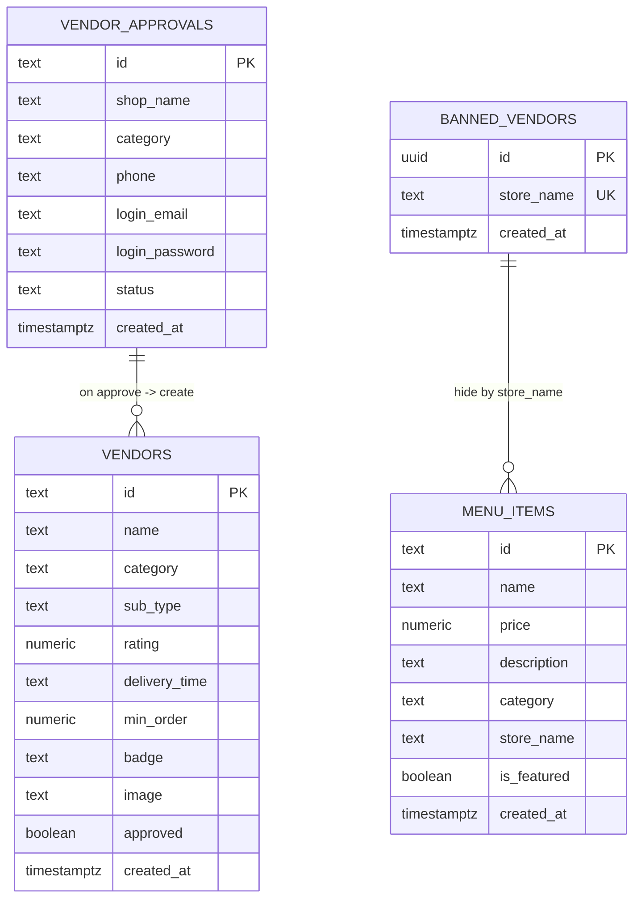
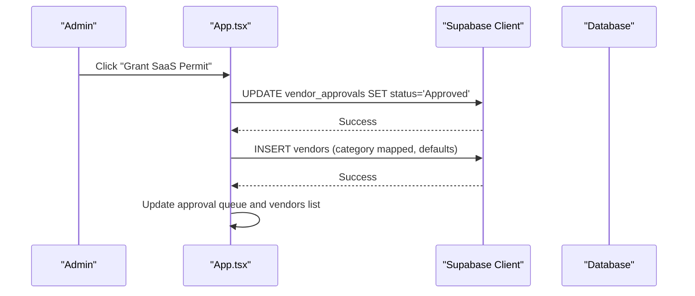
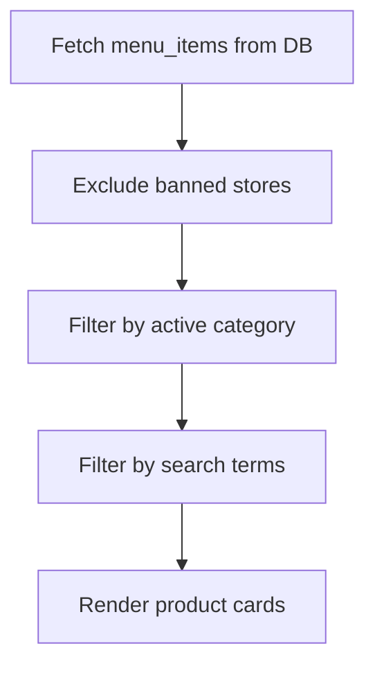
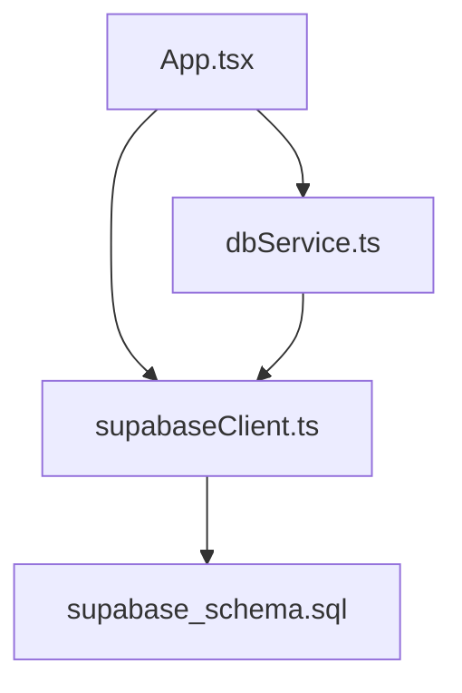

# Vendor Management

<cite>
**Referenced Files in This Document**
- [App.tsx](file://src/App.tsx)
- [supabaseClient.ts](file://src/supabaseClient.ts)
- [dbService.ts](file://src/supabase/dbService.ts)
- [inquiryService.ts](file://src/supabase/inquiryService.ts)
- [supabase_schema.sql](file://supabase_schema.sql)
- [SUPABASE.md](file://SUPABASE.md)
</cite>

## Table of Contents
1. [Introduction](#introduction)
2. [Project Structure](#project-structure)
3. [Core Components](#core-components)
4. [Architecture Overview](#architecture-overview)
5. [Detailed Component Analysis](#detailed-component-analysis)
6. [Dependency Analysis](#dependency-analysis)
7. [Performance Considerations](#performance-considerations)
8. [Troubleshooting Guide](#troubleshooting-guide)
9. [Conclusion](#conclusion)

## Introduction
This document explains the vendor management system for the marketplace, focusing on:
- Vendor registration workflow with form validation and approval queue
- Approval states (Pending, Approved, Declined), administrative review, and automated category assignment upon approval
- Vendor profile management including shop details, categories, ratings, delivery times, minimum order requirements, and badges
- Database operations for vendor data persistence, real-time status updates, and integration with the marketplace catalog
- Examples of vendor onboarding flows, error handling strategies, and security considerations for account creation

The implementation uses a React application with Supabase as the backend database and authentication provider.

## Project Structure
Key files involved in vendor management:
- Application logic and UI for vendor registration, approvals, and catalog integration are implemented in the main app component.
- Supabase client configuration provides connectivity to the database and auth services.
- A lightweight DB wrapper service centralizes common queries and error handling.
- The schema defines tables for vendors, vendor approvals, menu items, and related entities.
- Environment and setup guidance is provided in the Supabase documentation file.

**Diagram sources**
- [App.tsx](file://src/App.tsx)
- [supabaseClient.ts](file://src/supabaseClient.ts)
- [dbService.ts](file://src/supabase/dbService.ts)
- [supabase_schema.sql](file://supabase_schema.sql)

**Section sources**
- [App.tsx](file://src/App.tsx)
- [supabaseClient.ts](file://src/supabaseClient.ts)
- [dbService.ts](file://src/supabase/dbService.ts)
- [supabase_schema.sql](file://supabase_schema.sql)
- [SUPABASE.md](file://SUPABASE.md)

## Core Components
- Vendor Registration Form: Validates required fields, enforces password rules, and submits a pending request to the vendor_approvals table.
- Approval Workflow: Admin reviews pending requests, updates status to Approved or Declined, and upon approval creates a vendor record with default attributes and maps it to the selected category.
- Vendor Profile Management: Displays vendor cards with name, sub-type, rating, delivery time, minimum order, badge, and image; supports filtering by category and visibility based on approved status.
- Marketplace Catalog Integration: Menu items are associated with store names; banned stores are hidden from the catalog.
- Real-Time Updates: After approval, the UI updates both the approval queue and the active vendors list immediately.

**Section sources**
- [App.tsx](file://src/App.tsx)
- [supabase_schema.sql](file://supabase_schema.sql)

## Architecture Overview
The vendor management flow spans UI state, Supabase client calls, and database tables. On initial load, the app fetches vendors, menu items, inquiries, approvals, and other datasets. Vendor registration inserts into vendor_approvals; admin approval transitions the request and creates a vendor entry.

**Diagram sources**
- [App.tsx](file://src/App.tsx)
- [supabase_schema.sql](file://supabase_schema.sql)

## Detailed Component Analysis

### Vendor Registration Workflow
- Inputs: Shop name, category, phone, password, confirm password.
- Validation: All required fields must be present; passwords must match and meet length constraints.
- Submission: Creates a vendor_approvals record with status Pending and derived login email from phone.
- Feedback: Toast messages inform success or failure; local state updates to reflect new pending request.

**Diagram sources**
- [App.tsx](file://src/App.tsx)

**Section sources**
- [App.tsx](file://src/App.tsx)

### Vendor Approval System
- States: Pending, Approved, Declared (Declined).
- Admin Review: Lists pending requests with category and contact info; allows approving or declining.
- Automated Category Assignment: Upon approval, a vendor record is created with the selected category and default attributes (rating, delivery time, min order, badge).
- Status Tracking: Approval queue reflects updated status; vendor list updates to include the newly approved vendor.

**Diagram sources**
- [App.tsx](file://src/App.tsx)
- [supabase_schema.sql](file://supabase_schema.sql)

**Section sources**
- [App.tsx](file://src/App.tsx)
- [supabase_schema.sql](file://supabase_schema.sql)

### Vendor Profile Management
- Display: Vendor cards show name, sub-type, rating, delivery time, minimum order, badge, and image.
- Filtering: Vendors are filtered by active category and only shown if approved.
- Banning: Administrators can ban/unban stores; banned stores are excluded from the marketplace catalog.
- Attributes: Defaults include rating 5.0, delivery time range, minimum order value, and a “Merchant Verified” badge upon approval.

**Diagram sources**
- [App.tsx](file://src/App.tsx)
- [supabase_schema.sql](file://supabase_schema.sql)

**Section sources**
- [App.tsx](file://src/App.tsx)
- [supabase_schema.sql](file://supabase_schema.sql)

### Database Operations and Persistence
- Tables:
  - vendors: Stores approved vendor profiles with category, sub_type, rating, delivery_time, min_order, badge, image, approved flag.
  - vendor_approvals: Holds registration requests with shop_name, category, phone, login_email, login_password, status.
  - menu_items: Product listings linked to store_name; supports featured promotion.
  - banned_vendors: Blacklist of store names to hide from catalog.
- Initial Data: On first load, baseline vendors and menu items are inserted if none exist.
- Queries: Select all records for vendors, approvals, menu items, inquiries, delivery jobs, escrow transactions, chama deals, gas predictions, and banned vendors.

**Diagram sources**
- [supabase_schema.sql](file://supabase_schema.sql)

**Section sources**
- [supabase_schema.sql](file://supabase_schema.sql)
- [App.tsx](file://src/App.tsx)

### Real-Time Status Updates
- After vendor approval, the UI updates the approval queue status to Approved and adds the new vendor to the active vendors list.
- Escrow and delivery job statuses are also updated in real-time during checkout and transit verification flows.

**Diagram sources**
- [App.tsx](file://src/App.tsx)

**Section sources**
- [App.tsx](file://src/App.tsx)

### Integration with Marketplace Catalog
- Menu items are displayed per category and search query; banned stores are excluded.
- Vendors’ products are grouped under their store names; users can add items to cart and proceed to checkout.

**Diagram sources**
- [App.tsx](file://src/App.tsx)

**Section sources**
- [App.tsx](file://src/App.tsx)

## Dependency Analysis
- App.tsx depends on supabaseClient.ts for direct Supabase operations and dbService.ts for a typed wrapper around queries.
- The schema defines relationships and policies that govern access and behavior.
- SUPABASE.md provides environment variable guidance and troubleshooting tips.

**Diagram sources**
- [App.tsx](file://src/App.tsx)
- [supabaseClient.ts](file://src/supabaseClient.ts)
- [dbService.ts](file://src/supabase/dbService.ts)
- [supabase_schema.sql](file://supabase_schema.sql)

**Section sources**
- [App.tsx](file://src/App.tsx)
- [supabaseClient.ts](file://src/supabaseClient.ts)
- [dbService.ts](file://src/supabase/dbService.ts)
- [supabase_schema.sql](file://supabase_schema.sql)
- [SUPABASE.md](file://SUPABASE.md)

## Performance Considerations
- Batch Inserts: Baseline data insertion occurs once on first load; avoid repeated seeding.
- Query Optimization: Use selective columns and filters to reduce payload size.
- Caching: Consider caching frequently accessed categories and vendor lists locally to minimize network calls.
- Indexing: Ensure indexes on frequently queried columns such as category, store_name, and status.

[No sources needed since this section provides general guidance]

## Troubleshooting Guide
Common issues and resolutions:
- Query returns null data: Verify rows exist in Supabase Studio and check Row Level Security policies.
- Incorrect Supabase URL: Ensure the project URL is used without appending /rest/v1/.
- RLS blocking writes: Temporarily allow open policies for development, then tighten before production.
- Auth failures: Confirm credentials and session retrieval; handle legacy phone-based fallback gracefully.

**Section sources**
- [SUPABASE.md](file://SUPABASE.md)
- [App.tsx](file://src/App.tsx)

## Conclusion
The vendor management system provides a complete workflow from registration through approval to catalog integration. It leverages Supabase for data persistence and authentication, with clear separation between UI state and database operations. Administrative controls ensure quality and safety, while real-time updates keep the marketplace consistent. Future enhancements may include stronger role-based access control, robust password hashing, and advanced indexing for performance.