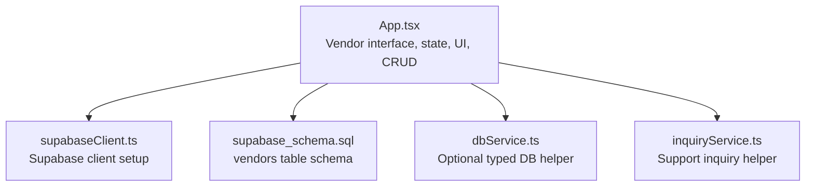
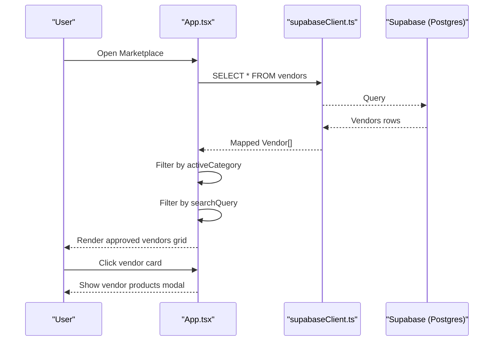
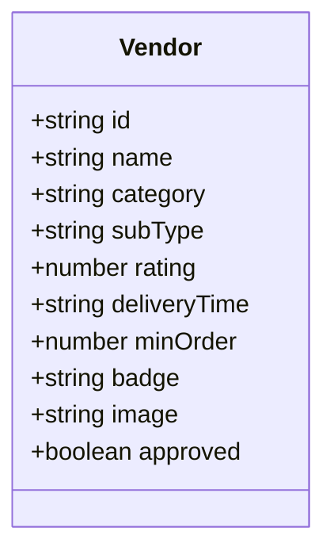
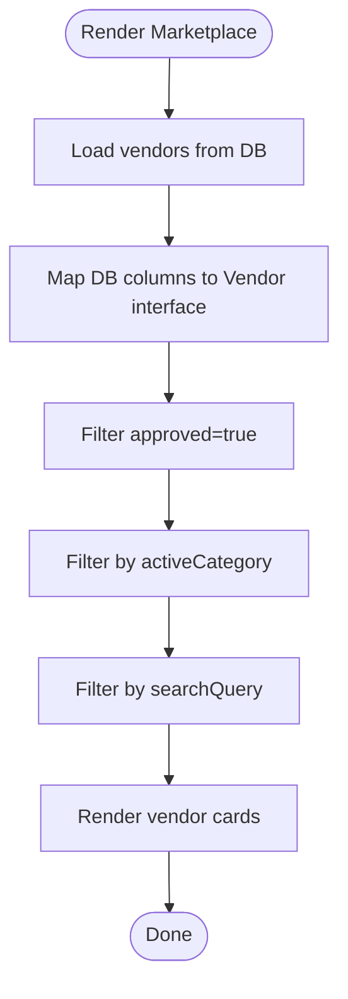
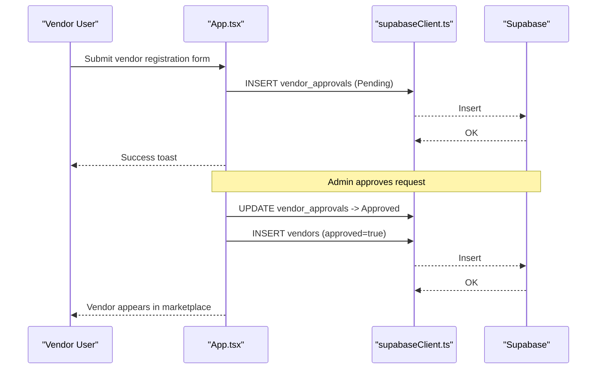
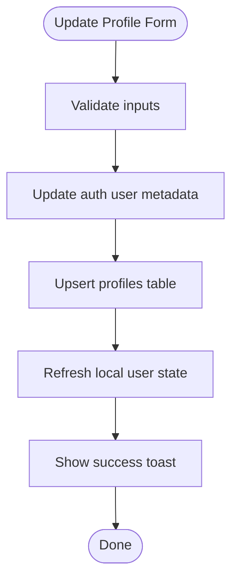
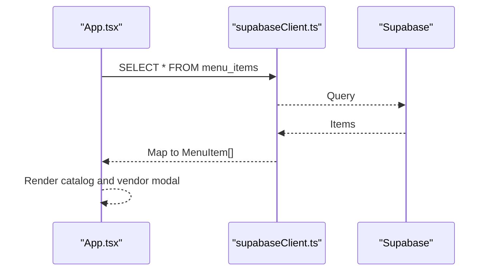
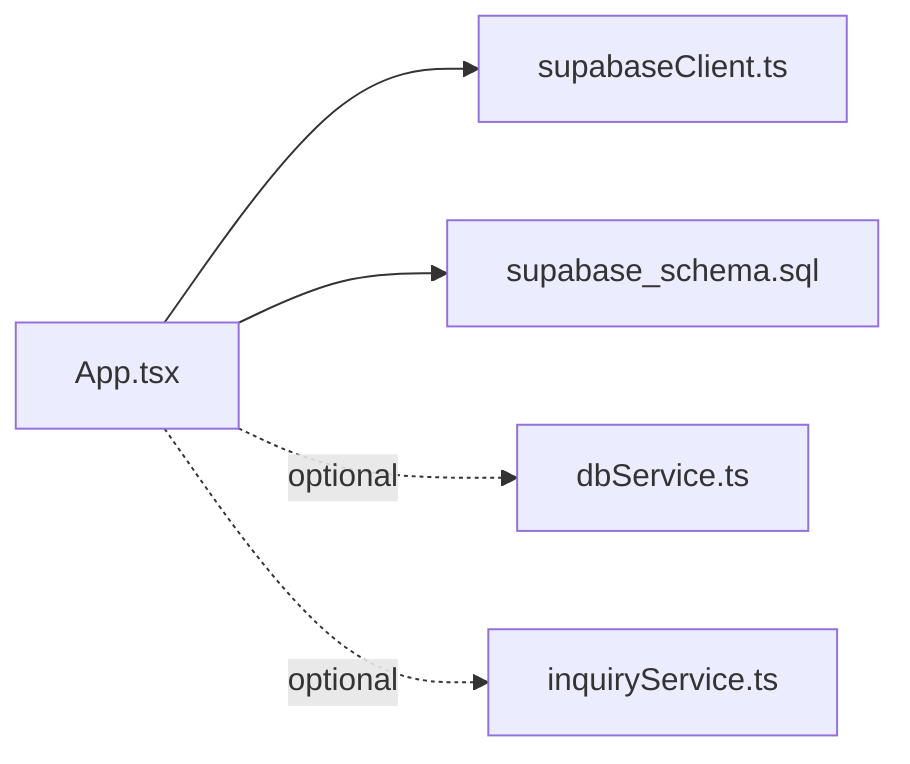

# Vendor Profile Management

<cite>
**Referenced Files in This Document**
- [App.tsx](file://src/App.tsx)
- [supabase_schema.sql](file://supabase_schema.sql)
- [supabaseClient.ts](file://src/supabase/supabaseClient.ts)
- [dbService.ts](file://src/supabase/dbService.ts)
- [inquiryService.ts](file://src/supabase/inquiryService.ts)
</cite>

## Table of Contents
1. [Introduction](#introduction)
2. [Project Structure](#project-structure)
3. [Core Components](#core-components)
4. [Architecture Overview](#architecture-overview)
5. [Detailed Component Analysis](#detailed-component-analysis)
6. [Dependency Analysis](#dependency-analysis)
7. [Performance Considerations](#performance-considerations)
8. [Troubleshooting Guide](#troubleshooting-guide)
9. [Conclusion](#conclusion)

## Introduction
This document explains the vendor profile management functionality in the Match & Market platform. It covers the Vendor data model, how vendor profiles are displayed and filtered in the marketplace, search behavior, featured highlighting, profile update mechanisms, image handling, real-time synchronization with the database, vendor dashboard features, and integration with the marketplace catalog system. It also includes performance considerations for large catalogs and caching strategies.

## Project Structure
The vendor profile feature spans a few key areas:
- Data model definition in the Supabase schema
- Client-side types and state in the main application component
- Database client configuration and optional service helpers
- UI flows for listing, filtering, searching, and vendor dashboards

**Diagram sources**
- [App.tsx](file://src/App.tsx)
- [supabaseClient.ts](file://src/supabase/supabaseClient.ts)
- [supabase_schema.sql](file://supabase_schema.sql)
- [dbService.ts](file://src/supabase/dbService.ts)
- [inquiryService.ts](file://src/supabase/inquiryService.ts)

**Section sources**
- [App.tsx](file://src/App.tsx)
- [supabase_schema.sql](file://supabase_schema.sql)
- [supabaseClient.ts](file://src/supabase/supabaseClient.ts)
- [dbService.ts](file://src/supabase/dbService.ts)
- [inquiryService.ts](file://src/supabase/inquiryService.ts)

## Core Components
- Vendor interface defines the shape of vendor profiles used across the app.
- The vendors table in Supabase stores persistent vendor records.
- The App component manages vendor list state, filtering, search, and dashboard interactions.
- Supabase client provides authenticated access to the database.

Key responsibilities:
- Define and map vendor fields between frontend and database columns
- Load and seed initial vendor data on first run
- Filter by category and search by name/store/description
- Display approved vendors only in the marketplace
- Provide vendor dashboard for product upload and ad promotion

**Section sources**
- [App.tsx:36-47](file://src/App.tsx#L36-L47)
- [supabase_schema.sql:72-84](file://supabase_schema.sql#L72-L84)
- [App.tsx:349-382](file://src/App.tsx#L349-L382)
- [App.tsx:647-659](file://src/App.tsx#L647-L659)
- [App.tsx:1980-2006](file://src/App.tsx#L1980-L2006)

## Architecture Overview
The vendor profile flow integrates UI state, database operations, and schema constraints.

**Diagram sources**
- [App.tsx:349-382](file://src/App.tsx#L349-L382)
- [App.tsx:647-659](file://src/App.tsx#L647-L659)
- [App.tsx:1980-2006](file://src/App.tsx#L1980-L2006)

## Detailed Component Analysis

### Vendor Data Model and Mapping
- Frontend Vendor interface includes id, name, category, subType, rating, deliveryTime, minOrder, badge, image, and approved.
- Database vendors table uses snake_case columns; mapping occurs during load and insert.
- Approved flag controls visibility in the marketplace.

**Diagram sources**
- [App.tsx:36-47](file://src/App.tsx#L36-L47)

**Section sources**
- [App.tsx:36-47](file://src/App.tsx#L36-L47)
- [supabase_schema.sql:72-84](file://supabase_schema.sql#L72-L84)
- [App.tsx:355-381](file://src/App.tsx#L355-L381)

### Marketplace Display, Filtering, Search, and Featured Highlighting
- Vendors are shown only if approved is true.
- Category filter is applied via activeCategory state.
- Search filters items by name, storeName, or description (for menu items).
- Featured items are highlighted in a dedicated banner section.

**Diagram sources**
- [App.tsx:349-382](file://src/App.tsx#L349-L382)
- [App.tsx:647-659](file://src/App.tsx#L647-L659)
- [App.tsx:1980-2006](file://src/App.tsx#L1980-L2006)

**Section sources**
- [App.tsx:647-659](file://src/App.tsx#L647-L659)
- [App.tsx:1980-2006](file://src/App.tsx#L1980-L2006)
- [App.tsx:1798-1824](file://src/App.tsx#L1798-L1824)

### Vendor Dashboard Features
- Vendor registration submits a request to vendor_approvals with status Pending.
- Admin approval creates a new vendor record in vendors and updates local state.
- Authenticated vendors can upload products to menu_items and promote listings as featured ads.

**Diagram sources**
- [App.tsx:1233-1280](file://src/App.tsx#L1233-L1280)
- [App.tsx:1452-1497](file://src/App.tsx#L1452-L1497)

**Section sources**
- [App.tsx:1233-1280](file://src/App.tsx#L1233-L1280)
- [App.tsx:1452-1497](file://src/App.tsx#L1452-L1497)

### Profile Update Mechanisms and Image Handling
- User profile updates write to both auth metadata and the profiles table using upsert.
- Profile photo is stored as a URL string; no server-side upload logic is implemented in this codebase.
- Updates reflect immediately in UI state and persisted via Supabase.

**Diagram sources**
- [App.tsx:959-1036](file://src/App.tsx#L959-L1036)

**Section sources**
- [App.tsx:959-1036](file://src/App.tsx#L959-L1036)

### Integration with Marketplace Catalog System
- Menu items are loaded from menu_items and mapped to MenuItem interface.
- Vendors’ products are displayed in a modal when clicking a vendor card.
- Product upload inserts into menu_items and updates local catalog state.

**Diagram sources**
- [App.tsx:384-408](file://src/App.tsx#L384-L408)
- [App.tsx:2061-2085](file://src/App.tsx#L2061-L2085)
- [App.tsx:1555-1592](file://src/App.tsx#L1555-L1592)

**Section sources**
- [App.tsx:384-408](file://src/App.tsx#L384-L408)
- [App.tsx:2061-2085](file://src/App.tsx#L2061-L2085)
- [App.tsx:1555-1592](file://src/App.tsx#L1555-L1592)

## Dependency Analysis
- App.tsx depends on supabaseClient.ts for all database operations.
- dbService.ts provides a generic typed wrapper but is not actively used in vendor flows.
- inquiryService.ts is available for support inquiries and unrelated to vendor profiles.
- Schema enforces RLS policies that allow full access for anon/authenticated/service roles.

**Diagram sources**
- [App.tsx](file://src/App.tsx)
- [supabaseClient.ts](file://src/supabase/supabaseClient.ts)
- [supabase_schema.sql](file://supabase_schema.sql)
- [dbService.ts](file://src/supabase/dbService.ts)
- [inquiryService.ts](file://src/supabase/inquiryService.ts)

**Section sources**
- [supabase_schema.sql:170-198](file://supabase_schema.sql#L170-L198)
- [supabaseClient.ts:1-28](file://src/supabase/supabaseClient.ts#L1-L28)

## Performance Considerations
- Initial load: All tables are queried on mount. For large catalogs, consider pagination or lazy loading.
- Filtering and search: Current implementation filters in-memory after fetching all items. For large datasets, move filtering to the database using WHERE clauses and indexes.
- Images: Vendor images are URLs; ensure CDN usage and proper sizing to reduce payload.
- Real-time sync: No real-time subscriptions are implemented. Consider Supabase realtime channels for live updates.
- Caching: Add client-side caching (e.g., in-memory cache or localStorage/IndexedDB) for vendor lists and menu items to avoid repeated network calls.
- Indexes: Ensure indexed columns for frequently filtered fields such as category, store_name, and is_featured.

[No sources needed since this section provides general guidance]

## Troubleshooting Guide
- Missing credentials: If Supabase environment variables are missing, client initialization will log an error. Verify VITE_SUPABASE_URL and VITE_SUPABASE_ANON_KEY.
- Empty vendor list: On first run, baseline vendors are inserted if none exist. Check network requests and RLS policies.
- Vendor not visible: Only approved vendors appear. Confirm approved flag and category filter.
- Profile update failures: Errors may occur during auth metadata update or profiles upsert. Inspect error messages and confirm user session exists.
- Support inquiries: Use the help desk form; errors indicate RLS or table policy issues.

**Section sources**
- [supabaseClient.ts:6-19](file://src/supabase/supabaseClient.ts#L6-L19)
- [App.tsx:349-382](file://src/App.tsx#L349-L382)
- [App.tsx:959-1036](file://src/App.tsx#L959-L1036)
- [App.tsx:1038-1094](file://src/App.tsx#L1038-L1094)

## Conclusion
The vendor profile management system combines a clear data model, robust UI flows, and direct database integration. Vendors are displayed based on approval status and category filters, with search and featured highlights enhancing discoverability. Profile updates persist through Supabase, while image handling relies on URL-based storage. For scalability, implement server-side filtering, pagination, indexing, and caching to optimize performance for large catalogs.

[No sources needed since this section summarizes without analyzing specific files]