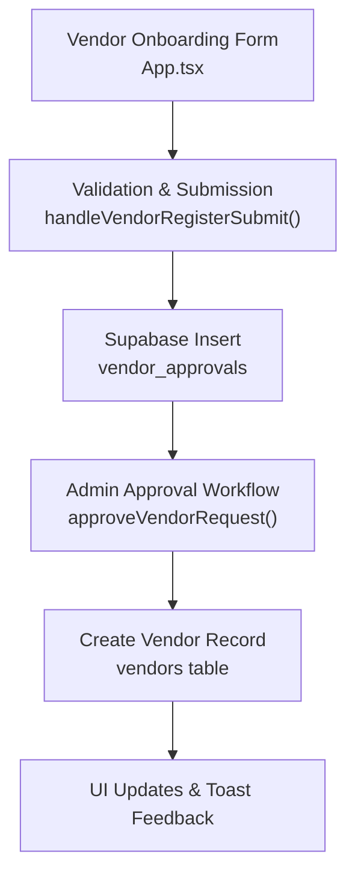
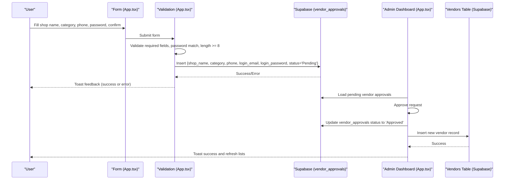
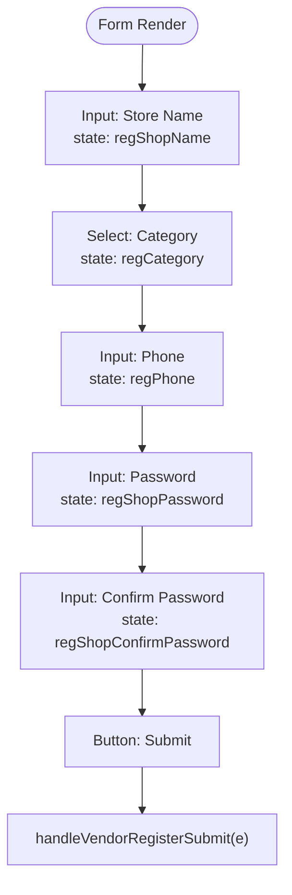
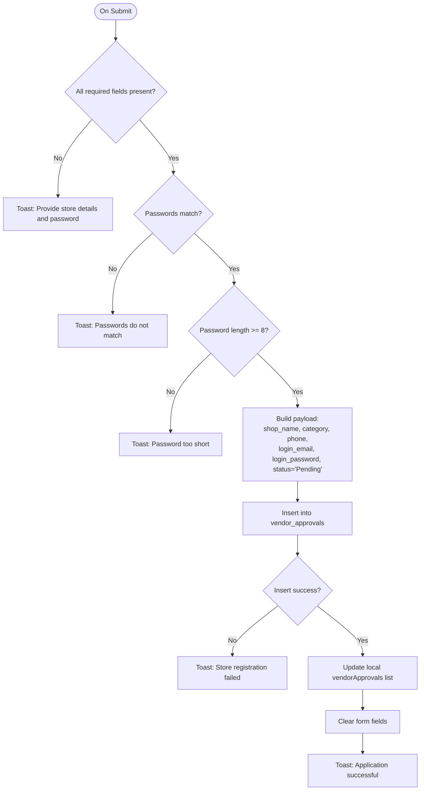
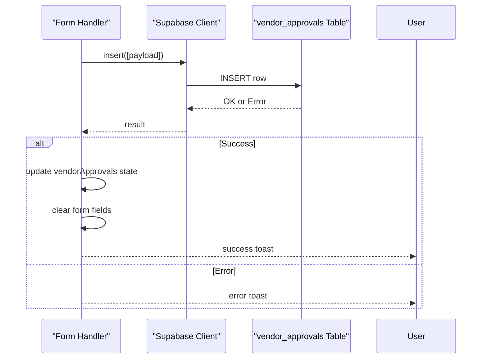
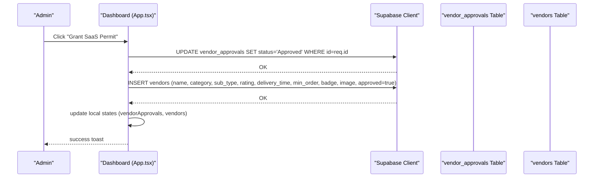
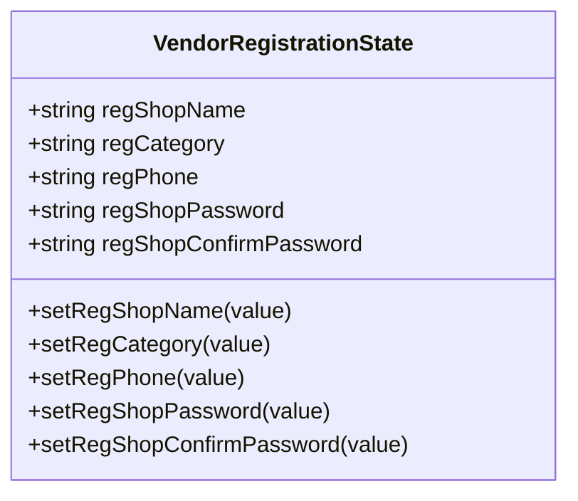
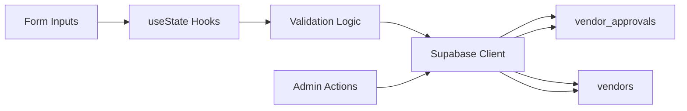

# Vendor Registration

<cite>
**Referenced Files in This Document**
- [App.tsx](file://src/App.tsx)
- [supabase_schema.sql](file://supabase_schema.sql)
</cite>

## Table of Contents
1. [Introduction](#introduction)
2. [Project Structure](#project-structure)
3. [Core Components](#core-components)
4. [Architecture Overview](#architecture-overview)
5. [Detailed Component Analysis](#detailed-component-analysis)
6. [Dependency Analysis](#dependency-analysis)
7. [Performance Considerations](#performance-considerations)
8. [Troubleshooting Guide](#troubleshooting-guide)
9. [Security Considerations](#security-considerations)
10. [Conclusion](#conclusion)

## Introduction
This document explains the vendor self-onboarding and registration system, including the form fields (shop name, category selection, phone number, password creation with confirmation), validation logic, error handling, data submission to the database, and the end-to-end workflow from form input to approval request creation. It also covers state management using useState hooks for regShopName, regCategory, regPhone, regShopPassword, and regShopConfirmPassword, user feedback mechanisms, integration with the vendor approvals table, and security considerations for password handling and data sanitization.

## Project Structure
The vendor registration feature is implemented within the main application component and backed by Supabase tables defined in the schema file. The key implementation points are:
- UI and state: App.tsx
- Database schema and RLS policies: supabase_schema.sql

**Diagram sources**
- [App.tsx:1233-1280](file://src/App.tsx#L1233-L1280)
- [App.tsx:1452-1497](file://src/App.tsx#L1452-L1497)
- [supabase_schema.sql:114-127](file://supabase_schema.sql#L114-L127)
- [supabase_schema.sql:71-84](file://supabase_schema.sql#L71-L84)

**Section sources**
- [App.tsx:627-631](file://src/App.tsx#L627-L631)
- [App.tsx:1233-1280](file://src/App.tsx#L1233-L1280)
- [App.tsx:1452-1497](file://src/App.tsx#L1452-L1497)
- [supabase_schema.sql:114-127](file://supabase_schema.sql#L114-L127)
- [supabase_schema.sql:71-84](file://supabase_schema.sql#L71-L84)

## Core Components
- Self-onboarding form fields:
  - Shop Name: text input bound to regShopName
  - Category: select dropdown bound to regCategory
  - Phone: text input bound to regPhone
  - Password: password input bound to regShopPassword
  - Confirm Password: password input bound to regShopConfirmPassword
- Validation and submission handler: handleVendorRegisterSubmit
- Admin approval flow: approveVendorRequest
- State variables:
  - regShopName, setRegShopName
  - regCategory, setRegCategory
  - regPhone, setRegPhone
  - regShopPassword, setRegShopPassword
  - regShopConfirmPassword, setRegShopConfirmPassword
- User feedback: toast notifications via triggerToast

**Section sources**
- [App.tsx:627-631](file://src/App.tsx#L627-L631)
- [App.tsx:2845-2908](file://src/App.tsx#L2845-L2908)
- [App.tsx:1233-1280](file://src/App.tsx#L1233-L1280)
- [App.tsx:1452-1497](file://src/App.tsx#L1452-L1497)

## Architecture Overview
The vendor registration architecture follows a client-side form with immediate validation, then inserts an approval request into the vendor_approvals table. An admin reviews pending requests and approves them, which triggers creation of a vendor record and updates UI state accordingly.

**Diagram sources**
- [App.tsx:1233-1280](file://src/App.tsx#L1233-L1280)
- [App.tsx:1452-1497](file://src/App.tsx#L1452-L1497)
- [supabase_schema.sql:114-127](file://supabase_schema.sql#L114-L127)
- [supabase_schema.sql:71-84](file://supabase_schema.sql#L71-L84)

## Detailed Component Analysis

### Vendor Registration Form UI
- Fields:
  - Store Name: text input bound to regShopName
  - SaaS Category: select with options for Food & Beverages, M & M Soko, M & M Services, M & M Fun Zone
  - Contact Phone: text input bound to regPhone
  - Password: password input bound to regShopPassword
  - Confirm Password: password input bound to regShopConfirmPassword
- Submit button triggers handleVendorRegisterSubmit

**Diagram sources**
- [App.tsx:2845-2908](file://src/App.tsx#L2845-L2908)

**Section sources**
- [App.tsx:2845-2908](file://src/App.tsx#L2845-L2908)

### Form Validation Logic
- Required fields check: shop name, phone, password, confirm password must be non-empty
- Password confirmation must match
- Minimum password length enforced (>= 8 characters)
- Email generation for vendor login uses phone digits appended with domain suffix

**Diagram sources**
- [App.tsx:1233-1280](file://src/App.tsx#L1233-L1280)

**Section sources**
- [App.tsx:1233-1280](file://src/App.tsx#L1233-L1280)

### Data Submission to Database
- Payload includes:
  - shop_name: from regShopName
  - category: from regCategory
  - phone: from regPhone
  - login_email: derived from phone digits + domain
  - login_password: from regShopPassword
  - status: 'Pending'
- Supabase insert operation writes to vendor_approvals table
- On success, local state vendorApprovals is updated and form fields cleared
- On error, toast displays failure message

**Diagram sources**
- [App.tsx:1233-1280](file://src/App.tsx#L1233-L1280)
- [supabase_schema.sql:114-127](file://supabase_schema.sql#L114-L127)

**Section sources**
- [App.tsx:1233-1280](file://src/App.tsx#L1233-L1280)
- [supabase_schema.sql:114-127](file://supabase_schema.sql#L114-L127)

### Admin Approval Workflow
- Admin dashboard lists pending vendor approvals
- Approve action updates vendor_approvals status to 'Approved'
- Creates a new vendor record in vendors table with default attributes
- Updates local vendorApprovals and vendors lists
- Displays success toast

**Diagram sources**
- [App.tsx:1452-1497](file://src/App.tsx#L1452-L1497)
- [supabase_schema.sql:71-84](file://supabase_schema.sql#L71-L84)
- [supabase_schema.sql:114-127](file://supabase_schema.sql#L114-L127)

**Section sources**
- [App.tsx:1452-1497](file://src/App.tsx#L1452-L1497)
- [supabase_schema.sql:71-84](file://supabase_schema.sql#L71-L84)
- [supabase_schema.sql:114-127](file://supabase_schema.sql#L114-L127)

### State Management with useState Hooks
- regShopName, setRegShopName: stores shop name input
- regCategory, setRegCategory: stores selected category
- regPhone, setRegPhone: stores phone number input
- regShopPassword, setRegShopPassword: stores password input
- regShopConfirmPassword, setRegShopConfirmPassword: stores confirm password input
- These states are used to bind inputs and validate on submit

**Diagram sources**
- [App.tsx:627-631](file://src/App.tsx#L627-L631)

**Section sources**
- [App.tsx:627-631](file://src/App.tsx#L627-L631)

### User Feedback Mechanisms
- Toast notifications provide immediate feedback for:
  - Validation errors (missing fields, mismatched passwords, short passwords)
  - Submission success or failure
  - Admin actions (approval success)
- Triggered via triggerToast function with message and type ('success', 'error', 'info')

**Section sources**
- [App.tsx:1233-1280](file://src/App.tsx#L1233-L1280)
- [App.tsx:1452-1497](file://src/App.tsx#L1452-L1497)

## Dependency Analysis
- UI components depend on state setters for binding inputs
- Validation depends on current state values
- Database operations depend on Supabase client configured in the app
- Admin approval depends on vendor_approvals and vendors tables
- RLS policies allow full access for all roles in development mode

**Diagram sources**
- [App.tsx:1233-1280](file://src/App.tsx#L1233-L1280)
- [App.tsx:1452-1497](file://src/App.tsx#L1452-L1497)
- [supabase_schema.sql:171-197](file://supabase_schema.sql#L171-L197)

**Section sources**
- [App.tsx:1233-1280](file://src/App.tsx#L1233-L1280)
- [App.tsx:1452-1497](file://src/App.tsx#L1452-L1497)
- [supabase_schema.sql:171-197](file://supabase_schema.sql#L171-L197)

## Performance Considerations
- Local state updates ensure responsive UI without unnecessary re-renders
- Single insert operation per registration minimizes network calls
- Admin approval performs two sequential operations (update approvals, insert vendor); consider batching if needed
- Toast messages are transient and do not impact performance

[No sources needed since this section provides general guidance]

## Troubleshooting Guide
Common issues and resolutions:
- Missing required fields: Ensure all fields are filled before submission
- Password mismatch: Verify both password fields match exactly
- Short password: Use at least 8 characters
- Database insertion errors: Check Supabase connection and RLS policies
- Admin approval failures: Verify permissions and table structure

**Section sources**
- [App.tsx:1233-1280](file://src/App.tsx#L1233-L1280)
- [App.tsx:1452-1497](file://src/App.tsx#L1452-L1497)

## Security Considerations
- Password handling:
  - Passwords are stored in plain text in vendor_approvals.login_password field
  - No hashing or encryption is applied in the current implementation
  - Minimum length validation helps prevent weak passwords
- Data sanitization:
  - Phone number is sanitized to digits only when generating email
  - No additional input sanitization is performed
- RLS policies:
  - Current policies grant full access to all roles, which is suitable for development but not production
- Recommendations:
  - Implement server-side password hashing
  - Add input validation and sanitization
  - Configure proper RLS policies for production
  - Consider encrypting sensitive fields like login_password

**Section sources**
- [App.tsx:1248-1256](file://src/App.tsx#L1248-L1256)
- [supabase_schema.sql:114-127](file://supabase_schema.sql#L114-L127)
- [supabase_schema.sql:171-197](file://supabase_schema.sql#L171-L197)

## Conclusion
The vendor registration system provides a complete self-onboarding experience with robust form validation, immediate user feedback, and integration with the vendor approvals workflow. While the current implementation serves well for development and testing, production deployment should address security concerns around password storage and implement proper access controls through RLS policies.

[No sources needed since this section summarizes without analyzing specific files]