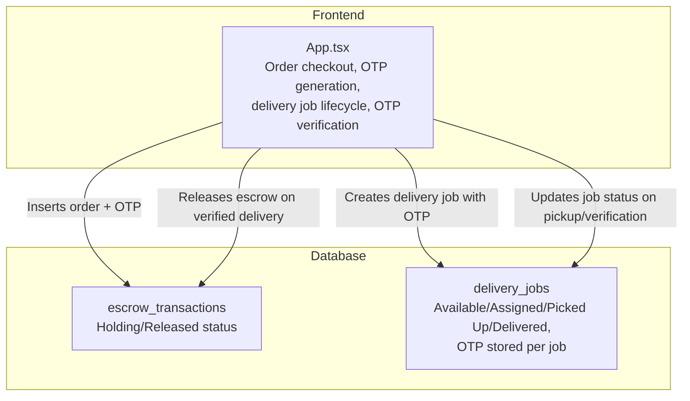
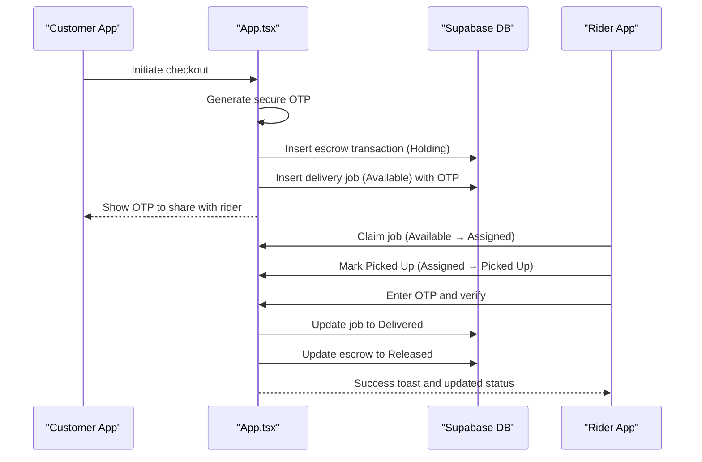
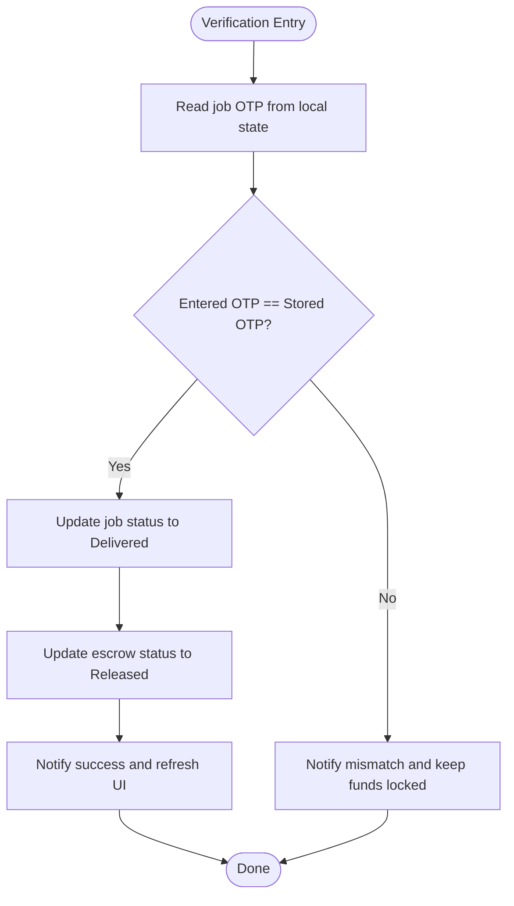
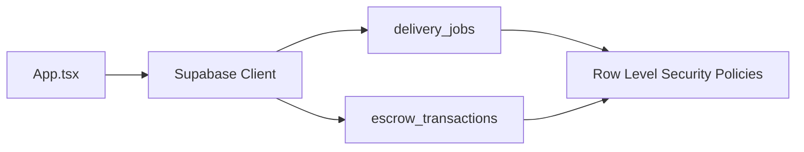

# OTP Verification & Delivery Confirmation

<cite>
**Referenced Files in This Document**
- [App.tsx](file://src/App.tsx)
- [supabase_schema.sql](file://supabase_schema.sql)
- [SUPABASE.md](file://SUPABASE.md)
- [dbService.ts](file://src/supabase/dbService.ts)
</cite>

## Table of Contents
1. [Introduction](#introduction)
2. [Project Structure](#project-structure)
3. [Core Components](#core-components)
4. [Architecture Overview](#architecture-overview)
5. [Detailed Component Analysis](#detailed-component-analysis)
6. [Dependency Analysis](#dependency-analysis)
7. [Performance Considerations](#performance-considerations)
8. [Troubleshooting Guide](#troubleshooting-guide)
9. [Conclusion](#conclusion)

## Introduction
This document explains the OTP verification system used for delivery confirmation in the Match & Market application. It covers how a secure OTP is generated, how delivery jobs are created and matched to riders, and the end-to-end verification workflow that releases escrow funds upon successful OTP confirmation. It also documents anti-fraud measures, OTP expiration handling, retry mechanisms, integration points with delivery completion workflows, customer notifications, and audit logging for security compliance. Finally, it provides troubleshooting guidance and security best practices.

## Project Structure
The OTP and delivery confirmation logic is implemented primarily in the React application component and persisted via Supabase tables. The key files involved are:
- Application logic and UI orchestration: src/App.tsx
- Database schema and Row Level Security policies: supabase_schema.sql
- Supabase client configuration and environment guidance: SUPABASE.md
- Optional database wrapper utility (not used by current flow): src/supabase/dbService.ts

**Diagram sources**
- [App.tsx](file://src/App.tsx)
- [supabase_schema.sql](file://supabase_schema.sql)

**Section sources**
- [App.tsx](file://src/App.tsx)
- [supabase_schema.sql](file://supabase_schema.sql)

## Core Components
- OTP Generation: A short numeric code is generated at checkout time and attached to the delivery job record.
- Delivery Job Lifecycle: Jobs move through states Available → Assigned → Picked Up → Delivered.
- OTP Verification Handshake: At delivery, the rider enters the OTP provided by the customer; if it matches, the job is marked delivered and escrow is released.
- Escrow Ledger: Transactions are recorded and transition from Holding to Released upon successful verification.

Key implementation references:
- OTP generation and job creation: [App.tsx](file://src/App.tsx)
- Job state transitions and OTP verification: [App.tsx](file://src/App.tsx)
- Data model for delivery jobs and escrow transactions: [supabase_schema.sql](file://supabase_schema.sql)

**Section sources**
- [App.tsx](file://src/App.tsx)
- [supabase_schema.sql](file://supabase_schema.sql)

## Architecture Overview
The OTP-based delivery confirmation integrates three main layers:
- Frontend orchestration: handles user interactions, generates OTP, persists data, and updates UI state.
- Database persistence: stores delivery jobs and escrow transactions with explicit statuses and OTP values.
- Security controls: Row Level Security policies govern access to tables.

**Diagram sources**
- [App.tsx](file://src/App.tsx)
- [supabase_schema.sql](file://supabase_schema.sql)

## Detailed Component Analysis

### OTP Generation Algorithm
- Implementation: A four-digit numeric OTP is generated using a simple random function at checkout time.
- Storage: The OTP is stored in the delivery_jobs table alongside other job metadata.
- Distribution: The OTP is shown to the customer and intended to be shared with the rider upon arrival.

Security considerations:
- The generator uses a basic random function; consider upgrading to a cryptographically secure generator for production.
- Ensure OTP is not exposed beyond necessary channels and avoid logging sensitive values.

References:
- OTP generation and usage: [App.tsx](file://src/App.tsx)
- OTP field in delivery_jobs: [supabase_schema.sql](file://supabase_schema.sql)

**Section sources**
- [App.tsx](file://src/App.tsx)
- [supabase_schema.sql](file://supabase_schema.sql)

### Delivery Driver-Customer Matching Process
- Job Creation: On checkout, a new delivery job is created with status Available and includes the customer’s phone number and merchant details.
- Assignment: A rider claims the job, transitioning its status to Assigned and recording the rider name.
- Pickup: The rider marks the job as Picked Up, enabling OTP verification.

References:
- Job creation and initial state: [App.tsx](file://src/App.tsx)
- Claiming and assignment: [App.tsx](file://src/App.tsx)
- Pickup marking: [App.tsx](file://src/App.tsx)
- Schema fields supporting matching: [supabase_schema.sql](file://supabase_schema.sql)

**Section sources**
- [App.tsx](file://src/App.tsx)
- [supabase_schema.sql](file://supabase_schema.sql)

### OTP Verification Workflow
- Input: Rider enters the OTP associated with the job.
- Validation: The entered OTP is compared against the stored OTP for the job.
- Outcome:
  - If match: job status becomes Delivered and escrow transaction status changes to Released.
  - If mismatch: an error message indicates funds remain locked pending review.

**Diagram sources**
- [App.tsx](file://src/App.tsx)

**Section sources**
- [App.tsx](file://src/App.tsx)

### Anti-Fraud Measures
- OTP-based release: Payment release requires a secret known only to the customer and presented at delivery.
- Status gating: OTP verification is only available after the job is marked Picked Up, preventing premature release.
- Escrow holding: Funds remain in Holding until OTP verification succeeds, reducing fraud risk.

Recommendations:
- Enforce rate limiting on OTP verification attempts.
- Add device or session binding to reduce replay attacks.
- Consider expiring OTPs after a defined window.

**Section sources**
- [App.tsx](file://src/App.tsx)
- [supabase_schema.sql](file://supabase_schema.sql)

### OTP Expiration Handling
Current behavior:
- No explicit expiration is enforced in the code; OTP remains valid until manually verified or overwritten by a new job.

Recommended enhancements:
- Store OTP creation timestamp and enforce expiry before verification.
- Invalidate OTP after successful use or after a timeout.
- Provide clear user feedback when OTP expires and guide reissuance.

**Section sources**
- [App.tsx](file://src/App.tsx)

### Retry Mechanisms
Current behavior:
- Network errors during insert/update operations trigger error toasts and abort the operation without retries.

Recommended enhancements:
- Implement exponential backoff for failed network requests.
- Add idempotency keys for critical operations (e.g., OTP verification).
- Persist retry attempts for auditability.

**Section sources**
- [App.tsx](file://src/App.tsx)

### Integration with Delivery Completion Workflows
- Checkout triggers escrow Holding and creates a delivery job with OTP.
- Rider flow: claim → pick up → verify OTP → complete delivery.
- Upon successful verification, both job and escrow records are updated atomically in sequence.

References:
- Checkout and OTP creation: [App.tsx](file://src/App.tsx)
- Job lifecycle transitions: [App.tsx](file://src/App.tsx)
- Escrow release on verification: [App.tsx](file://src/App.tsx)

**Section sources**
- [App.tsx](file://src/App.tsx)

### Customer Notification Systems
- Notifications are implemented via in-app toasts indicating OTP availability and verification outcomes.
- There is no external SMS/email integration visible in the codebase.

Recommendations:
- Integrate with an SMS provider to deliver OTP securely to the customer’s phone.
- Send delivery status updates to customers automatically.

**Section sources**
- [App.tsx](file://src/App.tsx)

### Audit Logging for Security Compliance
- Escrow transactions include timestamps and payer/vendor details, providing an audit trail for financial flows.
- Delivery job records capture status transitions and relevant metadata.

Recommendations:
- Log all OTP verification attempts (success/failure) with timestamps and identifiers.
- Retain logs securely and restrict access based on least privilege.

**Section sources**
- [supabase_schema.sql](file://supabase_schema.sql)
- [App.tsx](file://src/App.tsx)

## Dependency Analysis
The OTP and delivery confirmation flow depends on:
- React state management within App.tsx for UI and business logic.
- Supabase client calls for reading/writing delivery_jobs and escrow_transactions.
- Database schema enforcing structure and RLS policies for access control.

**Diagram sources**
- [App.tsx](file://src/App.tsx)
- [supabase_schema.sql](file://supabase_schema.sql)

**Section sources**
- [App.tsx](file://src/App.tsx)
- [supabase_schema.sql](file://supabase_schema.sql)

## Performance Considerations
- Batch operations: When creating multiple records (e.g., escrow and job), ensure efficient writes and handle errors promptly.
- Query optimization: Use targeted selects and avoid unnecessary data fetching.
- RLS performance: Keep policies simple and indexed where appropriate.

[No sources needed since this section provides general guidance]

## Troubleshooting Guide
Common issues and resolutions:
- OTP mismatch: Verify the correct OTP was shared and entered; check job state is Picked Up before verification.
- Failed updates: Inspect toast messages for error details; confirm Supabase permissions and RLS policies allow updates.
- Missing rows: Confirm inserts succeeded and that the same project URL and anon key are used consistently.

Operational tips:
- Validate environment variables for Supabase URL and anon key.
- Temporarily relax RLS policies during development to isolate issues, then tighten them for production.

**Section sources**
- [SUPABASE.md](file://SUPABASE.md)
- [App.tsx](file://src/App.tsx)

## Conclusion
The OTP verification system provides a practical mechanism to secure delivery confirmations and release escrow funds. While the current implementation is functional, enhancing cryptographic strength, adding OTP expiration, implementing retry logic, and integrating external notifications will improve security, reliability, and user experience. Proper audit logging and strict RLS policies further strengthen compliance and safety.

[No sources needed since this section summarizes without analyzing specific files]