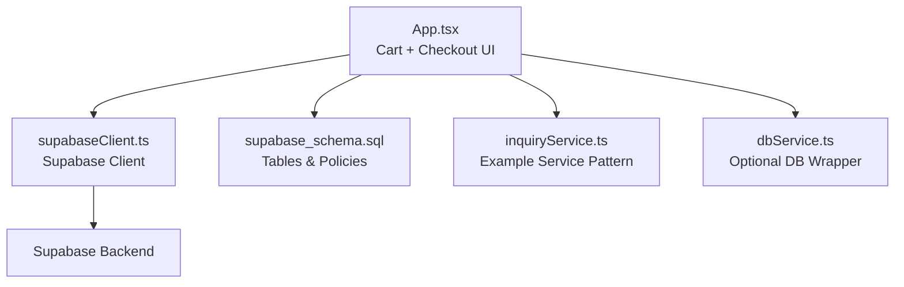
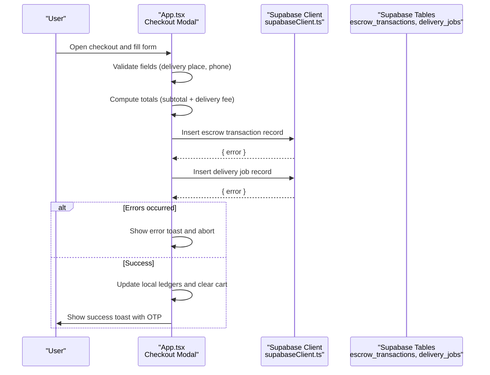
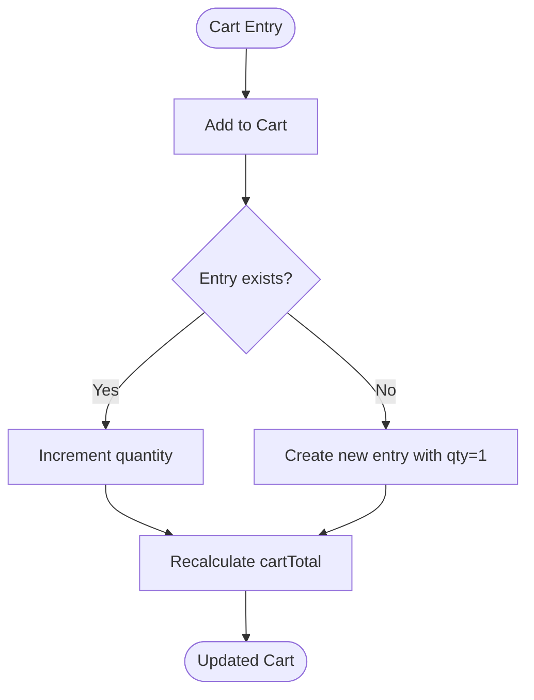
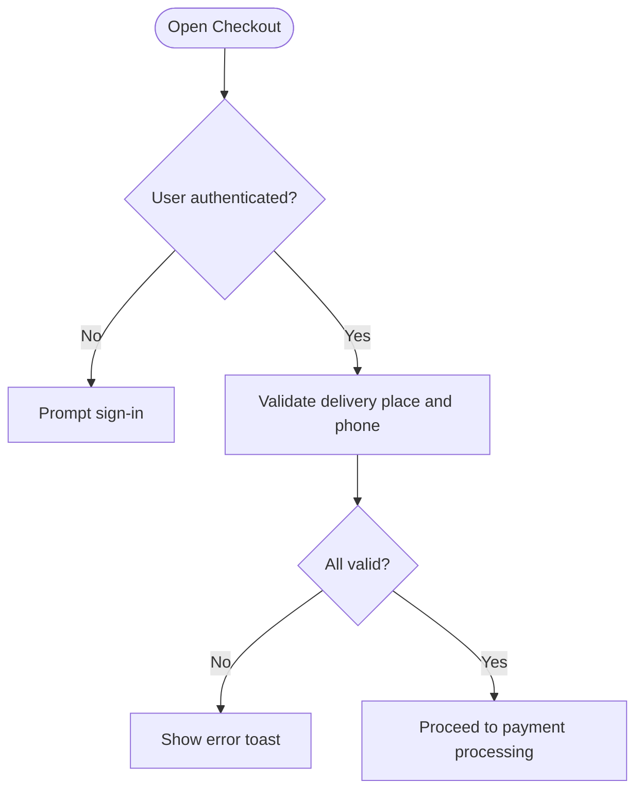
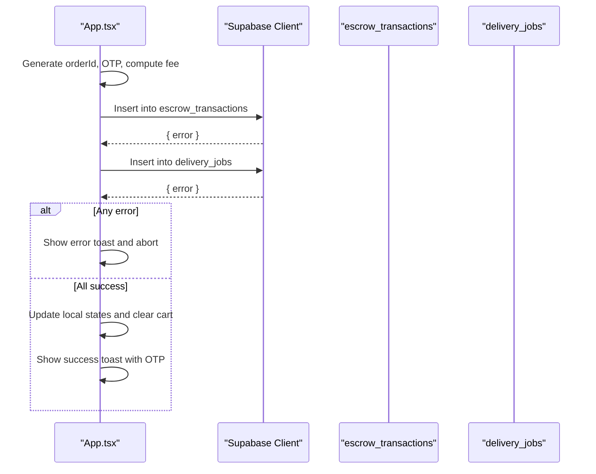
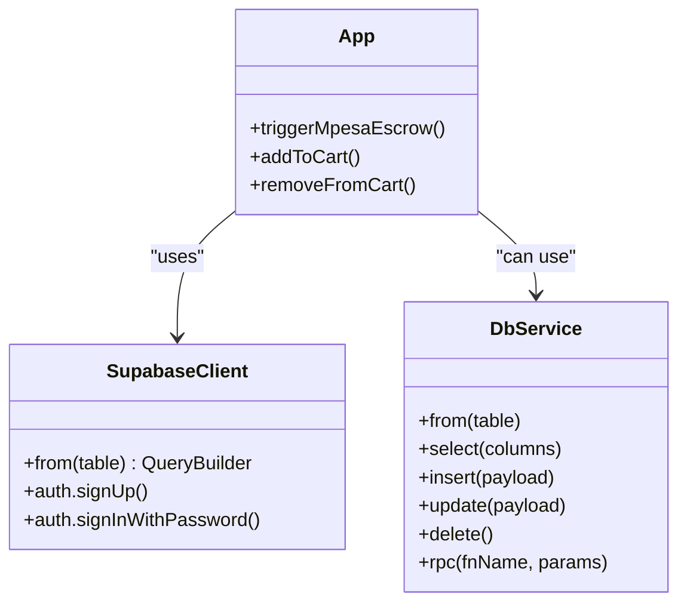
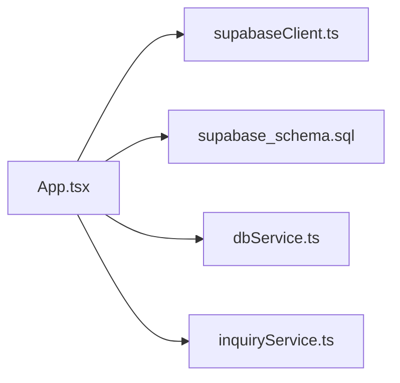

# Order Creation Process

<cite>
**Referenced Files in This Document**
- [App.tsx](file://src/App.tsx)
- [supabaseClient.ts](file://src/supabase/supabaseClient.ts)
- [dbService.ts](file://src/supabase/dbService.ts)
- [inquiryService.ts](file://src/supabase/inquiryService.ts)
- [supabase_schema.sql](file://supabase_schema.sql)
- [SUPABASE.md](file://SUPABASE.md)
</cite>

## Table of Contents
1. [Introduction](#introduction)
2. [Project Structure](#project-structure)
3. [Core Components](#core-components)
4. [Architecture Overview](#architecture-overview)
5. [Detailed Component Analysis](#detailed-component-analysis)
6. [Dependency Analysis](#dependency-analysis)
7. [Performance Considerations](#performance-considerations)
8. [Troubleshooting Guide](#troubleshooting-guide)
9. [Conclusion](#conclusion)
10. [Appendices](#appendices)

## Introduction
This document explains the end-to-end order creation process in the application, from cart initiation to order persistence and post-order state management. It covers:
- How orders are initiated from the shopping cart
- Cart validation and pricing calculations
- Required order data structure and validation rules
- Integration with Supabase for order persistence (escrow and delivery job records)
- Error handling and recovery patterns
- API call examples and user feedback mechanisms during ordering

The implementation is primarily contained within the main application component and Supabase client utilities.

## Project Structure
Key files involved in the order flow:
- Application UI and orchestration: src/App.tsx
- Supabase client configuration: src/supabase/supabaseClient.ts
- Optional database wrapper utility: src/supabase/dbService.ts
- Example service pattern: src/supabase/inquiryService.ts
- Database schema and RLS policies: supabase_schema.sql
- Setup guidance and troubleshooting: SUPABASE.md

**Diagram sources**
- [App.tsx](file://src/App.tsx)
- [supabaseClient.ts](file://src/supabase/supabaseClient.ts)
- [supabase_schema.sql](file://supabase_schema.sql)
- [inquiryService.ts](file://src/supabase/inquiryService.ts)
- [dbService.ts](file://src/supabase/dbService.ts)

**Section sources**
- [App.tsx](file://src/App.tsx)
- [supabaseClient.ts](file://src/supabase/supabaseClient.ts)
- [supabase_schema.sql](file://supabase_schema.sql)
- [SUPABASE.md](file://SUPABASE.md)

## Core Components
- Cart state and operations:
  - Cart items are stored as an array of entries with item details and quantity.
  - Add/remove/clear operations update local state and trigger toast notifications.
- Checkout modal:
  - Collects delivery destination, optional group shipping option, and M-Pesa phone number.
  - Displays subtotal, delivery fee, and total payable amount.
- Order creation handler:
  - Validates inputs, generates a unique order ID and OTP, computes final fee, and persists escrow transaction and delivery job records to Supabase.
  - Updates local state for escrow ledger and delivery fleet, clears cart, and shows success feedback.

**Section sources**
- [App.tsx](file://src/App.tsx)

## Architecture Overview
The order creation flow is orchestrated in the main application component and uses the Supabase client directly for persistence. The sequence below maps to actual code paths in the repository.

**Diagram sources**
- [App.tsx](file://src/App.tsx)
- [supabaseClient.ts](file://src/supabase/supabaseClient.ts)
- [supabase_schema.sql](file://supabase_schema.sql)

## Detailed Component Analysis

### Cart State and Pricing Calculations
- Data model:
  - CartItem includes item reference and quantity.
  - CartTotal is computed by summing price × quantity across all entries.
- Operations:
  - addToCart merges or increments existing entries.
  - removeFromCart decrements or removes entries.
  - clearItemFromCart removes specific items.
- Validation:
  - No explicit availability checks against inventory; availability is not enforced in this flow.
- Pricing:
  - Subtotal = sum(price × quantity).
  - Delivery fee depends on selected route and optional group pooling option.

**Diagram sources**
- [App.tsx](file://src/App.tsx)

**Section sources**
- [App.tsx](file://src/App.tsx)

### Checkout Modal and Input Validation
- Inputs:
  - Delivery destination selection (required).
  - Group pooling toggle (optional).
  - M-Pesa mobile number (required, minimum length check).
- Validation rules:
  - Must be logged in to proceed.
  - Destination must be selected.
  - Phone number must meet minimum length requirement.
- Feedback:
  - Toast messages guide users through missing or invalid inputs.

**Diagram sources**
- [App.tsx](file://src/App.tsx)

**Section sources**
- [App.tsx](file://src/App.tsx)

### Order Creation Handler (Escrow + Delivery Job)
- Steps:
  - Generate orderId and OTP.
  - Compute final fee based on delivery option.
  - Build escrow transaction payload and delivery job payload.
  - Persist both records via Supabase client.
  - On success: update local ledgers, clear cart, show success toast with OTP.
  - On failure: show error toast and stop processing.
- Transaction handling:
  - Two separate insert calls are executed sequentially; there is no explicit database transaction wrapping both inserts.
  - Error recovery is handled at the application level by checking errors and providing user feedback.

**Diagram sources**
- [App.tsx](file://src/App.tsx)
- [supabaseClient.ts](file://src/supabase/supabaseClient.ts)
- [supabase_schema.sql](file://supabase_schema.sql)

**Section sources**
- [App.tsx](file://src/App.tsx)
- [supabaseClient.ts](file://src/supabase/supabaseClient.ts)

### Order Data Structure and Required Fields
- Order identifier:
  - orderId is generated locally as a string prefixed with “ORD-”.
- Customer info:
  - Derived from current user profile and provided phone number.
- Items:
  - Items summary is constructed from cart entries (name and quantity).
- Total amount:
  - Computed as cartTotal plus delivery fee.
- Additional fields:
  - Escrow status defaults to “Holding”.
  - Delivery job status defaults to “Available”.
  - OTP is generated for secure handover verification.

Validation rules applied before persistence:
- Authentication required.
- Delivery destination must be selected.
- Phone number must meet minimum length.

**Section sources**
- [App.tsx](file://src/App.tsx)
- [supabase_schema.sql](file://supabase_schema.sql)

### Supabase Integration and Persistence
- Client configuration:
  - Supabase client is created using environment variables for URL and anon key.
  - Environment validation warns if credentials are missing or misconfigured.
- Direct usage:
  - The order creation handler uses supabase.from(...).insert(...) for both escrow and delivery job tables.
- Alternative wrapper:
  - dbService.ts provides a typed wrapper that normalizes responses and errors.
- Example service pattern:
  - inquiryService.ts demonstrates a simple async function pattern for CRUD operations.

**Diagram sources**
- [supabaseClient.ts](file://src/supabase/supabaseClient.ts)
- [dbService.ts](file://src/supabase/dbService.ts)
- [App.tsx](file://src/App.tsx)

**Section sources**
- [supabaseClient.ts](file://src/supabase/supabaseClient.ts)
- [dbService.ts](file://src/supabase/dbService.ts)
- [inquiryService.ts](file://src/supabase/inquiryService.ts)
- [SUPABASE.md](file://SUPABASE.md)

### Post-Order State Management and User Feedback
- Local state updates:
  - Escrow ledger and delivery fleet lists are updated with new records.
  - Cart is cleared and checkout modal closed.
- User feedback:
  - Toast messages inform about progress, errors, and success outcomes.
  - OTP is displayed to the user for secure handover with the rider.

**Section sources**
- [App.tsx](file://src/App.tsx)

## Dependency Analysis
- UI orchestrates order creation and relies on Supabase client for persistence.
- Schema defines table structures and RLS policies enabling open access for development.
- Optional services and wrappers provide alternative patterns for database interactions.

**Diagram sources**
- [App.tsx](file://src/App.tsx)
- [supabaseClient.ts](file://src/supabase/supabaseClient.ts)
- [supabase_schema.sql](file://supabase_schema.sql)
- [dbService.ts](file://src/supabase/dbService.ts)
- [inquiryService.ts](file://src/supabase/inquiryService.ts)

**Section sources**
- [App.tsx](file://src/App.tsx)
- [supabaseClient.ts](file://src/supabase/supabaseClient.ts)
- [supabase_schema.sql](file://supabase_schema.sql)

## Performance Considerations
- Avoid redundant re-renders by keeping cart computations memoized where possible.
- Batch inserts when creating multiple related records to reduce network overhead.
- Use Supabase RPC functions for complex server-side transactions if needed.
- Ensure environment variables are correctly set to prevent runtime errors and retries.

[No sources needed since this section provides general guidance]

## Troubleshooting Guide
Common issues and resolutions:
- Supabase credentials missing or incorrect:
  - Verify VITE_SUPABASE_URL and VITE_SUPABASE_ANON_KEY in .env.
  - Do not append /rest/v1/ to the URL.
- Query returns null data:
  - Confirm rows exist in Supabase Studio and RLS policies allow access.
- Insert succeeds but SELECT returns nothing:
  - Check RLS policies and ensure primary keys and field names match payloads.
- Error handling:
  - Inspect error objects returned by Supabase and display meaningful messages to users.

**Section sources**
- [SUPABASE.md](file://SUPABASE.md)
- [supabaseClient.ts](file://src/supabase/supabaseClient.ts)

## Conclusion
The order creation process integrates cart validation, pricing calculation, and Supabase persistence for escrow and delivery records. While robust user feedback is implemented, transactional guarantees across multiple inserts are not enforced at the database level. Future enhancements can introduce server-side transactions or RPC functions to ensure atomicity and stronger consistency.

[No sources needed since this section summarizes without analyzing specific files]

## Appendices

### API Call Examples
- Create escrow transaction:
  - Method: POST (via Supabase client insert)
  - Table: escrow_transactions
  - Payload fields: id, order_id, amount, payer, vendor_name, status
- Create delivery job:
  - Method: POST (via Supabase client insert)
  - Table: delivery_jobs
  - Payload fields: id, order_id, destination, fee, status, customer_phone, merchant_name, items_summary, otp, boda_pool_active

**Section sources**
- [App.tsx](file://src/App.tsx)
- [supabase_schema.sql](file://supabase_schema.sql)