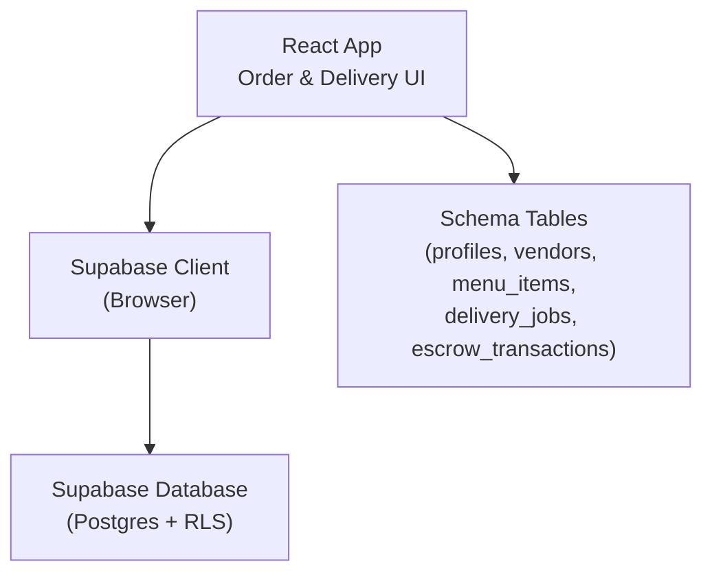
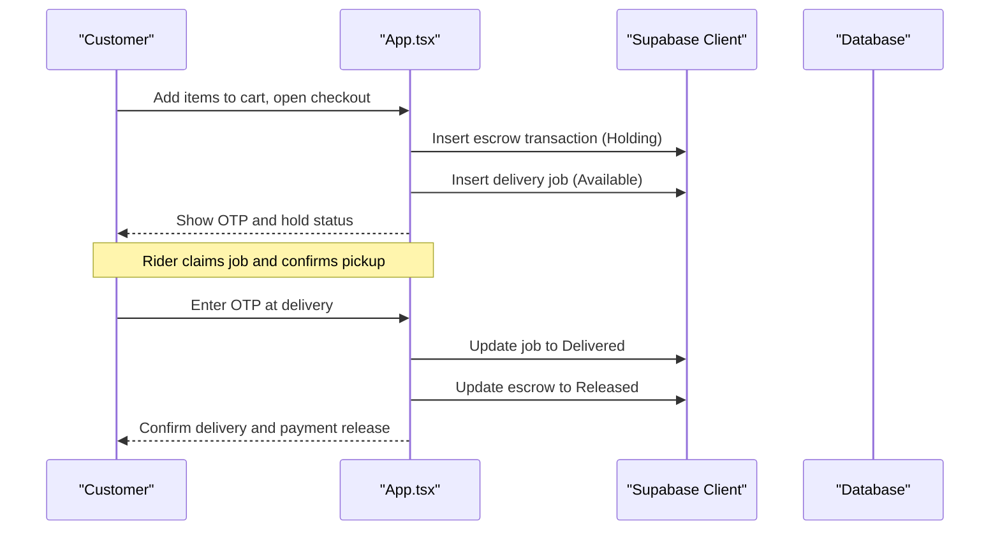
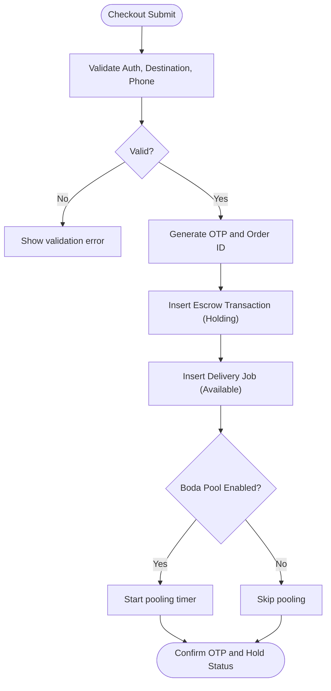
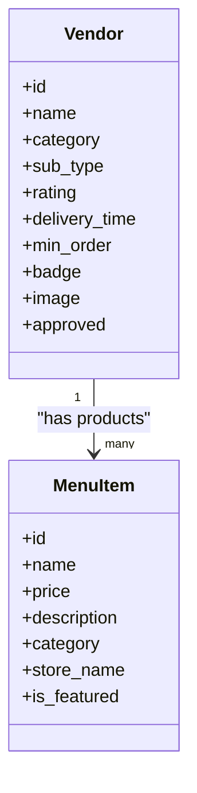
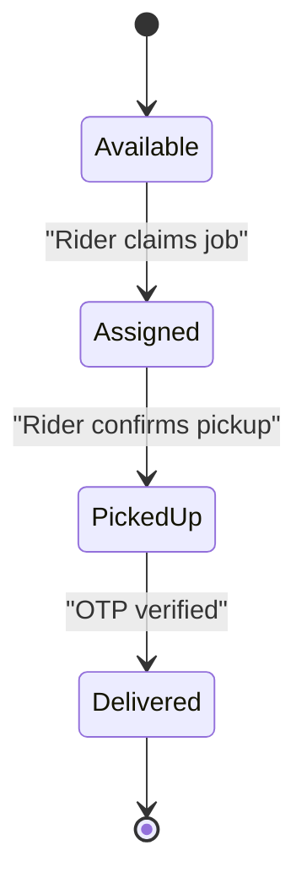
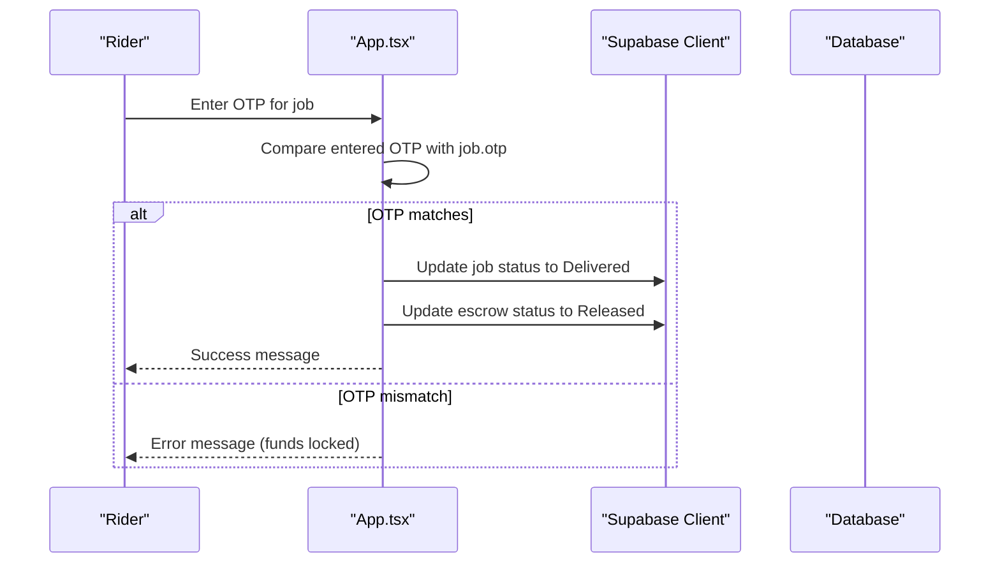
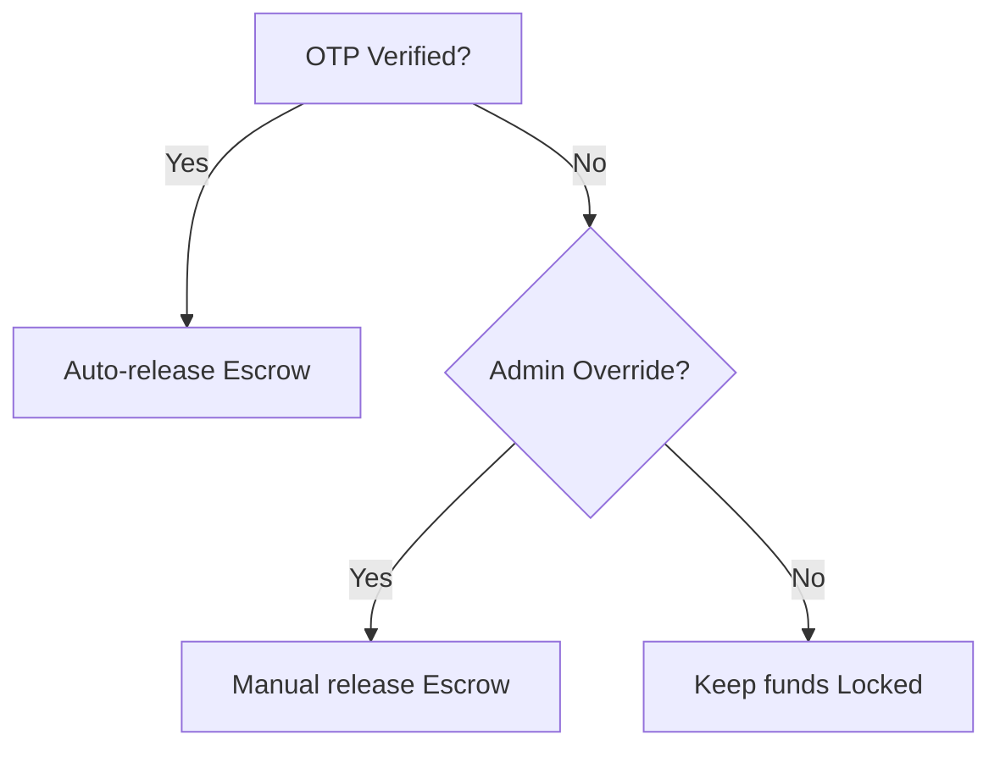
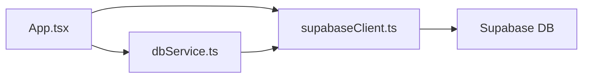

# Order Fulfillment Workflow

<cite>
**Referenced Files in This Document**
- [App.tsx](file://src/App.tsx)
- [supabaseClient.ts](file://src/supabaseClient.ts)
- [dbService.ts](file://src/supabase/dbService.ts)
- [supabase_schema.sql](file://supabase_schema.sql)
- [SUPABASE.md](file://SUPABASE.md)
- [package.json](file://package.json)
</cite>

## Table of Contents
1. [Introduction](#introduction)
2. [Project Structure](#project-structure)
3. [Core Components](#core-components)
4. [Architecture Overview](#architecture-overview)
5. [Detailed Component Analysis](#detailed-component-analysis)
6. [Dependency Analysis](#dependency-analysis)
7. [Performance Considerations](#performance-considerations)
8. [Troubleshooting Guide](#troubleshooting-guide)
9. [Conclusion](#conclusion)

## Introduction
This document explains the end-to-end order fulfillment workflow implemented in the application, from order confirmation through delivery completion. It covers vendor order processing, inventory allocation (via marketplace catalog), preparation steps, rider assignment, OTP-based delivery verification, and escrow release. It also documents error handling patterns and exception management across the fulfillment pipeline.

## Project Structure
The fulfillment logic is primarily implemented in the main React application component with Supabase as the data layer. The schema defines core entities for profiles, vendors, menu items, delivery jobs, and escrow transactions. A lightweight database service wraps Supabase calls to standardize responses.

**Diagram sources**
- [App.tsx:1144-1231](file://src/App.tsx#L1144-L1231)
- [supabaseClient.ts:1-7](file://src/supabaseClient.ts#L1-L7)
- [supabase_schema.sql:44-69](file://supabase_schema.sql#L44-L69)

**Section sources**
- [App.tsx:1-200](file://src/App.tsx#L1-L200)
- [supabase_schema.sql:1-198](file://supabase_schema.sql#L1-L198)
- [SUPABASE.md:1-38](file://SUPABASE.md#L1-L38)

## Core Components
- Order creation and escrow holding: Captures cart, destination, and payment phone; generates a secure OTP; persists escrow transaction and delivery job; initializes optional group pooling window.
- Rider dispatch and lifecycle: Riders claim available jobs, confirm pickup, and complete delivery via OTP verification.
- Escrow release: Funds are released to the vendor upon successful OTP handshake or admin override.
- Data models: Profiles, vendors, menu items, delivery jobs, escrow transactions, inquiries, approvals, and governance tables.

Key responsibilities:
- Cart and checkout orchestration: [App.tsx:1144-1231]
- Job state transitions (Available → Assigned → Picked Up → Delivered): [App.tsx:1594-1651]
- OTP generation and verification: [App.tsx:20-21], [App.tsx:1624-1651]
- Escrow ledger updates: [App.tsx:1144-1231], [App.tsx:1514-1533], [App.tsx:1624-1651]

**Section sources**
- [App.tsx:1144-1231](file://src/App.tsx#L1144-L1231)
- [App.tsx:1594-1651](file://src/App.tsx#L1594-L1651)
- [App.tsx:1514-1533](file://src/App.tsx#L1514-L1533)
- [supabase_schema.sql:44-69](file://supabase_schema.sql#L44-L69)

## Architecture Overview
The fulfillment flow integrates UI actions, client-side state, and Supabase persistence. The app initializes baseline data, manages user sessions, and exposes dashboards for customer, vendor, rider, and admin roles.

**Diagram sources**
- [App.tsx:1144-1231](file://src/App.tsx#L1144-L1231)
- [App.tsx:1594-1651](file://src/App.tsx#L1594-L1651)
- [supabase_schema.sql:44-69](file://supabase_schema.sql#L44-L69)

## Detailed Component Analysis

### Order Confirmation and Escrow Holding
- Validates user authentication, delivery route selection, and M-Pesa phone number.
- Generates a unique order ID and a secure OTP.
- Persists an escrow transaction with amount (items subtotal + delivery fee) and sets status to Holding.
- Creates a delivery job with status Available, including merchant name, items summary, destination, fee, and OTP.
- Optionally starts a Boda Pooling window for shared delivery cost.

**Diagram sources**
- [App.tsx:1144-1231](file://src/App.tsx#L1144-L1231)

**Section sources**
- [App.tsx:1144-1231](file://src/App.tsx#L1144-L1231)

### Vendor Order Processing and Inventory Allocation
- Vendors are represented by the vendors table; their products are listed in menu_items.
- On app load, baseline vendors and menu items are seeded if none exist.
- Admin can approve vendor requests and ban stores; banned stores are excluded from the catalog.
- Inventory allocation is implicit: orders reference menu items and store names; no explicit stock fields are present in the schema.

**Diagram sources**
- [supabase_schema.sql:71-96](file://supabase_schema.sql#L71-L96)

**Section sources**
- [App.tsx:348-408](file://src/App.tsx#L348-L408)
- [supabase_schema.sql:71-96](file://supabase_schema.sql#L71-L96)

### Rider Assignment and Preparation Steps
- Riders claim available jobs; job status transitions to Assigned with rider name recorded.
- After claiming, riders confirm pickup; job status becomes Picked Up and OTP verification is enabled.
- No automated routing algorithm is implemented; assignment is manual via claim action.

**Diagram sources**
- [App.tsx:1594-1622](file://src/App.tsx#L1594-L1622)

**Section sources**
- [App.tsx:1594-1622](file://src/App.tsx#L1594-L1622)

### OTP Verification and Proof of Delivery
- OTP is generated during checkout and stored on the delivery job.
- At delivery, the rider enters the OTP provided by the customer; verification updates the job to Delivered and releases escrow funds.
- If OTP mismatches, funds remain locked and an error toast is shown.

**Diagram sources**
- [App.tsx:1624-1651](file://src/App.tsx#L1624-L1651)

**Section sources**
- [App.tsx:1624-1651](file://src/App.tsx#L1624-L1651)

### Escrow Release and Admin Override
- Successful OTP verification triggers automatic escrow release.
- Admin can manually release escrow for any order regardless of OTP status.

**Diagram sources**
- [App.tsx:1514-1533](file://src/App.tsx#L1514-L1533)
- [App.tsx:1624-1651](file://src/App.tsx#L1624-L1651)

**Section sources**
- [App.tsx:1514-1533](file://src/App.tsx#L1514-L1533)
- [App.tsx:1624-1651](file://src/App.tsx#L1624-L1651)

### Real-time Tracking Integration
- The current implementation does not include real-time tracking (e.g., live location streaming).
- Job states provide basic visibility into fulfillment progress (Available, Assigned, Picked Up, Delivered).

[No sources needed since this section provides general guidance based on observed behavior]

### Customer Satisfaction Collection
- There is no explicit post-delivery satisfaction survey in the codebase.
- Support inquiries and admin replies are available for issue resolution and feedback capture.

**Section sources**
- [App.tsx:1038-1142](file://src/App.tsx#L1038-L1142)

## Dependency Analysis
- UI components depend on Supabase client for all data operations.
- dbService provides a typed wrapper around Supabase queries, normalizing responses.
- Schema enforces RLS policies for broad access during development.

**Diagram sources**
- [App.tsx:1-200](file://src/App.tsx#L1-L200)
- [supabaseClient.ts:1-7](file://src/supabaseClient.ts#L1-L7)
- [dbService.ts:1-24](file://src/supabase/dbService.ts#L1-L24)

**Section sources**
- [package.json:12-28](file://package.json#L12-L28)
- [dbService.ts:1-24](file://src/supabase/dbService.ts#L1-L24)

## Performance Considerations
- Initial data seeding occurs on app mount; consider lazy loading or pagination for large catalogs.
- Batch inserts are used for baseline data; avoid excessive re-renders by minimizing state updates.
- Use Supabase indexes on frequently queried columns (e.g., order_id, status) to improve performance.

[No sources needed since this section provides general guidance]

## Troubleshooting Guide
- Common Supabase issues:
  - Query returns null data: verify RLS policies and table permissions.
  - Incorrect environment variables: ensure correct Supabase URL and anon key.
- Debugging tips:
  - Log effective env values at runtime.
  - Confirm rows exist using Supabase Studio or psql.
- Error handling patterns:
  - Toast notifications for user-facing errors.
  - Console logs for backend/database errors.

**Section sources**
- [SUPABASE.md:14-33](file://SUPABASE.md#L14-L33)
- [App.tsx:1144-1231](file://src/App.tsx#L1144-L1231)
- [App.tsx:1594-1651](file://src/App.tsx#L1594-L1651)

## Conclusion
The fulfillment pipeline implements a robust, OTP-driven delivery confirmation with escrow protection. While advanced features like route optimization and real-time tracking are not present, the system provides clear state transitions, secure payment holding, and administrative controls. Future enhancements could include automated rider assignment algorithms, live tracking integration, and post-delivery satisfaction surveys.