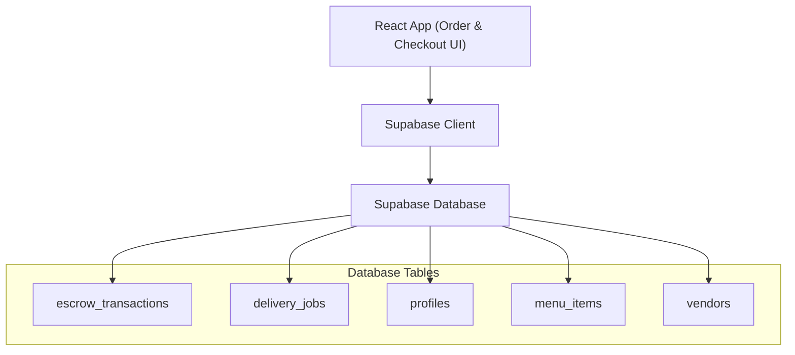
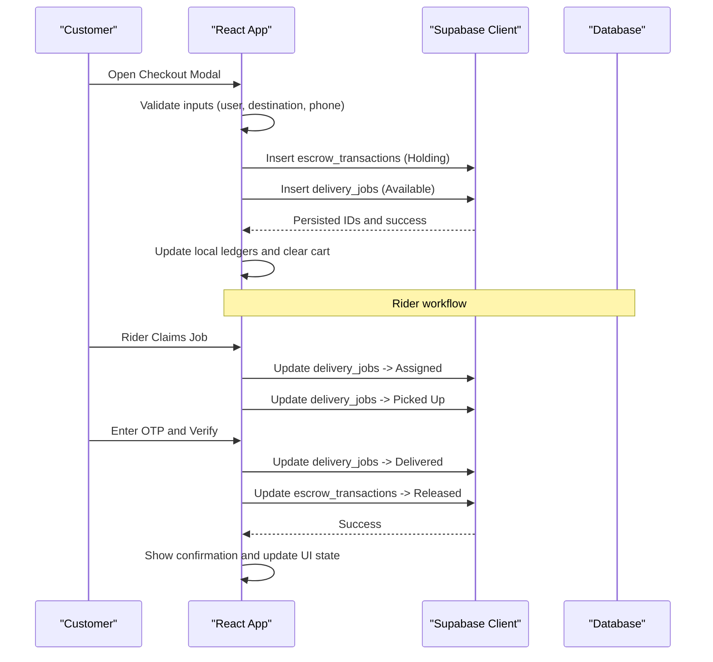
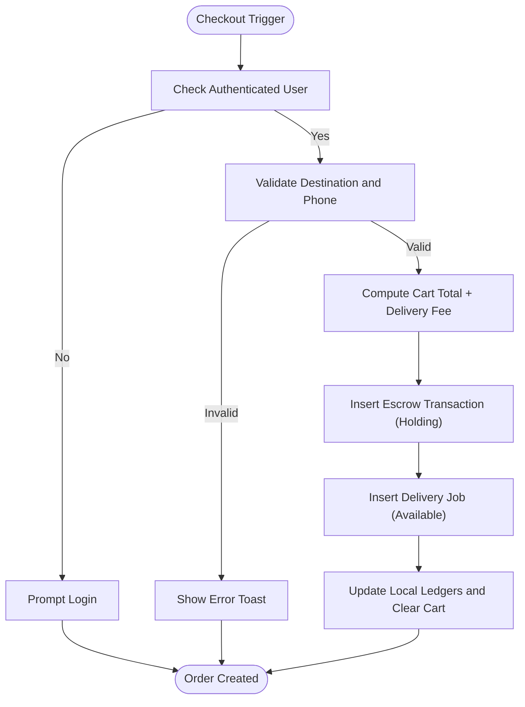
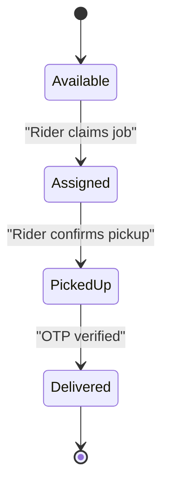
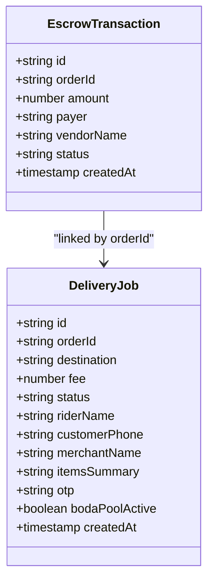
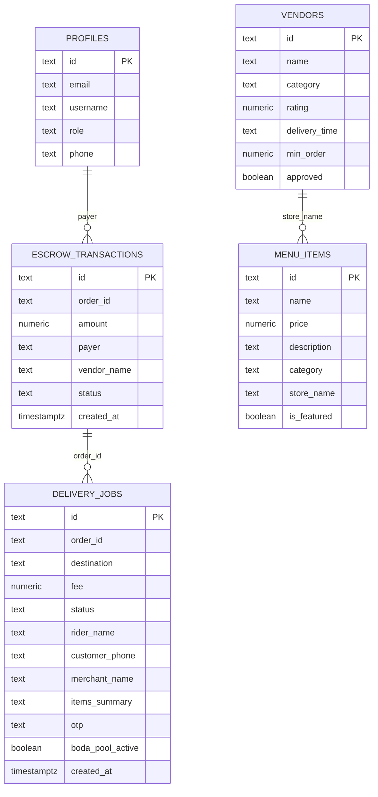
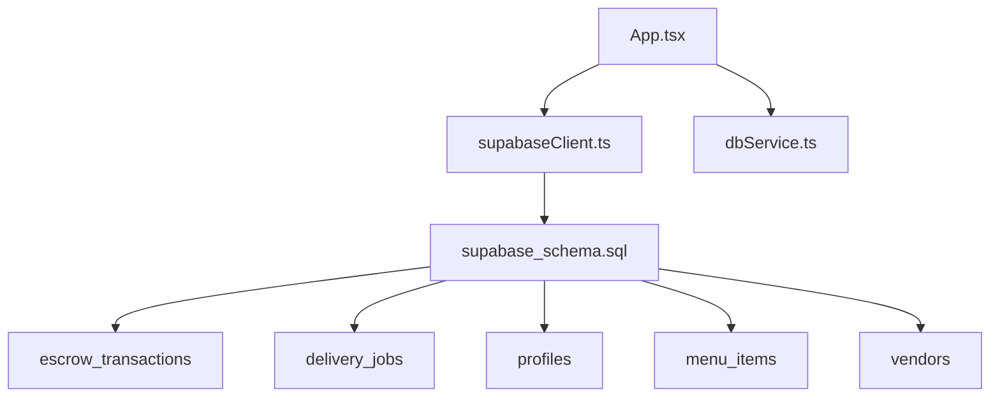

# Order Lifecycle Management

<cite>
**Referenced Files in This Document**
- [App.tsx](file://src/App.tsx)
- [supabase_schema.sql](file://supabase_schema.sql)
- [supabaseClient.ts](file://src/supabaseClient.ts)
- [dbService.ts](file://src/supabase/dbService.ts)
</cite>

## Table of Contents
1. Introduction
2. Project Structure
3. Core Components
4. Architecture Overview
5. Detailed Component Analysis
6. Dependency Analysis
7. Performance Considerations
8. Troubleshooting Guide
9. Conclusion

## Introduction
This document explains the order lifecycle management implemented in the application, covering the flow from cart creation through fulfillment. It details order status transitions, validation rules, state management, pricing calculations, and audit trails. The current implementation models orders using escrow transactions and delivery jobs, with a secure OTP-based handoff between rider and customer to release funds.

Note: The platform does not implement a dedicated “orders” table or explicit order states like Pending/Confirmed/Processing/Shipped/Delivered/Cancelled. Instead, it uses escrow_transactions (Holding/Released/Refunded) and delivery_jobs (Available/Assigned/Picked Up/Delivered) to represent order progress and payment status. Cancellation and refund flows are not present in the codebase; refunds would require additional logic.

## Project Structure
The order-related functionality is primarily implemented in the main React component and persisted via Supabase tables defined in the schema file. A shared Supabase client and a lightweight database wrapper service are used for data access.

**Diagram sources**
- [supabase_schema.sql:44-69](file://supabase_schema.sql#L44-L69)
- [supabaseClient.ts:1-7](file://src/supabaseClient.ts#L1-L7)

**Section sources**
- [supabase_schema.sql:44-69](file://supabase_schema.sql#L44-L69)
- [supabaseClient.ts:1-7](file://src/supabaseClient.ts#L1-L7)

## Core Components
- Cart and Pricing:
  - Cart items are stored locally with quantities and item prices.
  - Total price is computed as sum of item price multiplied by quantity.
  - Delivery fee is added based on selected route and optional group pooling option.

- Order Creation:
  - On checkout, an order ID is generated, an OTP is created for secure handoff, and two records are inserted:
    - escrow_transactions: amount includes cart total plus delivery fee; status set to Holding.
    - delivery_jobs: initial status Available, with destination, merchant, items summary, and OTP.

- Delivery Workflow:
  - Rider claims job (status Assigned), confirms pickup (Picked Up), then verifies OTP to mark Delivered.
  - Upon successful OTP verification, escrow transaction status updates to Released.

- Audit Trail:
  - Escrow ledger entries include payer, vendor name, amount, and timestamps, providing an audit trail for payments.

- Validation Rules:
  - Requires authenticated user before checkout.
  - Requires valid delivery destination and mobile number.
  - OTP must match exactly to complete delivery and release funds.

**Section sources**
- [App.tsx:661-686](file://src/App.tsx#L661-L686)
- [App.tsx:1144-1231](file://src/App.tsx#L1144-L1231)
- [App.tsx:1594-1651](file://src/App.tsx#L1594-L1651)

## Architecture Overview
The order lifecycle spans UI interactions, local state updates, and persistent storage via Supabase. The sequence below shows the end-to-end flow from checkout to delivery completion.

**Diagram sources**
- [App.tsx:1144-1231](file://src/App.tsx#L1144-L1231)
- [App.tsx:1594-1651](file://src/App.tsx#L1594-L1651)
- [supabase_schema.sql:44-69](file://supabase_schema.sql#L44-L69)

## Detailed Component Analysis

### Order Creation and Pricing Calculation
- Inputs validated:
  - User must be authenticated.
  - Delivery destination must be selected.
  - Mobile number must be provided and meet length requirements.
- Pricing:
  - Cart subtotal computed from items and quantities.
  - Delivery fee determined by route selection and optional group pooling toggle.
  - Final amount = cart subtotal + delivery fee.
- Persistence:
  - Creates escrow_transactions record with Holding status.
  - Creates delivery_jobs record with Available status and OTP.

**Diagram sources**
- [App.tsx:1144-1231](file://src/App.tsx#L1144-L1231)

**Section sources**
- [App.tsx:1144-1231](file://src/App.tsx#L1144-L1231)

### Delivery Job State Transitions
- States:
  - Available: New job posted after order creation.
  - Assigned: Rider claims the job.
  - Picked Up: Rider confirms pickup at merchant location.
  - Delivered: OTP verified successfully; payment released.
- Actions:
  - Claim job updates status to Assigned and sets rider name.
  - Confirm pickup updates status to Picked Up.
  - OTP verification updates delivery status to Delivered and escrow to Released.

**Diagram sources**
- [App.tsx:1594-1651](file://src/App.tsx#L1594-L1651)

**Section sources**
- [App.tsx:1594-1651](file://src/App.tsx#L1594-L1651)

### Payment Escrow and Audit Trail
- Escrow statuses:
  - Holding: Funds held until delivery confirmed.
  - Released: Funds transferred to vendor upon successful delivery.
  - Refunded: Not implemented in current code; would require additional logic.
- Audit fields:
  - Order ID, payer, vendor name, amount, timestamp provide traceability.

**Diagram sources**
- [supabase_schema.sql:44-69](file://supabase_schema.sql#L44-L69)

**Section sources**
- [supabase_schema.sql:44-69](file://supabase_schema.sql#L44-L69)

### Data Models and Relationships
- Key tables involved in order lifecycle:
  - escrow_transactions: payment holding and release tracking.
  - delivery_jobs: logistics and OTP handshake.
  - profiles: user identity and role.
  - menu_items: product catalog and pricing.
  - vendors: merchant information.

**Diagram sources**
- [supabase_schema.sql:8-96](file://supabase_schema.sql#L8-L96)

**Section sources**
- [supabase_schema.sql:8-96](file://supabase_schema.sql#L8-L96)

### Order Modification and Cancellation Workflows
- Current capabilities:
  - Cart modification (add/remove/clear items) before checkout.
  - No post-checkout order modification is implemented.
- Cancellation:
  - No cancellation flow exists in the codebase.
  - Refund processing is not implemented; escrow only supports Holding and Released states.
- Recommendations:
  - Add order status transitions (Pending, Confirmed, Processing, Shipped, Delivered, Cancelled).
  - Implement cancellation endpoints that revert escrow to Refunded and update delivery job accordingly.
  - Introduce inventory reservation/release logic tied to order states.

**Section sources**
- [App.tsx:661-686](file://src/App.tsx#L661-L686)
- [supabase_schema.sql:44-69](file://supabase_schema.sql#L44-L69)

### Inventory Updates
- Current behavior:
  - No inventory reservation or decrement logic is implemented during order creation.
- Recommendations:
  - Add inventory table and enforce stock checks before checkout.
  - Reserve inventory on order confirmation and release on cancellation/refund.
  - Decrement inventory on delivery completion.

**Section sources**
- [supabase_schema.sql:86-96](file://supabase_schema.sql#L86-L96)

## Dependency Analysis
- UI layer depends on Supabase client for all data operations.
- Database schema defines relationships between escrow transactions and delivery jobs via order_id.
- Profiles link to escrow transactions via payer field.
- Menu items and vendors are referenced in delivery jobs and escrow records for merchant context.

**Diagram sources**
- [App.tsx:1144-1231](file://src/App.tsx#L1144-L1231)
- [supabaseClient.ts:1-7](file://src/supabaseClient.ts#L1-L7)
- [supabase_schema.sql:44-69](file://supabase_schema.sql#L44-L69)

**Section sources**
- [App.tsx:1144-1231](file://src/App.tsx#L1144-L1231)
- [supabaseClient.ts:1-7](file://src/supabaseClient.ts#L1-L7)
- [supabase_schema.sql:44-69](file://supabase_schema.sql#L44-L69)

## Performance Considerations
- Use batch inserts where possible to reduce network calls.
- Avoid unnecessary re-renders by memoizing derived values (already used for cart totals and filtered items).
- Consider optimistic UI updates with rollback on failure for better UX.
- Index frequently queried fields such as order_id, status, and created_at for faster lookups.

[No sources needed since this section provides general guidance]

## Troubleshooting Guide
- Common issues:
  - RLS policies blocking inserts/selects: ensure proper policies for anon/authenticated roles.
  - Incorrect Supabase URL configuration: verify environment variables and client initialization.
  - Empty results after insert: check primary keys and field names match schema.
- Debugging steps:
  - Log effective environment values at runtime.
  - Inspect Supabase Studio for row existence and policy enforcement.
  - Temporarily allow open policies during development, then tighten for production.

**Section sources**
- [SUPABASE.md:14-28](file://SUPABASE.md#L14-L28)

## Conclusion
The application implements a robust order lifecycle centered around escrow transactions and delivery jobs, with secure OTP-based handoff ensuring reliable fund release upon delivery. While core flows for order creation and fulfillment are present, enhancements are recommended to support full order state transitions, cancellation/refund workflows, and inventory management. Adopting these improvements will strengthen consistency, auditability, and operational control across the marketplace.

[No sources needed since this section summarizes without analyzing specific files]