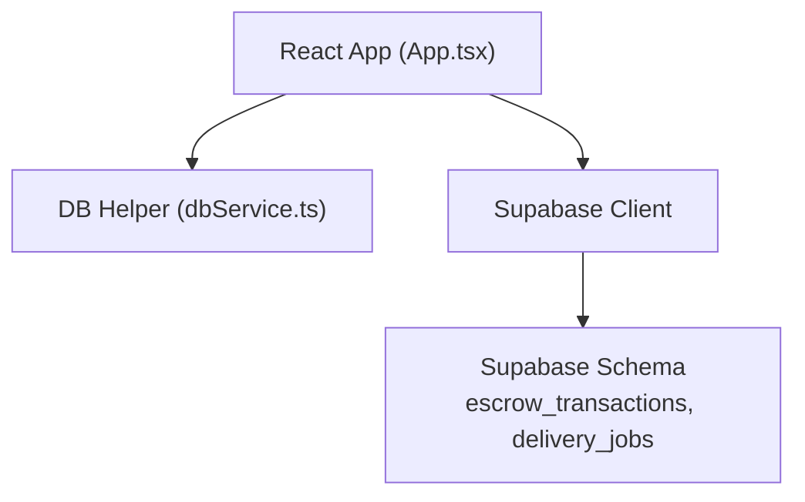
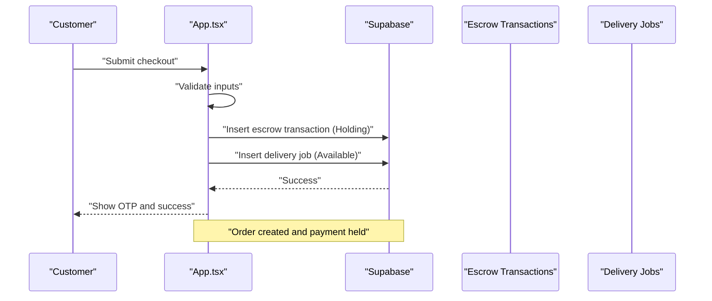
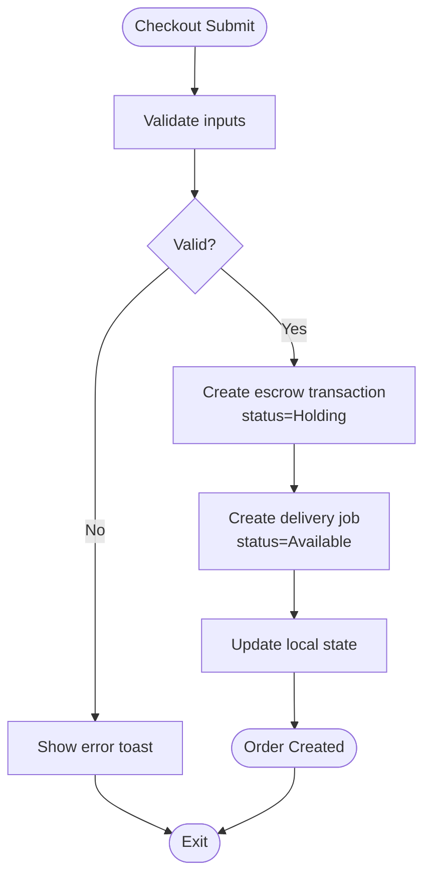
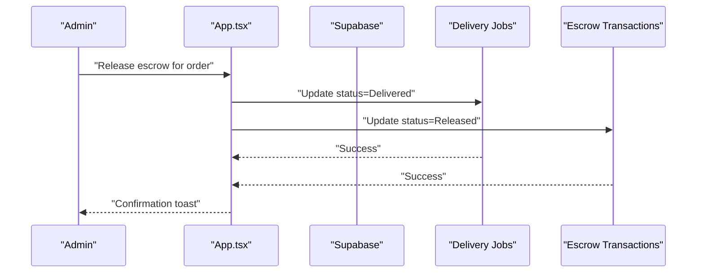
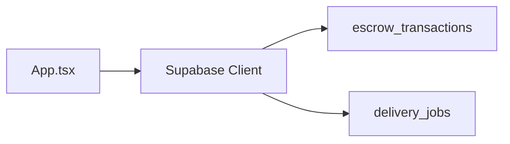

# Order Modification & Cancellation

<cite>
**Referenced Files in This Document**
- [App.tsx](file://src/App.tsx)
- [supabase_schema.sql](file://supabase_schema.sql)
- [dbService.ts](file://src/supabase/dbService.ts)
</cite>

## Table of Contents
1. Introduction
2. Project Structure
3. Core Components
4. Architecture Overview
5. Detailed Component Analysis
6. Dependency Analysis
7. Performance Considerations
8. Troubleshooting Guide
9. Conclusion

## Introduction
This document specifies the order modification and cancellation workflows for the platform, grounded in the current codebase. It explains which modifications are allowed at different stages (item quantity changes, delivery address updates, special instructions), outlines cancellation policies, refund processing, inventory restoration, approval workflows, user permissions, audit logging, and provides example API patterns and conflict resolution strategies when orders are already being processed.

## Project Structure
The application is a React + TypeScript frontend that interacts with Supabase via direct client calls and a small shared database helper. The schema defines core entities such as escrow transactions and delivery jobs, which represent orders and their fulfillment state.

**Diagram sources**
- [App.tsx:1144-1231](file://src/App.tsx#L1144-L1231)
- [dbService.ts:1-24](file://src/supabase/dbService.ts#L1-L24)
- [supabase_schema.sql:44-69](file://supabase_schema.sql#L44-L69)

**Section sources**
- [App.tsx:1144-1231](file://src/App.tsx#L1144-L1231)
- [supabase_schema.sql:44-69](file://supabase_schema.sql#L44-L69)

## Core Components
- Order creation flow: The checkout triggers an escrow payment hold and creates both an escrow transaction and a delivery job record.
- Escrow ledger: Tracks order payments in Holding, Released, or Refunded states.
- Delivery jobs: Track order fulfillment status from Available to Assigned, Picked Up, Delivered.
- Admin release: An admin action can mark a delivery job as Delivered and release escrow funds.

Key implementation references:
- Checkout and escrow creation: [App.tsx:1144-1231](file://src/App.tsx#L1144-L1231)
- Admin release of escrow: [App.tsx:1514-1533](file://src/App.tsx#L1514-L1533)
- Data model definitions: [supabase_schema.sql:44-69](file://supabase_schema.sql#L44-L69)

**Section sources**
- [App.tsx:1144-1231](file://src/App.tsx#L1144-L1231)
- [App.tsx:1514-1533](file://src/App.tsx#L1514-L1533)
- [supabase_schema.sql:44-69](file://supabase_schema.sql#L44-L69)

## Architecture Overview
Order lifecycle in the current system:
- Customer initiates checkout; app validates inputs and simulates STK prompt.
- App inserts escrow transaction (status: Holding) and delivery job (status: Available).
- Rider assignment and delivery progress update delivery job status.
- Admin marks delivery as Delivered and releases escrow to Released.

**Diagram sources**
- [App.tsx:1144-1231](file://src/App.tsx#L1144-L1231)
- [supabase_schema.sql:44-69](file://supabase_schema.sql#L44-L69)

## Detailed Component Analysis

### Order Creation Flow
- Inputs validated include delivery route selection and customer phone number.
- On success, two records are created:
  - escrow_transactions: orderId, amount, payer, vendor_name, status=Holding
  - delivery_jobs: orderId, destination, fee, status=Available, otp, items_summary
- UI updates reflect new escrow entry and delivery job.

**Diagram sources**
- [App.tsx:1144-1231](file://src/App.tsx#L1144-L1231)

**Section sources**
- [App.tsx:1144-1231](file://src/App.tsx#L1144-L1231)

### Escrow Release Flow
- Admin action sets delivery job status to Delivered and escrow transaction status to Released.
- Local state updates reflect these changes.

**Diagram sources**
- [App.tsx:1514-1533](file://src/App.tsx#L1514-L1533)
- [supabase_schema.sql:44-69](file://supabase_schema.sql#L44-L69)

**Section sources**
- [App.tsx:1514-1533](file://src/App.tsx#L1514-L1533)

### Allowed Modifications by Stage
- Pre-checkout (cart stage):
  - Item quantity changes: supported via addToCart/removeFromCart/clearItemFromCart.
  - Delivery address updates: not part of cart; address is selected at checkout.
  - Special instructions: captured via profile pickup notes and delivery point fields.
- Post-checkout (order placed, escrow Holding, delivery job Available):
  - Item quantity changes: not implemented in current code; would require backend logic and policy checks.
  - Delivery address updates: not implemented; would require updating delivery_jobs.destination and revalidation.
  - Special instructions: could be appended to delivery_jobs.items_summary or a dedicated field if added.
- In-transit (delivery job Assigned/Picked Up):
  - Modifications should be blocked or require explicit admin override due to operational constraints.
- Delivered:
  - No modifications; only post-delivery support actions (e.g., refunds) may apply.

Note: These allowances are based on current implementation gaps and data models.

**Section sources**
- [App.tsx:665-686](file://src/App.tsx#L665-L686)
- [App.tsx:1144-1231](file://src/App.tsx#L1144-L1231)
- [supabase_schema.sql:56-69](file://supabase_schema.sql#L56-L69)

### Cancellation Policies
- Current code does not implement a cancellation endpoint or workflow.
- Policy recommendation:
  - Allow cancellation while escrow is Holding and delivery job is Available.
  - Block cancellation once delivery job transitions to Assigned or Picked Up without admin override.
  - On approved cancellation, set escrow status to Refunded and delivery job status to Cancelled.

**Section sources**
- [supabase_schema.sql:44-69](file://supabase_schema.sql#L44-L69)

### Refund Processing
- Not implemented in current code.
- Recommended approach:
  - Add a refund handler that updates escrow_transactions.status to Refunded.
  - Ensure delivery_jobs reflects cancellation or reversal where applicable.
  - Emit audit logs and notifications to stakeholders.

**Section sources**
- [supabase_schema.sql:44-69](file://supabase_schema.sql#L44-L69)

### Inventory Restoration
- Not implemented in current code.
- Recommended approach:
  - Maintain a separate inventory table linked to menu_items.
  - On cancellation, restore reserved quantities back to available stock.
  - Record inventory adjustments in an audit log.

[No sources needed since this section proposes future enhancements]

### Approval Workflows and User Permissions
- Current RLS policies grant broad access across tables; role-based restrictions are not enforced at the database level.
- Recommendation:
  - Implement Row Level Security policies to restrict modification and cancellation to authorized roles (admin, vendor for own orders, rider for delivery updates).
  - Enforce business rules via Supabase Edge Functions or stored procedures.

**Section sources**
- [supabase_schema.sql:167-198](file://supabase_schema.sql#L167-L198)

### Audit Logging
- Timestamps exist in created_at columns; no dedicated audit table is present.
- Recommendation:
  - Create an order_audit_log table capturing actor, action, before/after snapshots, and timestamps.
  - Log all modification and cancellation attempts, including denials.

**Section sources**
- [supabase_schema.sql:44-69](file://supabase_schema.sql#L44-L69)

### Example APIs and Handlers
- Order creation (current):
  - POST /checkout -> triggerMpesaEscrow() in App.tsx creates escrow and delivery job.
- Modification API (proposed):
  - PATCH /orders/{orderId}/modify -> validate stage, apply allowed changes, update delivery_jobs and/or escrow_transactions, log audit.
- Cancellation handler (proposed):
  - POST /orders/{orderId}/cancel -> check stage, update statuses, emit notifications, log audit.

Implementation references:
- Checkout handler: [App.tsx:1144-1231](file://src/App.tsx#L1144-L1231)
- DB helper pattern: [dbService.ts:13-21](file://src/supabase/dbService.ts#L13-L21)

**Section sources**
- [App.tsx:1144-1231](file://src/App.tsx#L1144-L1231)
- [dbService.ts:13-21](file://src/supabase/dbService.ts#L13-L21)

### Conflict Resolution Strategies
- When orders are already being processed:
  - Use optimistic concurrency control with versioning or lock tokens.
  - Apply server-side guards to prevent conflicting updates (e.g., reject modifications if delivery job status is Assigned/Picked Up).
  - Provide clear error messages and fallback actions (e.g., escalate to admin).

[No sources needed since this section provides general guidance]

## Dependency Analysis
The order-related flows depend on:
- React state management in App.tsx for UI and orchestration.
- Supabase client for data operations.
- Database schema defining escrow and delivery entities.

**Diagram sources**
- [App.tsx:1144-1231](file://src/App.tsx#L1144-L1231)
- [supabase_schema.sql:44-69](file://supabase_schema.sql#L44-L69)

**Section sources**
- [App.tsx:1144-1231](file://src/App.tsx#L1144-L1231)
- [supabase_schema.sql:44-69](file://supabase_schema.sql#L44-L69)

## Performance Considerations
- Batch writes: Combine related updates (e.g., escrow and delivery job) into a single transaction to reduce latency and ensure consistency.
- Indexing: Ensure indexes on frequently queried columns like order_id and status for fast lookups during modifications and cancellations.
- Concurrency: Avoid unnecessary re-renders by minimizing state updates and using memoization where appropriate.

[No sources needed since this section provides general guidance]

## Troubleshooting Guide
Common issues and resolutions:
- Validation failures during checkout: Ensure delivery route and phone number are provided; check error toasts and input bindings.
- Database write errors: Inspect Supabase error responses; verify RLS policies and permissions.
- State inconsistencies: Refresh local state after successful writes; reconcile with server data.

Relevant references:
- Error handling wrapper: [dbService.ts:5-11](file://src/supabase/dbService.ts#L5-L11)
- Checkout validation and error toasts: [App.tsx:1144-1160](file://src/App.tsx#L1144-L1160)

**Section sources**
- [dbService.ts:5-11](file://src/supabase/dbService.ts#L5-L11)
- [App.tsx:1144-1160](file://src/App.tsx#L1144-L1160)

## Conclusion
The current codebase implements order creation and escrow holding with delivery job tracking but lacks explicit modification and cancellation workflows. To enable robust order modifications and cancellations, implement stage-gated validations, role-based approvals, audit logging, and refund/inventory restoration processes. Introduce server-side guards and concurrency controls to handle conflicts when orders are already being processed.

[No sources needed since this section summarizes without analyzing specific files]