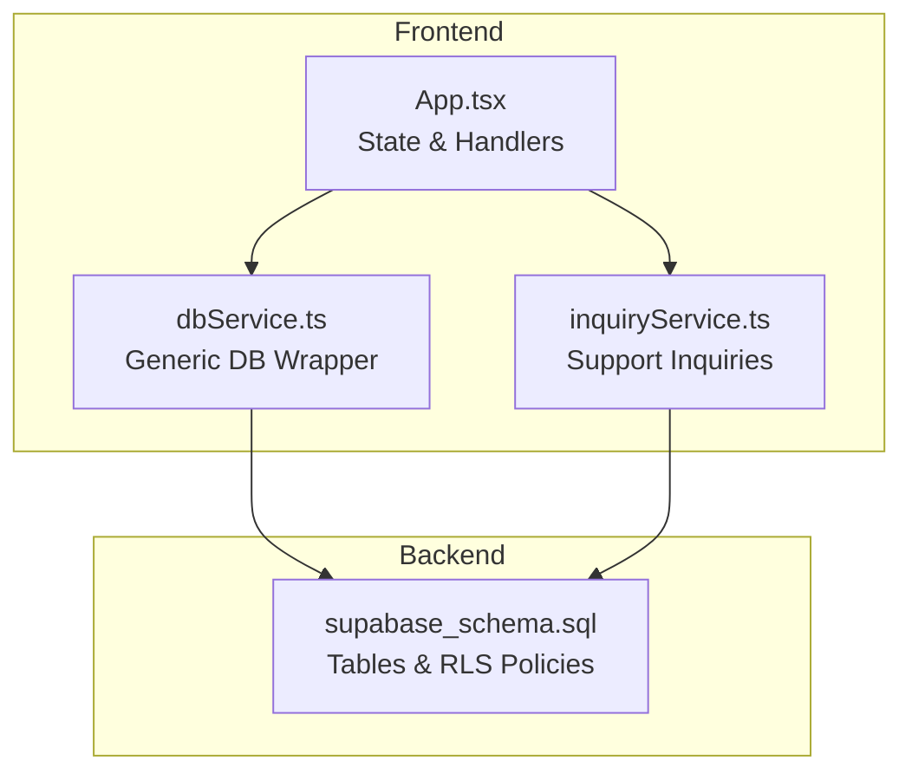
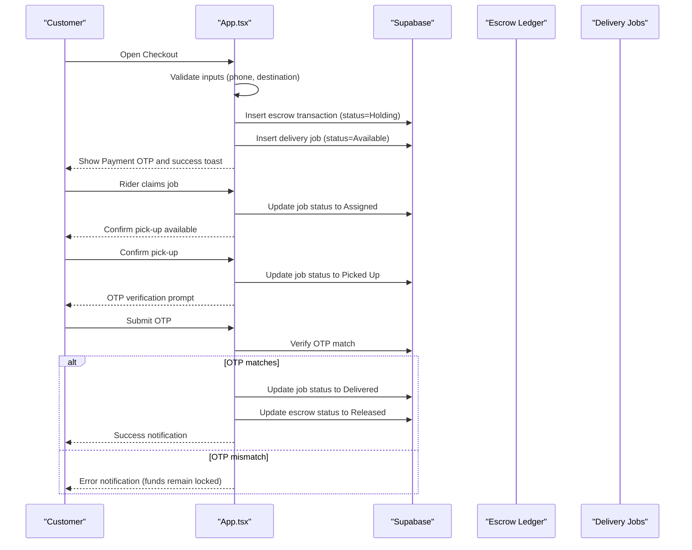
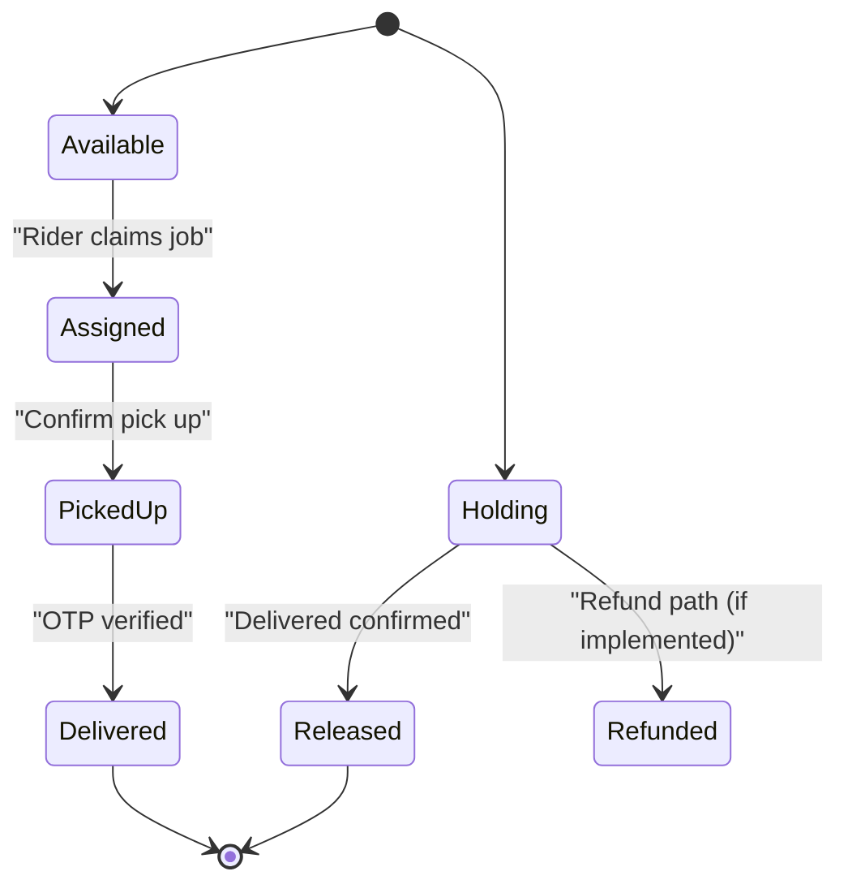
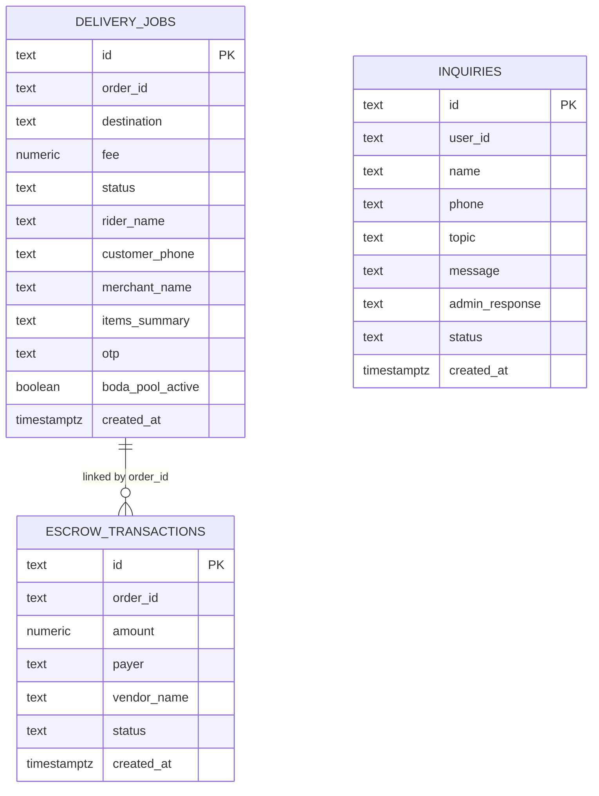
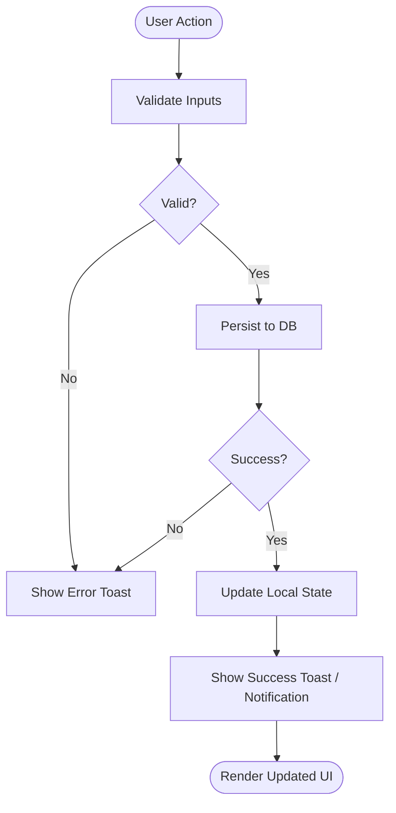
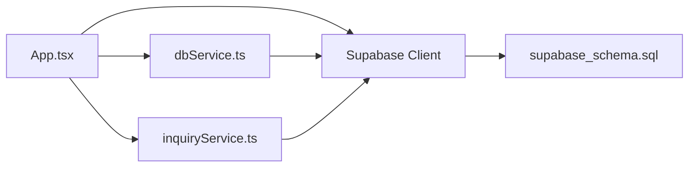

# Order Status Management

<cite>
**Referenced Files in This Document**
- [supabase_schema.sql](file://supabase_schema.sql)
- [App.tsx](file://src/App.tsx)
- [dbService.ts](file://src/supabase/dbService.ts)
- [inquiryService.ts](file://src/supabase/inquiryService.ts)
</cite>

## Table of Contents
1. Introduction
2. Project Structure
3. Core Components
4. Architecture Overview
5. Detailed Component Analysis
6. Dependency Analysis
7. Performance Considerations
8. Troubleshooting Guide
9. Conclusion
10. Appendices

## Introduction
This document explains the order status management system implemented in the application. It covers:
- The lifecycle and transitions of order statuses
- Business rules and validation governing state changes
- Real-time UI synchronization and notifications
- Database schema for orders, delivery jobs, escrow transactions, and audit trails
- Code references for transition functions and event handlers

Note: The current implementation models order fulfillment through delivery job states and an escrow ledger. A dedicated “orders” table is not present; instead, orders are represented by generated IDs and tracked via delivery_jobs and escrow_transactions.

## Project Structure
The order flow spans three layers:
- Frontend orchestration (React app): user actions, local state, and Supabase calls
- Data access utilities: generic DB wrapper and client configuration
- Backend persistence: Supabase Postgres tables and policies

**Diagram sources**
- [App.tsx](file://src/App.tsx)
- [dbService.ts](file://src/supabase/dbService.ts)
- [inquiryService.ts](file://src/supabase/inquiryService.ts)
- [supabase_schema.sql](file://supabase_schema.sql)

**Section sources**
- [supabase_schema.sql](file://supabase_schema.sql)
- [App.tsx](file://src/App.tsx)
- [dbService.ts](file://src/supabase/dbService.ts)
- [inquiryService.ts](file://src/supabase/inquiryService.ts)

## Core Components
- Delivery Jobs: represent the operational state of an order’s fulfillment (Available → Assigned → Picked Up → Delivered).
- Escrow Transactions: represent payment holding and release tied to an order_id.
- Support Inquiries: customer support tickets with status Pending/Answered.
- Generic DB Service: a typed wrapper around Supabase queries used across the app.

Key responsibilities:
- App.tsx orchestrates checkout, creates orders (via job + escrow), manages rider workflow, OTP verification, and admin release.
- dbService.ts provides a consistent interface for select/insert/update/delete/rpc operations.
- inquiryService.ts demonstrates service-style data access patterns.

**Section sources**
- [App.tsx](file://src/App.tsx)
- [dbService.ts](file://src/supabase/dbService.ts)
- [inquiryService.ts](file://src/supabase/inquiryService.ts)

## Architecture Overview
The order lifecycle is driven by user interactions in the UI and persisted via Supabase. There is no explicit “order” table; order identity is derived from generated IDs and linked across delivery_jobs and escrow_transactions.

**Diagram sources**
- [App.tsx](file://src/App.tsx)
- [supabase_schema.sql](file://supabase_schema.sql)

## Detailed Component Analysis

### Order Lifecycle and State Transitions
Current states modeled:
- Delivery Job: Available → Assigned → Picked Up → Delivered
- Escrow Transaction: Holding → Released (or Refunded if applicable)
- Support Inquiry: Pending → Answered

Business rules and validations:
- Checkout requires authenticated user, valid destination, and valid M-Pesa phone number.
- On successful checkout, both escrow and delivery job records are created atomically at the call site.
- Rider can claim only when job is Available.
- Pick-up confirmation transitions to Picked Up.
- OTP must match the stored value to finalize delivery and release funds.
- Admin can release escrow and mark delivery as delivered when needed.

**Diagram sources**
- [App.tsx](file://src/App.tsx)

**Section sources**
- [App.tsx](file://src/App.tsx)

### Database Schema for Order Tracking and Audit Trails
Relevant tables:
- delivery_jobs: tracks order fulfillment steps and OTP handshake
- escrow_transactions: tracks payment holding and release per order_id
- inquiries: support ticketing with status tracking

Indexes and policies:
- Row Level Security (RLS) policies enable full CRUD for all roles on these tables.
- Timestamps provide basic audit trail capability.

**Diagram sources**
- [supabase_schema.sql](file://supabase_schema.sql)

**Section sources**
- [supabase_schema.sql](file://supabase_schema.sql)

### Real-Time Updates and UI Synchronization
- Local state mirrors database rows for deliveryFleet and escrowLedger.
- After each update, the UI updates immediately using setDeliveryFleet/setEscrowLedger.
- Toast notifications inform users of progress and errors.
- Notifications array supports simple in-app messaging for support replies and system events.

**Diagram sources**
- [App.tsx](file://src/App.tsx)

**Section sources**
- [App.tsx](file://src/App.tsx)

### Code Examples: Status Transition Functions and Event Handlers
- Create order (checkout): inserts escrow transaction and delivery job, sets initial statuses.
- Claim delivery job: transitions job to Assigned and assigns rider.
- Confirm pick-up: transitions job to Picked Up.
- Verify OTP and complete delivery: validates OTP, updates job to Delivered, releases escrow.
- Admin release: allows admin to force-deliver and release funds.

References:
- Checkout and order creation: [App.tsx](file://src/App.tsx)
- Claim job handler: [App.tsx](file://src/App.tsx)
- Pick-up confirmation handler: [App.tsx](file://src/App.tsx)
- OTP verification and completion: [App.tsx](file://src/App.tsx)
- Admin release function: [App.tsx](file://src/App.tsx)
- Generic DB wrapper usage: [dbService.ts](file://src/supabase/dbService.ts)
- Example service pattern: [inquiryService.ts](file://src/supabase/inquiryService.ts)

**Section sources**
- [App.tsx](file://src/App.tsx)
- [dbService.ts](file://src/supabase/dbService.ts)
- [inquiryService.ts](file://src/supabase/inquiryService.ts)

## Dependency Analysis
- App.tsx depends on Supabase client for persistence and uses local React state for immediate UI feedback.
- dbService.ts encapsulates Supabase calls with typed responses.
- inquiryService.ts shows a service-style approach for data access.
- supabase_schema.sql defines tables and enables RLS policies for all roles.

**Diagram sources**
- [App.tsx](file://src/App.tsx)
- [dbService.ts](file://src/supabase/dbService.ts)
- [inquiryService.ts](file://src/supabase/inquiryService.ts)
- [supabase_schema.sql](file://supabase_schema.sql)

**Section sources**
- [App.tsx](file://src/App.tsx)
- [dbService.ts](file://src/supabase/dbService.ts)
- [inquiryService.ts](file://src/supabase/inquiryService.ts)
- [supabase_schema.sql](file://supabase_schema.sql)

## Performance Considerations
- Batch operations: prefer inserting multiple rows where possible to reduce round-trips.
- Selective columns: fetch only required fields to minimize payload size.
- Indexes: ensure indexes on frequently filtered columns like order_id, status, and created_at.
- Optimistic UI updates: maintain local state for instant feedback while persisting asynchronously.
- Avoid N+1 queries: aggregate or join where appropriate in backend logic.

[No sources needed since this section provides general guidance]

## Troubleshooting Guide
Common issues and resolutions:
- Auth failures during login/signup: verify credentials and fallback flows; check error messages and ensure profile creation succeeds.
- RLS policy errors: confirm that policies allow the intended operations for anon/authenticated/service_role.
- OTP mismatches: ensure correct OTP generation and storage; validate input before verification.
- Failed updates: inspect error responses from Supabase; verify row existence and permissions.

Relevant code areas:
- Authentication and profile handling: [App.tsx](file://src/App.tsx)
- RLS policy setup: [supabase_schema.sql](file://supabase_schema.sql)
- DB wrapper error handling: [dbService.ts](file://src/supabase/dbService.ts)

**Section sources**
- [App.tsx](file://src/App.tsx)
- [supabase_schema.sql](file://supabase_schema.sql)
- [dbService.ts](file://src/supabase/dbService.ts)

## Conclusion
The order status management system leverages delivery job states and an escrow ledger to model order fulfillment and payment security. While there is no dedicated orders table, the combination of generated order IDs and linked records provides a robust foundation. The UI remains responsive through optimistic updates and clear notifications. Future enhancements could include a formal orders table, richer audit history, and more granular status transitions.

[No sources needed since this section summarizes without analyzing specific files]

## Appendices

### Appendix A: Status Definitions and Allowed Transitions
- Delivery Job:
  - Available → Assigned (rider claims)
  - Assigned → Picked Up (confirm pick-up)
  - Picked Up → Delivered (OTP verified)
- Escrow Transaction:
  - Holding → Released (delivery confirmed)
  - Holding → Refunded (refund path, if implemented)
- Support Inquiry:
  - Pending → Answered (admin reply)

**Section sources**
- [App.tsx](file://src/App.tsx)
- [supabase_schema.sql](file://supabase_schema.sql)